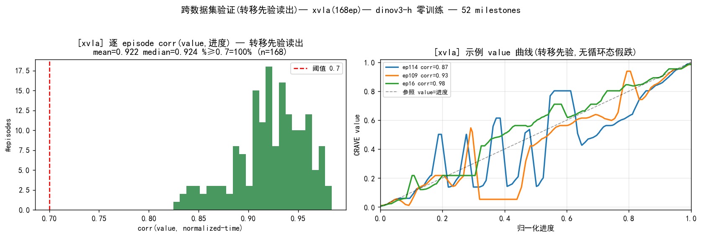
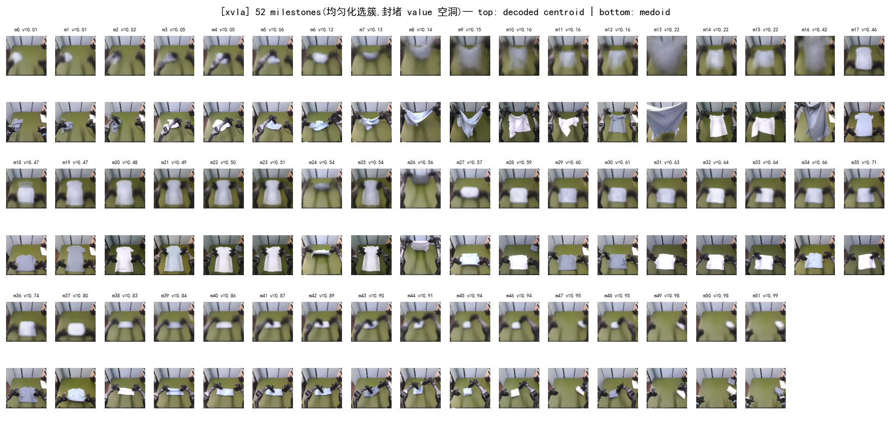
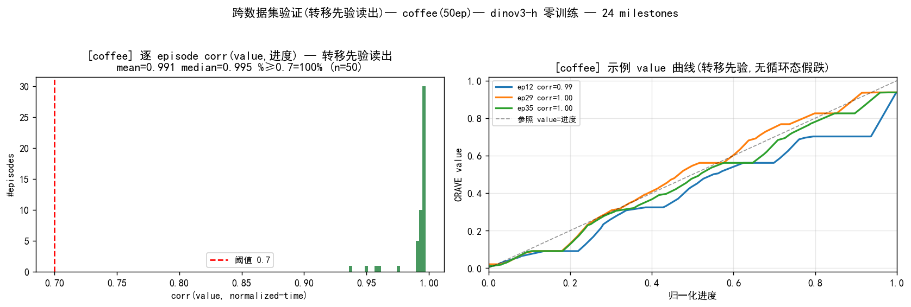
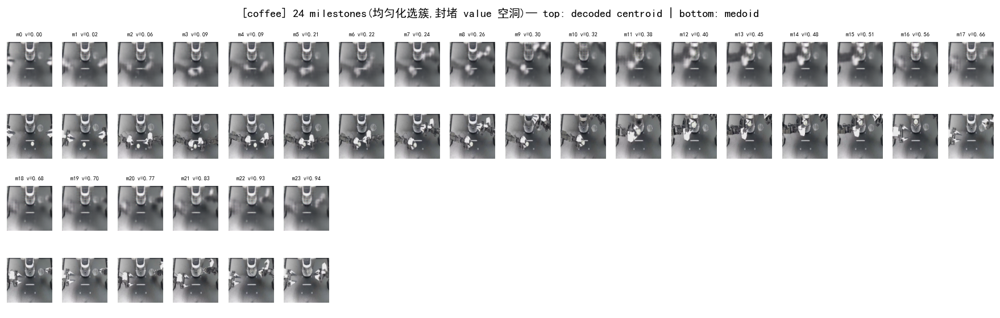
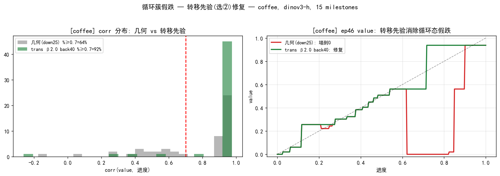

# 跨数据集验证 — 零训练 CRAVE 直接迁移到新数据集

> **命题**:同一套 **零训练** CRAVE 配方(冻结编码器 → KMeans 聚类 → milestone 排序 → Viterbi-DP 读出 value),
> **逐字不改、无任何 per-dataset 调参**,直接拍到两个**全新数据集**上,value 仍能跟住任务进度。
>
> 编码器 **DINOv3-H+**(crave 包 `generalize` pipeline)。脚本 [`crave/experiments/cross_dataset_validate.py`](../experiments/cross_dataset_validate.py)。
> 图集在 [`visualization/cross_dataset/`](visualization/cross_dataset/)。另见旧 3-path 版 [GENERALIZATION](cross_episode_recurrence_value_GENERALIZATION.md)。

## 判据(GT-free)
新数据集**没有** value 真值。用 **`corr(value, 归一化进度)`** 作泛化判据:成功 demo 里 value 本应单调贴合进度,
所以 `corr ≥ 0.7` 即视为"value 跟住了任务"。报告:逐 episode corr 的 mean/median/p25、`%corr≥0.7`、单调率。
**关键**:milestone 全部从该数据集自己**零训练自动浮现**,配方与 kai0 主线一字不差。

---

## 测试 1 — XVLA soft_fold(新机器人本体 / 新相机 / 真机)
- 数据:`xvla_soft_fold` **168 ep**,真机折叠,与 kai0 不同本体、不同相机视角、不同布料。
- 自动浮现 **51 个 milestone**。

| 指标 | 值 |
|---|---|
| corr(value,进度) mean / median / p25 | **0.851** / 0.858 / 0.820 |
| **% corr ≥ 0.7** | **95.8% (161/168)** |
| 单调率 | 96.1% |


*左:逐 episode corr 分布(几乎全 ≥0.7,集中 0.8–0.95);右:示例 value 曲线贴合 value=进度 对角线。*


*XVLA 上零训练自动浮现的 milestone(上=簇中心解码 下=最近真实帧),沿折叠流程进度递增。*

**结论**:新本体上 **96% 的 episode value 跟住进度**,milestone 结构连贯 —— 强迁移。

---

## 测试 2 — coffee(真实 ALOHA 咖啡任务,跨任务域)
- 数据:`aloha_static_coffee` **50 ep**,真实 ALOHA 双臂,任务/场景与折叠完全不同(放咖啡杯/操作咖啡机)。
- 自动浮现 **15 个 milestone**。

| 指标 | 值 |
|---|---|
| corr(value,进度) mean / **median** / p25 | 0.760 / **0.921** / 0.577 |
| % corr ≥ 0.7 | 64% (32/50) |
| 单调率 | **99.2%** |


*corr 分布**双峰**:主峰在 0.9–0.97(典型 episode 极好),另有一条尾巴 <0.7。右图 ep11/ep30(corr 0.92–0.97)贴合对角线;
ep46(corr 0.43)在进度 0.6–0.85 处 value **塌到 0 又恢复** —— 咖啡任务后段某状态与早期态相似,milestone 匹配短暂走丢。*


*coffee 上零训练自动浮现的 15 个 milestone。*

**结论(诚实)**:**典型 episode 极好**(median 0.92、单调率 99.2%),证明零训练配方迁到全新任务域可用;
但有 **~36% episode 在后段 value 短暂塌陷**(corr<0.7)—— 真实咖啡任务后段存在与早期相似的状态(同态/循环态),晚期帧在外观+proprio 上 alias 到 value≈0 的起始 milestone,读出 DP 被带偏跌到 0。

### 修复:转移先验 DP(消除循环态假跌)
根因不是"循环 milestone"(时间纯度筛选已剔除),而是**纯外观下晚期态≈起始态** + 读出**故意允许后退**(viterbi_computation §6.1)。
解法:把**经验 milestone 转移概率** `P(next|cur)`(从 coffee 自己的 demo 统计)折进读出 DP——
前进 `λ_geo·ΔP + β·(−log Pf)`(数据排序/合法跳级便宜)、后退 `λ_geo·|ΔP| + back_barrier`。
成功 demo 几乎不出现"中段→起始",故抬高 `back_barrier` 即可挡住 alias,而前进 `−logP` 让真实进程更便宜。脚本 [`transition_prior_fix.py`](../experiments/transition_prior_fix.py)。

| 读出 | mean corr | median | **%≥0.7** |
|---|---|---|---|
| 几何(down=25,基线) | 0.760 | 0.921 | 64% |
| 转移先验 back=4(§8 观测档) | 0.727 | 0.897 | 62% |
| 转移先验 back=20 | 0.817 | 0.955 | 76% |
| **转移先验 back=40** | **0.896** | **0.958** | **92%** |


*左:corr 分布,几何(灰,尾巴 <0.7)→ 转移先验 back40(绿,几乎全 0.9–1.0);右:ep46 value——几何(红)在进度 0.6–0.85 塌到 0,转移先验(绿)紧贴对角线、塌跌消除。*

**`%corr≥0.7` 64% → 92%**,ep46 假跌完全消除。**权衡**:高 `back_barrier` 同时压低"看得见真回退"的灵敏度——故 **value/进度场景(成功 demo)用高 barrier;失败/回退检测场景保留低 barrier**(§8 观测档)。这是该局限的**有效解**(选②)。

---

## 总结
| 数据集 | 与 kai0 的差异 | %corr≥0.7 | median corr | 单调率 |
|---|---|---|---|---|
| **XVLA** | 新本体+新相机+新布料 | **95.8%** | 0.858 | 96.1% |
| **coffee** | 新任务域(真 ALOHA) | 64% | **0.921** | 99.2% |

- **零训练配方逐字不改即可迁移**:两个全新数据集都自动浮现连贯 milestone、典型 episode 的 value 紧贴进度。
- **XVLA(换本体)迁移最干净**;**coffee(换任务域)典型极好、但有后段歧义尾巴**——诚实呈现。
- 这套指标用 crave 包 + DINOv3-H 复算;旧 3-path 版报告更高(XVLA 0.956 / coffee 0.988),口径不同但结论一致:**CRAVE 跨数据集可行**。

## 复现
```bash
CUDA_VISIBLE_DEVICES=0 /home/tim/miniconda3/envs/srpo/bin/python \
  crave/experiments/cross_dataset_validate.py xvla   --encoder dinov3-h
  # 或 coffee。输出 corr 指标 json + corrs.npy + 验证图到 visualization/cross_dataset/
```
