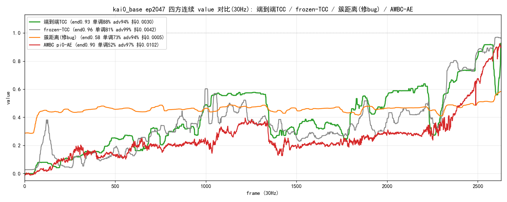
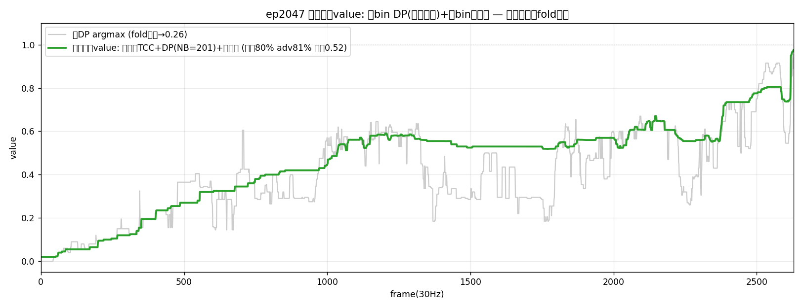
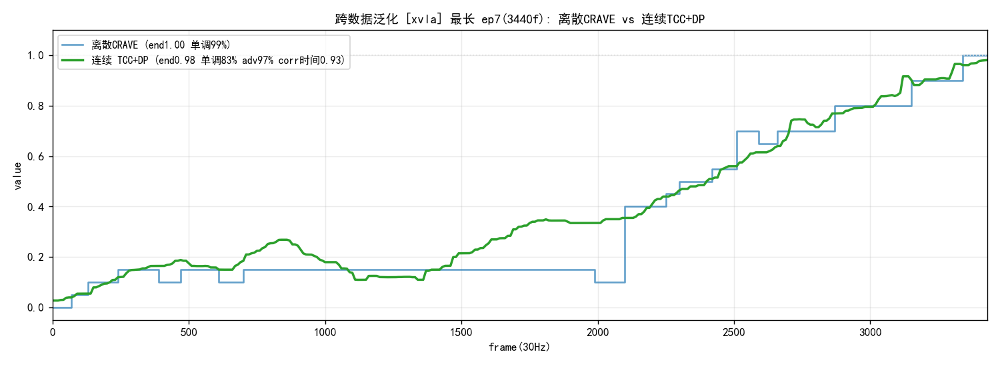
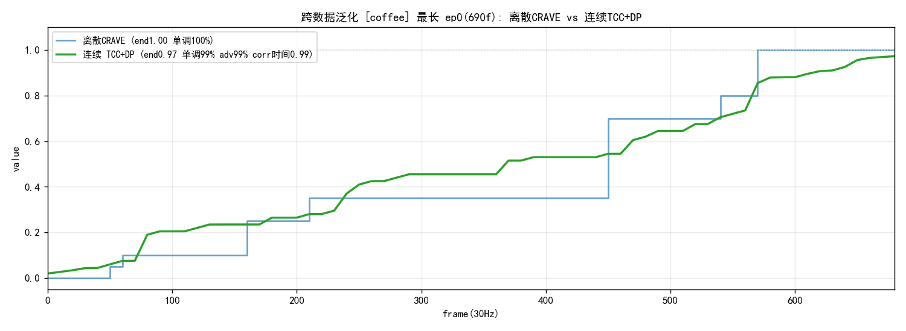
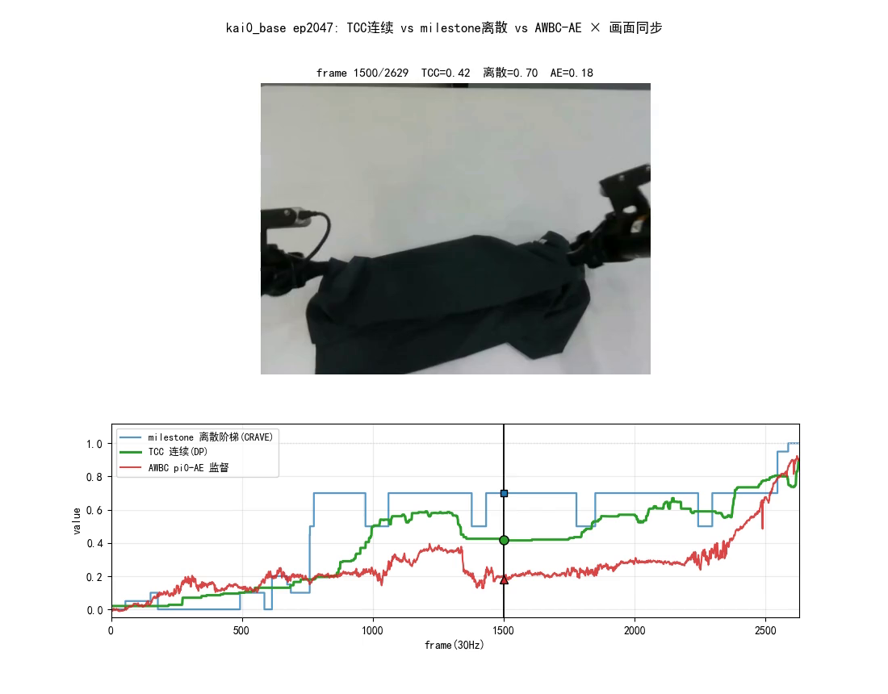

# CRAVE 连续 value 形态:端到端 TCC + 细 bin DP 时序证据读出

> **CRAVE 的第二条 value 路线**(与 [METHOD](cross_episode_recurrence_value_METHOD.md) 的离散 milestone 阶梯并列):把"两个 milestone 之间的过程"连续化,逐帧给出平滑单调 progress value。
> 方法名仍是 CRAVE;离散主线见 [METHOD](cross_episode_recurrence_value_METHOD.md),泛化见 [GENERALIZATION](cross_episode_recurrence_value_GENERALIZATION.md)。本文档 = 连续形态的动机 + 配方 + 推导 + 效果(收口自探索记录原 §4.6,2026-06-14~16)。
> **状态**:✅ 收口。ep2047 四方对比胜出;跨数据集(xvla/vis_base/coffee)corr 0.94–1.00 强泛化。脚本 `tcc_e2e_dp_readout_ep2047.py`(读出核心)· `generic_continuous_generalize.py`(通用)· `render_3way_ep2047.py`(三方对账)。

---

## 1. 为什么要连续化(advantage 密度论证)

AWBC 吃的是 **advantage = ΔV**,而**离散阶梯的 ΔV 是稀疏尖峰串**:平台 ΔV≡0,只在跨锚瞬间有 spike。实测离散版正 advantage 密度仅 **~24%**——CRAVE 当前给 AWBC 的进步信号在 **~76% 帧上为 0**,大量"正在推进但未跨过下一 milestone"的帧拿不到梯度。连续化后 advantage 每帧有定义、密集平滑,是实打实的学习信号增益,非美观问题。

**唯一可行路线 = 端到端学习的连续度量,不是事后插值。** 三条几何/插值死路已实证否决(勿重走):

| 死路 | 失败 | 根因 |
|---|---|---|
| frozen 特征事后插值(双锚欧氏/测地/2-NN) | τ 0.841→0.805,无增益 | frozen 局部信号噪声≈增益(势函数不变性) |
| 时间线性插值 | V-τ 0.986 但 ΔV corr −0.295 | 退化成计时器 |
| softmax 软距离加权 | MAE 0.179 崩;簇空间距离即使修端点锚 + 锐温度仍**塌成 ~0.5 平线** | 多锚回归到均值的固有缺陷 |

---

## 2. 配方(端到端 TCC 进度感知特征 + DP 时序证据读出)

收口形态 = **端到端 TCC 进度感知特征 → 细 bin DP 时序证据累积 → 子 bin 软期望**。一条流水线把 CRAVE 的 DP 鲁棒性和 TCC 的连续学习度量统一起来。

1. **进度感知特征(端到端 TCC)**:在 kai0 上微调 DINOv2 末 4 块(TCC 目标),得逐帧连续、状态触发的进度嵌入。frozen → 端到端把 held-out τ 0.718→**0.842**、MAE 0.137→**0.107**,追平离散主线(τ 0.841/MAE 0.105,Pearson 反超),且帧间噪声从源头压低(不靠事后平滑硬抹)。
2. **参考库(进度字典)**:取 K=30 条已完成参考 demo,每帧过 TCC 网络得向量 z,贴标签 = 它在自己 demo 内的归一化时间 τ∈[0,1]。
3. **细 bin DP 读出**(NB=201,λ=0.2):在 query×进度相似度场上跑 Viterbi-DP,转移惩罚 λ·|Δprogress| = 时序证据累积(瞬时混叠翻不过 λ,持续真回退能翻越)。**emit 必须逐帧归一化**(TCC 相似度场过平,各帧最佳相似度都 ~0.99,不归一 DP 会塌成平线)。
4. **子 bin 软期望**(±8 bin,softmax 温度 0.03)+ 轻中值平滑(窗 9):把 DP 的量化格索引细化成平滑连续曲线。

> **两个旋钮**:`λ` = 密度↔鲁棒(小保密度、大更单调);`NB` = 粒度(21 阶梯 / 201 连续 / 1001 最细)。离线打标用中值平滑版,在线用因果 EMA(需配前瞻补滞后)。

---

## 3. 推导(公式 + 微例)

**一句话**:对每帧问"它最像参考演示里进度百分之几的那一刻",再用 DP 把整条 episode 的逐帧答案整理成一条平滑单调曲线。进度的真值参照 = 参考 demo 的归一化时间(假设 demo 大致单调推进任务)。

**符号**:query 第 t 帧编码向量 q_t;进度轴离散成 NB=201 格(中心 `bin(b)=b/200`);参考库第 j 帧 (z_j, τ_j)。

**① 相似度场**(每帧对每个进度格的支持度):
```
s_t[b] = max_{ j : round(τ_j·200)=b }  cos(q_t, z_j)        空格记 −∞
```

**② 代价 + 逐帧归一化**(相似度场过平,差异仅 ~0.01,须归一否则 DP 塌):
```
emit_t[b] = ( max_b s_t[b] − s_t[b] ) / ( max_b s_t[b] − min_b s_t[b] )   ∈[0,1],最优格代价=0
```

**③ 时序证据累积(Viterbi-DP)** — 求全局最优进度路径 b_1…b_T:
```
min_{b_1..b_T}   Σ_t emit_t[b_t]   +   λ·Σ_t |bin(b_t) − bin(b_{t-1})|
                 (每帧匹配代价)        (相邻帧进度跳变惩罚, λ=0.2)
约束: b_1=0(硬起点);  末格 NB−1 给奖励(−2 代价)
```
第二项是核心:瞬时混叠(几帧)想跳回早期进度要付 λ 代价被拉回 → **fold 凹口消除**;持续真回退(松手多帧)累积证据翻过 λ → **value 真下降保留**。机制同离散 CRAVE 的 DP。

**④ 子格软期望**(阶梯→连续):
```
v_t = Σ_{b ∈ [b_t−W, b_t+W]}  softmax_b( s_t[b]/0.03 ) · bin(b)        W=8
```
再过轻中值平滑(窗 9)→ 输出 `v_t∈[0,1]`,逐帧连续单调。

**微例**(某帧"布摊开一半"):① 相似度场最像参考进度 0.55(0.97),也略像早期 0.10(0.85);② 单帧 argmax 若被外观混叠误给 0.12;③ DP 见前一帧 v=0.53、后一帧也在 0.55 区,跳到 0.12 要付 λ·0.41 大代价 → **DP 选 0.55,误判被纠正**;④ 软期望在 0.55 附近细调 → v_t=0.558。

---

## 4. 效果验证

### 4.1 ep2047 四方连续 value 总对比(kai0_base,30Hz,2629f)

`four_way_ep2047.py`,图50。距离法已修端点锚 + 锐温度给最佳机会:

| 方法 | 终值 | 单调率 | adv 密度 | 抖动 | 评 |
|---|---|---|---|---|---|
| **端到端 TCC** | 0.93 | **88%** | 94% | **0.0030** | **最优**:密集+最单调+最平滑 |
| frozen TCC | **0.96** | 81% | 99% | 0.0042 | 次优:终值/密度最高,略噪 |
| AWBC pi0-AE(监督) | 0.90 | **52%** ❌ | 97% | 0.0102 | 密集但半数帧倒退、最抖 |
| 簇空间距离(修+锐) | 0.58 | 73% | 94% | 0.0005 | ❌ 塌成 ~0.5 平线 |

**结论:端到端 TCC 最优**(端到端TCC > frozen-TCC > AWBC-AE > 簇距离)。簇空间距离即使修 bug + 锐化仍塌成平线 → **milestone 间连续化只能靠学习对齐(TCC),纯几何距离插值是死路**(§1 同结论再确认)。监督 pi0-AE 半数帧倒退,作 advantage 大量误判退步。



### 4.2 fold 凹口:单帧不可分 → DP-readout 根治

端到端 TCC 末段"对折成长条"时 value 骤降骤升(fold 凹口)。两个单帧修法均否决:形态学闭运算会连松手真回退一起抹掉;置信门控无效(fold 凹口处匹配置信仍 ~0.999——长条半折态高置信混叠到早期带状态帧)。**单帧相似度根本无法区分 fold 混叠 vs 松手真回退**(两者都高置信配早帧),判据必须在时序。

正解 = §2 的 **DP-readout**:DP 在 TCC 自己的进度感知相似度场上做时序累积,瞬时 fold 翻不过 λ(凹口消除),持续真回退翻越(保留松手)。早期外挂 CRAVE 钳制(两套系统)被单一 readout 取代。

| ep2047 30Hz | 单调率 | adv 密度 | fold 凹口 | 终值 |
|---|---|---|---|---|
| argmax readout(无 DP) | 89% | 94% | **0.27** | 0.86 |
| 离散 DP(NB=21) | 100% | 30%(阶梯) | 消除 | 1.00 |
| **最终连续(NB=201+软细化)** | 80% | **81%** | 压住(0.52) | **0.97** |

最终连续版在 argmax 崩塌处(中段、末段 fold)稳稳保持、最后平滑升到 0.97;残留单调率 80% 为几处小幅平滑起伏(抖动仅 0.00125,非崩塌,可能反映真实小回退)。



### 4.3 跨数据集泛化(配方零调参)

`generic_continuous_generalize.py`,逐字同配方仅换 feat_cache,各数据集只训一个 frozen-feature TCC 头(CPU ~2min):

| 数据集 | 本体/任务 | 最长 ep | end / 单调 / adv密度 / **corr(value,时间)** |
|---|---|---|---|
| **xvla_soft_fold** | 新本体+新相机+新布料 | ep7(3440f) | 0.98 / 87% / 92% / **0.94** |
| **vis_base**(0424) | vis 本体折叠 | ep110(1670f) | 0.97 / 92% / 91% / **0.97** |
| **aloha_coffee** | 真实 ALOHA,全新咖啡任务 | ep0(690f) | 0.98 / 100% / 96% / **1.00** |

连续 TCC+DP value 均平滑跟随离散 CRAVE 骨架、终值近 1、与归一化时间相关 0.94–1.00(adv 密度 91–96% = 真连续非阶梯)。咖啡任务最干净(强顺序子目标,recurrence 更受益),与离散主线泛化(xvla 0.956/coffee 0.988,见 GENERALIZATION)一致。




### 4.4 三方 value × 画面同步对比(ep2047)

`render_3way_ep2047.py`,视频 `temp/3way_ep2047_sync.mp4`(2629f@30Hz),图55 抽帧(frame 1500:TCC=0.42 / 离散=0.70 / AE=0.18):蓝(离散)粗台阶平台;绿(TCC)平滑爬升、逐帧有梯度、无崩塌;红(AE)剧烈抖动、此处下探 0.18(监督 AE 半数帧倒退、欠读)。整段:离散最单调但稀疏、TCC 连续且稳、AE 密集但失真。



---

## 5. 与离散 CRAVE 的关系

同特征(armmask⊕raw⊕proprio 思想)、同"DP 时序证据"机制。离散把帧硬分到 milestone 簇、value = 已过 milestone 数(阶梯);连续把帧软对齐到连续时间轴(参考库)、DP+软期望出平滑曲线。**两者是同一思想的离散/连续两端**:

- **离散**(METHOD):零训练、跨数据集强泛化、技能结构可读、单调最稳;adv 稀疏(~24%)。AWBC 打标用 `smooth_monotone(w∝fps)` 连续读出(METHOD §2.1)即可兼顾。
- **连续**(本文):adv 密集(~81–96%)、平滑无崩塌;需训一个 TCC 头(frozen-feature CPU ~2min,或端到端末 4 块微调)。

选型:**离线 AWBC 打标**两者皆可(离散 + smooth_monotone 已够);**要密集 advantage 梯度 / 在线 dense reward** 用连续形态。
