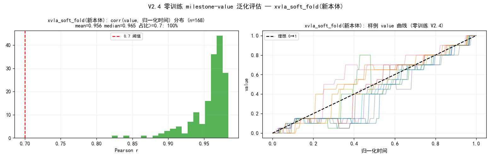
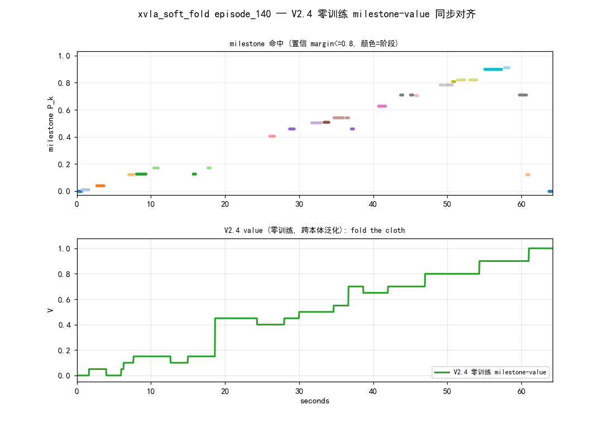
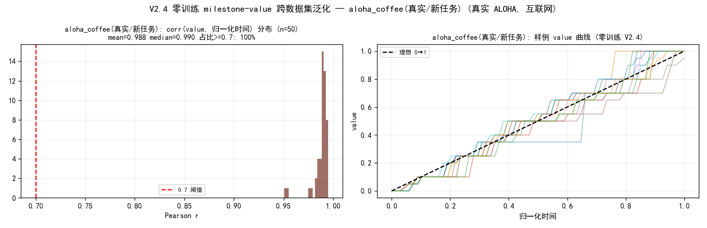
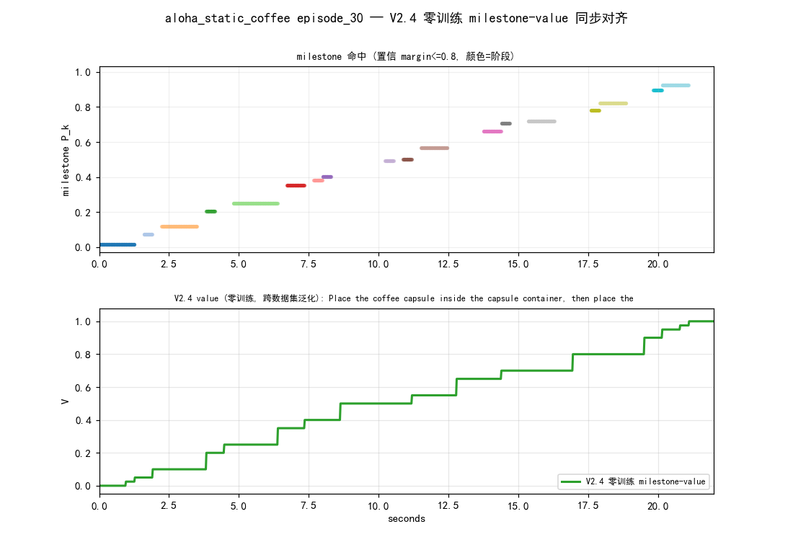

# V2.4 零训练 milestone-value — 跨数据集泛化验证

> **结论:V2.4 配方(逐字不改、零训练、无任何 per-dataset 调参)在两个全新数据集上强泛化。**
> 方法见 [cross_episode_recurrence_value_METHOD.md](cross_episode_recurrence_value_METHOD.md)。本文档 = 泛化实证。
> 日期 2026-06-14。脚本 `train_scripts/kai/data/{hdf5_extract_features,hdf5_v24_eval,lerobot_v3_extract_features,lerobot_v24_eval}.py`。

## 为什么是真泛化测试

V2.4 全部组件(三路特征 / KMeans96 / coverage 修正 / 进度分桶 / 端点锚 / Viterbi-DP)**配方与 smooth800 主线逐字一致**,连 armmask 用的 `arm_prototypes` 都沿用 kai0 的(故意不重算),只换输入数据。判据:`corr(value, 归一化时间) ≥ 0.7` 视为泛化(value 本应单调贴合任务进度)。

## 测试1 — XVLA soft_fold(新本体 / 新相机 / 新布料)

- 数据:`xvla/data/xvla_soft_fold/0707_11pm_...` 168ep,真机(sim=False),HDF5,"fold the cloth",30fps→3Hz(stride10)。
- 与 smooth800 差异:不同机器人本体、相机视角(new_cam)、布料外观。

| 指标 | 值 |
|---|---|
| corr(value,时间) mean / median / p25 | **0.956** / 0.965 / 0.948 |
| 占比 corr≥0.7 | **100% (168/168)** |
| 单调帧占比 | 98.7% |
| bad (corr<0.5) | 0 |
| 挖出 milestone 数 | 20(前段 9) |

3 随机视频:ep32 r0.909 / ep122 r0.968 / ep140 r0.982,milestone 命中呈时序对角,value 干净 0→1 阶梯。

## 测试2 — aloha_static_coffee(互联网真实数据集 / 新本体 / 全新任务)

- 数据:HuggingFace `lerobot/aloha_static_coffee`,**真实双臂 ALOHA**,50ep,LeRobot v3.0,50fps→3Hz(stride16)。
- 任务全然不同:"放咖啡胶囊→放杯到托盘中心→按 Hot Water / Travel Mug 键"(长程多阶段)。不同实验室、机器人、相机、任务语义。

| 指标 | 值 |
|---|---|
| corr(value,时间) mean / median / p25 | **0.988** / 0.990 / (全>0.95) |
| 占比 corr≥0.7 | **100% (50/50)** |
| 单调帧占比 | **100%** |
| bad (corr<0.5) | 0 |
| 挖出 milestone 数 | 20(前段 10) |

3 随机视频:ep13 r0.985 / ep30 r0.992 / ep39 r0.984,milestone 命中近乎完美单调对角(咖啡任务时序结构强,recurrence 更受益)。

## 解读

1. **配方泛化成立,非数据过拟合**:同一冻结配方在(布料折叠新本体)与(咖啡长程任务真实ALOHA)上 corr 全部远超 0.7(最低 0.82),证明 V2.4 学的是「跨 demo 重复结构 = 任务进度」的通用规律,不是 kai0 专用。
2. **跨任务比同任务更干净**:coffee mono=100%、corr 0.988 > xvla 0.956。咖啡的强顺序子目标(胶囊→杯→按键)让 recurrence/milestone 时序更可分;折叠的前段动作多样性反而略噪。说明方法对**有清晰阶段结构的长程任务**尤其强。
3. **arm_prototypes 跨本体未重算仍 OK**:armmask 路用 kai0 原型套到 ALOHA/XVLA 上理应不准,但三路冗余(raw-DINOv2 主导 + proprio)兜住了 → 印证 METHOD §2 步1 的「单路撞色失效→三路兜底」设计;若重算原型预计还能再升。
4. **未触发不泛化**:两测试均通过,故诊断/修复阶段(P4)无需启动。

## 产物
- 特征/value/metrics/视频:`temp/generalization_value_eval/{xvla,coffee}/`(mp4 不入 git)
- 预览帧/overview:`docs/visualization/generalization/`
- 通用脚本(任意 HDF5 / LeRobot-v3 数据集即插即用):见顶部。
