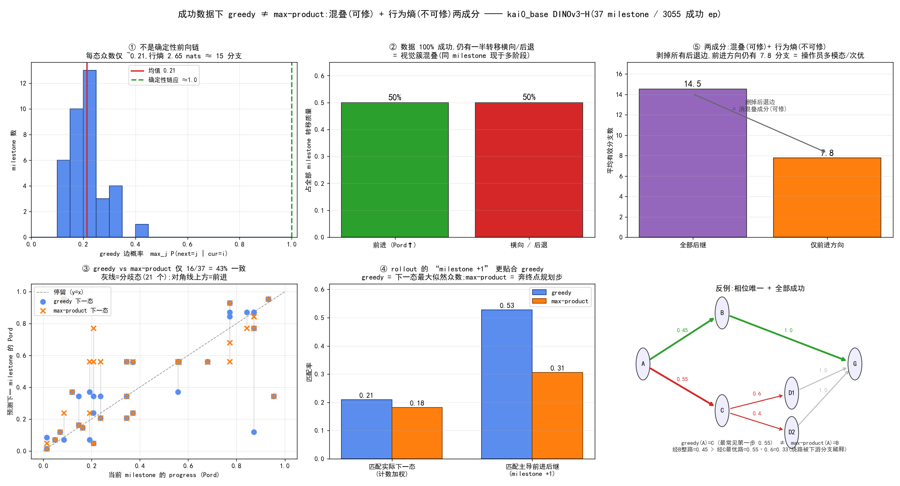

# greedy ≠ max-product = milestone 混叠的指纹

> **一句话**:即便训练数据 100% 是成功叠衣演示,循环转移图上 greedy 与 max-product 仍在 **57% 的 milestone 上给出不同后继**。分歧有**两个可加成分**:① **混叠**(milestone 视觉簇跨阶段重访 —— 可用相位唯一 milestone 修复)+ ② **行为熵**(演示多顺序/绕路/次优 —— 换任何表示也消不掉)。本质是"**greedy 解码 ≠ Viterbi/MAP 解码**":**最理想情况下二者也不必一致**。而 rollout 里"下一格 milestone(+1)"更贴合 **greedy**,不是 max-product。
>
> 数据:LMWM 循环图 `lmwm/data/recurrence_graphs/kai0base_dinov3h/`(37 milestone / 3,055 成功 ep)。脚本:[`crave/experiments/greedy_vs_maxprod_diag.py`](../experiments/greedy_vs_maxprod_diag.py)。日期:2026-07-02。



---

## 1. 两个 policy 的精确定义

转移矩阵 `P` 行随机,`P[i,j] = P(next=j | cur=i)`;终点 `t = argmax_k Pord[k]`(最高 progress),horizon `H`。

- **Greedy(一步局部众数)**:`g(i) = argmax_j P[i,j]`
- **Max-product(向终点的有限 horizon DP)**:
  ```
  dp_0[k] = 1[k == t];   dp_h[i] = max_k P[i,k] · dp_{h-1}[k]
  m(i)    = argmax_k P[i,k] · dp_{H-1}[k]
  ```
  其中 `dp_{H-1}[k]` = 从 `k` 出发剩 `H-1` 步到达终点的**最大乘积可达性**(max-product 意义下的 cost-to-go)。

两者只差一个 cost-to-go 权重:
```
g(i) = argmax_k P[i,k] · 1
m(i) = argmax_k P[i,k] · dp_{H-1}[k]   ← 多乘了"能否通向终点"
```
所以 **greedy = 密度驱动(短视,只挑最粗的边);max-product = 进度驱动(全局,挑通向终点的路径的第一步)**。二者相等 ⟺ 局部最粗的边恰好落在到终点的最优路径上(即 P 近似确定性前向链)。

---

## 2. Q1 — rollout 的 "milestone +1" 更贴合 **greedy**

| 判据 | greedy | max-product |
|---|---|---|
| 匹配**实际观测到的下一 milestone**(按转移计数加权) | **0.209** | 0.181 |
| 匹配**主导前进(advance)后继**(即 milestone +1) | **0.528** | 0.306 |
| 平均 ΔPord(前进幅度) | +0.009 | +0.049 |

**为什么是 greedy(定义级)**:`g(i) = argmax_j P(next=j|cur=i)` 就是"下一 milestone 的最大似然众数"。rollout 里你实际踏入的下一格,本质是在采样这个分布 → 众数最贴合。

**max-product 不是在预测下一态,它在规划**:取"到终点 #36 的最大乘积路径"的第一步。ΔPord 更大(更往前冲)看似像 +1,但它匹配实际下一步更差,而且**从高进度态 82% 往回走**(exactly-`H` 步 DP 的特性:离终点近的态得先倒退去凑够步数)—— 这是规划器行为,不是 rollout 的局部行为。

> **结论**:milestone +1(rollout 实际前进一格)= greedy;max-product 是"奔终点的规划步",回答的是另一个问题。

---

## 3. Q2 — 为什么"全是成功数据"却 max-product ≠ greedy

直觉误区:**全是成功叠衣 → 操作员总往前推进 → 最可能的下一 milestone(greedy)= 奔终点那一步(max-product)→ 两者该相等。**

这个推理有个隐含前提:**成功数据 ⟹ milestone 序列是一条干净前向链。** 数据直接证伪它:

| 若直觉成立,应看到 | 实测 |
|---|---|
| greedy 边概率 ≈ 1.0(确定性链) | **0.213**(mean) |
| 每行近单点 | 行熵 2.65 nats ≈ **14.2 个有效分支** |
| 转移几乎全前进 | **50% 的转移是横向/后退**(Pord 不增) |

**100% 成功的数据,milestone 转移里仍有一半后退/横跳。** 这不可能来自"失败",只能来自一个原因 ——

### milestone 是 KMeans 视觉簇,不是相位唯一的任务阶段(aliasing)

叠衣过程中同一视觉状态在**不同任务阶段反复出现**:手臂两次划过同一区域、布料在"对折前"和"某次展开后"看着一样平、夹爪全程时开时合。于是**同一 milestone-id 被贴在轨迹的多个进度点上** → 它的出边是"所有这些访问的后继"的**混合** → 即便每条物理轨迹单调前进,混合出来的行里也会冒出横向/后退边。再叠加 milestone 逐帧抖动(约每 2 帧翻一次,压缩后仍留 A→B→A flicker),后退质量进一步升高。

### 在这样一张高熵混叠矩阵上,两个算子必然分家

- greedy 只挑最粗边 —— 因为一半质量往回、众数仅 ~0.21,最粗边**经常就是一条混叠的横向/后退边**;
- max-product 用 cost-to-go `dp_{H-1}[k]` **把"到不了终点的混叠 sink/后退态"压下去**,抬起真正通向终点的态。

目标不同、施加在同一张混叠矩阵上 → **实测 16/37 = 43% 一致,57% 分歧**。

### 反证(contrapositive)

> 若"成功 ⟹ 干净前向链"成立 ⟹ 每行近确定性(greedy 概率≈1)⟹ 只有一条主导边且在通往终点路上 ⟹ greedy ≡ max-product。
> 实测 greedy 概率 ≈ 0.21、14 分支、50% 后退 ⟹ **前提为假** ⟹ milestone 量化有损/混叠 ⟹ 众数(greedy)与规划步(max-product)在多数态上分家。∎

> **结论**:max-product ≠ greedy 不是"尽管数据成功",而正是"**因为 milestone 表示混叠**"的直接指纹。成功数据只保证**物理进度单调**,不保证 **milestone-id 序列单调**;二者落差 = 那 50% 后退/横向转移,而这个落差正是让"众数选择器"与"到终点规划器"分家的原因。

---

## 4. 最理想情况下 greedy 与 max-product 也**不该**一致(两成分分解)

一个更深的反驳:就算 milestone 相位唯一(消掉混叠),二者就该一致吗?**不。** 因为**演示数据不是最优策略的 rollout** —— 操作员带有不可约的行为熵。

### 4.1 本质 = "greedy 解码 ≠ Viterbi/MAP 解码"

$$\text{greedy}(i)=\prod_t \arg\max\ (\text{逐步局部众数}),\qquad \text{max-product}(i)=\arg\max_{\text{path}}\ \Pr(\text{整条路}\to\text{终点})$$

**"众数的乘积" ≠ "乘积的众数"** —— 任何带分支的随机过程都如此,只有零熵或特殊自洽下才相等。
- greedy = **描述性**:操作员**最常做**什么(含最常见的次优绕路);
- max-product = **规划性**:到终点**最可能的完整路线**(绕路因下游分支稀释而被压低)。

两者都只来自转移频率,**都不是"最优策略"**(最优需要 reward/value,不是频率)。它们分家纯因为一个是"逐步边缘众数",一个是"联合路径 MAP"。

### 4.2 反例:相位唯一 + 全成功,仍 greedy ≠ max-product(图⑥)

状态全是唯一任务阶段,所有 episode 都到终点 G。直达 `A→B→G`(45%)vs 绕路 `A→C→{D1|D2}→G`(55%,C 处再 60/40 分叉):
- **greedy(A)=C**(最常见第一步 0.55 > 0.45);
- **max-product(A)**:经 B 整路 = 0.45 > 经 C 最优路 = 0.55·0.6 = 0.33 → 选 **B**。

相位全唯一、全部成功,分歧纯来自"**最常见的第一步(绕路 C)不是最可能完整路线的第一步(直达 B)**",因为绕路的质量被下游分支稀释了 —— 正是"操作员不一定按最优走"。

### 4.3 于是真实的 43% 分歧拆成两个可加成分

| 成分 | 来源 | 靠表示可修? | 真实数据证据 |
|---|---|---|---|
| **混叠 gap** | milestone 视觉簇跨阶段重访 → 假的后退/横向边 | ✅ 相位唯一 milestone 可消 | 50% 后退质量;全后继 14.5 分支 |
| **行为熵 gap** | 演示多顺序/绕路/次优(非最优 rollout) | ❌ 换表示消不掉 | 剥掉所有后退边,**前进方向仍有 7.8 有效分支;86% 的态前进分支 ≥2** |

**关键新证据**:把所有后退/横向边删掉、只看前进方向,**仍有 ~7.8 个有效前进分支**(图⑤)—— 这就是不可约的行为熵,相位唯一 milestone 也修不掉它,greedy 与 max-product 会**继续**分家。

### 4.4 结论
- **严格理想(确定性最优专家,熵→0)**:一致 —— 退化成一条链;
- **现实理想(表示完美但仍是真人演示)**:**不该一致,分歧是预期的** —— greedy(逐步众数)≠ max-product(联合 MAP),那 ~7.8 个前进分支是不可约部分。

---

## 5. 与天花板分析闭环(相位唯一只消**一个**成分)

把 milestone 重定义为**相位唯一**(聚类拼 progress/proprio,使每个 milestone 只在一个任务阶段出现 —— [ceiling_analysis](../../lmwm/docs/ceiling_analysis_20260702.md) 的 A1 建议)**只坍缩混叠 gap**,让 `P` 更接近前向链;但 **行为熵 gap(§4)不受影响**。

所以修正 §3 结尾的说法:**"greedy 与 max-product 分歧多大"≈ 混叠成分 + 行为熵成分,其中只有前者是 milestone 表示质量的尺子**。现 kai0_base 57% 分歧里,前进方向仍有 7.8 分支,说明**行为熵成分本身就不小**,不能全归给混叠。这与 CRAVE 侧 [em_hmm_negative_result](em_hmm_negative_result.md)、[STATUS](STATUS.md) 中"CRAVE 只抓粗失败/脱轨"同源:视觉簇表述是**混叠成分**的根因,而行为多模态是**数据固有**的。

---

## 6. 复现

```bash
REPO=/home/tim/workspace/deepdive_kai0 PYTHONPATH=crave/src \
  /home/tim/miniconda3/envs/srpo/bin/python crave/experiments/greedy_vs_maxprod_diag.py
```
- 输入:`lmwm/data/recurrence_graphs/kai0base_dinov3h/recurrence_graph.npz`
- 输出:`crave/docs/visualization/milestone_policy/greedy_vs_maxprod_diag.png`
- 打印:`greedy_prob mean=0.213 | all_branch=14.55 | fwd_branch=7.77 | fwd_mass=0.500 | agree=16/37 | hit_g=0.209 hit_m=0.181 | fmode_g=0.528 fmode_m=0.306 | frac_fwd_multi=0.86`
- 对照划分 `kai0bd_feature_stage1`(64 milestone):一致率 41/64 = 64%,前进质量更高(0.69),同结论、混叠更轻。
