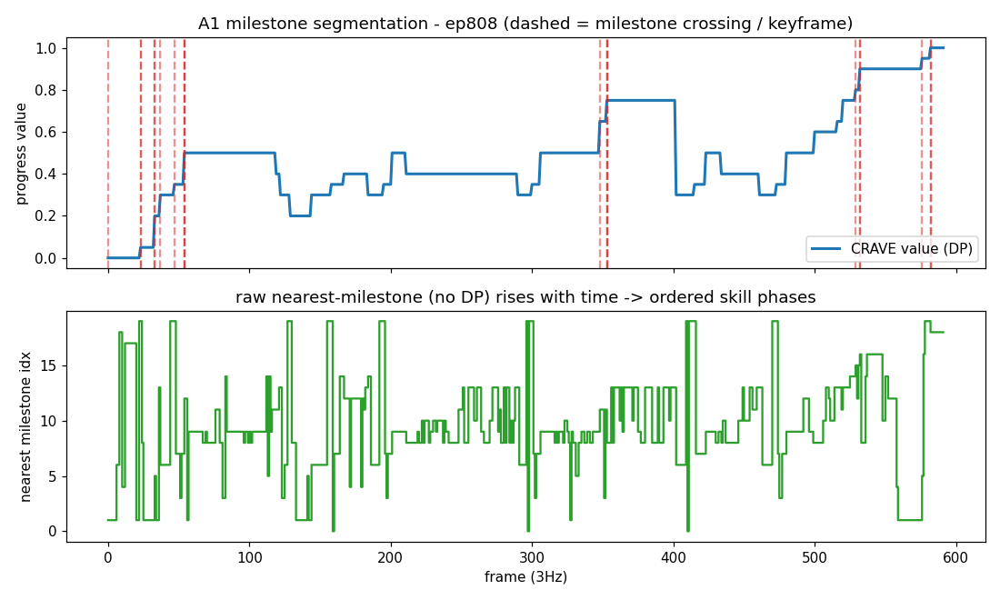
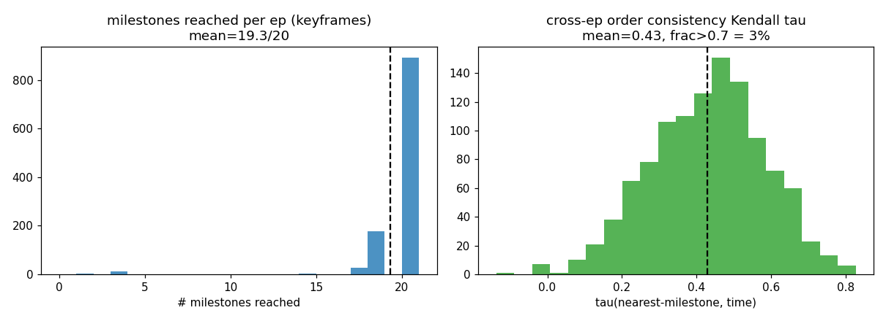
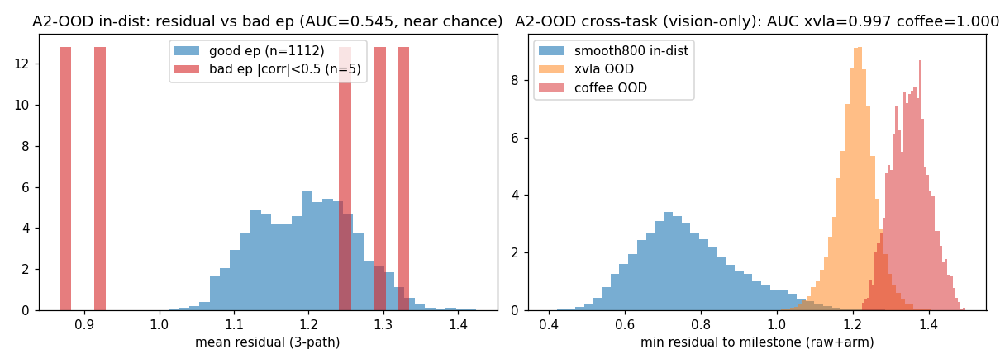
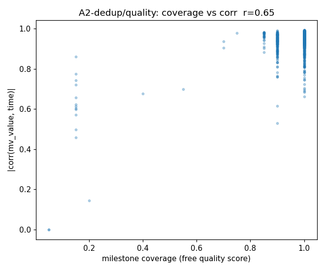
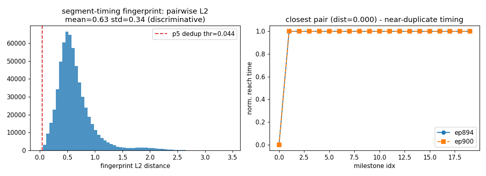

# CRAVE P1(A1/A2)本地零成本验证结果

> 2026-06-17 · 全 CPU,无新训练/无 GPU/无新采集。脚本 [`crave_a1a2_validate.py`](../../../train_scripts/kai/data/crave_a1a2_validate.py)。
> 挖掘逐字复刻 [`smooth800_v24_full.py`](../../../train_scripts/kai/data/smooth800_v24_full.py)(KMeans96+coverage修正+进度分桶+端点锚,seed0)→ **与 AB-plan 的 `mv_value` 同一 milestone 模型**(20 个 milestone)。
> 数据:`A_smooth800_dagger_all` 全 1117 ep 缓存特征(raw⊕armmask⊕proprio);跨任务 OOD 用 `generalization_value_eval/{xvla 168ep, coffee 50ep}`。
> 留痕:`temp/crave_a1a2/{summary.json, segments.json, ood_residuals.npz}` + 本目录 4 张图。
> 对应 [STATUS](../STATUS.md) 的 P1 项 / [positioning](../CRAVE_positioning_and_roadmap.md) §2 A 组。

这一轮把 positioning 里"立即可做、低成本"的 **A1(milestone 切分)+ A2(keyframe / OOD / dedup)** 用现有缓存全部跑实,把"可做"变成"已验/已界定"。结论分三类:✅成立 · ⚠️有边界 · ❌不成立(诚实记录)。

---

## A1 · milestone 自动切分(✅ 成立)

把 20 个 milestone 的进度位置 `Pord` 投到每条 demo 的逐帧 DP value 上,value 跨越 `Pord[j]` 的帧 = milestone j 的边界帧 → 每条 demo 切成有序基元段。

| 指标 | 值 | 含义 |
|---|---|---|
| 每 ep 到达 milestone 数 | **mean 19.3 / 20**(median 20,p10–p90 18–20) | 几乎每条 demo 都按序走完同一条 20 步骨架 → 跨 episode 一致的任务结构 |
| 覆盖率 coverage | **0.967** | 同上,milestone 序列 = 任务必经骨架 |
| 原始最近-milestone(**不靠 DP**)vs 时间 Kendall τ | **0.43**(>0.7 仅 2.9%) | 有序相位结构**真实存在但 raw 分配噪声大** → 这正是必须上 Viterbi-DP 平滑的原因 |

- **示例**(`crave_a1_segmentation_example.png`,ep808):value 单调上升,虚线 = 12 个去重后的 milestone 跨越帧,把 592 帧切成 12 段(抓→对折→…);下子图 raw 最近-milestone 随时间整体上行但带跳变。
- **边界(诚实)**:milestone 同进度位常并发跨越(20 milestone → 实际约 **12 个去重段/ep**);raw 标签 τ=0.43 印证 [B1](../CRAVE_positioning_and_roadmap.md#b-组--核心研究补最大软肋无-action无结果信号) 的"milestone=有序技能相位但需 DP 去噪",非尖锐动作切点。
- **判定**:零成本切分**可直接用作 AWBC `prompt_from_task` 的子任务边界 / 分层子目标**。唯一缺口 = 给每段起 VLM 名字(~12 次/任务,廉价,需 API,未做)。

## A2 · keyframe 导出(✅ 平凡成立)

milestone 跨越帧即 keyframe,**mean 19.3(去重约 12)/ep**,已逐 ep 落 `segments.json`(`cross_frames_3hz` + `segments`)。零成本,无需标注。可直接喂 keyframe-conditioned policy / world-model 子目标 / 数据预览。

## A2 · OOD / 残差(⚠️ 有边界:跨任务强,域内细粒度无效)

帧到最近 milestone 中心的残差作为异常分。两个验证给出**清晰的能力边界**:

| 验证 | 指标 | 结论 |
|---|---|---|
| **跨任务/跨本体 OOD**(vision-only raw⊕arm) | ROC-AUC **xvla 0.997 / coffee 1.000**;残差 in-dist 0.77 vs xvla 1.21 / coffee 1.35 | ✅ **近乎完美**地把别的任务/本体的帧判为 OOD |
| **域内细粒度质量**(残差分 corr.json 坏 ep) | AUC **0.545 ≈ 随机**(且坏 ep 仅 5/1117) | ❌ 抓不到 on-manifold 的细微质量差异 |

- 这与 [B2 否决](../CRAVE_positioning_and_roadmap.md#b-组--核心研究补最大软肋无-action无结果信号)**完全一致**:CRAVE 残差抓**粗 OOD/脱轨**,抓不到**像 demo 的细微失败**。再次独立印证 CRAVE 的失败信号只在"粗"这一档。
- **判定**:milestone 残差 = **免费的跨任务/脱轨 OOD 检测器**(场景 E 的"粗失败定位"成立);**不要**指望它做域内精细质量评分或细微 neg 判别。

## A2 · dedup / 质量分(✅ 质量分成立 · ✅ 段时序指纹修复 dedup)

| 用法 | 指标 | 结论 |
|---|---|---|
| **覆盖率当免费质量分** | coverage vs |corr(mv_value,time)| **r=0.65** | ✅ 覆盖率低的 ep 确实是挖掘/数据差的 ep → 可全量扫的零成本初筛分 |
| **reached-set 签名做近重复** | 893/1117 ep 签名相同 | ❌ 太粗:任务高度一致 → 到达集合无区分度 |
| **段时序指纹做近重复**(20 维归一化到达时刻) | pairwise L2 mean **0.63 / std 0.34**(范围 0–3.46),NN p5 阈下 **56 个近重复** | ✅ **有区分度**,修复 reached-set 退化;脚本 [`crave_a2_dedup_fingerprint.py`](../../../train_scripts/kai/data/crave_a2_dedup_fingerprint.py) |

- **修复**:朴素"到达集合"签名退化(893 同签名),改用**每 ep 20 维归一化 milestone 到达时刻向量**做指纹后,pairwise 距离展开(std 0.34)→ 可设阈值 dedup,p5 阈下找到 56 个近重复候选。
- **额外发现**:最紧的近重复对(ep894/ep900,dist=0)是**只到达 milestone 0 的退化短 ep**(指纹全 1.0)→ 指纹也顺带把低质量短 demo 聚到一起,与覆盖率质量分同向。
- **判定**:覆盖率 = 可全量扫的廉价质量分(场景 D 成立);**段时序指纹**让 dedup/检索本地可落地(D 组的一块已跑实)。

---

## 小结(本轮把"可做"落成"已界定")

| 项 | 结果 | 落地建议 |
|---|---|---|
| A1 milestone 切分 | ✅ 19.3/20 骨架,覆盖 0.967,~12 段/ep | 接 AWBC `prompt_from_task` / 分层子目标;缺 VLM 命名 |
| A2 keyframe | ✅ 零成本导出(segments.json) | 即取即用 |
| A2 OOD 残差 | ⚠️ 跨任务 AUC≈1.0;域内细粒度≈随机 | 仅做粗 OOD/脱轨检测,印证 B2 |
| A2 dedup/质量 | ✅ 覆盖率 r=0.65 质量分;✅ 段时序指纹 dedup(std 0.34,56 近重复) | 质量分可全量扫;指纹做检索/去重 |

**一句话**:positioning 里 A 组"立即可做"项**本地全部跑实**——切分/keyframe/质量分/段时序指纹 dedup/跨任务 OOD 五个能力成立且零成本,同时**独立复现了 CRAVE「只抓粗失败、抓不到细微 on-manifold」的根本边界**(A2 域内 OOD ≈ 随机,与 B2 同向)。下一步本地可做的只剩 **A1 的 VLM 段命名**(需 API);其余(B 臂蒸馏 / C1 / Tier3)需 GPU/集群/sim。
