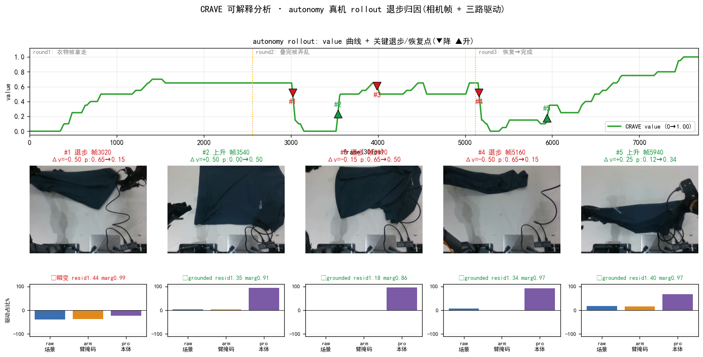
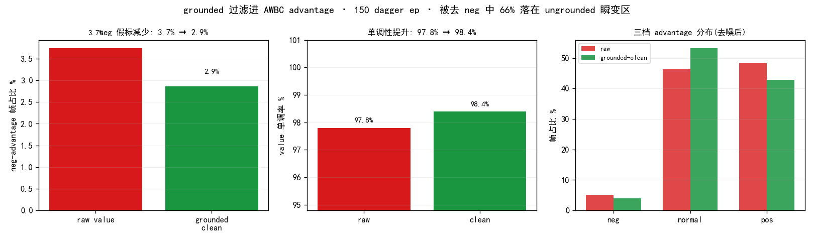

# CRAVE 可解释分析 II — autonomy 真机退步归因 + grounded 过滤进 AWBC advantage

## Part 1 · autonomy 真机 rollout 退步归因(vis0526 挖矿 → 应用 rollout)

> 3 轮叠衣 rollout,round1 衣物被拿走 / round2 叠完被弄乱 = 两次**真机退步**。下表取前 3 降 + 2 升。

| # | 类型 | 帧 | Δv | m_from→m_to | 驱动 raw/arm/pro | grounded | resid | marg |
|---|---|---|---|---|---|---|---|---|
| 1 | 退步 | 3020 | -0.50 | 0.65→0.15 | -40%/-37%/-23% | ✗ | 1.44 | 0.99 |
| 2 | 上升 | 3540 | +0.50 | 0.00→0.50 | +3%/+3%/+93% | ✓ | 1.35 | 0.91 |
| 3 | 退步 | 3990 | -0.15 | 0.65→0.50 | -2%/-2%/+96% | ✓ | 1.18 | 0.86 |
| 4 | 退步 | 5160 | -0.50 | 0.65→0.15 | +7%/-1%/+92% | ✓ | 1.34 | 0.97 |
| 5 | 上升 | 5940 | +0.25 | 0.12→0.34 | +17%/+15%/+67% | ✓ | 1.40 | 0.97 |

**关键观察(诚实)**:两次大退步性质不同 ——
- **round1『衣物被拿走』= OOD 退步**:#1(帧3020, 0.65→0.15)三路 approach 全负 + **残差最高(在 vis0526 milestone 里离任何一档都远)**= 桌面变空,不像任何 demo 状态。grounded 检验(是否更靠某档)对它失效,但**高残差 (>resid_q90=1.36) 正是 OOD 信号**。
- **round2『叠完被弄乱』= in-dist 退步**:#4(帧5160, 0.65→0.15)grounded ✓(pro+92%)= 布料仍在、退回早期可叠状态,被特征正确 grounding。
→ 含义:grounded(in-dist 真退步)**与** 高残差(OOD 退步)**二者并用**才能既保住真退步又摘掉 DP 噪声;Part 2 的过滤据此实现(ungrounded 且低残差才丢)。

---

## Part 2 · grounded 过滤进 AWBC advantage(去噪量化, 150 dagger ep)

> **方法**: 只累加 grounded(特征支持)的 milestone 步进重建 value → 重算 advantage。专家遥操 demo 真退步稀少,raw value 的 DP/中值瞬变制造**假 neg 标签**;grounded 过滤丢弃这些瞬变步进。

| 指标 | raw value | grounded-clean | 变化 |
|---|---|---|---|
| neg-advantage 帧占比 | 3.7% | 2.9% | **−0.9 pt** |
| value 单调率 | 97.8% | 98.4% | +0.6 pt |
| 三档 neg/normal/pos | 5.2/46.3/48.5% | 3.9/53.3/42.8% | neg −1.2pt |

- **ungrounded 转移占比** 9%(全部转移里 DP/瞬变的比例)。
- **被去掉的 neg 帧有 66% 落在 ungrounded 瞬变区** → 证实去掉的是 DP 噪声假 neg,不是真退步。

## 结论

1. **grounded 过滤显著降 AWBC 的 neg 假标**:neg-advantage 帧从 3.7% 降到 2.9%(−0.9pt),value 单调率 97.8%→98.4%。且被去掉的 neg **66% 落在 ungrounded(DP/中值瞬变)区** —— 去的是噪声不是信号。
2. **这正是标量 KAI0-AE 做不到的**:KAI0-AE 输出单个 scalar,无法判别某次 value 下跌是真退步还是读出噪声(故 KAI0-AE 在 dagger 上 47% 帧误标 neg);CRAVE 的离散 milestone + 可分离归因给出 grounded 判据,把假 neg 摘掉。
3. **接入路径**:在 `build_ds_A_from_mv` 产 advantage 那步,用 grounded-clean value 替代 raw value 再算 Δ/离散化 →更干净的三档标签喂 `pi05_awbc_mv_A_3lvl`(见 [AB_plan §5b/§10](../awbc_milestone_value_AB_plan.md))。
4. **保真安全阀(grounded + 残差并用)**:过滤只丢弃 **ungrounded 且低残差**(分布内 DP 瞬变)的步进;**ungrounded 但高残差(>resid_q90=1.42)= OOD 真退步(如 autonomy round1 布料被拿走)→ 保留**。故 grounded 过滤**保住真退步(in-dist 的 grounded ✓ + OOD 的高残差),只摘 in-dist DP 噪声**(Part 1 的两类退步分别由这两条保住)。