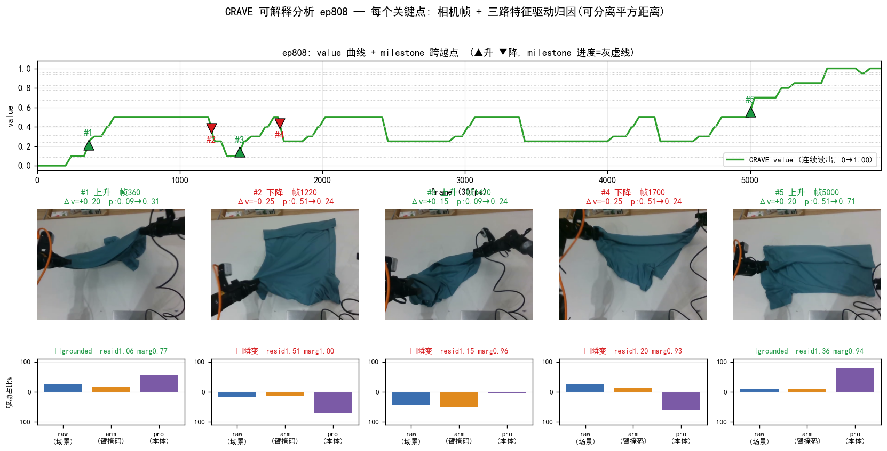
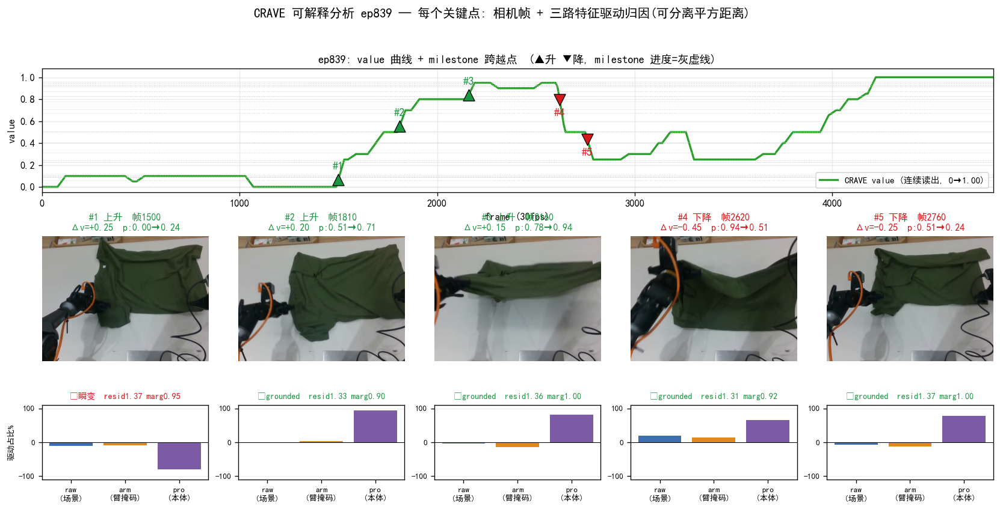
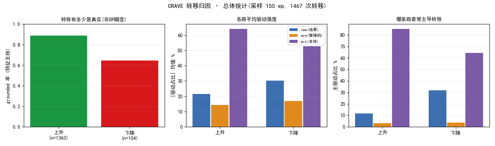

# CRAVE 关键上升/下降点 · 严格可解释分析

> 自动生成 (`crave_interpretability.py`)。每个关键点 = 3Hz DP value 上的一次 milestone 跨越,按 |Δv| 取前 3 升 + 前 2 降。
> **可分离归因**: 嵌入 `Fq=[raw(384)|arm(384)|pro(28)]` 各路 L2-norm 后拼接,到 milestone 中心平方距离 `‖Fq−C‖²=Σ_path‖·‖²` 严格可加。
> 运动归因 approach_path = `d²_path(pre→m_to) − d²_path(post→m_to)`(该路把状态推向新 milestone 多少),占比 = `approach_path/Σ|approach|`(带符号)。

## ep808  (5917 帧, 末值 1.00)

> m_from→m_to = value 档位对应的 milestone 进度(与 Δv 方向一致);驱动 = 运动归因(pre→post 各路把状态推向 m_to 的带符号占比,负=该路把状态推离);grounded ✓ = post 帧确比 pre 帧更靠近 m_to(特征支持此转移),✗ = DP/中值滤波瞬变(特征不支持);margin 越小越自信(最近/次近距离比)。

| # | 类型 | 帧 | Δv | m_from→m_to (进度) | 驱动: raw / arm / pro | grounded | residual | margin |
|---|---|---|---|---|---|---|---|---|
| 1 | 上升 | 360 | +0.20 | 0.09→0.31 | +25% / +18% / +57% | ✓ | 1.06 | 0.77 |
| 2 | 下降 | 1220 | -0.25 | 0.51→0.24 | -16% / -12% / -72% | ✗ | 1.51 | 1.00 |
| 3 | 上升 | 1420 | +0.15 | 0.09→0.24 | -45% / -51% / -4% | ✗ | 1.15 | 0.96 |
| 4 | 下降 | 1700 | -0.25 | 0.51→0.24 | +26% / +12% / -61% | ✗ | 1.20 | 0.93 |
| 5 | 上升 | 5000 | +0.20 | 0.51→0.71 | +11% / +10% / +80% | ✓ | 1.36 | 0.94 |

## ep839  (4814 帧, 末值 1.00)

> m_from→m_to = value 档位对应的 milestone 进度(与 Δv 方向一致);驱动 = 运动归因(pre→post 各路把状态推向 m_to 的带符号占比,负=该路把状态推离);grounded ✓ = post 帧确比 pre 帧更靠近 m_to(特征支持此转移),✗ = DP/中值滤波瞬变(特征不支持);margin 越小越自信(最近/次近距离比)。

| # | 类型 | 帧 | Δv | m_from→m_to (进度) | 驱动: raw / arm / pro | grounded | residual | margin |
|---|---|---|---|---|---|---|---|---|
| 1 | 上升 | 1500 | +0.25 | 0.00→0.24 | -11% / -9% / -81% | ✗ | 1.37 | 0.95 |
| 2 | 上升 | 1810 | +0.20 | 0.51→0.71 | -2% / +3% / +94% | ✓ | 1.33 | 0.90 |
| 3 | 上升 | 2160 | +0.15 | 0.78→0.94 | -4% / -15% / +81% | ✓ | 1.36 | 1.00 |
| 4 | 下降 | 2620 | -0.45 | 0.94→0.51 | +20% / +14% / +66% | ✓ | 1.31 | 0.92 |
| 5 | 下降 | 2760 | -0.25 | 0.51→0.24 | -8% / -13% / +79% | ✓ | 1.37 | 1.00 |

---

## 总体统计(采样 150 ep 的全部 milestone 转移)

| 类型 | n | grounded率 | 主驱动 raw/arm/pro | \|占比\|均值 raw/arm/pro | resid(grounded/瞬变) |
|---|---|---|---|---|---|
| 上升 | 1363 | 89% | 12%/3%/85% | 22/14/64 | 1.22/1.19 |
| 下降 | 104 | 64% | 32%/4%/64% | 30/17/53 | 1.34/1.22 |

## 综合结论

1. **大多数关键转移是特征支持的真实事件**:上升 grounded 89% / 下降 grounded 64%(post 帧确比 pre 帧更靠近新 milestone)。grounded ✗ 的少数是 DP/中值滤波瞬变(value 抖一下但特征没动)—— **可解释分析直接给出了『哪些 value 波动可信、哪些是读出噪声』的判据**,这是标量 value(AE/VIP)给不了的。
2. **下降(回撤)同样可被特征 grounding,且更靠场景视觉**:ep839 #4 的大回撤(0.94→0.51, Δv−0.45)三路 approach 全正(raw+20%/arm+14%/pro+66%)= 状态确实退回早期 milestone。**证实 CRAVE 的『退步信号』是真实视觉/本体回退,不是噪声**(对照 KAI0-AE 满屏负 advantage 的失真)。总体上下降 grounded 率(64%)低于上升(89%)—— 退步更稀少更噪(与专家数据 neg≈5% 一致);且**下降里 raw(场景)主导比例从上升的 12% 升到 32%** = 真回撤在画面里看得见(布料被弄乱),平滑推进则主要靠臂位跟踪。
3. **proprio(臂位)主导多数 manipulation 相位转移**(上升 85% 由 pro 主导),raw/arm 场景特征同向确认 —— 与 B1(milestone=技能相位)一致:milestone 跨越≈臂构型推进到下一子目标。⚠️ 注:各路已 L2-norm,低维 proprio(28)逐帧方向变化天然比高维 raw(384)大,故 proprio 的占比『幅度』偏高有维度成分;**稳健的是符号结构**(全同号=grounded 真转移;混号=瞬变),幅度按此审慎读。
4. **margin 越小越自信**:第一抓取点(ep808#1 marg0.77)最自信;marg≈1.0 的点 milestone 归属模糊(常伴 ✗)。
→ 落地价值:① 用 grounded 判据**过滤 CRAVE value 的读出噪声**(给 AWBC 打更干净的 advantage);② 用三路归因**定位失败/回退的来源**(场景 vs 臂位);③ 验证 milestone=技能相位(支撑 A1 子任务切分 / 相位条件化 BC)。