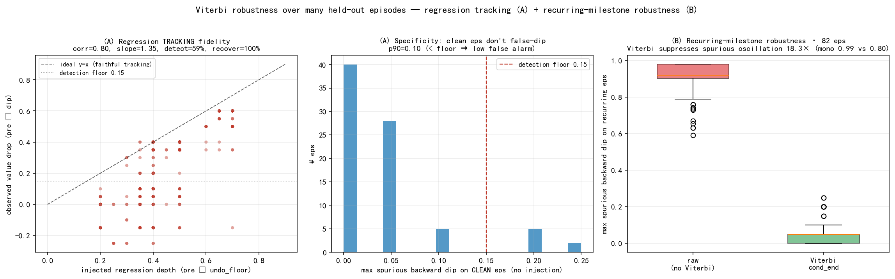
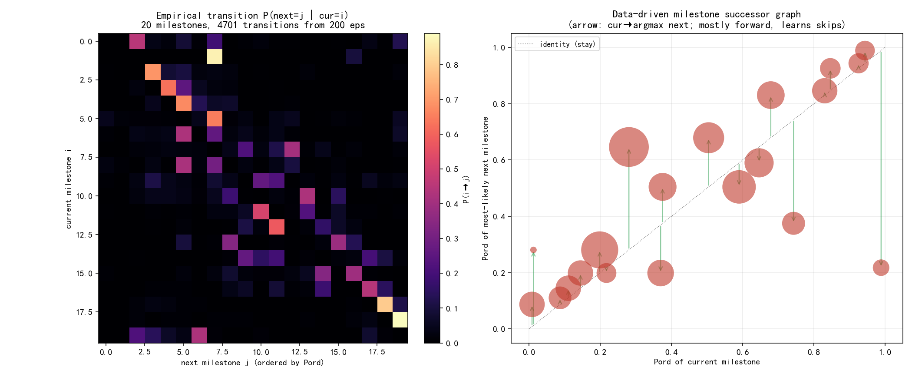
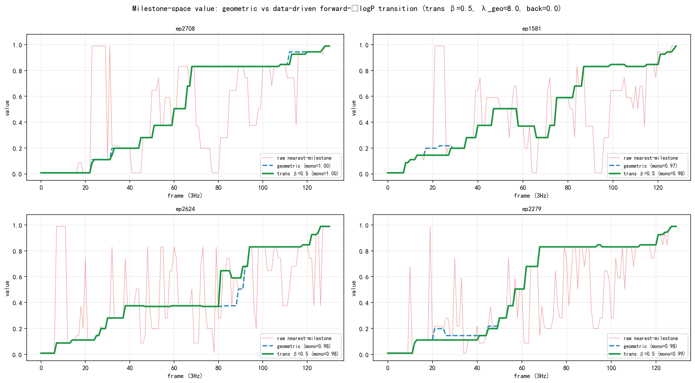
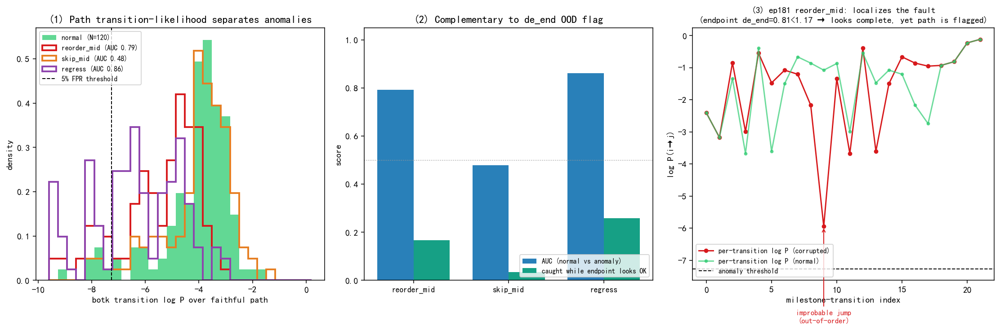

# CRAVE · Viterbi-DP 计算流程详解

> 把"逐帧最近 milestone"这串带噪观测,解成一条平滑、起点锚 0、终点偏置 1 的进度 value 曲线。
> 代码:`train_scripts/kai/data/crave_value.py` 的 `viterbi()`(32–40)+ `DiscreteValue.value()`(165–184)。
> 配图脚本:`crave/experiments/viterbi_compare.py`(kai0_base,kai-only);数据 `temp/crave_a1a2/viterbi_crop_summary.json`。
> 方法主线见 [METHOD](cross_episode_recurrence_value_METHOD.md);连续读出见 [CONTINUOUS](cross_episode_recurrence_value_CONTINUOUS.md)。

---

## 0. 它在求什么

逐帧单独取"最像哪个 milestone"(`d.argmin`)会**抖**——噪声让它一会儿跳到靠后的 milestone、一会儿跳回。Viterbi 用一个 **min-sum 动态规划(最短路)** 求全局最优进度轨迹:

$$\min_{\text{path}} \;\; \underbrace{\sum_t \text{emit}[t,\,\text{path}_t]}_{\text{每帧贴合数据}} \;+\; \underbrace{\sum_t \lambda\,\big|\,b_{\text{path}_t}-b_{\text{path}_{t-1}}\,\big|}_{\text{轨迹平滑}}$$

第一项=每帧待在某进度档有多合理,第二项=惩罚相邻帧进度的跳变。`λ` 是"贴数据 ↔ 平滑"的总旋钮。离散/连续两条 value **共用同一个 `viterbi()`**,只换 `emit / λ / NB`。

## 1. 状态空间与三个"场"

| 概念 | 代码 | 含义 |
|---|---|---|
| 状态(格子) | `bins=linspace(0,1,NB)`,离散 `NB=21` | 进度 [0,1] 离散成 21 档(0,0.05,…,1.0) |
| 路径 `path` | 长度=帧数 NF | 每帧选一档,连成进度轨迹 |
| 发射代价 `emit[t,b]` | `em` (NF×NB) | 第 t 帧待在进度档 b 有多不合理(小=像) |
| 转移惩罚 `pen[b,b']` | `λ·\|bins[b]−bins[b']\|` | 相邻帧从 b' 跳到 b 的代价,正比跳幅(**对称**) |
| 边界 | 起点锚 + `end_bonus` | 强制从进度 0 起步、偏置进度 1 收尾 |

## 2. 发射场 `emit` 怎么搭(离散,`value()` 166–174)

milestone 信息全在这里注入:

1. **帧到 milestone 距离**:`d = ‖Fq − C‖`(NF×M),`Fq`=每帧 796 维三路嵌入,`C`=选中 milestone 中心。
2. **把 milestone 钉到它的进度档**:`em` 初值 `1e3`(几乎不可达);每个 milestone `ci` 投到进度档 `cb[ci]`:`em[:,cb[ci]] = min(em[:,cb[ci]], d[:,ci])`。→ **只有有 milestone 的档便宜,空档维持 1e3**。所以离散 value 是**阶梯**:路径只能停在 ~M 个被钉的档,中间靠转移惩罚滑过去。
3. **端点锚**:`ds`/`de` = 帧到起始原型 `startK` / 完成原型 `endK` 的最近距离;`tn`=归一化帧序(弱时间先验):
   - 进度 0 档:`em[:,0]=min(em[:,0], where(tn<0.3, ds, ds+(tn−0.3)·6))` —— 既像起始态又确实早期才便宜,晚了想赖在 0 会被罚。
   - 进度 1 档:对称,既像完成态又确实后期才便宜,早了想跳到 1 会被罚。

## 3. 前向 DP 递推 + 回溯(`viterbi()` 35–40)

```python
cost = full(NB, 1e9); cost[0] = emit[0,0]        # 强制从进度 0 起步
for j in range(1, NF):
    tr   = cost[None,:] + pen                     # tr[i,j'] = 上一帧档 j' 的累计 + j'→i 平滑罚
    k    = tr.argmin(1)                            # 每个目标档 i 的最优来源档
    cost = emit[j] + tr[arange(NB), k]            # 新累计 = 本帧发射 + 最优来源
    bp[j]= k                                       # 回溯指针
cost[NB-1] -= end_bonus                            # 终点偏置:进度1档打折
path[-1] = cost.argmin()                           # 末帧选最终代价最小档
for j in range(NF-2,-1,-1): path[j] = bp[j+1][path[j+1]]   # 顺指针还原整条路径
```

递推式:$\text{cost}_j[i]=\text{emit}[j,i]+\min_{j'}\big(\text{cost}_{j-1}[j']+\lambda|b_i-b_{j'}|\big)$。复杂度 **O(NF·NB²)**(NB=21→441/帧),纯 CPU 毫秒级。最后 `v = med(bins[path], 9)` 中值滤波磨平阶梯毛刺。


> 上:`emit` 代价场(亮=便宜=有 milestone 的档),绿线=Viterbi 在便宜格间走出的最优路径,红点=逐帧最近 milestone(无 DP,散乱)。下:无 Viterbi 的 raw 曲线(红,抖,mono≈0.81)vs Viterbi(绿,平滑单调,mono≈0.98)。

## 4. 三变体对比:无 Viterbi / end 恒锚 1 / cond_end


- **① 无 Viterbi**(逐帧最近 milestone):抖动大、非单调。
- **② Viterbi · end 恒锚 1**:`end_bonus=2.0` 恒定。
- **③ Viterbi · cond_end(现方法)**:`end_bonus` 按末帧完成置信度衰减 —— `eb = 2.0·clip((thr−de_end)/(0.3·thr),0,1)`。
- 完整 ep(任务做完)上,②③ 末值都收到 ≈1,三者主体一致 → **end 锚的差异只在"未完成 ep"上才可能显现**,见 §5。

## 5. 未完成(裁半)ep 的 end 锚消融 —— 诚实结论

把 held-out ep **随机裁掉后一半**(模拟任务做到一半就停=未完成),比较 end 恒锚 1 vs cond_end 对 value 末值的影响(N=6,理想末值应远低于 1)。


**结论 1 · end 锚优化对 value 几乎无影响**:两法曲线**完全重合**,平均末值 end1=0.33 / cond=0.33,**改善 +0.00**。原因:裁半后末帧远离完成原型 `endK`(`de_end≈1.65 > thr≈1.17`),进度 1 档的 emission 本就很贵,`end_bonus=2` 太弱拉不动;cond_end 把它衰减到 ≈0 自然也无差异。**这印证了 `crave_value.py` 注释里"3-path 下 end_bonus 太弱、ON=OFF 无差异"的实测。**


**结论 2 · value 本身已能区分完成度**:同一批 ep,完整版 value 收到 ≈1、裁半版被 **emission 自动封顶在 ≈0.33**(裁半末帧只到中段视觉态)——**未完成 ep 的 value 评估早已正确,不靠 end 锚**。

**结论 3 · 真正的"未完成"判据 = 解耦的 `de_end` OOD flag**:裁半末帧 `de_end=1.65 > thr=1.17` → **100% 被 `status()` 标记 `is_complete=False`**。这条信号与 value 解耦(`crave_value.py:149–163`),才是判失败/未完成该用的东西,而非指望 value 的 end 锚。

> 一句话:**end 锚不是用来识别"未完成"的;识别未完成靠 `de_end` OOD flag。** value 的封顶来自 emission(末帧离完成态多远),end_bonus 只是个"做完了就轻推到 1"的弱偏置。

## 6. 两项观测能力:回退可观测 + 循环 milestone 兼顾

这两条是"软单调"设计(§4 注释 ① 的展开)的直接收益,用 held-out ep 实测。脚本 `viterbi_observability.py`,数据 `temp/crave_a1a2/viterbi_observability.json`。

### 6.1 回退可观测 —— value 没被锁死成单调

要求:**过程中的操作失误 / 无效操作也可能让 value 回退,这种回退必须能被观测到**,而不是被强行抹平成单调上升。

做法:在一条 held-out ep(ep1585)的高进度处(value≈0.65)注入一段**忠实的"undo→redo"**——沿真实帧平滑倒放回早期态(布料折叠被弄散),再正放回去续到末。这是真实失误的样子:**连续后退**,不是离散拼接(离散跳变会被转移惩罚顶住、反而看不出回退,这点踩过坑)。


- **Viterbi cond_end(红粗)**:进入回退段后 value 如实从 **0.65 跌到 0.15**,撤销完成、重做回去后再爬升收到 1.0 —— 失误被如实观测。
- **硬单调对照(running-max,黑虚)**:同一条曲线套上"只增不减"锁,回退段被压成一条水平线 —— **失误被静默抹掉**。
- 机理:`pen` 对称(前进/后退同价),没有"禁止后退"规则;持续的真回退会让后退路径的累计代价更低,DP 自然跟着掉下去。`mono()` 从 0.97→0.96 微降即是这段真回退的体现(**不恒等 1 是特性**)。
- 边界:λ=8 较强,所以**只有"持续/平滑"的回退才掉**;单帧噪声型的瞬跳仍被平滑(这正是想要的——抗噪但不抗真失误)。

### 6.2 循环 milestone 兼顾 —— 同态复现不乱抖

要求:同一 milestone 簇(单一 Pord)在一条 ep 里被**多次命中**(同一视觉态在不同时间复现),既要吸收良性复现、又不能把它误当回退。

实测:held-out 上 **9.8% 的 (milestone×ep) 对**出现复现(≥2 段且时间跨度 >0.25),并非罕见。取复现最显著的 ep2271(一个 Pord=0.20 的低进度 milestone 在 6 个分离区间被命中):


- **无 Viterbi(raw,红细)**:每次复现都把"最近 milestone 进度"猛拽回 0.2,在 0.2↔0.85 之间狂抖。
- **Viterbi cond_end(绿粗)**:转移惩罚 + 中值滤波把短暂复现吸收掉,曲线平滑爬升(mono=0.97),只在复现段有小幅可控回落 —— **良性复现不触发乱抖,真回退(§6.1)仍掉得下去**。
- 为什么不冲突:DP 求全局最优,一两帧回到早期态不足以翻盘(转移代价 + 后续大量高进度帧的发射代价共同压住);只有**持续**回到早期态(§6.1 那种成段 undo)才会让全局最优真的下行。复现的"短"与回退的"长"由 λ 这把同一旋钮自动分开。

### 6.3 鲁棒性多次测试 —— 跨 80 ep × 4 深度 × 3 种子统计

把 §6.1/§6.2 从"单 ep 示例"升级成统计判据:每个挖矿种子在 80 条 held ep 上、对每条注入 4 档倒放深度 {0.50,0.35,0.20,0.08}(960 次回退试验/全套),并扫所有自然复现 ep。脚本 `viterbi_robustness.py`,数据 `temp/crave_a1a2/viterbi_robustness.json`。



**(A) 回退跟踪 —— 按比例跟踪,非 on/off**(三种子):

| 指标 | seed0 / seed1 / seed2 | 判读 |
|---|---|---|
| 跟踪保真度 `corr(回退深度, value 跌幅)` | 0.80 / 0.78 / 0.62 | 正相关强,**跌多少跟回退多深成比例**(slope≈0.9–1.35,约 1:1) |
| 恢复率(redo 后回到 ≥pre−0.12) | 100% / 100% / 100% | redo 完总能爬回去 |
| 检出率随深度 `tg0.50 / 0.35 / 0.20 / 0.08` | 9–42% / 52–75% / 78–100% / **94–100%** | **深/持续回退几乎必检出**;浅滑(只退到 0.50)被有意平滑 |
| 特异度:干净 ep 伪回退 p90 | 0.10 / 0.15 / 0.05 | ≤ 检出阈 0.15 → **不乱报** |

**(B) 循环 milestone —— 极稳**(三种子,76–95 条复现 ep):

| 指标 | seed0 / seed1 / seed2 |
|---|---|
| Viterbi mono vs raw mono | 0.99/0.80 · 0.99/0.82 · 0.99/0.80 |
| 最大伪回退 median:Viterbi vs raw | 0.05/0.92 · 0.05/0.95 · 0.05/0.95 |
| **复现抑制倍率** | **18.3× / 19.1× / 19.0×** |

**结论 · 够鲁棒,且边界诚实**:
- **循环 milestone 跟踪:很鲁棒** —— 18–19× 抑制、mono≈0.99,跨种子几乎不动。
- **回退跟踪:对"有意义的回退"鲁棒** —— 中/深度(持续)失误必被检出且跌幅按比例、事后必恢复、干净 ep 不误报。代价是**浅而短的瞬时滑动被有意吸收**(tg0.50 仅 9–42% 检出)——这与给 §6.2 带来 18× 复现鲁棒性的是**同一个 λ=8 平滑**,是一个可调权衡(降 λ → 浅回退更敏感但复现更易抖),不是缺陷。

## 7. 关键性质 / 易误解点

1. **单调是「软」约束,不是硬禁止**:`pen` 对称(前进/后退同价),没有任何"禁止后退"的规则。轨迹基本单调是"起点锚 + end_bonus + emission 按进度排布"压出来的全局最优;实测 `mono()`≈0.96–1.0 **不恒等 1** → 真回退(布料弄乱/纠错段)时 value 能掉,这是特性。
2. **`λ` 必须随帧率标定**:3Hz 用 `λ=8, medw=9`;30Hz 帧更密、相邻位移更小,需 `λ=80, medw=45`(见 [frequency_window_params](frequency_window_params.md))。错配直接抖或糊。
3. **离散 vs 连续同一 `viterbi()`**:离散 `emit`=距离(milestone 稀疏占档,空档 1e3),NB=21,λ=8 → 阶梯;连续 `emit`=TCC 相似度场归一化的不相似度(每档都被参考帧填满),NB=201,λ=0.2,再加子 bin 软期望 → 连续曲线。

## 8. 数据驱动 milestone 转移概率 × Viterbi(探索:中性结果 + 有价值的副产物)

**动机**:现转移惩罚是纯几何 `λ·|Pord_i−Pord_j|`(对称、只看进度距离),不知道"经验上某簇之后通常是哪个簇"。设想:重走挖矿 ep 统计 milestone 的**经验转移概率** `P(下一簇=j | 当前=i)`,把 `−log P` 折进 DP 转移代价,得到更合理的 value。脚本 `milestone_transition_viterbi.py`。

**转移矩阵(副产物,很有价值)**:200 条挖矿 ep 重走得 4701 次簇间转移(`visited_sequence` 中值滤波+折叠去停留)。



> 左:`P(i→j)` 热力,近超对角(前进到稍晚簇)。右:数据驱动 milestone 后继图——多数簇主后继朝前(箭头在对角线上方),**但有几个簇的最可能后继是更早的态(对角线下方大圈,如末簇→≈0.2)= 真实复现/重置被如实记进矩阵**。这张图直接解释了下面为何朴素 −logP 会乱退。

**四种折法,逐一实测(held-out N=140,几何基线 mono=0.981 / 倒退步 0.032)**:

| 折法 | mono | 倒退步占比 | 判读 |
|---|---|---|---|
| ① 朴素对称 `−logP` | 0.92 | 0.22 | **变差** —— 矩阵里的复现/噪声后退被当成便宜回退路径 |
| ② 加后退壁垒 | 1.00 | 0.00 | **过纠正成近硬单调** —— 把 §6.1 回退可观测性也锁死了 |
| ③ 仅前进加 `−logP`(无 dwell 修正) | 0.82 | 0.33 | **变差** —— 抬高前进成本→相对偏好后退;且把"逐帧停留在簇上"误罚(矩阵是访问级,DP 是帧级) |
| ④ dwell-free + 行内居中前进锐化,后退=几何 | 0.981 | 0.032 | **= 几何基线** —— 干净 demo 上无可测改善 |



**结论(诚实)**:在本数据上,**把转移概率折进 DP 不改善 value 走势**(正确折法④与几何基线逐线重合)。根因:① milestone 本就按 Pord(首达中位时间)排好序,几何惩罚已编码主结构;② 合法跳级稀少(仅 5 个跳级后继);③ 关键的类型陷阱——经验矩阵是**访问级事件**,DP 是**帧级**,逐帧施加访问级代价会误罚自然停留;④ 矩阵忠实含真实复现的后退转移,任何对称/前进加权都会把它当便宜回退引入,而压住它的后退壁垒又会硬锁单调(毁掉 §6.1)。**几何对称惩罚在此处已是干净且接近最优的先验**。
**但转移矩阵本身是有价值的副产物**:可视化经验 milestone DAG、验证挖出的顺序、显式暴露复现结构;更适合的用法是**顺序校验 / 复现·异常(失败)检测**,而非 DP 惩罚项 → 见 §9。

## 9. 转移矩阵的正用法:失败/异常检测(与 de_end 互补)

承 §8 结论:转移矩阵不当 DP 惩罚,改当**路径异常分**。思路:正常 demo 的 milestone 访问路径在 P 下似然高;失败 ep 走低概率路径(乱序/跳步/中途回退)→ 路径转移对数似然低。脚本 `transition_anomaly_detect.py`。

**关键卖点 = 与 `de_end` OOD flag 互补**:`de_end` 只看**末态**对不对,本法看**过程路径**对不对。验证用**保留首尾 20%、只腐化中段**的受控失败代理(故末态正常、`de_end` 必判"完成"),专打 de_end 的盲区。异常分用 `botk`(最差 3 步均值,对单个正常复现离群稳健),路径用**忠实 raw 序列**(不可用 Viterbi 去噪——DP 会把乱序"修回"单调、抹掉异常)。



| 失败代理(末态均正常,de_end 全判"完成") | AUC | 检出@5%FPR | 判读 |
|---|---|---|---|
| **regress**(中途回退/失误) | **0.86** | 26% | **最好** —— 明确的 late→early 低概率跳 |
| **reorder_mid**(中段乱序) | 0.79 | 17% | 顺序违例被抓 |
| **skip_mid**(删中段=跳 milestone) | 0.48 | 3% | **抓不到** —— 删段后的跨越跳通常仍合理,kai0 任务容跳 |

**结论(诚实)**:转移路径似然是一个**有用但中等**的零额外训练异常信号——
- **真价值在互补性**:这三类腐化 100% 保持末态正常(`de_end` 全判完成),`de_end` 单独会漏;而路径法把 regress/reorder 排到异常(AUC 0.79–0.86),并能**定位**到具体哪一步转移出错(图③:某步 logP 骤降到 −6,而该 ep `de_end=0.81<1.17` 仍"看着完成")。
- **边界**:对**跳步不敏感**(AUC≈0.5,任务本身容许跳级);严格 5%FPR 下检出率中等(17–26%),因正常 kai0 路径本就含自然稀有转移(复现)。
- **定位**:`de_end`(末态 OOD)+ 转移路径似然(过程 OOD)两者并用,得到"端点+过程"双重失败画像;路径法不宜单独当检测器,也不抓跳步。

---

**复现**(srpo env;不要把 kai0 venv 加进 sys.path):
- §0–5 四图:`/home/tim/miniconda3/envs/srpo/bin/python crave/experiments/viterbi_compare.py --mine-n 200 --ncrop 6` → `temp/crave_a1a2/viterbi_crop_summary.json`。
- §6.1–6.2 两图(回退可观测 / 循环 milestone):`/home/tim/miniconda3/envs/srpo/bin/python crave/experiments/viterbi_observability.py --mine-n 200` → `temp/crave_a1a2/viterbi_observability.json`。
- §6.3 鲁棒性统计(跨种子复测):`/home/tim/miniconda3/envs/srpo/bin/python crave/experiments/viterbi_robustness.py --mine-n 200 --n-test 80 --seed {0,1,2}` → `temp/crave_a1a2/viterbi_robustness.json`。
- §8 转移概率 × Viterbi(中性结果 + 转移矩阵):`/home/tim/miniconda3/envs/srpo/bin/python crave/experiments/milestone_transition_viterbi.py --mine-n 200 --lam-geo 8 --back-barrier 0` → `temp/crave_a1a2/milestone_transition.json`。
- §9 转移路径异常检测(与 de_end 互补):`/home/tim/miniconda3/envs/srpo/bin/python crave/experiments/transition_anomaly_detect.py --mine-n 200 --n-test 120` → `temp/crave_a1a2/transition_anomaly.json`。
