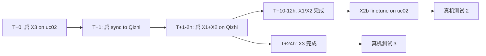

# 跨本体数据复用 — 战略评估与执行计划

> **作者**: 综合外部研究员讨论 + 项目实测数据 (2026-05-19)
> **背景**: A=官方 KAI0 双臂 piper (D435i wrist), B=自有双臂 piper (D405 wrist), 共享同一型号机械臂但 wrist 相机+机械装配有差异。当前实测发现 naive 混合训练 (A+B) 在 B 真机上抖动**反而**超过纯 B 训练 → 需要系统化复用方案。
> **目标**: 把 A 的 **6,512 ep** 数据价值榨干, 同时不污染 B 真机部署性能, 并为 CoRL/NeurIPS paper 铺路。

---

## 1. 设备差异定量

### 1.1 共享 (跨本体的"同"部分)
| 维度 | A (官方 KAI0) | B (自有) |
|---|---|---|
| 机械臂型号 | piper 双臂 (6 DOF + gripper) | 同 |
| Joint DOF | 14 (7×2 含 gripper) | 同 |
| 控制频率 | 30 Hz | 同 |
| Top 头部相机 | RealSense D435 | 同 |
| Top 高度 | ~76 cm | 同 (略差) |
| Top 俯视角度 | ~30° | 同 (略差) |
| Action 语义 | "Flatten and fold the cloth." | 同 |

### 1.2 差异 (跨本体的"异"部分)
| 维度 | A | B | 量化差异 | 严重度 |
|---|---|---|---:|---:|
| **Wrist 相机** | RealSense **D435** (RGB FOV 69°×42°, rolling shutter, min 28cm) | RealSense **D405** (RGB FOV 87°×58°, global shutter, min 7cm, RGB-IR 共光路) | brightness ↓12%, sharpness ↓31%, near-field depth A 失效 | 🔥 最严重 |
| **Wrist 相机 flange 安装** | 一致设计 | 一致设计但高度/角度略差 | 待精确测量 | ⚠️ 中-高 |
| **双臂间距** | 标准 | 略差 (毫米级未测) | state joint 3 std +61%, joint 5 std +83% (摇操员 + 几何叠加) | ⚠️ 中 |
| **Top 高度/角度** | 标准 | 略差 (<5cm, <5°) | mean brightness 接近 | ✅ 最小 |

### 1.3 实测真机症状回顾 (来自 `dataset_diagnostic_report.md`)
1. **Cloth loop** (复杂场景): mixed_1 baseline (纯 A 训练) 部署 B 出现循环卡死 — D435i→D405 视觉 OOD 累积漂移
2. **空桌面抖动**: vis SFT 后 prior 被高 jump 帧拉宽, 空桌面 condition 弱 → 抽到大 action
3. **混训抖动 > 纯 B**: `mixed_pure2_1800_6000` 真机抖 > `pure_1200_new_norm` → naive 混训创造双模式策略, chunk 间切换抖

---

## 2. 战略框架: A 数据的 4 层 ROI

判断标准: **某 loss/objective 是否依赖 A 和 B 的 action space 对齐?**

| 层 | 内容 | 依赖 action 对齐? | A 价值 | 工程复杂度 |
|---|---|---|---|---|
| **L1** Visual SSL / World Model | V-JEPA + point track + flow, dynamics | ❌ 不依赖 | **全功率可用** | 高 |
| **L2** Embodiment-conditioned policy | A+B 共训, 通过 embedding 区分 | ⚠️ 弱依赖 (需 conditioning) | **可用, 需对齐** | 中 |
| **L3** Auxiliary tasks | Inverse dynamics, future prediction (head) | ⚠️ 部分依赖 | **可用, 不入主 loss** | 中 |
| **L4** Data engine / Sim2Real | Retargeting, replay-augmentation | ✅ 强依赖 | 低 (需高保真 retarget) | 高 |

**关键原则**: A 的价值不在"直接帮 B 做 task", 而在 **representation / dynamics / prior** 这些更上游的层次。

---

## 3. 现有数据规模与状态校准

| 数据 | episodes | 当前用途 | 后续分层 |
|---|---:|---|---|
| **A: kai0_base** (官方 D435i, base) | **3,055** | mixed_1 init 训练用过 | L1 (SSL) + L2 (主 A 数据) |
| **A: kai0_dagger** (官方修正样本) | **3,457** | mixed_1 训练用过, 抖动+62% | **仅 L1 / L3** (不进 policy) |
| **B: vis_base_clean_v2** (D405, 已清理) | **837** (-7% from 895) | task_a_new_smooth_800 训练用 | L2 主力 (oversample 3-5×) |
| **A 总和** | **6,512** | — | — |
| **A+B 总和** | **7,349** | — | L1 SSL pretraining 全用 |
| 已删除 (清理) | 58 vis ep | — | — |

### 3.1 当前模型 SOTA 对比 (val MAE@1)
| 实验 | Init | 数据 | Best MAE@1 | 真机表现 |
|---|---|---|---:|---|
| `task_a_new_pure_200` (js02 resume) | mixed_1 step 22k | vis 200 ep | **0.0065** ⭐ | 待测 |
| `task_a_new_pure2_1800_6000` (uc SOTA) | pi05_base | 7900 ep mix | 0.0085 | **抖动严重** |
| `task_a_new_pure2_1800_js` (js cluster) | pi05_base | 1800 ep | 0.0090 | 待测 |
| `task_a_new_smooth_800` (uc03 进行中) | mixed_1 | vis_clean 800 | TBD | 待测 |

**重要观察**: val MAE 漂亮的 SOTA `mixed_pure2_1800_6000` 真机抖动严重 — val MAE ≠ 真机平滑度。

### 3.2 已隐式执行的 Layer 2 (但未显式标识)
当前 SOTA 链 `pi05_base → mixed_1 → task_a_new_pure_200` 本质上是 **A-heavy pretrain → B-only finetune** 的 curriculum, 但缺失:
- ❌ 没有显式 embodiment conditioning (model 不知道哪是 A 哪是 B)
- ❌ 没有 EE-relative action (用绝对关节角)
- ❌ 没有 wrist view 对齐
- ❌ kai0_dagger 进了 init (污染抖动 prior)

→ 真机抖动是这些缺失的总和体现。

---

## 4. EE-relative Action 可行性 (验证)

### 4.1 可用资源
| 资源 | 位置 |
|---|---|
| **piper URDF** | `calib/piper_local.urdf` (SolidWorks 完整导出) |
| **DH 参数 + 2° j2/j3 校正** | `/home/tim/workspace/piper_sdk/piper_sdk/kinematics/piper_fk.py` (C++) |
| **PiperFK Python 封装** | `calib/piper_fk.py` (`PiperFK().fk_homogeneous(q)` → 4×4) |
| **Hand-eye 标定 (camera↔arm base)** | `config/calibration.yml` (DANIILIDIS, reproj <0.3px) |
| **双臂 CAN 配置** | `config/pipers.yml` |

### 4.2 三种 EE-relative 方案对比
| 方案 | 公式 | 跨本体优势 | 实现成本 |
|---|---|---|---|
| **A. Delta joints** | a_t = q_t − q_{t−1} | ✅ 完全绕开几何, 最简单 | 极低 (parquet 改 1 列) |
| **B. Delta EE pose** ⭐ | a_t = T^{−1}_{t−1,EE} ⊗ T_{t,EE} (6-DOF twist) | ✅ 绕开 base 偏置, 保留 EE 物理意义 | 中 (跑 FK + log map) |
| **C. EE pose in base frame** | a_t = T_{t,EE} (绝对) | ❌ base→arm 偏置仍有 | 中 |

**推荐方案 B**: Delta EE pose 是物理最干净的 embodiment-invariant 表示 — "gripper 在自己 frame 里挪了多少", 同 piper 不同 base 安装位置完全无关。

### 4.3 实施步骤 (估 1 天)
```python
# 1. 离线预处理脚本
from calib.piper_fk import PiperFK
fk = PiperFK()

for ep in dataset:
    actions = ep["action"]  # (T, 14) — joint angles
    # Split L/R arms
    q_left = actions[:, 0:7]; q_right = actions[:, 7:14]
    # Compute EE pose per arm
    T_left = np.stack([fk.fk_homogeneous(q[:6]) for q in q_left])  # (T, 4, 4)
    T_right = np.stack([fk.fk_homogeneous(q[:6]) for q in q_right])
    # Delta in EE frame: dT_t = T_{t-1}^{-1} @ T_t
    dT_left = np.linalg.inv(T_left[:-1]) @ T_left[1:]
    dT_right = np.linalg.inv(T_right[:-1]) @ T_right[1:]
    # Convert to 6-DOF se(3) log map (3 trans + 3 rot)
    twist_left = se3_log(dT_left)  # (T-1, 6)
    twist_right = se3_log(dT_right)
    # Concat with gripper (still abs):
    new_action = concat([twist_left, twist_right, gripper_L, gripper_R])  # (T-1, 14)
    # Write back parquet
```

### 4.4 推理时反变换
```python
# 部署时: model outputs delta EE → 累积回 EE pose → IK → joints
T_current = fk.fk_homogeneous(q_current)
for delta in predicted_chunk:
    T_next = T_current @ se3_exp(delta[:6])
    q_next = ik_solve(T_next, q_current)  # warm start with current
    send_to_arm(q_next)
    T_current = T_next
```

**风险**: IK 解可能不唯一 / 不连续 → 需要 warm-start 保证 joint-space 连续性。**可选**: 训练时同时输出 delta EE + delta joints, 部署时优先 delta joints (避开 IK)。

---

## 5. 推荐执行计划 (按 milestone)

### 🚀 M1 (本周-下周): Layer 2 落地, 修复真机抖动 [短期 ROI 最高]

| Step | 内容 | 输出 |
|---|---|---|
| M1.1 | 写 `convert_to_delta_ee.py`: 跑 FK + se3 log, 重写 parquet | `kai0_base_dee/`, `vis_clean_dee/` |
| M1.2 | 改 prompt: `"[D435i wrist] Flatten ..."`, `"[D405 wrist] Flatten ..."` (轻量 conditioning) | data_config 调整 |
| M1.3 | 训练: `pi05_flatten_fold_xemb_kai0base_visclean` <br> data = kai0_base × 1 + vis_clean × 3 (不混 dagger) <br> init = pi05_base (干净起点) <br> LR 1.5e-5 → 1.5e-6, 50k step <br> uc 集群 24 GPU, ~9h | M1 ckpt |
| M1.4 | Phase B-only finetune: 接 M1.3, 仅 vis_clean × 3, LR 1.5e-6 → 1.5e-7, 10k step, 强制 [D405] prompt | M1-finetune ckpt |
| M1.5 | 真机分级测试 (平铺/皱缩/堆叠/复杂) vs `task_a_new_smooth_800` baseline | 报告 |

**预期**: 真机抖动 < 当前混训, 复杂场景成功率 > 纯 vis_clean。
**关键决策点**: 如果 M1.5 显示真机已足够好, **M2-M4 转为 paper-focused 长线投入**。

---

### 🔬 M2 (4-6 周): Layer 1 SSL Pretraining [paper 价值最高]

| Step | 内容 | 输出 |
|---|---|---|
| M2.1 | 数据预处理 (1 周): CoTracker3 跑 7349 轨迹 dense point tracks; RAFT 跑 flow; SAM3 跑 cloth mask | pseudo-labels |
| M2.2 | Wrist FOV 处理: 接受 D435 (69°×42°) vs D405 (87°×58°) 无法对齐 (D435 更窄), 用 view-conditioned token 让 model 学 differentiate | preprocess pipeline |
| M2.3 | Multi-objective SSL (2-3 周): <br> L = w_VJEPA·L_vjepa + w_track·L_track + w_flow·L_flow + w_xview·L_xview <br> Phase 1: 1.0/0.5/0.3/0.2 (前 50%) <br> Phase 2: 0.5/1.0/0.5/0.3 (后 50%) <br> Init π0.5 PaliGemma vision backbone (continual pretrain, layer-wise lr decay, peak 1e-5) | `AtomWorld Vision Backbone v0.1` |
| M2.4 | Cloth-specific 调整: Saliency-guided masking (cloth edges 高 mask 率), multi-scale temporal (k=4-8 + k=32-64), top/wrist 统一 backbone + view token | model arch |

---

### 🌍 M3 (6-10 周): Embodiment-conditioned Dynamics

| Step | 内容 |
|---|---|
| M3.1 | Latent dynamics: z_{t+1} = f(z_t, embodiment_emb, action_t), [A_emb, B_emb] 各一份 (dim=128), action_t 各自 norm |
| M3.2 | Motion-residual decomposition: ego motion (embodiment-specific) vs cloth residual (embodiment-invariant), loss 拆分 |
| M3.3 | Inverse dynamics aux head (embodiment-conditioned), 全部 7349 数据 |

---

### 📝 M4 (8-12 周): ATOM Policy + Paper

| Step | 内容 |
|---|---|
| M4.1 | ATOM stack: frozen M2 vision → frozen M3 dynamics → object tokenizer (per-point/region) → policy head |
| M4.2 | Policy 训练: 仅 vis_clean × 4 + (dagger 作为 aux only, 不入 main action loss) |
| M4.3 | Ablation table for paper: 纯 π0.5 / + Embodiment cond / + SSL pretrain / + Dynamics / Full ATOM |
| M4.4 | Paper story: "Object-centric representation enables efficient cross-embodiment data reuse, 6000+800 setup as controlled experiment" |

---

## 6. 风险预警 (从外部分析吸收)

| # | 风险 | 缓解 |
|---|---|---|
| 1 | CoTracker3 在 heavy occlusion (crumpled cloth) 失败 | Filter low-confidence tracks, 不硬训 |
| 2 | RAFT 在 fast motion 失败 | Quasi-static 阶段训 flow, dynamic 阶段降权重 |
| 3 | Wrist D435 (69°) vs D405 (87°) FOV crop **无法对齐** (D435 视野更小) | 接受不一致, 用 view-conditioned token |
| 4 | π0.5 PaliGemma backbone continual SSL pretraining 易 catastrophic forget | Layer-wise lr decay, peak 1e-5, keep web image data anchor |
| 5 | 叠衣 success criterion 真机评估难自动化 | 设计 IoU / fold count / stage completion 离线 metric |
| 6 | IK 在 delta EE 推理时不连续 | Warm-start with current joints, 或训练同时输出 delta EE + delta joints |
| 7 | EE-relative 丢失绝对工作空间位置信息 | 加 base→top_camera frame 的 anchor token (从 hand-eye calibration 得来) |

---

## 7. 决策点 / 立即下一步

### 决策点 1: 走 M1 还是等 task_a_new_smooth_800 完成?
- **走 M1 (并行启动)**: 不等 smooth_800, 直接启动 M1.1-M1.3, smooth_800 完成后真机对比, 2 个 ckpt 都测
- **等 smooth_800 真机测试**: 如果纯 vis 已足够好, M1 改优先级降低; 否则按 M1 全推

### 决策点 2: Embodiment conditioning 实现?
| 方式 | 工程量 | 推荐度 |
|---|---|---|
| Prompt token only | 极低 (改 prompt 字符串) | ⭐⭐⭐ **先做** |
| Action head embedding | 中 (改 model arch) | ⭐⭐ 后做 |
| 两者结合 | 高 | ⭐ 最终方案 |

### 决策点 3: 是否引入 dagger?
- L1 (SSL): ✅ 引入 (3457 ep 增加 vision diversity)
- L2 (policy): ❌ 不引入 (抖动 +62%, 污染 action prior)
- L3 (aux): ⚠️ 可选 (作为 inverse dynamics 目标)

---

## 8. 资源分配 (2026-05-21 更新: 7 节点 × 8 GPU = 56 GPU 总池)

### 8.1 节点拓扑 + 网络
| 节点群 | 节点数 | GPU/节点 | 接入方式 | 内网域 | 可用空间 | 备注 |
|---|---:|---:|---|---|---|---|
| **uc01** | 1 | 8 (A800) | SSH 直连 | **uc 内网** | /data 368G | 占用中 (别的任务) |
| **uc02** | 1 | 8 (A800) | SSH 直连 | **uc 内网** | /data 3.0T | **空闲** ✅ |
| **uc03** | 1 | 8 (A800) | SSH 直连 | **uc 内网** | /data 1.8T | 占用 (task_a_new_smooth_800) |
| **Qizhi (gf3 集群)** | 4 | 8 | **`qzcli` 任务提交** | **gf3 内网** (与 gf03 同, 与 uc 隔离) | gf03 共享存储 (待查) | **空闲** ✅ |
| 总池 | **7** | **56** | — | — | — | — |

⚠️ **关键网络约束**: Qizhi 与 uc 不在同一内网 → uc 上的 dataset / ckpt 无法直接共享给 Qizhi。跨网传输需通过:
1. 公网 SSH rsync (慢, ~3-10 MB/s 跨 region)
2. 共享对象存储 (TOS / OSS / vePFS-East) 作为中转
3. 镜像到 gf03 (gf3 内网) 然后 Qizhi 拉取

### 8.2 可用 GPU (扣除占用)
```
可用 = 56 - 8 (uc01) - 8 (uc03) = 40 GPU
```

### 8.3 单任务最大 16 GPU 约束 → 3 并行实验切分
| 实验 | 节点 | GPU | 类型 |
|---|---|---:|---|
| **X1** | Qizhi 2 节点 | 16 | 集群训练 (FSDP=16) |
| **X2** | Qizhi 2 节点 | 16 | 集群训练 (FSDP=16) |
| **X3** | uc02 1 节点 | 8 | 单节点 (FSDP=8) |
| 合计 | 5 节点 | **40 GPU** | — |

### 8.4 后续 M2 资源 (M1 结束后)
- Qizhi 4 节点都可用 → 32 GPU 跑 V-JEPA + point-track + flow multi-obj SSL
- uc02 8 GPU 跑数据预处理 (CoTracker3 / RAFT / SAM3 在 7349+1538=8887 条轨迹上)
- 本地小 GPU 调试

---

## 9. M1 具体实验配置 (3 并行实验, 2026-05-21 启动)

> **目标**: 在 1 个 50k step 周期 (~9-15h) 内得到 3 个对照实验, 直接验证 §4 (EE-relative action) + §7 (embodiment cond) + §3.2 (curriculum) 的核心假设。

### 9.0 数据集准备状态
| 数据 | 路径 | 状态 |
|---|---|---|
| `kai0_base` (3055 ep) | `kai0/data/Task_A/kai0_base/` | ✅ 本地 / uc01-03 |
| `vis_base_clean_v2` (837 ep) | `/data/shared/tim/data/Task_A/vis_base_clean_v2/` | ✅ uc 服务器 |
| `A_new_smooth_800` (811+26 ep) | `/data/shared/tim/data/Task_A/A_new_smooth_800/` | ✅ uc 服务器 |
| `mixed_1_clean` ckpt | `/home/tim/local_ckpts/Task_A_init/mixed_1_clean/` | ✅ uc01/03 |
| `pi05_base` ckpt | `gs://openpi-assets/checkpoints/pi05_base/` | ✅ 远端 |
| **XVLA-Soft-Fold** (1542 hdf5) | `uc02:/data/tim/datasets/xvla_soft_fold/` | ✅ 443G/476G 下载完 (5 文件补齐中) |

### 9.1 实验 X1: **delta-joint baseline** (单变量, 验证 pi05_base prior 对齐)

**目标**: 测试 `use_delta_joint_actions=True` 单独的效果, 同 vis_clean × 1 + mixed_1 init 不变, 仅翻 1 行配置。

**Hypothesis**: pi05_base 预训练 prior 是 delta 格式, 用 absolute joints 训练相当于"扭"模型; 切 delta 后真机抖动减弱。

**Config** (新增到 `kai0/src/openpi/training/config.py`):
```python
TrainConfig(
    name="pi05_flatten_fold_a_smooth_800_delta_joint",
    model=pi0_config.Pi0Config(pi05=True),
    data=LerobotAgilexDataConfig(
        repo_id="/data/shared/tim/data/Task_A/A_new_smooth_800/base",
        default_prompt="Flatten and fold the cloth.",
        use_delta_joint_actions=True,    # ← 唯一关键改动
    ),
    weight_loader=weight_loaders.CheckpointWeightLoader(
        "/home/tim/local_ckpts/Task_A_init/mixed_1_clean/params"
    ),
    lr_schedule=_optimizer.CosineDecaySchedule(
        warmup_steps=1_000, peak_lr=1.5e-5, decay_steps=50_000, decay_lr=1.5e-6
    ),
    ema_decay=0.9999,
    num_train_steps=50_000,
    keep_period=2_000, save_interval=2_000,
    num_workers=64,                       # uc cluster 需显式 64
    batch_size=128,
    fsdp_devices=16,                      # ← 集群 FSDP
    inline_eval_val_root="/data/shared/tim/data/Task_A/A_new_smooth_800/val",
    inline_eval_n_frames=200,
    inline_eval_every=2,
),
```

**资源**: Qizhi 2 节点 (16 GPU FSDP), ETA ~9h
**Norm stats**: **重算** (delta action 分布完全不同于 absolute)
**对照**: 与 uc03 上跑的 `task_a_new_smooth_800_new_norm` (delta=False) 真机+val 直接对比

---

### 9.2 实验 X2: **完整 M1 方案** (delta + embodiment cond + mix)

**目标**: 同时引入 (a) delta-joint, (b) embodiment prompt 区分 D435i/D405, (c) kai0_base × 1 + vis_clean × 3 加权混合, (d) pi05_base 干净起点。

**Hypothesis**: 这是 §7 完整 M1 路径, 应该达到三方面最佳: D405 视觉适配 + smooth action prior + 跨本体 representation diversity。

**Step 1: 构建混合数据集** (需新脚本)
```bash
# Build mix dataset (kai0_base × 1 + vis_clean × 3 + embodiment prompt rewrite)
python scripts/build_mix_kaibase_visclean_emb.py \
    --kai0-base kai0/data/Task_A/kai0_base \
    --vis-clean /data/shared/tim/data/Task_A/vis_base_clean_v2 \
    --vis-mult 3 \
    --out /data/shared/tim/data/Task_A/mix_kaibase_visclean_xemb
# 结果: ~5566 ep (3055 + 837×3), embodiment_prompt 字段标记 D435i / D405
```

**Config**:
```python
TrainConfig(
    name="pi05_flatten_fold_a_mix_kaibase_visclean_xemb_delta",
    model=pi0_config.Pi0Config(pi05=True),
    data=LerobotAgilexDataConfig(
        repo_id="/data/shared/tim/data/Task_A/mix_kaibase_visclean_xemb/base",
        # default_prompt 留空, 由 tasks.jsonl 提供 ([D435i]/[D405] 区分)
        prompt_from_task=True,
        use_delta_joint_actions=True,
    ),
    weight_loader=weight_loaders.CheckpointWeightLoader(
        "gs://openpi-assets/checkpoints/pi05_base/params"  # ← 干净起点
    ),
    lr_schedule=_optimizer.CosineDecaySchedule(
        warmup_steps=1_000, peak_lr=1.5e-5, decay_steps=50_000, decay_lr=1.5e-6
    ),
    ema_decay=0.9999,
    num_train_steps=50_000,
    keep_period=2_000, save_interval=2_000,
    num_workers=64,
    batch_size=128,
    fsdp_devices=16,
    inline_eval_val_root="/data/shared/tim/data/Task_A/mix_kaibase_visclean_xemb/val",
    inline_eval_n_frames=200,
    inline_eval_every=2,
),
```

**资源**: Qizhi 2 节点 (16 GPU FSDP), ETA ~12h (数据多 50%)
**Phase 2 finetune** (X2 完成后接 X2b):
```python
# Same model, freeze further: vis_clean only × 3, B-only finetune
TrainConfig(
    name="pi05_flatten_fold_a_visclean_xemb_delta_b_finetune",
    # ... same model + data only vis_clean ...
    weight_loader=CheckpointWeightLoader("<X2 best ckpt>/params"),
    lr_schedule=CosineDecay(warmup=200, peak_lr=1.5e-6, decay=10_000, decay_lr=1.5e-7),
    num_train_steps=10_000,
    default_prompt="[D405 wrist] Flatten and fold the cloth.",  # 强制 D405 分支
)
```

---

### 9.3 实验 X3: **pure_200 resume with delta-joint** (短线 SOTA 重训)

**目标**: 当前 SOTA `task_a_new_pure_200_new_norm` (MAE 0.0065) 是用 absolute joint, 用 delta 重训是否进一步降?

**Hypothesis**: pure_200 已经 val 0.0065 漂亮, 但真机抖动未测。delta 应该让真机执行更平滑。

**Config**:
```python
TrainConfig(
    name="pi05_flatten_fold_a_new_pure_200_delta",
    model=pi0_config.Pi0Config(pi05=True),
    data=LerobotAgilexDataConfig(
        repo_id="/data/shared/tim/data/Task_A/self_built/A_new_pure_200/base",
        default_prompt="Flatten and fold the cloth.",
        use_delta_joint_actions=True,       # ← 加这个
    ),
    weight_loader=weight_loaders.CheckpointWeightLoader(
        "/home/tim/local_ckpts/Task_A_init/mixed_1_clean/params"
    ),
    lr_schedule=_optimizer.CosineDecaySchedule(
        warmup_steps=1_000, peak_lr=1.5e-5, decay_steps=50_000, decay_lr=1.5e-6
    ),
    ema_decay=0.9999,
    num_train_steps=50_000,
    keep_period=2_000, save_interval=2_000,
    num_workers=64,                          # uc cluster 必须显式
    batch_size=128,
    fsdp_devices=8,
    inline_eval_val_root="/data/shared/tim/data/Task_A/self_built/A_new_pure_200/val",
    inline_eval_n_frames=200,
    inline_eval_every=2,
),
```

**资源**: uc02 单节点 (8 GPU FSDP), ETA ~22h
**对照**: 与 js02 上完成的 `task_a_new_pure_200_new_norm` (MAE 0.0065) 直接对比

---

### 9.4 X1/X2/X3 启动顺序 + 依赖 (考虑跨网同步)

**关键约束**: Qizhi 不在 uc 内网 → X1/X2 启动前必须先同步数据到 gf03/Qizhi 路径。X3 在 uc02 本地不需同步可立即启动。



| 阶段 | 时间 | 操作 | GPU 占用 |
|---|---|---|---|
| **T+0** | 现在 | X3 启 uc02 (8 GPU, 数据本地) | 8 |
| **T+0** 同时 | 后台 sync | uc02 → Qizhi: A_new_smooth_800 (3GB) + mix dataset build (in-place) → 同步 (~150GB, 50min-4h) | 0 (CPU/IO) |
| **T+0.5-2h** | sync 完成 | qzcli submit X1 (16 GPU) + X2 (16 GPU) | 8 + 32 = 40 |
| **T+10h** | X1 完成 | qzcli 拉 ckpt 回 uc02, 真机测试 1 | 8 + 16 + 0 |
| **T+12h** | X2 完成 | qzcli 拉 ckpt, 启 X2b finetune on uc02 (8 GPU) | 0 + 0 + 8 (X2b) |
| **T+24h** | X3 完成 | 真机测试 3 | 0 |
| **T+15h** | X2b 完成 | 真机测试 2 | 0 |

**总挂时**: ~24-25h 拿到 3 个 (+ 1 finetune) 实验 ckpt + 真机数据

---

### 9.5 同步 + 数据 准备 TODO (含 Qizhi 跨内网约束)

| TODO | 描述 | 难度 |
|---|---|---|
| **Qizhi 跨网数据同步** ⚠️ | uc 与 Qizhi 不同内网, 需经 gf03 中转或 TOS: <br> 1. uc02 → gf03 (公网 rsync, ~50G mix dataset estimate, 30min-2h) <br> 2. 或 uc02 → TOS bucket → Qizhi 拉取 (HTTP, 类似速度) <br> 3. 验证 Qizhi 节点能 read 同步后的路径 | 中-高, 是 X1/X2 启动前必做 |
| **Qizhi 共享存储路径调研** | 通过 qzcli 或 gf03 SSH 查 Qizhi 节点挂载的 shared FS 路径 (vePFS-East? Cluster NFS?) | 中, 0.5-1h |
| **Qizhi pi05 env** | 确保 Qizhi 节点有 kai0 .venv (或 conda env 含 jax+flax+nnx+openpi). gf03 应该有, 估 Qizhi 可继承 | 中, 估有现成 |
| **`qzcli` 操作** | 用本地或 gf03 上 qzcli 提交 2 个 16-GPU job (X1, X2) | 易, `qzcli submit ...` |
| **mix dataset build script** | 写 `scripts/build_mix_kaibase_visclean_emb.py` (融合 + embodiment prompt 重写 tasks.jsonl) | 中, 2h |
| **norm_stats 重算** | delta-joint 后 action 分布从 ±π → ±0.1 完全变, 必须重算 | 易, 现有脚本 |
| **新 config 写入** | 3 个 TrainConfig 加到 `config.py` | 易, 复制粘贴 |
| **XVLA-Soft-Fold 补齐** | 5 个文件缺失, 已重启 aria2c driver 补 | 易, 自动完成 |

### 9.5b 推荐数据同步策略
```
Step 1: 在 uc02 build mix dataset (kai0_base × 1 + vis_clean × 3 + emb prompt)
        → /data/tim/data/Task_A/mix_kaibase_visclean_xemb/
        估计 ~50-80 GB (5566 ep, parquet + symlink mp4)

Step 2: 复制原始 mp4 (symlink resolve) → 实际 ~150 GB
        rsync -a /data/tim/data/Task_A/mix_kaibase_visclean_xemb/ \
              gf03:/<qizhi_shared_path>/mix_kaibase_visclean_xemb/

Step 3: Qizhi 任务提交 (qzcli) 指向 gf03 shared path

Step 4: X3 在 uc02 跑 (用 uc02 本地 dataset, 不需跨网)
```

实际数据规模 (考虑 video):
- kai0_base 3055 ep ≈ ~50-80 GB
- vis_clean 837 ep × 3 (symlink, 实际复制需 ~25 GB × 3 = ~75 GB, 或 hard link 节省)
- 总 ~150 GB 需要跨网传输 (uc → gf03)
- 公网 rsync @ 10 MB/s → 4 小时
- 公网 rsync @ 50 MB/s (TOS 公网) → ~50 分钟

---

### 9.6 X1/X2/X3 ablation 矩阵 (用于结果对比)

| 实验 | delta_joint | init | data | embodiment cond | 预期 val MAE@1 | 预期真机抖动 |
|---|---|---|---|---|---|---|
| smooth_800 (基线, uc03 跑) | False | mixed_1 | vis_clean | None | 0.007-0.010 | 中 |
| **X1** | **True** | mixed_1 | vis_clean | None | 0.006-0.009 | 低 |
| **X2** | True | pi05_base | mix kai0_base+vis_clean | [D435i]/[D405] | 0.008-0.011 | 最低 (混合多样性) |
| **X2b** | True | X2 best | vis_clean only | [D405] only | 0.006-0.009 | 最低 (B-locked) |
| **X3** | True | mixed_1 | pure_200 | None | **0.005-0.007** | 低-中 (200 ep 数据少) |
| pure_200 (历史 SOTA) | False | mixed_1 step 22k | vis 200 ep | None | **0.0065** | 待测 |

---

## 10. M2 SSL Pretraining 资源规划 (M1 完成后)

> **触发条件**: M1 X1/X2/X3 真机测试 ≥ 1 个达到"抖动消失 + 复杂场景成功 ≥ 60%"

### 10.1 数据池 (M2 跨 3 域 SSL)
- A: kai0_base + kai0_dagger = **6512 ep** (D435i wrist)
- B: vis_base_clean_v2 = **837 ep** (D405 wrist)
- C: **XVLA-Soft-Fold = 1538 ep** (新加入, 多种相机配置)
- Total: **8887 ep, ~520 GB**

### 10.2 资源占用
- Qizhi 4 节点 (32 GPU) 跑 multi-obj SSL: V-JEPA + CoTracker tracks + RAFT flow + xview, 2-3 周
- uc02 8 GPU 跑 pseudo-label 预处理 (CoTracker3 / RAFT / SAM3 全数据)
- 输出: `AtomWorld Vision Backbone v0.1` 作为后续 ATOM policy 的 vision init

### 10.3 SSL data alignment 处理
- kai0 (D435i) vs vis (D405) wrist: 接受 FOV 不一致, view-conditioned token 区分
- XVLA-Soft-Fold camera: 检查 hdf5 元数据 + 标 embodiment token
- Top view 统一 (3 域都是 D435 head 似乎? — 待 XVLA 元数据确认)

---

## 11. 与已有项目文档的关系

| 已有文档 | 本计划的关系 |
|---|---|
| `docs/training/dataset_diagnostic_report.md` | 提供 vis_base 清理 + 抖动诊断的事实基础 (本计划继承) |
| `docs/training/00_action_only_finetune_history.md` | 实验历史, 本计划 M1.5 真机对比时引用 |
| `docs/deployment/training_servers_knowledge_base.md` | 服务器/GPU 资源参考 |
| `docs/deployment/official_diff_and_risk_analysis.md` | 早期跨本体风险分析 (本计划是更系统的接续) |

---

## 12. 一句话总结

> **A 的 6512 ep 价值不在 supervised policy training, 而在 visual representation + dynamics prior**。
> 立即行动: M1 用 EE-relative action + embodiment prompt + B oversample 修复真机抖动 (1-2 周 ROI 最高)。
> 长线投入: M2-M4 走 V-JEPA + ATOM 路线, 把 6512 ep 完整价值释放为 CoRL/NeurIPS paper 的实验基础。
