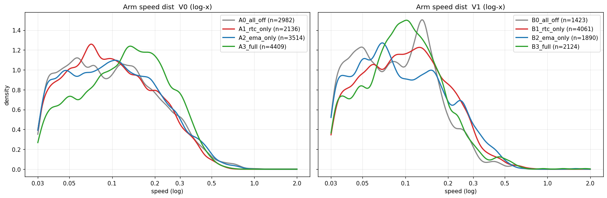
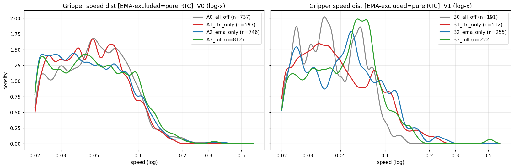

# 模型部署后机械臂运行速度分析

> 记录不同部署配置 (RTC / EMA / V0-V1) 对真机执行速度的影响。
> 配套: 实验设计 [`rtc_ema_speed_ablation.md`](rtc_ema_speed_ablation.md) · 采样登记 [`speed_ablation_episodes.md`](speed_ablation_episodes.md)
> 最近更新: 2026-07-19

---

## 1. 方法论: 为什么看峰值/分布, 不看均值

真机 A/B 的测试场景无法完全一致 (每段布的初始摆放、任务进度、快接近段 vs 慢精细段的比例都不同)。
因此**速度均值不可比** —— 均值 = "这段任务里各阶段速度的加权平均", 权重取决于场景, 和 RTC/EMA 无关。
(实测: 同 ckpt 8 段, 均值把 RTC "off" 测成比 "on" 还慢, 物理上不可能, 纯场景噪声。)

**更抗场景差异的指标 (本文主用)**:

| 指标 | 含义 | 为什么抗噪 |
|---|---|---|
| **峰值 `max / p99 / p95`** | 这套配置**允许的最快速度** = 能力上限 | RTC/EMA 是低通, 直接**削峰**。不管场景里快动作占多少, "动起来时的最快速度"反映管线的低通程度 |
| **分布分位 `p25/p50/p75/p90`** | 常见速度的整体形状 | 比单一均值信息量大; 低通会把整条分布向低速压缩 + 砍尾 |
| **众数 mode** | 最常出现的速度 | 反映巡航速度 |
| 夹爪 `max/p99` | 夹爪峰值 | **夹爪在节点内被 EMA 排除** → 夹爪峰值变化 = 纯 RTC 效应 (干净隔离) |

⚠️ **峰值也有前提**: episode 必须**足够长 / 含快动作**才能跑出真实峰值。太短、场景单调的段 (如下 V1 B0 只有 61.7s) 峰值被低估, 使对照失真。

---

## 2. 数据

`Task_A/autonomy/v2/2026-07-19-v2`, ckpt `pi05_v4_awbc_chunk001_dagger_crave_step49999` (V0=ckpt_v0, V1=ckpt_v1 pkl)。
每组一段, 场景**未受控** (见 §5 局限)。速度 = `observation.state` 逐帧差分 × 30fps, 手臂 = 12 关节 `mean|Δq|`, 夹爪 = 2 维 `max|Δq|`, 仅统计运动帧 (>0.03 rad/s)。

| 组 | 版本 | RTC | EMA(α) | ep | 帧/时长 |
|---|---|---|---|---|---|
| A0 | v0 | off | off(1.0) | 3 | 3506 / 120s |
| A1 | v0 | on | off(1.0) | 4 | 2578 / 86s |
| A2 | v0 | off | on(0.5) | 5 | 4555 / 152s |
| A3 | v0 | on | on(0.5) | 1 | 5073 / 188s |
| B0 | v1 | off | off(1.0) | 9 | **1850 / 62s** ⚠短 |
| B1 | v1 | on | off(1.0) | 10 | 5445 / 182s |
| B2 | v1 | off | on(0.7) | 11 | 2676 / 89s |
| B3 | v1 | on | on(0.7) | 8 | 2475 / 83s |

---

## 3. 手臂关节速度分布 (rad/s, 运动帧)

| 组 | min | p25 | 众数 | p50 | p75 | p90 | **p95** | **p99** | **max** |
|---|---|---|---|---|---|---|---|---|---|
| A0 v0全关 | 0.030 | 0.055 | 0.043 | 0.096 | 0.171 | 0.281 | 0.353 | 0.557 | **1.038** |
| A1 v0仅RTC | 0.030 | 0.057 | 0.038 | 0.094 | 0.164 | 0.260 | 0.323 | 0.449 | **0.645** |
| A2 v0仅EMA | 0.030 | 0.056 | 0.041 | 0.099 | 0.178 | 0.279 | 0.365 | 0.527 | **0.891** |
| A3 v0全开 | 0.030 | 0.071 | 0.039 | 0.127 | 0.204 | 0.298 | 0.352 | 0.461 | **0.718** |
| B0 v1全关⚠ | 0.030 | 0.050 | 0.038 | 0.086 | 0.137 | 0.192 | 0.249 | 0.405 | 0.630 |
| B1 v1仅RTC | 0.030 | 0.058 | 0.039 | 0.100 | 0.162 | 0.241 | 0.290 | 0.456 | 0.764 |
| B2 v1仅EMA | 0.030 | 0.053 | 0.049 | 0.086 | 0.161 | 0.255 | 0.322 | 0.449 | 1.576 |
| B3 v1全开 | 0.030 | 0.063 | 0.053 | 0.097 | 0.146 | 0.218 | 0.276 | 0.485 | 1.843 |

## 4. 夹爪速度分布 (归一化/s, 运动帧; 夹爪不走 EMA → 峰值变化=纯RTC)

| 组 | p50 | p90 | p95 | p99 | **max** |
|---|---|---|---|---|---|
| A0 v0全关 | 0.059 | 0.103 | 0.119 | 0.194 | **0.326** |
| A1 v0仅RTC | 0.057 | 0.101 | 0.114 | 0.148 | **0.172** |
| A2 v0仅EMA | 0.057 | 0.107 | 0.125 | 0.189 | 0.372 |
| A3 v0全开 | 0.061 | 0.111 | 0.132 | 0.180 | 0.330 |
| B0 v1全关⚠ | 0.052 | 0.084 | 0.092 | 0.114 | 0.130 |
| B1 v1仅RTC | 0.055 | 0.111 | 0.134 | 0.202 | 0.233 |
| B2 v1仅EMA | 0.061 | 0.119 | 0.135 | 0.225 | 0.258 |
| B3 v1全开 | 0.063 | 0.101 | 0.124 | 0.154 | 0.514 |

---

## 4.5 速度分布图 (波峰波谷) — 最直观的指标

密度归一化 (density) 后**消除了 episode 长度差异**, 只看分布形状。log-x 轴把低速主峰和高速尾分开, 便于看多峰结构。



**手臂速度分布读图**:
- **所有配置共享一个 ~0.04–0.05 rad/s 的低速主峰** (波峰1) — 模型大量时间在**慢速微调**, 这正是"部署整体慢/开环磨蹭"的分布指纹。
- **0.1–0.3 rad/s 的宽肩** (波峰2区) — 搬运/接近段。各组在此**重叠严重**, 位置差异是场景噪声, 不能干净归因 RTC/EMA。
- **>0.4 rad/s 高速尾** — 快速伸手。**RTC 在此削峰**: V0 log-x 图里 A1/A3 (含RTC) 的右尾 (>0.5) 明显比 A0 (全关) 低、收得早。这是分布层面最稳的可归因信号 (与 §5.1 峰值结论一致)。



**夹爪速度分布读图** (夹爪不走 EMA → 纯 RTC 信号, 最干净):
- V0: **A1 (仅RTC) 相对 A0 (全关) 高速尾 (>0.1) 被明显压低** → RTC 削掉夹爪的快速开合瞬态, 与 §5.1 夹爪 max 0.53× 吻合。
- V1: B0 (全关) 样本饥饿 (n=191, 仅 62s) → 分布尖而窄, 失真, 不可比。

**方法论小结**: 分布图比单点峰值更直观 —— 能同时看到 (1) 共享的慢速主峰 (模型本身慢), (2) 场景噪声集中在中段 (故均值不可比), (3) RTC 削掉的高速尾 (可归因信号)。三者一图看清。

## 5. 发现

### 5.1 ✅ V0: RTC 明显削峰 (最干净的信号)

相对 A0(全关):

| | p95 | p99 | max | 夹爪 max |
|---|---|---|---|---|
| A1 仅RTC | 0.92× | 0.81× | **0.62×** | **0.53×** |
| A2 仅EMA | 1.03× | 0.95× | 0.86× | 1.14× |
| A3 全开 | 1.00× | 0.83× | 0.69× | 1.01× |

- **RTC 把手臂峰值 (max) 压到 0.62×, p99 到 0.81×** —— 与 RTC 重叠混合=低通、削掉快速瞬态的机制一致。
- **夹爪 max 0.53× (砍半)**: 夹爪不走 EMA, 这是**纯 RTC** 效应 → 干净证明 RTC 在削峰。这也解释了之前"夹爪只有遥操 0.3×"里 RTC 的贡献。
- **EMA 单独 (A2) 削峰温和** (max 0.86×, p99 0.95×): EMA α=0.5 主要加相位滞后, 削峰弱于 RTC。
- p25/p50/众数 (常见巡航速度) 各组接近 → 低通主要削**峰**, 不太动巡航段。

### 5.2 ⚠️ V1: 峰值对照失真 (基线 B0 太短)

V1 "全关" B0 只有 62s 且场景单调, 没跑出快动作 → max 仅 0.63 (远低于 V0 全关的 1.04)。
这使 B1/B2/B3 的峰值比 >1 (仅RTC max 1.21×, 全开 2.93×), 物理上不成立, 是**基线场景饥饿**假象。
→ V1 这批**不能用**, 需重采 (B0 用足够长、含快接近的场景)。唯一勉强参考: V1 各组 p90/p95 普遍低于 V0 同类 (如 A0 p95 0.353 vs B0 0.249), 与 "V1 延迟大 → RTC inference_delay 大 → 压得更狠" 方向一致, 但基线不可靠, 存疑。

### 5.3 结论 (置信度)

- **[较可信] RTC 削手臂峰值至 ~0.62-0.81× (V0), 夹爪峰值至 ~0.53×** —— 单段但机制自洽 + 夹爪纯 RTC 隔离佐证。
- **[温和] EMA(α=0.5) 削峰弱于 RTC (~0.86-0.95×)**, 主要贡献相位滞后而非削峰。
- **[存疑] V1 比 V0 慢** —— 方向与延迟机制吻合, 但本批 V1 基线场景饥饿, 需重采确认。

---

## 6. 局限与下一步

- 每组仅 1 段、场景未受控 → 上述峰值结论仍是"单段证据 + 机制自洽", **非统计显著**。
- V1 B0 场景太短 → V1 全套需重采 (基线选长段/含快接近)。
- **要升级为可写报告的数字**:
  1. **同场景 RTC 热翻**: 同一块布连续跑, 中途 `ros2 param set /policy_inference enable_rtc {true,false}`, 比翻转前后各 30s 的峰值/分布 (RTC 可热改, 这是最干净的受控 A/B)。
  2. EMA 不可热改 → 同起始场景 + 同里程碑截断, 每配置 ≥3 段, 取峰值/分布的组间中位。
  3. 每段跑够长 (>150s) 且含快接近段, 保证峰值有意义。
  4. 配 `--profile-latency` 记往返延迟, 从 `inference_delay` 侧面印证 RTC 削峰幅度。

---

## 7. 采数/复现

```bash
# 列出所有已标记 episode
/data1/miniconda3/bin/python -c "
import json,glob
for mp in glob.glob('/data1/DATA_IMP/KAI0/Task_A/*/*/*/meta/episodes.jsonl'):
    for l in open(mp):
        d=json.loads(l); e=d.get('experiment')
        if e and e.get('study')=='rtc_ema_speed_ablation':
            print(mp.rsplit('/meta',1)[0], 'ep='+str(d['episode_id']), e['group'])
"
```
速度分布计算: 见本文 §2 口径 (逐帧差分×30fps, 运动帧>0.03, 报 min/p25/众数/p50/p75/p90/p95/p99/max)。

分布图 (§4.5) 复现 — 自动扫所有标记 episode 重画:
```bash
/data1/miniconda3/bin/python train_scripts/kai/eval/plot_deploy_speed_dist.py
# → docs/deployment/inference/assets/deploy_speed/{arm,gripper}_speed_dist.png
```
新增 episode 并打标后重跑即可自动纳入 (按 group 分 V0/V1, kind 分 off/off、RTC only、EMA only、both)。
