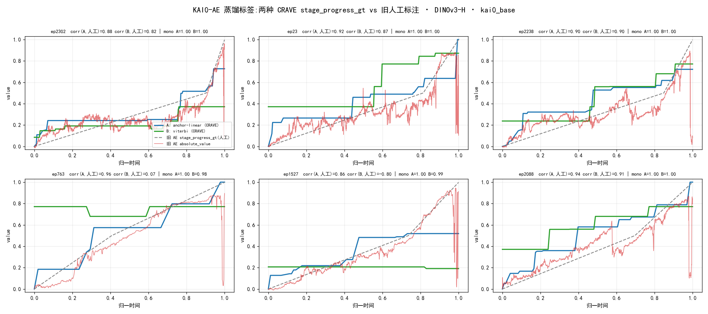

# CRAVE → KAI0-AE 蒸馏:两种标签方法对照 plan

> **目标(收紧)**:用 CRAVE 自动生成的 `stage_progress_gt` **替代人工 Step-0 标注**,各训一个 KAI0-AE,**离线看效果**。**暂不做 VLA / 真机**。
> 这是 [awbc_milestone_value_AB_plan](../../../../crave/docs/awbc_milestone_value_AB_plan.md) 的 **B 臂**(CRAVE→AE 蒸馏)。日期:2026-07-03。

## 0. 命题
KAI0-AE 现在的监督信号 `stage_progress_gt` 靠**人工分段 + 线性插值**(Step-0,痛点:人工+循环)。用 **CRAVE 逐帧 value** 顶替它 → 得到一个**零人工标注**的 value 模型。比两种 CRAVE 标签构造法训出的 AE 谁更干净。

## 1. 两种标签方法(都产出逐帧 `stage_progress_gt` 0→1)

两者都在 **DINOv3-H milestones(全 3055 ep,apples-to-apples)** 上,3Hz 生成 → 插值到 30Hz → **端点归一 0→1**(kai0_base 全成功完整折;单调曲线)。

| | **A · anchor-linear** | **B · viterbi + 时间先验** |
|---|---|---|
| 构造 | 段内**离簇心最相似帧=锚点**(峰值成员,非边界),value=Pord;+ start(0,0)/end(末,1.0);isotonic 兜单调;线性连接 | milestone bin 上 Viterbi-DP,emit=(1−sim)+**α·\|tn−Pord\| 时间先验**;value=Pord[path];中值平滑 |
| 形状 | 分段线性(锚间线性,少而大的台阶) | Viterbi 平滑(更细的阶梯,处理 dwell/loop) |
| 鲁棒性 | 高(start/end 锚 + isotonic 强制 0→1) | 高(时间先验破起末别名) |

**⚠️ 关键教训(sanity 已验证)**:**naive Viterbi(纯 1−sim)崩** —— DINOv3-H 无 proprio → 起末视觉别名(折好布≈摊平布)→ ep763/1527 起点误吸晚期 milestone(corr 0.07 / −0.80)。**加时间先验 `α·|tn−Pord|`**(= sym-adaptive-vote 的 distance-correction 思路,α=0.6)后修复:ep763 0.07→**0.95**、ep1527 −0.80→**0.93**,全 3055 ep 鲁棒、无需 3 路 proprio cache。

*(修复后:A/B 均 mono 1.00 / corr 0.86–0.96 vs 人工;A 少而大台阶、B 细阶梯;A vs B 逐帧 mean|Δ|≈0.20、corr 0.65 → 两套标签有区分度。)*

## 2. 数据处理(生成两个可用数据集)

**帧映射**:native 30Hz,DINOv3-H/3路 cache 3Hz(FR=native 索引 ×10)→ 生成 3Hz value → 线性插值到 30Hz → 写 `stage_progress_gt`。

**✅ 已完成(全 3055 ep)**:
1. **两套标签**:`gen_ae_stage_labels.py --full` → `temp/crave_ae_labels/{anchor,viterbi}/ep*.npy`(native 30Hz,0→1)。
2. **两个数据集(训练就绪)**:`write_crave_stage_datasets.py` → **统一以 `kai0_base` 为底**(干净,不带旧 AE 输出列)、meta/videos symlink 到 kai0_base、加 `stage_progress_gt = CRAVE`:
   - **`kai0/data/Task_A/self_built/crave_stage_A/`**(A anchor-linear)
   - **`kai0/data/Task_A/self_built/crave_stage_B/`**(B viterbi+时间先验)
   两者均 3055 ep、列 = kai0_base 原列 + `stage_progress_gt`(0→1、mono 1.00),observation.state/action 不变 → 可直接作 Step-1 AE 训练 `repo_id`。
   *(已验证:advantage_q5 与 kai0_base 帧逐位一致 → CRAVE 标签对齐正确;两数据集只加 `stage_progress_gt`,不含旧 AE 的 absolute_value/relative_advantage 等列。)*

## 3. AE 训练(各一个,集群)

- **配置**:`ADVANTAGE_TORCH_KAI0_FLATTEN_FOLD`(pi0-AE,`AdvantageEstimator.value_head`),Step-1 `train_pytorch.py`,50k step(与现有 C 同参,唯一变量=标签)。
- **三臂**:
  - **AE-A** = 训在 crave_stage_A;
  - **AE-B** = 训在 crave_stage_B;
  - **AE-C(现成 baseline)** = 现有 `adv_est_v1/100000`(人工 `stage_progress_gt`)。
- 长训走集群(`submit-training-job`),本地只 sanity。

## 4. 离线看效果(判据 —— 不用"对人工 GT 的 MAE",会循环)

三个 AE 各自打 `absolute_value` / `relative_advantage`,在 held-out 成功 episode 上比(全是成功叠衣,理应几乎全 POSITIVE/NORMAL):

| 指标 | 含义 | 期望 |
|---|---|---|
| **P/N 翻转次数 / NEG 帧占比** | 痛点① 抖动 | **越低越好**(报告里 AE-C 有 256 次翻转) |
| **单调率 mono** | value 平滑单调 | 越高越好 |
| **relative_advantage 噪声(std / 过零率)** | AWBC 标签稳定性 | 越低越好 |
| **完成态 value** | 末帧是否到高值 | 接近 1 |
| 与人工 GT 在**清晰帧**上的一致性 | 合理性(非全局 MAE) | 参考,不作唯一判据 |

**看效果 = AE-A / AE-B 是否比 AE-C 的 P/N 更干净、更单调、advantage 更稳**(正是报告痛点①③要解的)。A vs B 谁更好 = 两种标签形状哪个更利于蒸馏。

## 5. 诚实边界 / 风险
- **天花板 = CRAVE 标签质量**:蒸出的 AE 继承 CRAVE 的"完成态偏弱 + 只抓粗失败"(B2 已否)。换掉的是"人工分段"痛点,不修细粒度盲区。
- **circular MAE 陷阱**:AE-B/C 各拟合自己的标签,别用"对谁的 MAE"评判 → 用 §4 的 P/N 干净度 / 单调 / advantage 稳定度。
- **B 覆盖**:三路 cache 550 ep;pilot 先跑 550,全量待补特征。
- **downstream 决定性判据(AWBC rollout)本轮不做**,留作后续(见 AB_plan Tier3 sim)。

## 6. 里程碑
| P | 内容 | 状态 |
|---|---|---|
| P0 | 两套标签(A/B,3055 ep,0→1)+ 写两个数据集 | ✅ **完成** |
| P1 | 集群训 AE-A / AE-B(50k,config `ADVANTAGE_TORCH_KAI0_FLATTEN_FOLD`,`repo_id` 指两数据集),对照现成 AE-C | 待提交集群 |
| P2 | 离线 P/N 干净度 / 单调 / advantage 稳定度对照(§4) | 出结论 |

复现:`crave/experiments/gen_ae_stage_labels.py --full`(两套标签 + sanity 图)· `write_crave_stage_datasets.py`(写两数据集)。

**注**:端点归一 0→1 假设 episode **完整完成**(kai0_base 全成功折 → 成立);对 partial/failed 数据需按 `de_end` 完成判据门控,不能盲目拉到 1.0(§6.3 truncate_test 教训)。
