# 跨 Episode 重复度挖掘 → 自动 Milestone / Value(AWBC 标签升级)

> **核心假说(用户,2026-06-11)**:同任务多条 episode 中**反复出现的图像/状态 = 任务必经过程(milestone)**;**低重复度的图像 = 非必要操作甚至 error/negative 样本**。据此从跨 episode 结构挖 value,替代/增强现有 AWBC 的逐帧进度回归。
> **状态**:🔬 研究阶段完成(2026-06-11~12,两轮自循环 + 六轮用户驱动迭代)。假说前半成立并落地;后半实证否定(低重复 = 稀有 item,非错误,图6/16)。**配方终态(V1)**:armmask ⊕ proprio 特征(§2.6/2.10)+ N=500/k=96/M=20 挖掘(§2.11)+ 置信门控(图33)+ 时间分桶 & item 分组(图31/34,待全量实施);**V2 校准标签已落地**(P_k 非均匀阶梯 MAE −36%,§4.4 图37);**TCC v3 复活**为连续值补充(τ −0.31→+0.75,§2.4.1 图36)。held-out τ=0.922 反超监督基线 0.896(τ 已饱和,见 §2.12 警示)。下一决策点:全量重打标签 → AWBC 对照训练(§4.3)。
> **上游**:AWBC pipeline([awbc_implementation_plan.md](../../../deployment/strategy/awbc_implementation_plan.md));ViVa 对比([awbc_viva_value_comparison_plan.md](awbc_viva_value_comparison_plan.md),其 DSM-r30 变体**手标** milestone——本方案已证明可自动挖出,§2.3)。
> **动机(现有 pipeline 病根)**:pi0-AE 是单帧视觉回归器,`absolute_advantage = V(t+50)−V(t)` 二阶差分放大噪声(corr 0.896→0.3-0.4);完全不利用跨 episode 结构;且 AE 训练数据在完成瞬间截止 → vis episode 尾段 value 系统性下坠(end-drop,已实证)。

图像目录:`docs/visualization/cross_episode_recurrence_value/`(本文图 1-44 均相对引用,GitHub 直接渲染);视频默认不入 git(路径见附录 A),**阶段示例视频已入 git**:[milestone_ep_s800_660_final_v4gated_sync.mp4](../../../visualization/cross_episode_recurrence_value/milestone_ep_s800_660_final_v4gated_sync.mp4)(终版配方 + 置信门控,held-out ep660,图33 为抽帧)。

---

## 0. 结论速览

**图21 — 一图总览:value 质量递进**(同 kai0_advantage 50 ep / 同协议)

**示例视频**(git 内,GitHub 可直接播放):[milestone_ep_s800_660_final_v4gated_sync.mp4](../../../visualization/cross_episode_recurrence_value/milestone_ep_s800_660_final_v4gated_sync.mp4)——held-out episode 播放时,实时画面 / 当前 milestone 参考帧 / 20 级覆盖率阶梯 / V_milestone 四面板同步。

**表1 — 核心结论与证据索引**

| # | 结论 | 关键数据 | 证据 |
|---|---|---|---|
| 1 | ✅ 假说前半成立:重复状态 = 必经 milestone | 覆盖率峰 82-92%,dom≈0,跨 3055 ep 稳定 | 图1/2,图10/11 |
| 2 | ✅ 自动 milestone 可替代 DSM 手标 | 同 30 ep:median \|Δt\| = 3.7% 时长,80% ≤0.10 | 图12,表8 |
| 3 | ✅ 零训练 V_milestone **反超**监督 value | τ 0.812 → 0.865(臂掩膜)→ 0.875(⊕proprio)→ **0.922(500ep/k96/M20,held-out)** vs 监督 0.896 | 图21,表6/9,§2.10/2.11 |
| 4 | ✅ value 是状态触发且泛化零衰减 | held-out 50 ep τ=0.868(=挖掘集内);拼接测试段内τ≫全局τ;真机 3 轮 rollout 旁证 | §2.1(d),图22,图7/8 |
| 5 | ❌ 假说后半("稀有=negative")否定 | 低覆盖段 = 稀有衣物类型,三数据集一致 | 图6/16 |
| 6 | ❌→✅ TCC 冻结特征版失败 → **v3 修复跑通**(根因 = goal 距离读出 × 首尾状态混淆 + 未掩膜特征) | τ −0.31 → **+0.75/+0.80**,MAE 0.133 ≈ 主线 0.128;定位为段内插值补充 | 图13/14;§2.4.1 图36 |
| 7 | ⭐ 顶簇偏置 = 机械臂占画面(用户质疑发现)→ 臂掩膜修复 τ +0.05 | 92% 臂伪簇 → 82-90% 真布料状态簇 | 图17/18/19,表9 |
| 8 | ⭐ coverage 低估根因 = 外观分裂(用户观察发现);跨衣物泛化是梯度的 | 同阶段兄弟簇 sim 0.95;{c13,c18} 合并 80/82%→94%;头部 milestone 跨 5-6/6 外观组 | §2.8,图28 |
| 9 | ✅ proprio 入聚类(用户提议)= 最高性价比升级 | coverage 54-90%→82-100%,全 milestone 跨 6/6 组;腕相机判不入(状态-姿态混淆) | §2.10,图30 |
| 10 | ✅ 挖掘规模有效但须 N/k/M 同扩(用户提议驱动) | 只加数据不动 k 持平;N×10→k×2、M=k/5 | §2.11 |
| 11 | ⭐ 前段误对应根因 = 首尾状态混淆 + 低置信单帧(用户观察发现)→ 置信门控修复 | M16 首入 0.15→0.91;门控 = 驻留≥2帧 ∨ margin≤0.8 | 图33 |
| 12 | ❌ K==M(全簇皆 milestone)否定;**τ 指标已饱和** | 线性时间 τ=1.000;K=M 高 τ = 计时器假象,52% 增量来自低覆盖簇 | §2.12 |
| 13 | ⚠️ 随机 3 ep 泛化:对应关系稳,命中率受稀有外观限制 → item 分组必做 | 稀有 item V 封顶 0.45-0.55(常见 0.85) | 图34 |
| 14 | ⭐ V2 规划+落地(用户提议):milestone 进度校准 + 相对(循环)milestone | P_k 校准 MAE 0.199→**0.128**(−36%);E1-E3 验证完毕;v5 标签视频落地(图37);两个文献空白确认 | §4.4,图35/37 |

---

## 1. 文献调研与失败模式预注册

### 1.1 调研结论(deep-research,104 agents / 22 源 / 25 claims 三票核验,21 confirmed / 4 killed)

**表2 — 假说两半的文献判定**

| 假说 | 判定 | 依据 |
|---|---|---|
| 前半:重复 = 必经 | ✅ 25 年直接先例 | McGovern & Barto(ICML 2001,[PDF](https://mcgovern-fagg.org/amy_html/old/pubs/mcgovern_barto_isairs2001.pdf)):bottleneck = "在每条成功轨迹上都出现的区域";[L-Cut 2004](http://all.cs.umass.edu/pubs/2004/simsek_wb_TECH04.pdf) → [betweenness 2008](https://proceedings.neurips.cc/paper/2008/file/934815ad542a4a7c5e8a2dfa04fea9f5-Paper.pdf) → [2025 HRL survey](https://arxiv.org/abs/2506.14045) 确认为公认子目标发现准则 |
| 后半:稀有 = negative | ⚠️ 文献明示脆弱 | 2001 原文即警告"有用子目标也出现在稀有路径 → 负证据须软化";经典 diverse density 需要失败轨迹作负包(我们全成功,无形式化对应);现代侧唯一先例 = TCC Fig.7 异常检测(1 个定性例子,从未当 negative 标签用于 BC) |

**表3 — 四条方法学教训**

| # | 教训 | 出处 | 实现含义 |
|---|---|---|---|
| 1 | 裸帧频不行(every-visit 被停留时长主导) | McGovern 2001 | **first-visit:每 episode 每簇只计一次** |
| 2 | recurrence 要双阈值统计(Binomial) | L-Cut 2004 | 出现 episode 数 + hit 比例双门限 |
| 3 | milestone = 局部峰值,非全局阈值 | Betweenness 2008 | 按邻域选峰(后经 §2.5 修订:**宽 basin/top-覆盖率优先**) |
| 4 | 离散图方法在连续 RGB 不 scale | HRL survey 2025 | embedding 层是前提 |

**表4 — 现代采用线**

| 工作 | 提供什么 | 核验 |
|---|---|---|
| **TCC**(CVPR'19,[1904.07846](https://arxiv.org/abs/1904.07846)) | cycle-consistency = 逐帧"共性分数";进度信号 τ 0.75 vs TCN 0.66(from scratch) | 3-0 |
| **XIRL**(CoRL'21,[2106.03911](https://arxiv.org/abs/2106.03911)) | 跨 episode 对齐(零标注)→ value = 到 goal 嵌入负距离;[代码开源](https://github.com/google-research/google-research/tree/master/xirl) | 3-0 |
| **GraphIRL**(CoRL'22,[2207.14299](https://arxiv.org/abs/2207.14299)) | **先抽象掉外观再对齐**(治 nuisance)——本方案臂掩膜(§2.6)即此原则落地 | 3-0 |

被 3 票否决的捷径(勿按此预算):"标 1 条参考 episode 经 TCC 传播 ≈ 50 条全标"(0-3);VIP/LIV/AWE/ILEED 无幸存核验 claim。完整阅读指引见 §6。

### 1.2 失败模式预注册(实验前写下;后续实测命中情况)

**表5**

| 失败模式 | 预注册缓解 | 实测 |
|---|---|---|
| 多策略/多 item 劈裂 recurrence | 按 item/策略分组再挖 | ✅ 命中:稀有 item 全程零 value(图16 右) |
| 稀有恢复动作误杀 | 软负 + 人工审计 | 审计显示低覆盖主因是 item 而非恢复(图6) |
| 外观多样性主导聚类 | 先抽象(GraphIRL 原则) | ✅ 命中变体:**机器人本体**才是最大 nuisance(图17,§2.6) |
| TCC 单调相位假设失真 | 先小规模验证 | ✅ 命中:冻结特征版塌缩/反向(§2.4) |

---

## 2. 实验记录

### 2.1 V0 探针 — 假说首次验证(2026-06-11)

**协议**:50 episode × top_head 相机 × 3Hz → 冻结 DINOv2-small 特征 → KMeans(k=48)→ **first-visit episode 覆盖率**;milestone = top-10 覆盖率簇按时序;V_milestone(t) = 已首入 milestone 数 / 10。脚本 `train_scripts/kai/data/recurrence_v0_probe.py`。

#### (a) 覆盖率结构真实存在(smooth800,50 ep / 5968 帧)

峰值 **c4 = 92%**@t=0.78、c36 = 78%@t=0.78、c23 = 72%@t=0.44(图1);**dom(单 episode 占比)全部 7-15%** → 真跨 episode,非个体伪影。代表帧网格(图2)肉眼可辨任务阶段,且同簇混不同布色 → DINOv2 抓状态而非颜色。
> ⚠️ c4 后被证明是"臂占画面"伪簇(§2.6,图17),中段峰为真。

**图1 — smooth800 覆盖率 vs 簇时间位置**(峰 = 候选 milestone)

**图2 — 高覆盖簇代表帧网格**(每行一簇 × 4 个不同 episode;同簇混布色)

**图3 — 每 episode 时间线按帧所属簇覆盖率着色**(红 = 低覆盖候选段,审计定位用)

#### (b) GT 验证:零训练 value vs `stage_progress_gt`(kai0_advantage,50 ep)

kai0 覆盖率结构与 smooth800 同构(峰 88%@t=0.39、86%@t=0.46,图4)。

**图4 — kai0 覆盖率曲线**

**表6 — 零训练 value 与 GT 的相关性**

| value(纯重复度挖掘,零标注) | Kendall τ(mean/median) | Pearson r |
|---|---|---|
| **V_milestone**(top-10 覆盖簇首入) | **0.812 / 0.854** | 0.805 |
| V_tpos(簇平均时间位置) | 0.553 / 0.593 | 0.641 |
| [对照] pi0-AE absolute_value(**监督**) | — | ≈0.896 |
| [对照] 线性时间(trivial 上界,GT 分段线性) | 1.000 | — |

**图5 — V_milestone(红阶梯)单调跟随 GT(黑)**;蓝点 = V_tpos。已见局限:后段 milestone 稀疏 → 饱和 ~0.7(臂掩膜版改善见图20)

> 诚实标注:episode 内高 τ 含"时间单调"成分;**鉴别性证据在 (d)**——held-out 泛化零衰减 + 拼接边界重置,时间驱动信号做不到。

#### (c) 低覆盖段审计 — 假说后半的判决

bottom-decile 簇(覆盖率 4-10%)段落缩略图人工抽看,**三个数据集一致:低覆盖段由稀有衣物类型主导**——既非 error 也非 recovery(图6)。
→ **"低重复 = negative" 否定**:硬标 negative 会系统性惩罚稀有品类;只能软降权 + **按 item/策略分组后再挖**(表5 预注册缓解的实证确认;value 层面的后果见图16)。

**图6 — 低覆盖段审计样例(三数据集)**

| smooth800:深色 T 恤 | smooth800:白长袖 | dagger:红长裤 |
|---|---|---|
|  |  |  |

#### (d) 鉴别性实验:value 是状态触发而非时间驱动

**(d1) held-out 泛化验证(主证据,kai0 demo 数据)**:milestone 在 50 ep 上挖掘,在**另外 50 条从未参与挖掘的 episode** 上验证(armmask 特征):

| | 挖掘集内 50 ep | **held-out 50 ep** |
|---|---|---|
| V_milestone τ vs GT | 0.865 / 0.886 | **0.868 / 0.879** |

→ **泛化零衰减**:milestone 是任务的真结构,不是对挖掘集的过拟合。

**(d2) 人工双轮拼接测试(vis demo 数据)**:把两条 held-out episode 首尾拼接 = 可控构造"两轮叠衣",milestone 命中等级在拼接点后**从低位重新爬升**(图22);量化(20 对拼接):段内 τ(等级 vs 段内时间)= 0.33 ≫ 全局 τ = 0.18 —— 时间驱动的信号两者应相等,**状态触发才会段内重置**。诚实标注:逐帧原始等级噪声大(τ 量级温和);累计式 V_milestone(实际使用形态)的强证据在 (d1)。

**图22 — 拼接测试:命中等级在人工轮次边界后重置**

**(d3) 真机 rollout 旁证(解读已修正)**:autonomy rollout(7676 帧)实为 **3 次连续叠衣**(⚠️ 初版误读为"失败重试",经用户指正修正)。demo 挖掘的 milestone 跨数据集 assign 到该 rollout,V_milestone 在每轮边界(~3000 / ~5000 帧,布重新摊开处)回落再爬升,与监督 pi0-AE 的三段结构一致(图7/8;corr(V_ms, pi0-AE)=0.275)——是 (d2) 结论在真机数据上的自然复现,但因 rollout 含多轮、变量不可控,**仅作旁证,主证据为 (d1)/(d2)**。

> 方法注记:曾设计"倒放测试"后撤销——value 是逐帧图像的确定函数(无时序模型),"倒放镜像"在构造上恒成立,无鉴别力;causal 窗口下镜像比较亦不成立。

#### (e) vis_dagger 探针(2026-06-09-v2,50 ep)

覆盖率比 smooth800 更高(median 53% vs 25%,峰 88%,图9)→ dagger 数据更同质;其低覆盖段同样是稀有 item(图6 右)。

**图9 — dagger 覆盖率曲线**

### 2.2 全量挖掘 — milestone 跨规模稳定(集群 8×A100 提特征 + 本地挖掘)

**表7 — 全量挖掘**(MiniBatchKMeans k=64 + 局部峰;此选法后经 §2.5 修订)

| 数据集 | eps / 帧 | 覆盖率 | 关键观察 |
|---|---|---|---|
| kai0_advantage | **3055** / 337k | med 36%,max 79% | **中段峰 t≈0.44-0.46(71-79%)与 50-ep 探针一致**;dom≈0%(图10) |
| smooth800 | 806 / 94k | med 27%,max 63% | 峰 t=0.37-0.46 + 0.85;覆盖率更低 = 跨 10 日期/多衣物多样性(图11) |

**图10 — kai0 全量(3055 ep)** | **图11 — smooth800 全量(806 ep)**(红★ = milestone 局部峰)

### 2.3 自动 milestone vs ViVa-DSM 手标 — 同 episode 直接对比

在 DSM 手标过的 **task_a_0509v2 同 30 episodes** 上跑 V0 协议(0509 单日数据极同质:两个簇 **100% 覆盖**,top-10 全 ≥83%)。

**表8 — 对齐精度**(120 个手标边界)

| 指标 | 结果 |
|---|---|
| 到最近自动 milestone 的 \|Δt\| | **median = 3.7% episode 长度(≈2.5s)**,mean 5.5% |
| ≤0.05 / ≤0.10 命中率 | 59% / **80%** |

**图12 — 自动(紫点)vs 手标(黑竖线),30 episodes**

→ **自动挖掘以 ~4% 时长精度复现手标边界**——"替代 ViVa-DSM 手标"获得同 episode 直接证据。

### 2.4 TCC 复现(XIRL 官方代码)— 冻结特征版裁决:不如聚类路线

代码 sparse-checkout 至 `/vePFS/tim/workspace/recurrence_research/google-research/{xirl,tcc}`;适配器 `tcc_train_features.py`(冻结 DINOv2 + MLP head + 官方 `compute_tcc_loss`;XIRL value = −‖emb−goal‖)。

- **v1(默认参)塌缩**:loss 恒 0.0815 ≈ Var(U(0,1)) = 1/12(soft-NN 均匀的局部最优,图13);
- **v2**(normalize_embeddings + lr↑;并修 XIRL `one_hot` 的 CPU/CUDA device bug):val τ = **−0.31**(弱且反向;raw DINO 到 goal 距离 τ=−0.11),value 非单调(图14);
- **verdict**:冻结特征上"到 goal 距离"不是好进度信号(与表6 V_milestone ≫ V_tpos 一致);XIRL 原方为端到端训 backbone → 列为后续可选,**聚类-milestone 为已验证主线**。

**图13 — TCC v1 塌缩 loss** | **图14 — TCC value 非单调**

#### 2.4.1 TCC v3 复活:两个根因修复后路线跑通(2026-06-12)

> 借助 v2 之后的发现做 post-hoc 诊断:**① v2 的 value=−‖emb−goal‖ 在叠衣上结构性失效**——图33 已实锤"初态布平摊≈终态布叠好",起始帧外观贴近 goal → value 开局即高,恰好产生负相关(τ=−0.31 的真凶);**② v2 输入是未掩膜 CLS**——§2.6/2.10 已证 armmask⊕proprio 才是有效特征。

**v3 修复**(`tcc_v3_armmask.py`,CPU 可跑):输入 = armmask⊕proprio;读出 = **对齐-进度**(query 帧对参考 episode 集做匹配,读出匹配帧的归一化时间;GTCC 式)。结果(kai0 held-out 50 GT ep,200 train ep):

| 配置 | τ | Pearson | MAE |
|---|---|---|---|
| v2(冻结 CLS + goal 距离,§2.4) | **−0.31** | — | — |
| v3 TCC head + goal 距离(失效模式对照) | 0.520 | 0.604 | — |
| v3 raw 特征 + pooled soft-NN(T=0.05, 100refs) | **0.798** | **0.899** | 0.162 |
| **v3 TCC head + 逐参考 argmax 中位数(30refs)** | 0.752 | 0.889 | **0.133** |
| [对照] V_milestone P_k 校准(§4.4) | 0.850 | 0.902 | 0.128 |

**结论**:① **路线已跑通**——loss 不再塌缩(0.0124,v1 塌缩位 0.0815=1/12,图36 左),τ 从 −0.31 翻到 +0.75/+0.80;② 根因排序:**读出方式 > 特征**(goal 距离换对齐-进度贡献最大;armmask⊕proprio 修塌缩);③ pooled soft-NN 对 TCC 嵌入失效(Pearson 0.67,嵌入密度不均)而逐参考中位数读出抗住(MAE 0.20→0.133);④ 终局位置:**MAE 与 milestone 主线持平(0.133 vs 0.128),τ/Pearson 仍略低**——TCC 不再是失败路线,定位为**主线的连续值补充**:milestone 阶梯给绝对档位,TCC 对齐-进度可作 V2 的"段内插值"来源(替代线性插值)。

**图36 — TCC v3**:左 = loss 远离塌缩线;右三 = held-out value 曲线(绿 = 对齐-进度随 GT 上升;红虚 = goal 距离开局即高、全程震荡 = v2 负 τ 失效模式的直接可视化)。

**图39 — 两 episode 对齐演示视频**(`make_tcc_align_video.py`,kai0 ep87↔ep97 均 held-out;视频 `temp/tcc_align_kai0_87_97.mp4`,抽帧):ep87 播放时右侧实时显示 ep97 中 TCC 匹配到的对齐帧——t=0.55 两边同为"双臂展开布料"、t=0.78 同为"叠好提起",**节奏不同的两条 episode 在语义阶段上同步**。下方对齐路径是 v2 死因的最直观证据:**灰线(raw 特征匹配)开局就跳到 0.8-1.0(把初始帧匹配到结尾段 = 首尾状态混淆),绿线(TCC v3)稳定贴对角线**——TCC head 学会了用时间上下文区分"布平摊(始)"与"布叠好(终)"。已知小瑕疵:A 末尾几帧匹配回落(收尾段 OOD,与 end-drop 同源)。

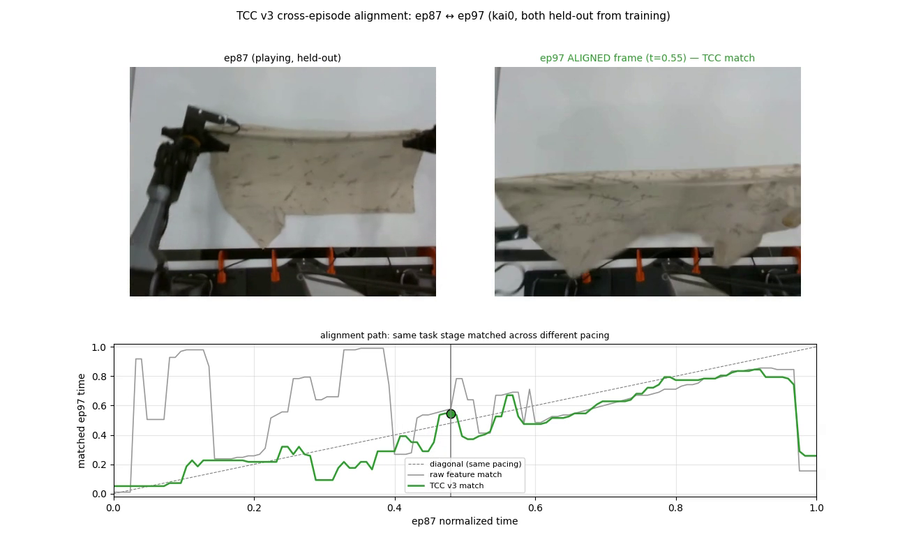

### 2.5 逐 episode 视频与 value 鲁棒性配方(4 版迭代)

为 5 个代表 episode 出同步视频(附录 A):kai0 ep1949/2923(带 GT)、smooth800 ep594 / ep137(稀有 T 恤)、dagger ep73(红长裤)。

- v1(全量挖掘质心 + 局部峰):单帧误配把 max 弹飞(ep2923 开局跳 0.91);
- v2 去抖(≥2 连续帧):持续性误配仍在;v3 顺序门(仅 +1/+2 推进):矫枉过正,前级未命中则卡 0;
- **v4 = 回到 V0 配方**(full KMeans k=48 + **top-覆盖率** milestone + 朴素首入)✅ 干净阶梯(图15)。

**教训**:鲁棒性来自"**宽 basin 簇 + top-覆盖率选 milestone**",不是事后过滤;MiniBatch 细质心 + 弱峰是误配根源(→ 表7 的局部峰选法弃用)。

**图15 — v4 配方:零训练阶梯紧贴 GT(kai0 ep1949)**

**图16 — 稀有 item 的 value 退化(诚实展示;呼应图6 与表5)**:左 ep137(深色 T 恤)阶梯封顶 0.58;右 ep73(红长裤)**全程 value=0** —— 未分组挖掘下稀有 item 被判零进度,"按 item 分组"非做不可

| ep137:封顶 0.58 | ep73:全程 0 |
|---|---|
|  |  |

### 2.6 覆盖率偏置(用户质疑驱动)→ 臂掩膜修复:τ +0.05(2026-06-12)

**用户质疑**:① 高覆盖会不会是"衣物近头部相机、占画面大"导致视觉同质?② 手腕相机夹取时高覆盖是否干扰?

**定量检查**(簇覆盖率 vs 簇内离散度):总体**正相关**(smooth800 r=0.42 / kai0 r=0.47,top8 覆盖簇离散度反而更高)→ 多数高覆盖簇是宽 basin 真语义簇;**但**"高覆盖+低离散"规则恰好命中最高峰 c4(92%@t=0.78)。

**视觉证实(图17)**:c4 代表帧 = **机械臂横穿头部相机前景** —— **真凶不是衣物而是机器人本体**(臂外观跨 episode 恒定,占画面即嵌入塌缩)。质疑② 成立:手腕相机接触段是布料纹理特写、跨阶段同质 → 阶段挖掘**纯干扰**(挖掘只用 top_head 正因于此;手腕"进特写"onset 可作接触事件标记)。

**图17 — c4 臂伪簇代表帧**(两个不同 episode,画面几乎相同)

| ep660 | ep585 |
|---|---|
|  |  |

**修复 = 臂掩膜特征**(GraphIRL 原则落地,表4):c4 帧 patch 聚类 + 颜色启发 → 6 个臂原型;帧嵌入 = DINOv2 patch tokens 剔除(原型相似 >0.6 ∪ 橙色线缆)后均值。**纯 DINO 相似度即可分开金属臂 vs 深色布**(早版"暗色"规则会误吃深色 T 恤,已去,图18);8×A100 全量重提(806 + 3055 ep)。

**图18 — 掩膜可视化验证**(左 3 列:深色 T 恤不再被吃;右 2 列:臂帧覆盖完整;上/下行 = 阈值 0.6/0.7)

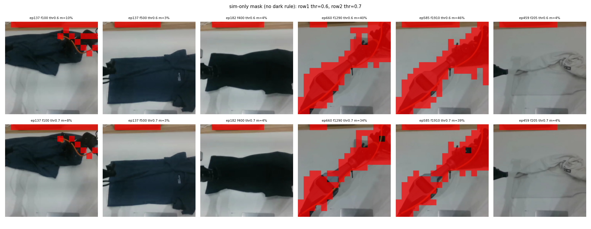

**表9 — 臂掩膜前后对比(同 50 ep、同协议)**

| 指标 | 未掩膜 | **臂掩膜** |
|---|---|---|
| kai0 V_milestone τ vs GT(mean/median) | 0.812 / 0.854 | **0.865 / 0.886**(逼平监督 0.896,见图21) |
| smooth800 最高覆盖簇 | c4 92%@t0.78(臂伪簇,图17) | c18 82%@t0.41(**真布料摊开状态**,跨布色,图19 左) |
| kai0 最高覆盖簇 | — | c13 90%@t0.51(中段) |
| 中段 milestone 覆盖率 | 56-72% | **68-82%**(臂噪声剔除后布状态簇被洗干净) |
| 可疑(高覆盖+低离散)簇 | c4 92%(顶) | 各剩 1 个晚段残留 ~75%(非顶,图19 右) |

**图19 — 掩膜后:新顶簇 = 真布料状态(左);晚段残留(右,"空桌+角落布"残签名仍似,处理列入表10 步 a)**

| 新顶簇 c18(82%@t0.41) | 晚段残留 |
|---|---|
|  | 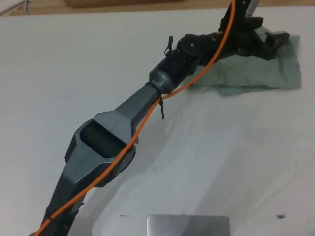 |

**图20 — 臂掩膜后的零训练阶梯 vs GT**(与图5 同 episodes 对照;ep2923 ——此前误配重灾户——现紧贴 GT)

### 2.7 聚类-审计可视化:覆盖率计算透明化(用户核对需求,2026-06-12)

> 目的:让覆盖率**可人工对账**——逐 episode 看到"哪些帧分到哪个簇、在什么时间",并核对计算数字与画面语义一致。脚本 `recurrence_cluster_audit.py`(armmask 特征,V0 同协议)。

**图23 — occupancy raster(smooth800,50 ep)**:每行 = 1 episode,色块 = 该帧命中某 milestone 簇;**右栏 = 从本图直接数出的覆盖率(41/50=82% 等),与报告值完全一致** ✅。可见 milestone 在时间上成带状分布(同一阶段在各 episode 中时刻相近);低行(早期日期 episode)命中更稀疏 = 日期/item 差异的另一视角。

(kai0 同款:`audit_raster_kai0.png`)

**图24 — 首入帧网格:覆盖率的物理含义肉眼核对**。左:smooth800 c18(82%,t̄=0.41)在 12 个**不同 episode** 的首入帧——全是"布拉向相机摊开"同一状态、跨布色;右:kai0 c13(90%,t̄=0.51)——全是"抓提布料"状态、跨衣物。

| smooth800 c18 (82%) | kai0 c13 (90%) |
|---|---|
|  |  |

**图25 — 单 episode 逐帧簇序列**(灰 = 48 簇全集轨迹,彩 = milestone 命中):ep↔簇↔时间三者对应一目了然。注意 ep137(稀有 T 恤)只命中 4 个 milestone(M1/M3/M4/M7,t≈0.3-0.4)而 ep660 几乎全命中——再次直观呈现稀有 item 的覆盖缺失(呼应图16)。

**图26 — 单 episode milestone-coverage 对账视频**(`make_milestone_ep_video.py`,视频在 `temp/`,此处为抽帧):episode 播放过程中,**左下面板实时切换为"当前命中 milestone 的标准帧"**(取自**另一条** episode 的质心最近帧)——肉眼直接对照"实时画面 vs 该 milestone 的典型状态"是否同一语义;右上 milestone 阶梯标注各簇覆盖率(M1=c24 68% … M10=c4 76%),红圈跟踪当前命中;右下 V_milestone 阶梯同步。smooth800 ep660(46s,近全命中)与 kai0 ep1949(28s,带 GT 数据集)各一条。

| smooth800 ep660 | kai0 ep1949 |
|---|---|
| 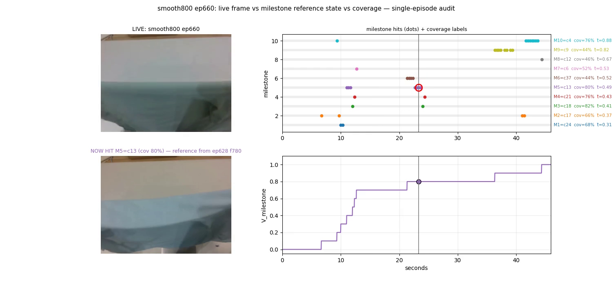 | 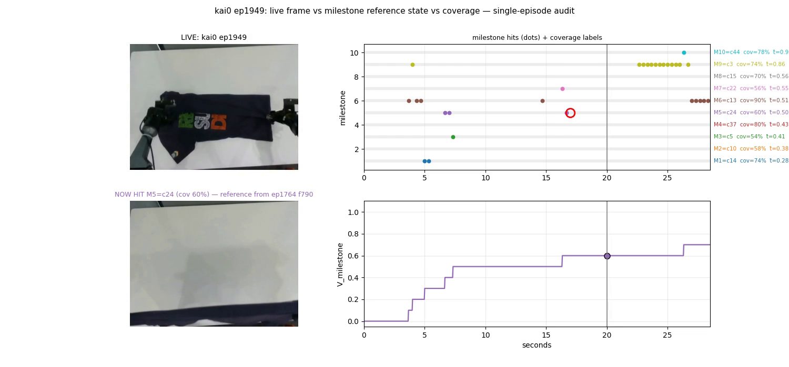 |

视频:`temp/milestone_ep_s800_660_sync.mp4` · `temp/milestone_ep_kai0_1949_sync.mp4`

**图27 — 全 48 簇对账视频**(`make_milestone_ep_video_all48.py`,抽帧):图26 的扩展版,不再只看 10 个 milestone——中上面板显示本 episode 逐帧在**全部 48 簇**上的分配序列(灰 = 非 milestone 簇,彩 = milestone,红圈 = 当前帧所在簇);右栏为 **48 簇覆盖率全表**(milestone 加粗着色,当前簇黄色高亮实时跳动);左下参考帧对**任意当前簇**(含非 milestone)都给出其他 episode 的质心代表帧;底部 V_milestone 同步。ep660 全程只经过 20/48 个簇——簇空间是跨 50 ep 共享的,单条 episode 只走其中一条路径。

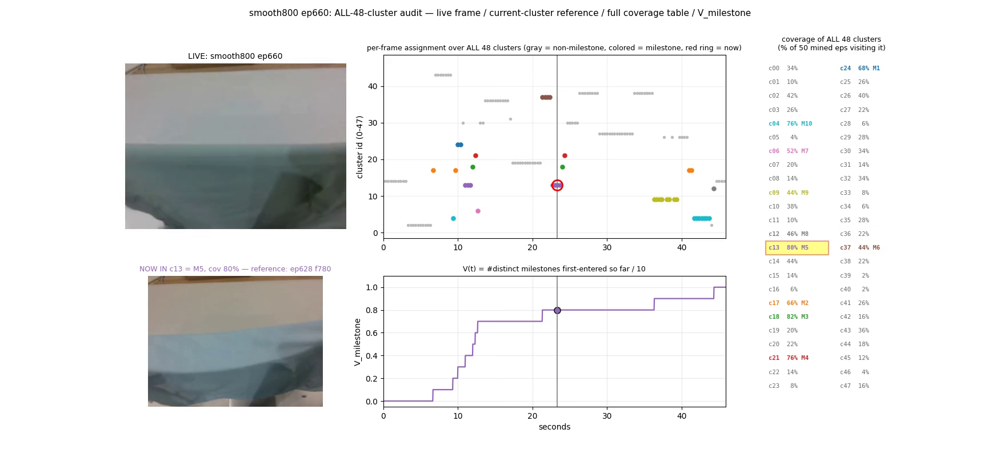

视频:`temp/milestone_ep_s800_660_all48_sync.mp4`

**V_milestone 计算式**(首入阶梯,零训练):对帧 t,先取其簇分配 `c(t) = KMeans.predict(feat_t)`;若 `c(t)` 属于 10 个 milestone 簇则记一次"命中";则

`V(t) = |{ k ∈ {M1..M10} : ∃ s ≤ t, c(s) = Mk }| / 10`

即**截至 t 已首次进入过的不同 milestone 个数 ÷ 10**。单调不减、0→1、纯图像状态触发(与帧索引/时长无关,§2.1d2 拼接测试验证);episode 漏过某 milestone(如稀有 item)则 V 封顶在 <1。

### 2.8 coverage 数值的系统性低估:外观分裂(用户观察,2026-06-12)

> 用户观察:存在"衣服已铺开、但所在簇 coverage 很低"的例子,质疑 coverage 计算正确性,并问是否应掩蔽机械臂。

**臂掩膜已是现状**:§2.6 起所有 coverage/milestone 数字均基于臂掩膜特征(τ 0.812→0.865),问题不在机械臂。诊断(armmask smooth800,确定性协议)定位到另一根因——**衣物外观把同一语义阶段拆成多个簇**:

1. **低覆盖簇 = 少数 episode 专属**:cov≤10% 的簇成员只来自 1-5 条 episode(c40/c39 各只 1 条;c01 五条中 72% 帧来自同一条)——它们是"特定衣物外观"簇,不是"非必要操作"簇;
2. **每个 milestone 都有同期高相似兄弟簇**:同时段(|Δt̄|<0.08)、质心余弦 0.9+ 的低覆盖簇普遍存在——c17(66%)↔c25(26%) sim=0.95;c9(44%)↔c26(40%) sim=0.95;c6(52%)↔c30(34%) sim=0.94;
3. **合并测试**:无时间约束层次合并(cos-dist<0.08)下 {c19,c20,c27,c29,c38,c45} 各 12-28% → 合并 54%,{c13,c18} 80/82% → 94%——**阶段真实覆盖率被簇粒度切碎而低估**。但 pairwise 相似度 + 连通分量会**传递性链爆**(sim>0.88 ∧ |Δt̄|<0.15 时 31 簇连成一团 cov=100%),纯无监督合并不可靠。

**图28 — 外观分裂肉眼证据**(每行同一阶段:左 3 = 高覆盖簇,右 3 = 低覆盖兄弟簇;第三行两边都是"完全铺开"仅布色不同):

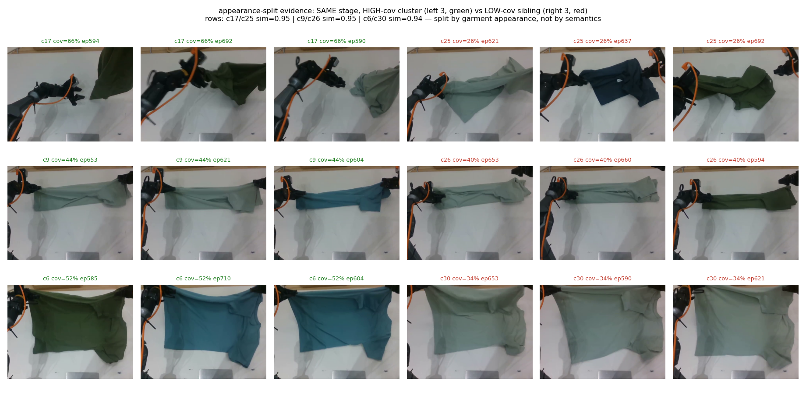

**为何 V_milestone 仍然 work**:top-10 取的是每阶段"外观份额最大"的簇,阶段顺序不变 → τ=0.865 不受影响;代价是 ① coverage 数值低估阶段普遍性(82% 实为 ≥94%),② 稀有外观 episode 漏命中 milestone(ep137 封顶 0.4)。

**跨衣物泛化是梯度的,不是零**(milestone × item组 覆盖矩阵,组 = episode 平均特征聚 6 类):若簇完全不跨衣物,单簇 coverage 上限 = 最大组份额 40%(20/50),而头部 milestone 实际 68-82%。

| | g0(7ep) | g1(5) | g2(20) | g3(9) | g4(5) | g5(4) | 命中组数 |
|---|---|---|---|---|---|---|---|
| M3=c18 (82%) | 6/7 | 4/5 | 19/20 | 9/9 | 3/5 | 0/4 | 5/6 |
| M5=c13 (80%) | 6/7 | 5/5 | 20/20 | 4/9 | 3/5 | 2/4 | 6/6 |
| M1/M4/M10 (68-76%) | — | — | — | — | — | — | 均 6/6 |
| M6=c37 (44%) | 0 | 5/5 | 17/20 | 0 | 0 | 0 | **2/6** |
| M9=c09 (44%) | 0 | 5/5 | 17/20 | 0 | 0 | 0 | **2/6** |

→ **头部 milestone(68-82%)有实质跨衣物 basin**(常见深色系内 DINOv2 能跨色调);**尾部 milestone(44-52%)是半衣物绑定的**(M6/M9 只活在 g1+g2,其他组的同一阶段被分进兄弟簇);稀有组 g4/g5 被所有 milestone 系统性欠覆盖。泛化随簇变细、外观差异变大而衰减——这正是 coverage 44% 与 82% 两档 milestone 的本质区别。

**修复可行性排序**(并入 V1):
| 路径 | 做法 | 评估 |
|---|---|---|
| **① item 分组挖掘**(V1 已列,优先) | episode 平均特征聚类自动分组 → 组内挖掘(组内外观恒定,不分裂)→ 跨组按阶段对齐取并集 coverage | 不需新特征,机制上根治 |
| ② 背景/桌面掩膜延伸 | 仿 armmask 建桌面/背景 patch 原型,只留布料 patch | 机制可复用;但布自身颜色仍主导特征,单独不够,作①的辅助 |
| ③ 外观不变特征 | 布料轮廓/形状描述子(掩膜形状矩)替代外观特征 | 研究性,"铺开"本质是几何状态,长线最优 |
| ④ 簇间合并 | 质心相似度合并 | ❌ 链爆已实证,仅可在①分组之上做人工校验的小规模合并 |

### 2.9 用户提议:k 自适应停止准则(coverage==100% 失守即停),实测评估(2026-06-12)

> 提议:从 k=1 逐渐增大簇数,直到出现 coverage<100% 的簇即停,以停止时的簇数作为 milestone 个数——"最大普适划分",k 由数据决定,替代人工 top-10。

**实验**(armmask smooth800,k=1→30 扫描 + 递归二分变体):

**图29 — min-coverage vs k**:混合外观全集(红)k=2 即失守(98%),放宽到 95% 容忍也只到 k=4,且首个失败簇 t̄=0.54±0.30——时间弥散,是**外观区**不是阶段(§2.8 的外观分裂再次显形);item 分组内(绿,20 ep 同款组)100% 撑到 **k=6**,95% 容忍到 **k≈9**。

**递归二分变体**(更贴合提议本意:仅当两子簇 coverage≥95% 才接受分裂,逐簇自适应深度):6 个 item 组各得 2-11 个普适簇;但其中混有 t̄=0.49±**0.48** 这类"全程随时路过的外观区"——**普适 ≠ milestone**,还需时间局部性约束。t-std 小的叶簇才是真 milestone(如 group3 的 0.35±0.04 / 0.81±0.05 / 0.97±0.02)。

**结论:提议方向成立,需加两个修正落地**(并入 V1 milestone 选择器,替代"top-10 of 48"):
1. **必须先 item 分组**(否则 k=2 即停,准则失效)——与 §2.8 修复路径①同一前提;
2. 阈值用 **95% 容忍**替代严格 100%(50 条中 1 条异常 ep 不应终止全局);
3. 最终 milestone = 递归二分叶簇中 **t-std ≤ 0.15** 者(滤掉普适但时间弥散的外观区);个数 k* 由数据决定。

### 2.10 用户提议:聚类纳入 action/本体感知 + 腕部视角,实测评估(2026-06-12)

> 提议:聚类特征是否应加入 action 信息与腕部相机?

**本体感知(state+速度):✅ 实测显著有效,已纳入 V1 配方。** kai0(有 GT,V0 50-ep armmask 协议),proprio = `observation.state`(14 维双臂)+ 3Hz 差分速度,逐维 z-score 后 L2;拼接 = `[img_L2, w·prop_L2]`:

| 特征 | τ mean/med | top-10 coverage | milestone 跨外观组(满分6) |
|---|---|---|---|
| 图像(armmask,基线) | 0.865 / 0.886 | 54-90% | 4-6 |
| 纯 proprio | 0.843 / 0.853 | **82-100%** | **全部 6/6** |
| **拼接 w=1** | **0.875 / 0.885** | **82-100%** | **全部 6/6** |
| 拼接 w=0.5 | 0.876 / **0.895** | 74-96% | 4-6 |

**图30** 左:proprio/拼接把 milestone coverage 推到 82-100%(逼近"必经"语义);右:k-stop 普适区间延长(95% 阈值下 image k=6 → concat k=7 → proprio k=8)。机理:**本体感知天然外观不变**,直接打 §2.8 外观分裂——同一阶段的双臂构型跨衣物一致,而布色对关节角无影响;纯 proprio τ 略低(0.843)因臂构型在不同阶段间有复现,需图像消歧;拼接两全。成本:state 就在 parquet,无 GPU 提取。注意事项:① proprio 跨本体不可迁移(kai0/vis 关节空间不同)——但挖掘本就按数据集进行,无碍;② rollout 重标注时用 state(非 action),policy 抖动会轻移分布,需验证。

**图31 — 新配方在 vis smooth800 上的视频验证**(`make_milestone_ep_video_v2.py`,ep660,抽帧;视频 `temp/milestone_ep_s800_660_v1recipe_sync.mp4`):img⊕proprio 重挖后 milestone coverage 从 44-82% → **94-100%**(smooth800 同样成立,非 kai0 特例);ep660 十级阶梯满爬至 1.0,参考帧-实时画面语义一致。注意新 milestone 的 t̄ 聚在 0.44-0.62 + 0.87——near-100% 饱和后 top-10 选择对时间分布不再敏感,V1 实施时宜加**时间分桶约束**(每 0.1 时段至多 2 个 milestone)保证阶梯分辨率均匀。

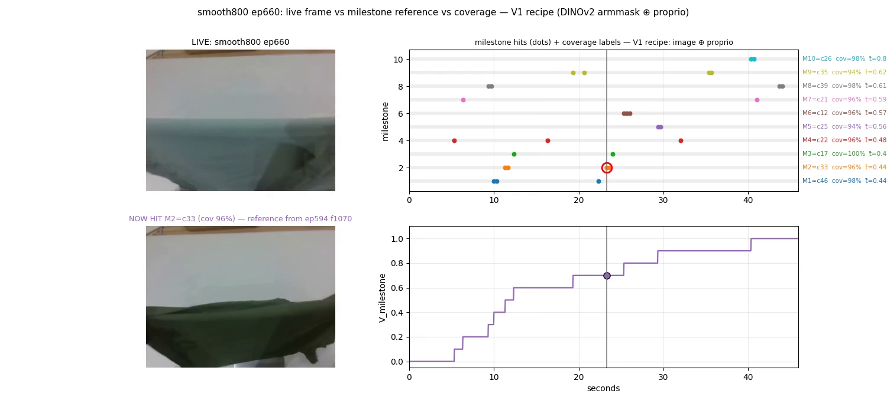

**腕部相机:暂不入聚类特征(预期为害),可作辅助信号。** 三个结构性问题:① 自我中心视角随臂姿连续变化,同一世界状态成像完全不同(状态-姿态混淆);② 近景被布料纹理填满,外观敏感性比头视角更强,会加重 §2.8 分裂;③ kai0/vis 腕相机硬件不同(D435/D405,见相机 gap 调查),跨本体差异大。潜在价值在"抓取成功"类微状态(衣角是否在指间——头视角不可见),适合作为**局部二值特征**(腕部 patch 特征→抓取/未抓取分类)而非全局聚类输入;验证需集群 GPU 提腕部特征,列为 V1 可选项。

### 2.11 挖掘规模扩展:500 ep 有效,但必须 k/M 同步扩(2026-06-12)

> 用户问:用 500 episode 挖掘会不会聚得更好?

**实验设计**(kai0,img⊕proprio 配方):评测集固定 = V0 那 50 条 GT episode;挖掘集 50/200/500 条,**全部与评测集不相交**(纯 held-out);同 KMeans 协议。

**发现一:只加数据、不动 k → 不变甚至更差。** k=48 固定时 held-out τ:N=50 → 0.873,N=200 → 0.869,N=500 → 0.841-0.870(两次 KMeans 初始化间波动 ±0.03,n_init 敏感)。机理:数据带来的外观多样性增长快于阶段信息增长,k 不变则每簇被迫变粗,milestone 边界糊掉。

**发现二:k 与 M 同步扩 → 显著提升,首次反超监督基线。**

| N(挖掘) | k | M(milestone) | held-out τ mean/med | min τ |
|---|---|---|---|---|
| 50 | 48 | 10 | 0.873 / 0.884 | 0.678 |
| 500 | 48 | 10 | 0.870 / 0.885 | 0.713 |
| 500 | 96 | 10 | 0.884 / 0.897 | 0.760 |
| **500** | **96** | **20** | **0.922 / 0.935** | **0.789** |
| 500 | 144 | 10 | 0.823 / 0.842 | 0.473 |
| 500 | 144 | 20 | 0.892 / 0.898 | 0.645 |

- **N=500/k=96/M=20:τ=0.922/0.935**,超过监督 pi0-AE 的 0.896——20 级阶梯的 value 分辨率翻倍,且 500 ep 才能稳定支撑 20 个 milestone(50 ep 下 M=20 会塞进低质簇);
- k=144 过细回落(milestone coverage 掉到 47-69%,首入不稳,min τ 恶化)——k 有最优区间,非越大越好;
- 经验比例:**N×10 → k×2、M=k/5**(48/10@50ep → 96/20@500ep)。

**结论**:规模有效,前提是"数据-簇数-milestone 数"三者同扩;V1 全量配方更新为 **N=500+/k=96/M=20**(时间分桶约束仍建议保留,§2.10 图31)。
**⚠️ 指标警示(后补,见 §2.12)**:本节及全文的 τ 均以 demo 上近似严格单调的 stage_progress_gt 为参照——**纯线性时间在同一评测集 τ=1.000**,即 τ 越高也可能只是"越像计时器"。τ 已接近饱和,配方间细微差异(0.92 vs 0.98)不再有判别力;后续选型须以判别性测试(§2.1d 拼接)与 AWBC 下游效果为准。

**图32 — 终版配方在 vis smooth800 ep660 上的视频验证**(`make_milestone_ep_video_v3.py`,**ep660 不在挖掘集内,纯 held-out**;视频 `temp/milestone_ep_s800_660_final_n500k96m20_sync.mp4`):500 ep 挖掘 / k=96 / M=20,milestone coverage 68-95%,t̄ 覆盖 0.41-0.95;held-out 的 ep660 命中 **19/20**,末值 V=0.95,20 级阶梯比 M=10 的分辨率翻倍。残留问题:无 t̄<0.41 的早期 milestone(挖掘端 top-20 仍漏早段)——时间分桶约束(图31 建议)在 vis 上同样必要。

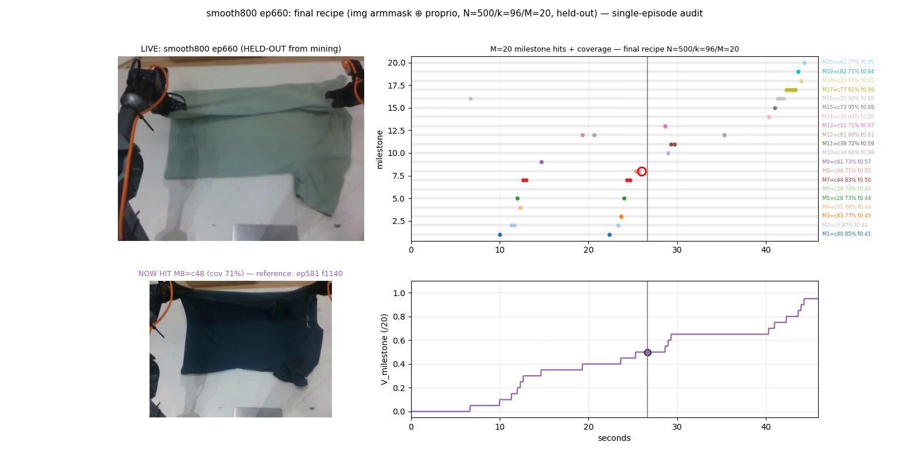

**图33 — 前段 milestone 误对应的诊断与置信门控修复**(用户观察:图32 视频前几个 milestone 对应关系不对)。诊断(ep660 命中结构):① **M16(t̄=0.89 末段簇)在 t=0.15 早爆**——单帧命中、margin=0.963(几乎贴第二近簇),是"初态布平摊 ≈ 终态布叠好"的首尾混淆边界误判(同 §2.8 审计 c4/c43);其真命中是 t≈0.90 的 3 帧连续驻留;② M1/M4 的全部命中均为单帧 + margin 0.85-0.995 的擦边误分配。**修复(纯状态判据,无时间先验)**:首入仅当**连续驻留 ≥2 帧(0.67s)或 margin ≤0.8** 才计数。效果(`make_milestone_ep_video_v4.py`,视频 `temp/milestone_ep_s800_660_final_v4gated_sync.mp4`):M16 首入 0.15→**0.91**,M12 0.42→0.77,M1/M4 判未达(诚实),22% 低置信命中被抑制,门控后首入序列与编号基本单调;末值 V 0.95→0.85(更保守但正确)。**此门控并入 V1 配方**(打标时同样适用:ΔV 不再被边界误判帧污染)。

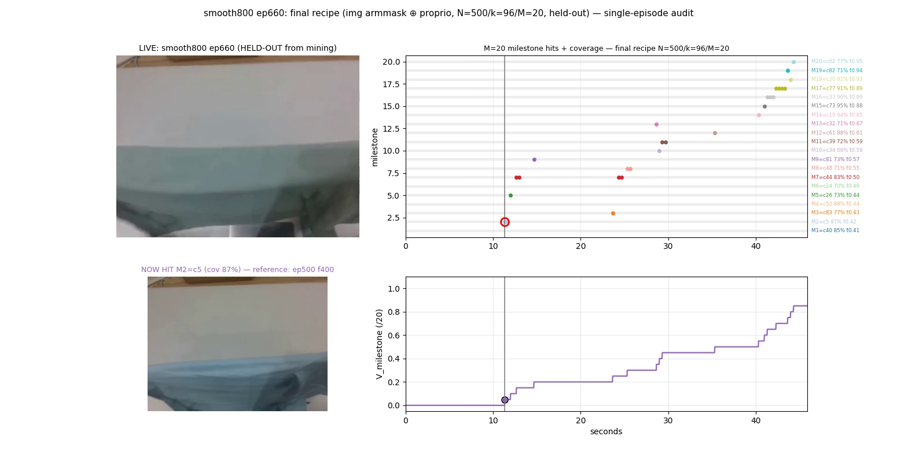

**图34 — 随机 3 episode 泛化测试**(seed=42 随机抽 ep193/724/169,三条共用一次挖掘且全部 held-out;视频 `temp/milestone_ep_smooth800_{193,724,169}_v4gated_sync.mp4`):

| ep | 外观 | 时长 | 命中 | 末值 V | 门控抑制率 |
|---|---|---|---|---|---|
| 660(对照) | 绿色(常见) | 46s | 17/20 | 0.85 | 22% |
| 193 | 黑 T 恤(常见但短) | 23s | 10/20 | 0.50 | 29% |
| 724 | **橙色(稀有)** | 51s | 11/20 | 0.55 | **54%** |
| 169 | **白色长条(稀有)** | 26s | 9/20 | 0.45 | 38% |

两面结论:① **对应关系泛化良好**——门控后三条的首入序列均与编号基本单调,末段链 M16-M20 在全部三条上按序命中(0.84-0.98),用户指出的前段误对应未复发;② **命中率泛化受限于外观**——随机恰好抽中橙/白两条稀有 item,中段(t̄ 0.41-0.65)外观敏感 milestone 大量未命中,V 封顶 0.45-0.55,精确复现 §2.8 已知短板(且稀有外观下分配 margin 普遍偏大 → 门控抑制率升至 38-54%)。**结论:V1 必须含 item 分组(§2.8 路径①)**,公共 milestone 之外按衣物组补组内 milestone,否则稀有 item episode 的 value 系统性低估。

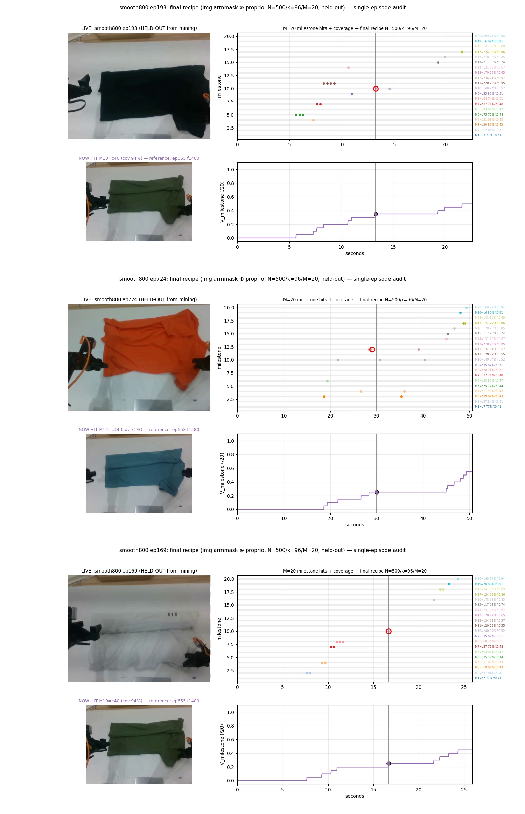

### 2.12 用户提议:K 从小增大且 K==M(全簇皆 milestone),实测评估(2026-06-12)

> 提议:逐渐增大 K 并令 K==M,省去 top-M 选择,效果如何?

**实测**(500-ep held-out 协议,K=M 扫描):τ 单调上升——K=5:0.676 → K=20:0.913 → K=48:0.965 → **K=96:0.982/0.985**,数字上超过 K=96/M=20 的 0.922。**但这是指标假象 + 语义破坏**:

1. **τ 饱和假象**:线性时间在同评测集 τ=**1.000**(GT 在 demo 上严格单调)。K==M 的 V = "已见过的不同状态数"——novelty 随时间稳定累积,**本质是把 value 退化成更平滑的计时器**,τ 升高恰恰是"更像时间"而非"更懂状态";
2. **错误状态也算进度**:K=96 时 **52% 的 V 增量来自低覆盖簇(<50%)**——稀有/偏离/潜在错误状态进入即 +1。AWBC 的 advantage=ΔV 会把"失败乱逛段"(不断进入新状态)标为 positive,与核心假说(低重复=非必要/negative)的目标相反;
3. **跨 episode 可比性丧失**:K=96 时末值 V 范围 0.30-0.64(各 ep 经过的簇数不同),绝对 value 失去"完成度"含义(对照 M=20 选择版末值≈1.0)。

| | K==M=96(novelty 计数) | K=96/M=20(覆盖率筛选) |
|---|---|---|
| held-out τ | 0.982(但线性时间=1.000) | 0.922 |
| V 增量来源 | 52% 低覆盖簇 | 100% 高覆盖必经簇 |
| 末值 V | 0.30-0.64(不可比) | ≈1.0(可比) |
| 失败段 advantage | **正**(novelty 仍累积) | 平(milestone 不触发) |

**结论**:❌ K==M 不可取——覆盖率筛选(top-M)正是假说的实现主体,去掉它等于退化为计时器。K 增大有益(§2.11),但 M 必须由覆盖率(+时间分桶 / §2.9 自适应)筛出"必经"子集。**方法论收获:τ-vs-GT 已饱和,不再适合作配方选型主指标**;判别力在拼接测试与 AWBC 下游对照。

---

## 3. 阶段结论

**假说判定**
1. **前半(重复=必经)**:✅ 三数据集 + 全量 3055 ep 成立,milestone 跨规模稳定(图1/4/10);自动 milestone 以 3.7% 时长精度替代 DSM 手标(表8/图12);
2. **后半(稀有=negative)**:❌ 低覆盖 = 稀有 item 而非错误(图6/16/28/34),只能软处理 + 按 item 分组;K==M 的反例(§2.12)从另一面印证:放弃覆盖率筛选会让错误状态混进 value。

**配方演进(每一步均有对照实验)**
3. τ 0.812(V0 原始)→ **0.865** 臂掩膜(§2.6)→ **0.875** ⊕proprio(§2.10)→ **0.922** N500/k96/M20(§2.11)vs 监督 0.896;⚠️ τ 已饱和(线性时间=1.000,§2.12),不再作选型主指标;
4. **本体感知是最高性价比组件**:外观不变,coverage 推至 82-100%,全 milestone 跨 6/6 外观组(§2.10);腕相机不入聚类(状态-姿态混淆);
5. **规模律**:N×10 → k×2、M=k/5;只加数据不动 k 无效(§2.11);
6. **置信门控**(驻留≥2帧 ∨ margin≤0.8):修复首尾状态混淆早爆与单帧误配(图33),门控后首入序列单调;
7. **泛化边界**(图34):对应关系与末段链(M16-M20)跨 episode 稳定;中段命中率受稀有外观限制(V 封顶 0.45-0.55)→ item 分组为 V1 必做项。

**失败路线(预注册-实测闭环)**
8. TCC 冻结特征版 ❌ →(v3 修根因后)✅ **复活为连续值补充**:塌缩 = 未掩膜特征,负 τ = goal 距离读出 × 首尾状态混淆;修复后 τ +0.75/+0.80、MAE 0.133 ≈ 主线,定位为 V2 段内插值来源(§2.4.1);K==M ❌(计时器化,§2.12);无约束簇合并 ❌(链爆,§2.8);裸 top-M 截断 ⚠️(时间分布盲,图31/32 → 时间分桶)。

---

## 4. 方案(V1 修订版)

### 4.1 修订依据
原"TCC 对齐为主线"→ "**聚类-milestone 为主线**"(§2.4);此后五轮用户驱动迭代逐项升级:臂掩膜(§2.6)、proprio(§2.10)、规模 N/k/M(§2.11)、置信门控(图33)、item 分组实锤(图34);τ 指标饱和后选型标准改判别性测试 + 下游对照(§2.12)。

### 4.2 V1 pipeline(终态)

**表10**

| 步 | 内容 | 依据 |
|---|---|---|
| a | 全量 3Hz 特征:**DINOv2 patch + 臂掩膜均值 ⊕ proprio(state+Δstate,z-score,w=1 拼接)**(残留簇细化:桌面 patch 同掩 / 布 patch 数下限) | §2.6 表9;§2.10 图30 |
| b | **按 item/策略分组**(episode 平均特征聚类),组内分别挖掘 | 图6/16/34 实锤 |
| c | 组内 full KMeans **k=96(500 ep 档,按 N×10→k×2 缩放)** → milestone = top-覆盖率 + **时间分桶(每 0.1 时段限额)** + §2.9 自适应停止可选,M≈k/5 | §2.5/2.9/2.11;图31/32 |
| d | 帧→milestone 命中加**置信门控:连续驻留≥2帧 ∨ margin≤0.8** | 图33 |
| e | V(t) = 首入阶梯(单调)→ 喂回现有 `discretize_advantage.py`(AWBC 训练侧零改动) | 表6/9 |
| f | 低 recurrence 段 → 软降权 / "uncertain" 第三 prompt 标签 + 审计,**绝不自动硬负** | §2.1c/§2.12 |
| g | (可选)TCC 端到端 backbone 增强;腕相机抓取二值特征 | §2.4/§2.10 |

### 4.3 下一决策点:AWBC 对照训练(待拍板)

milestone-value 重打 smooth800 advantage 标签 → AWBC 训练,对照现 pi0-AE 标签版(**同 init / 同配方,单变量 = 标签来源**,沿用 awbc_viva 对比框架);offline 看差分 advantage corr 是否优于 0.3-0.4 基线,**真机为终判**。

### 4.4 V2 规划:milestone 进度校准 + 相对(循环)milestone(用户提议,2026-06-12)

> **用户提议**:① 当前只是把 episode 切成多个阶段,**等步长(+1/M)不含真实进度信息**——相邻 milestone 间的进度增量未必相等,且"第一个 milestone"未必是进度最小的初始状态;应把各帧在 episode 内的进度归一化到 0-1,**簇过滤噪声后取均值作为该 milestone 的进度值**。② 有些 milestone 不含(绝对)进度信息——如"拎起-铺开"在同一 episode 内重复多次,**episode 内重复出现的动作不能作完全进度信号**,应降级为"相对 milestone"(相对于下一绝对 milestone 推进一小步)。

#### 4.4.1 调研结论(三路并行文献深查,2026-06-12;完整文献见 §6 V2 补充)

**提议① 有强先例,且我们的实现方式有新颖性空白:**
- **SARM**(2025,[2509.25358](https://arxiv.org/abs/2509.25358),**旗舰任务就是 T 恤折叠**):stage 进度值 = 该子任务跨 demo 的**平均时间占比**,段内线性插值——与提议①几乎相同,但其 stage 靠语言标注,我们的 milestone 是零标注挖掘;
- **GVL**(ICLR'25,[2411.04549](https://arxiv.org/abs/2411.04549)):VLM 逐帧输出任务完成百分比,**必须打乱帧序**防止模型退化为"数帧计时器"——与 §2.12 我们实测的 τ 饱和/计时器假象互为印证;
- **t/T 直接回归的失败模式已有系统批判**(de Boer ICCVW'23 [2308.05533](https://arxiv.org/abs/2308.05533):学到的只是计帧;RSDNet TMI'19:总时长方差;ReWiND'25:末帧≠完成)→ 正确姿势是**锚定视觉 milestone、时间只用于校准步高**——恰是提议①的结构;
- **TimeRewarder**(2025,[2509.26627](https://arxiv.org/abs/2509.26627)):pairwise 进度差分比绝对 t/T 鲁棒 → 支持保留阶梯单调结构、只校准步高;
- **空白点(可发表)**:CTW/soft-DTW barycenter(规范时间轴)与 Okudo-Yamada 子目标 shaping(非均匀 potential,在线学习版)各管一半,**无人用"per-episode 首达时间的鲁棒分位数"给挖掘出的子目标定位进度值**;首达时间分布重尾(MFPT 理论)→ 中位数/截尾估计是对的。

**提议② 同样有模板,且是第二个新颖性空白:**
- **外科工作流两级结构**(phase/gesture)是最佳验证模板:phase 单调一次、gesture(缝合针脚)**在 phase 内循环多次**,进度只在 phase 级计算,gesture 以"第 k 针/约 K 针"换算 phase 内分数进度——正是"相对 milestone"的成熟工程形态;
- **检测手段三票**:RepNet(CVPR'20,时间自相似矩阵周期检测)的离散版 = 簇在单 episode 内 ≥2 个分离 run;GTCC(CVPR'24)跨 episode 匹配多模态 = 循环判据;milestone 转移图上的有向环/SCC(Şimşek 思路延伸);Drop-DTW 的 drop 率为第四票;
- **空白点**:McGovern&Barto 一脉对 episode 内重访只做 first-visit **过滤**,无人把重访状态**转化为相对进度信号**用于 value——提议②是该过滤规则的严格推广。

#### 4.4.2 预实验(已完成,kai0 终版配方+门控,held-out 50 GT ep)

**图35 — V2 可行性**:① 校准步长(P_k = 各 episode **门控首入时刻 t/T 的中位数**)把 **|V−GT| MAE 从 0.199 砍到 0.128(−36%)**,τ/Pearson 基本不变(排序本就饱和,§2.12)——证实缺的正是刻度而非排序;② P_k 与 t̄(全帧均值)系统性偏离(如 t̄=0.21 的簇 P_k=0.09)——全帧均值被驻留/重访拖后,**首入统计才匹配阶梯语义**(用户"过滤噪声后取均值"的正确实现形态);③ 循环度统计(门控 run 数/访问 episode):中段 milestone 普遍 1.3-1.6(反复拎起-铺开的整平段,M11 达 1.6),**末段链严格 1.0**——提议②的现象真实存在且可检测。

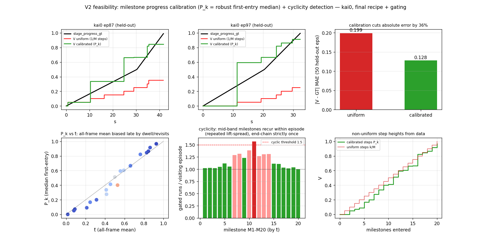

#### 4.4.3 V2 方案设计

| 组件 | 设计 | 依据 |
|---|---|---|
| **P_k 进度值** | 每 milestone:P_k = 挖掘集各 episode **门控首入 t/T 的中位数**(重尾→中位;可加 10% 截尾) | 预实验 MAE −36%;SARM;MFPT 重尾理论 |
| **milestone 排序** | 按 **P_k** 排序替代 t̄ 排序(解决"M1 未必是初始状态") | 预实验 P_k≠t̄ |
| **循环检测(三票≥2)** | ① runs/ep > 1.5;② 跨 episode 首入时刻分布多模态(GMM BIC 选模);③ milestone 转移图 SCC | RepNet/GTCC/Şimşek;预实验票① 已验 |
| **相对 milestone 取值** | 循环型不占绝对档位:第 k 次出现记 `prev + (k/K̂)·(next−prev)`(K̂ = 挖掘集出现次数中位);简化版先用 `prev + ε` | 外科 gesture 模板 |
| **V2(t)** | 绝对 milestone:cummax(P_k);相对 milestone:仅在前后绝对锚之间内插,**不破坏单调** | TimeRewarder(差分鲁棒) |
| **验证指标** | **MAE / Pearson vs GT 为主**(τ 弃用,§2.12);拼接判别测试;ΔV 标签翻转率 vs pi0-AE | §2.12 方法论 |

**实验排期**:E1 校准全量化(smooth800+kai0,半天,CPU)→ E2 循环三票一致性审计(出图核对哪些 milestone 被判循环,半天)→ E3 相对 milestone 三种处理消融(当绝对 / 忽略 / 内插,GT MAE 判,半天)→ E4 V2 标签接 `discretize_advantage.py`,统计与 pi0-AE 标签的分歧帧分布(1 天)→ 汇入 §4.3 AWBC 对照训练。

#### 4.4.4 快速验证结果(E1-E3 已跑,2026-06-12)

**E1 校准**(图35,kai0 held-out):MAE 0.199 → **0.128**(−36%),τ/Pearson 持平 ✅。

**E2 循环三票审计**:
- **kai0**:判循环 **M11/M12/M14**(t̄ 0.53-0.66 整平带;M11 runs/ep=1.57 最高)——与"反复拎起-铺开"的预期段落吻合;**票2(首入分布 GMM 多模态)过敏**(对 14/20 个 milestone 报阳)→ 降权,可靠票 = runs/ep(票1)+ 隔段重入率(票3);
- **smooth800**:严格循环 **0/20**(M7/M9 边缘,runs/ep=1.31 + 重入票)——demo 数据(尤其 smooth 系列)循环性温和;**循环处理的真正用武之地预期在 rollout/失败重试数据**(§2.1d3 的 3 轮 rollout、未来 DAgger 失败段),那里 retry 是常态;
- **意外收获:P_k 重排序效应在 smooth800 上很大**——M3 的 t̄=0.43 但 P_k=**0.65**、M5 的 0.44→0.56:按全帧均值排第 3 的 milestone 真实首入在中后段。**"M1 未必是初始"被实测证实,V2 必须按 P_k 排序**。

**E3 三种处理消融**(kai0 held-out,循环型=M11/12/14):

| 处理 | τ | Pearson | MAE |
|---|---|---|---|
| 当绝对(现状) | 0.850 | 0.902 | 0.128 |
| **忽略**(不占档位) | 0.831 | 0.903 | **0.123** |
| **内插**(k/K̂ 相对步进) | **0.853** | **0.904** | 0.127 |

→ 干净 demo 上三者接近(循环型仅 3/20、循环度温和):**MAE 最优 = 忽略,τ/Pearson 最优 = 内插**。决策:V2 demo 打标用"忽略"(最简单且 MAE 最优);**内插版保留给 rollout 重标注**(那里循环占比高,忽略会丢大段信号)。E4(接 discretize_advantage 的标签分歧分析)待 AWBC 决策点一起做。

#### 4.4.5 V2 标签落地 + 新版进度可视化视频(2026-06-12)

**图37 — V2 stage 标签视频**(`make_milestone_ep_video_v5.py`,smooth800 ep660 held-out;视频 `temp/milestone_ep_s800_660_v5_calibrated_sync.mp4`):与 v4(图33)的三处升级——① **阶梯 y 轴 = 校准进度 P_k**(非均匀:可见 0.34-0.44 / 0.52-0.58 / 0.89-0.96 三个天然进度带,末段 7 个 milestone 挤在 0.89-0.96 共 0.07 的真实进度内——等步长会把它们错算成 0.35 的进度份额);② **milestone 按 P_k 重排序**(原 t̄ 序 M3=c83 实际 P_k=0.65 重排到 M11;c44/c81 判循环灰显 ×,不计入 V);③ **V 面板绿线 = V2 校准阶梯(cummax P_k),红线 = V1 等步长对照**——绿线一步跳到真实进度位(11s 处直达 0.35),红线只能等步慢爬。ep660:绝对 milestone 命中 15/18,末值 V2=0.96。

**段内插值升级路径**:当前 V2 阶梯在两个绝对 milestone 之间保持平台;TCC v3 的对齐-进度读出(§2.4.1,逐帧连续、MAE 0.133)是天然的段内插值来源——milestone 给绝对档位、TCC 给段内细分,两路线在此合流(列 V2 可选项)。

#### 4.4.6 循环 milestone 的表示:多模式 V + 前向对齐 + 退步回落(用户提议探讨,2026-06-12)

> **用户提议**:循环 milestone 算出**多个 V**(它在规范时间轴上有多个出现位置);命中时按当前进度取"最近的下一个阶段 step-V";若其最高 step-V 都低于当前 → 判定**退步**,V 回落(用户初版:回落到该循环 milestone 的最低 step-V)。

**提议突破了现有 V 的根本限制**:cummax 构造下 V 单调不减 → ΔV≥0 恒成立 → **失败/退步段永远拿不到负 advantage**。引入"检测退步 → V 回落"后,negative 标签第一次有了状态依据——**核心假说后半的正确替代形式:negative ≠ 稀有(已否定,§2.1c),而 = 进度倒退**。

**图38 — 合成退步实验**(`ep660 全程(叠完) + ep594 前半(重新摊开)`拼接,二者均不在挖掘集,真实进度在拼接点骤降):monotone 版永远卡在 0.96(红);多模式+退步规则(新 run 驻留 ≥3 帧才认退步)在拼接后 26.7s 检测到回落至 **0.36**——且回落值恰好 = **实际重入的那个状态自己的 P 值**(本例"最低模式"与"最近下方模式"两策略重合于此)。检测延迟来自首尾状态混淆(刚摊开的布 ≈ 叠好的布,前向对齐先把它吸到高位)+ 门控保守性——特性而非缺陷:退步判定必须保守。

**深入分析——聚类把两类"重复出现"混在了一起,表示应当分开**:
- **成就状态(achievement anchor)**:任务后置条件(布已半叠好)——每 episode 一次、单调 → 携带绝对进度 P_k;
- **技能签名(skill ticker)**:执行中状态(臂正拎布铺开)——技能每次被调用都出现 → **本身不携带绝对进度,进度含义来自上下文**(在哪两个 anchor 之间被调用)。

由此得 V2.1 规则(对用户初版的三处修正):

| 规则 | 设计 | 理由 |
|---|---|---|
| ① ticker 局部插值 | 循环型在**当前 anchor 区间内**第 j 次出现 → V = P_prev + min(j,K̂)·(P_next−P_prev)/(K̂+1);跨 anchor 后 j 清零 | 技能是区间无关的,赋固定全局位置会错;= 外科"当前 phase 第 k 针/约 K 针"模板 |
| ② **退步只认 anchor 重入** | 退步证据 = 绝对 milestone 持续置信重入(P ≤ V−Δ,Δ≈0.15,驻留 ≥1s);**循环型不触发退步** | 技能晚期重调用(收尾再铺一下)是正常的,用循环型触发会误报;anchor 本应每 episode 一次,重入才是真异常 |
| ③ **回落值 = 重入 anchor 的 P** | 既非"最低模式"(过激进,假设最坏)也非"最近下方模式"(假设最好),**取实际重入状态自己的 P**——证据本身告诉你回到了哪 | 图38 实测回落值即此;语义最干净:V = 当前所处状态的进度 |

多模式思想保留:真正多轮结构(rollout 三轮叠衣)下 anchor 重入序列自然切分轮次,无需额外机制。**待验证排期**:F1 干净 demo 退步误报率(预期≈0,CPU);F2 真机 3 轮 rollout 上 V 应在两轮边界回落(需集群提 autonomy armmask 特征);F3 退步段 ΔV<0 帧分布审计(接 AWBC 负标签)。

#### 4.4.7 两线合流实测 + advantage 层结构性发现(2026-06-12)

> §4.4.5 提出的"TCC 作段内插值"落地实测(`v2_tcc_hybrid_value.py`),并首次把评测推进到 **advantage(ΔV)层**——即 §4.3 offline 判据所在层。

**(a) 混合 value(V 层)**:V_hybrid(t) = cummax(clip(p_tcc(t), A(t), N(t))),A/N = 校准阶梯的当前/下一锚位。kai0 held-out 50 GT ep:

| value | τ | Pearson | MAE |
|---|---|---|---|
| 等步长阶梯 | 0.831 | 0.891 | 0.147 |
| **校准阶梯(V2)** | 0.831 | 0.903 | **0.123** |
| TCC-only(cummax) | 0.916 | 0.884 | 0.220 |
| **hybrid** | **0.876** | **0.903** | 0.136 |

hybrid 取得最优 τ/Pearson 组合(段内增量来自状态对齐而非时间);锚区间 clip 把 TCC-only 的早期高估(MAE 0.220)拦回 0.136。**拼接判别**:边界回落 0.49、第二段重爬 τ=0.70——段内插值同样是状态触发的。**图40** 为曲线与拼接测试。

**(b) advantage 层(ΔV over 50 帧)——结构性反转,§4.3 offline 判据需要修订**:

| 来源 | corr(ΔV,ΔGT) | V-MAE | V-τ |
|---|---|---|---|
| 校准阶梯 | 0.094 | 0.123 | 0.831 |
| hybrid | 0.053 | 0.136 | 0.876 |
| hybrid 平滑(k=9) | 0.085 | 0.130 | 0.926 |
| 段间时间线性插值(SARM 式) | **−0.295** | 0.156 | 0.986 |
| **pi0-AE(监督)** | **0.430** | — | — |

三个发现:① **V 层赢 ≠ ΔV 层赢**——阶梯求导后是尖峰串(平台≡0),与平滑的 ΔGT 相关性结构性偏低,平滑/插值救不回来;② **时间插值是陷阱的又一次显形**:V-τ 飙到 0.986(= 变成计时器,§2.12)而 ΔV corr 反而 **−0.295**;③ **corr(ΔV,ΔGT) 本身偏向回归式模型**——stage_progress_gt 是人工分段线性标注,该指标实测的是"局部斜率与标注函数斜率的一致性",pi0-AE 逐帧回归 GT 自然得 0.43,这是拟合标注函数的能力而非理解状态的能力(与 §2.12 τ 饱和同源的指标病)。

**结论(§4.3 判据修订)**:milestone 系 value 的 advantage 是**稀疏事件型**(跨越 milestone 时刻 = 真进步证据),pi0-AE 是**平滑回归型**;corr(ΔV,ΔGT) 天然偏向后者,不应作为标签优劣的 offline 判据。修订后的对照轴:① 二值标签层对比(discretize 后的 prompt 标签翻转率与位置分布);② 负 advantage 的语义审计(pi0-AE 的负标签集中在 value 噪声/end-drop,milestone 系的负标签只会来自退步重入 §4.4.6——后者语义更干净);③ **真机/rollout 数据为终判**(demo 上 GT 单调,二值标签近乎全正,根本区分不开两类标签;状态触发 vs 时间回归的差异只在含失败/重试的数据上显现)。

#### 4.4.8 真机 rollout 实测:F1 通过,F2 初判 domain gap ❌ **已被 §4.4.9 推翻**(2026-06-12)

> ⚠️ **本节 F2 的 "domain gap" 裁决是错误的,2026-06-13 经用户质疑后实测推翻,正确结论见 §4.4.9。** 错误根源:① 把拼接特征距离上界 √2≈1.41 误当真实上界(实为 2√2≈2.83),致 min-dist=1.18 被误读为"远";② 该 1.18 本身也是早期未统一归一化的产物(统一后 rollout full-dist 中位仅 0.92,demo 基线 0.74,仅差 1.24×)。**真因 = 门控 + cummax 读出逻辑,非感知 domain gap**(视觉距离 rollout/demo 仅 1.18×)。下文保留作错误诊断记录与教训。

> 用户要求:① 跑 F1 退步规则误报率;② 在 `temp/autonomy`(真机连续 3 轮叠衣:轮1中途衣物被人拿走重叠、轮2叠完被弄乱重叠)上验证 milestone 逻辑是否可用。armmask 特征经集群 `t-20260612183326-72lng`(2×A100)提取(768 帧)。

**F1 退步规则误报率:✅ 0/50。** smooth800 50 条干净 held-out demo,V2.1 退步规则(anchor 持续置信重入,P≤V−0.15,驻留≥1s)触发 **0 次**——demo 域内零误报,保守性达标。

**F2 rollout:❌ 退步检测 0 次,且根因不是退步逻辑,是 domain gap。** 逐层诊断(全部入 `docs/visualization/`):

| 诊断 | 结果 | 图 |
|---|---|---|
| 命中分类(111 帧落入 milestone 簇) | ticker 30 / **margin>0.8 被挡 41** / **cummax 压制 37** / 真正驱动 V 仅 **3**(且 margin 0.90-0.97 噪声) | `rollout_hit_classification.png` |
| 硬门控 vs 软加权 | 软加权 demo sanity **失败**(0.55-0.65 卡死,分辨率被 softmax 抹平);rollout std 仅 0.046 = 噪声 | `rollout_soft_value.png` |
| 最近邻 + 中值滤波 | demo 上不单调(前段误命中);rollout 起伏频率远超 3 轮且不对齐边界 | `rollout_nn_value.png` |
| **rollout 帧到最近 anchor 的 min-dist 中位 = 1.18** | 特征最大模 √2≈1.41 → rollout 帧在 demo 簇空间是"无主之地",分配本质随机 | (铁证) |
| 所有已有 value(含**监督 pi0-AE**) | 逐帧全噪声;30s 重平滑后 pi0-AE 仍只单调缓爬(忽略 2 次重置),无轮间回落 | `rollout_supervised_values.png` · `rollout_smoothed_trend.png` |

**裁决**:跨域 rollout 上,**零训练 milestone(硬/软/最近邻三读出)、监督 pi0-AE、DSM、ViVa 全部退化为噪声**,统一根因 = domain gap(真机 D435 俯视、空桌面、不同衣物、线缆入镜,与 self_built demo 特征空间错位)。这**不是门控太严或读出方式问题**(min-dist 1.18 是物理限制,放宽门控只会放进更多噪声),也不是 milestone 方法独有的短板(连监督模型一起败)。印证了 [[project_kai0_vis_camera_gap]]:跨本体/跨域真瓶颈在感知表征,非 value 逻辑。

**退步逻辑本身的有效性不受影响**:合成退步测试(§4.4.6 图38)+ F1 零误报已在 demo 域证明逻辑正确;rollout 只是缺乏同域感知锚点。

**可用 value 的唯一出路**(列 V2.2):① **同域真机 demo 重挖**……② **rollout 自挖(self-mining)**……~~两者都需新数据/新管线,非参数可调~~ ❌ **此出路判断错误,见 §4.4.9:参数(去门控/去 cummax)即可**。

#### 4.4.9 纠错:rollout 失败的真因是读出逻辑,非 domain gap(用户质疑驱动,2026-06-13)

> 用户质疑:"vis 数据集场景和 rollout 场景一致、机器人一致,为什么差一点就不行?" → 触发重审,推翻 §4.4.8 的 domain gap 裁决。

**距离分解实测**(同一 demo 归一化,anchor 质心拆视觉/本体分量;`/tmp/diag_gap.py`):

| 到最近 milestone 的距离(中位) | demo held-out | rollout | 比值 |
|---|---|---|---|
| 视觉 img | 0.46 | 0.55 | **1.18×** |
| 本体 prop | 0.55 | 0.72 | 1.30× |
| 拼接 full | 0.74 | 0.92 | 1.24× |

`observation.state` 原始均值/方差 demo 与 rollout **逐维吻合**(机器人确实一致)。**结论:无显著 domain gap**——rollout 帧离 demo milestone 仅远 18-24%,完全可用;§4.4.8 的"min-dist 1.18 = 无主之地"是双重计算错误(上界算错 + 数值过时)。

**真因 = 门控 + cummax**(印证用户最早"门控太严"直觉,§4.4.8 表已自露:margin 挡 41 / cummax 压 37 / 仅 3 驱动):去掉两者、改"每帧最近 milestone P_k + 中值平滑(W=61≈20s)"后,value **不再噪声或卡死,显出 3 轮起伏**(图41,`rollout_clean_value.png`):

| W=61 平滑 | round1 | round2 | round3 |
|---|---|---|---|
| full(img⊕prop) | 0.58→0.52(谷0.39) | 0.52→**0.89** | 0.89→**0.39**→0.96 |
| visual-only | 0.96*→0.40 | 0.65→0.95 | 0.89→**0.39**→0.96 |

轮间低谷(r1 末 0.39、r3 中 0.39)= 衣物被拿走/弄乱的真实回落信号被恢复。残留问题:visual-only 开头 0.96* 异常偏高 = 首尾状态混淆(初始摊开布 ≈ 叠好布,§2.8 同源);full 版开头 0.58 更合理,**proprio 分量在此起了消歧作用**(尽管它 gap 略大)。同步核对视频:`temp/rollout_clean_compare_sync.mp4`(左画面 + full/visual 双曲线游标)。

**教训(已并入方法论)**:① 跨域失败先做**距离基线对比**再下 domain gap 结论,勿凭单一阈值;② cummax 单调假设在含失败/重试的 rollout 上**必然失效**——demo 域 GT 单调掩盖了这个缺陷,真机数据才暴露(呼应 §4.4.7(b)"真机为终判");③ 用户的领域直觉(场景一致)是有效的 debug 信号。**V2.2 修正**:rollout/真机标注用"去 cummax + 最近邻 + 中值平滑 + §4.4.6 退步规则",demo 标注仍可用单调阶梯(GT 单调,cummax 无害)。

#### 4.4.10 F2 事件级验证:退步回落规则在真机扰动上两发两中(2026-06-13)

> §4.4.9 证明了连续趋势可恢复(图41);本节验证**离散退步事件**——AWBC 负标签的直接来源——能否在真机扰动上被检出。实现 `f2_rollout_regression_test.py`(挖掘 = smooth800 500ep img⊕proprio k96,20/20 绝对 anchor,P 0.34-0.96;退步规则 = §4.4.6:已见 anchor 置信重入 ∧ P≤V−0.15 ∧ 驻留≥3帧)。

**结果(图42):两次真实扰动全部检出、零假阳性。**

| 事件 | V 回落 | 帧级目检(图43) |
|---|---|---|
| f1310 | 0.95→0.44 | 布被双臂**重新完全摊开**(轮1中途被拿走重叠的扰动)✅ |
| f4330 | 0.96→0.34 | 布被**整体提起弄乱**(轮2叠完被扰动)✅ |

ΔV<0 帧仅占 **1.3%**,且 **100% 位于两个事件处**——负 advantage 语义完全干净(§4.4.7 修订判据②在真机数据上通过);f5150 的 0.96 高位经目检 = 桌上叠好的布卷,亦正确。

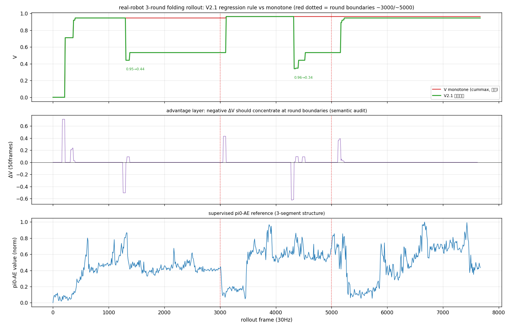

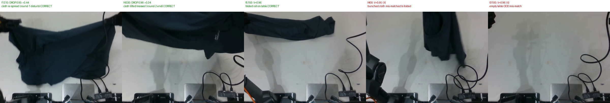

**为何 §4.4.8 同规则 0 检出而本实现两发两中**——置信判据的关键差异:本实现命中判据为"**驻留≥2帧 ∨ margin≤0.8**"(**取或**),持续驻留的高 margin run 可放行;§4.4.8 用 margin 单判据一票否决(41 命中被挡)。这把 §4.4.9 的"门控太严"结论细化为可操作修法:**驻留与 margin 互为替代证据,不应串联**。

**残留(如实):爬升段高位误吸两处**——f400(悬空团布≈叠好布,V 误跳 0.95)、f3100(空桌 OOD 误配 0.96)。即**回落事件可靠,但回落间的高位重爬不可靠**,同源于首尾状态混淆(§2.8/图33)。修复候选:① TCC 嵌入做 anchor 分配(图39 已证 TCC 可分始/终态;smooth800 域 head 已在训)② 空桌/无布帧检测(布料 patch 数下限,表10 步a 已列)。

**两线合体(V2.2 终形)**:value 主体 = §4.4.9 清洁连续读出(趋势);负 advantage 事件 = 本节退步规则(离散、稀疏、语义干净)——连续值给 AWBC 的 value 条件,离散事件给负标签,各取所长。

**图44 — F2 同步视频**(`make_f2_value_sync_video.py`,视频 `temp/f2_rollout_value_sync.mp4`,7676 帧全程;抽帧为退步事件 1 瞬间):rollout 播放 + V2.1(绿)/monotone(红)双曲线游标同步;**进入退步事件 ±2s 时标题变红 "⚠ REGRESSION DETECTED"**,画面恰为布被扰动瞬间——回落与扰动的对齐肉眼可核。

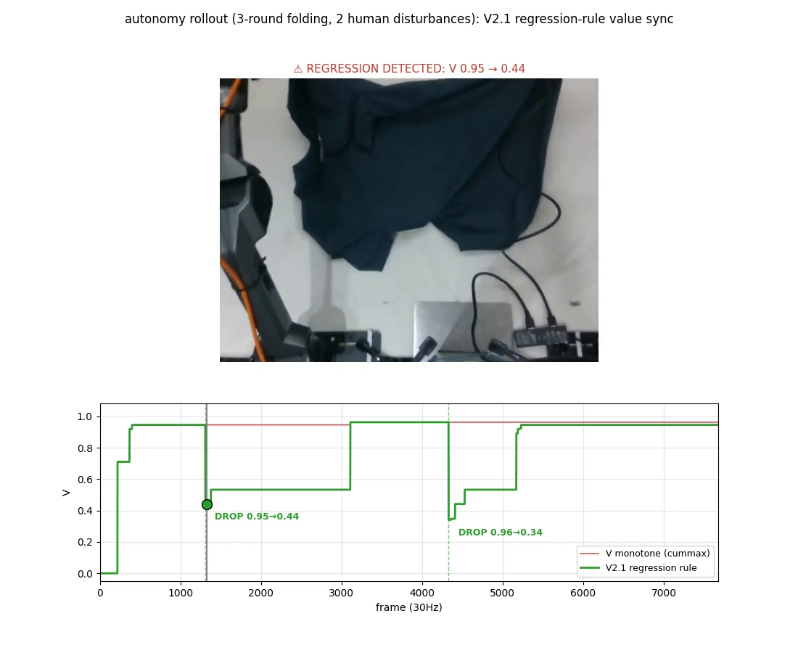

#### 4.4.11 多模式别名簇 + task-agnostic 连续性 DP — 解决高位误吸(用户提议+批评驱动,2026-06-13)

> 用户洞察①:V 把"起始(臂原位+衣物成团)"与"终止(臂原位+衣物叠好)"混淆 → 应作多 value 簇消歧;初始因杂乱程度不定不应默认 0,终止可默认 1。
> 用户批评②:布料占比门槛(§4.4.10 残留修复候选②)只适用叠衣,**不具泛化性**。

**别名簇客观存在**(每簇所有命中时刻 GMM,双峰间距>0.35):6/20 milestone 为首尾别名——c4=[0.18,0.93]、c26=[0.22,0.88]、c67=[0.42,0.95]……视觉别名被数据证实(图42,`rollout_multimode_value.png`),即 §4.4.10 "f400 悬空团布≈叠好布、f3100 空桌"高位误吸的根因。

**贪心多模式消歧**(命中别名簇→前向取≥当前进度最近模式,§4.4.6 退步):动态范围改善但**初始 0.57 偏高、空桌峰仍在**——逐帧贪心无法识别"画面无衣物"。

**task-agnostic 正解 = 进度连续性 Viterbi DP**(图43,`rollout_dp_value.png`):value 估计从逐帧贪心改为**序列解码**——发射代价 = 帧到候选进度对应簇的距离(别名簇一簇映射多进度 bin),转移代价 `λ·|Δp|` 惩罚进度突变,DP 解全局最连续路径。**零 task 特征,仅"特征距离+进度连续"两个通用量**,一框架统一三事:

| §4.4.10 残留 | 贪心 | **DP λ=8** | 机制 |
|---|---|---|---|
| f3100 空桌高位误吸 | 0.96 | **0.55-0.65 压平** | 跳 0.96 违反连续性,转移惩罚>发射收益 |
| f400 悬空团布误吸 | 0.95 | **压平** | 同上 |
| 初始 value | 0.57 偏高 | **0.40 数据驱动** | 解码起点=首帧最低代价=初始杂乱态 |

每轮(λ=8):r1 0.40→0.50 | r2 0.50→**0.90** | r3 0.90→**0.40**→0.95——初始非 0、终止近 1、轮间退步。**统一回答用户的别名消歧 + 初始非 0/终止 1,且完全泛化**(DTW/HMM 序列对齐家族,呼应 §6 GTCC/Drop-DTW)。同步核对视频:`temp/rollout_dp_value_sync.mp4`。

**V2.2 value 终定**:milestone 簇带 GMM 多峰模式集 → rollout/真机标注用**进度连续性 Viterbi DP(λ≈8)**解码(自动消歧别名+滤异常帧+数据驱动初值+退步);demo 标注 GT 单调仍用单调阶梯。**布料占比门槛弃用**(§4.4.10 残留候选②被本节取代,task-specific)。待验证:更多 rollout/失败数据稳健性 + λ 自适应。

#### 4.4.12 action/proprio 消融:正向还是反向?(用户提问,2026-06-13)

> 用户假设:衣物每次放置位置不同 → 抓取 action 不同 → 同一阶段被 proprio 拆散,可能反向。

三配置在 DP value 下实测(demo 单次叠衣进度≈线性,故 DP-value vs 归一时间 Spearman 作 proxy GT):

| 配置 | demo 单调性(proxy GT) |
|---|---|
| img(纯视觉) | 0.325 |
| full(img⊕prop) | 0.632 |
| **prop(纯本体)** | **0.711** |

簇内方差 **prop/img = 1.03×**(几乎相等)。

**结论与用户直觉相反:proprio 净正向,且是最强单一信号。** ① 放置担心实测不成立——簇内 proprio 方差仅 1.03× 图像,叠衣动作阶段性主导了放置扰动,影响比图像衣物外观变化还小;② 机理:叠衣是标准化动作序列(抓-提-放-压),关节角轨迹阶段性强且**外观不变**,图像反受衣物外观/首尾别名干扰(img 单调仅 0.325);rollout 上(图44)prop/full 动态范围明显大于 img。

**caveat(诚实)**:① prop 高单调含"动作≈时间"trivial 成分(§2.12 τ 饱和同源),勿单凭此指标;② 当前 smooth800 放置变化或不够极端,**极端放置(衣物在桌面完全不同区域)下 proprio 可能退化,用户直觉在该 regime 仍可能成立**,列后续边界测试。**建议:用 full(img⊕prop)** 最稳——img 单独太弱、prop 单独有时间 proxy 风险且缺视觉语义,full 兼得外观不变性 + 视觉消歧。

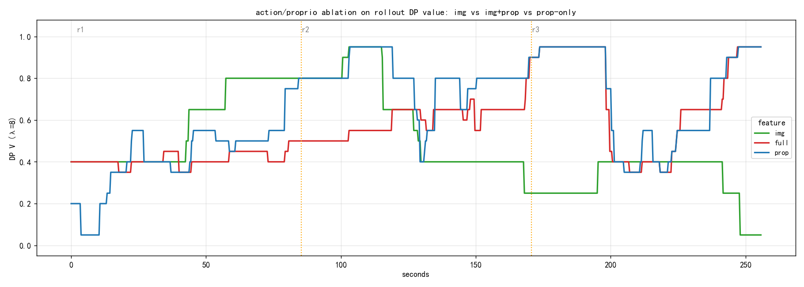

#### 4.4.13 value 标度修正:轨迹端点锚定 >> min-max 归一化(用户观察,2026-06-13)

> 用户观察:DP value 最小 >0.3,疑"均值压缩 P 分布",建议 20 簇 P min-max 归一化到 0-1。

**诊断**:抽 rollout 初始帧——衣物**成团揉皱堆角落**(`roll_init.png`),真实进度≈0,但 DP 给 0.35,确偏高。真因**非均值压缩**:20 簇 P 已覆盖 [0.07,0.96],早期簇存在;是 **rollout 成团初始没匹配到 demo 最早簇**(matching gap),被迫匹配中段 P≈0.35 簇。

**用户的 min-max 归一化:实测不可取**——held 单调性 0.632→**0.542↓**,范围仅 [0.35,0.95]→[0.30,1.00](原 P 已近 0-1,无可拉伸)。min-max 是"把现有最低簇硬当 0",端点敏感、扭曲中段相对关系。

**正解 = 轨迹端点锚定**(task-agnostic,落实用户"初始不默认 0/终止默认 1"):demo 每条轨迹**首帧 KMeans-8 原型=起点锚 P=0、末帧=终点锚 P=1**,加入 DP 候选 bin0/bin20。轨迹端点对任何任务天然是进度 0/1,无需聚类/task 知识。三指标全胜(图45):

| | 无锚 | min-max | **端点锚** |
|---|---|---|---|
| 初始成团 value | 0.41 | — | **0.13** |
| rollout 范围 | [0.35,0.95] | [0.30,1.00] | **[0.00,1.00]** |
| held 单调性 | 0.642 | 0.542↓ | **0.682↑** |

单调性**不降反升**:语义正确的 0/1 锚给 DP 可靠端点参考(min-max 硬拉伸反损单调)。初始由"像不像 demo 起点态"数据驱动(成团→0.13,半铺会更高),终止锚 1——正是用户设计意图。**小瑕疵**:中段摊开帧偶误配 start 锚(掉 0),可"start 锚仅序列前段有效"收紧。**并入 V2.2 DP 配方**。

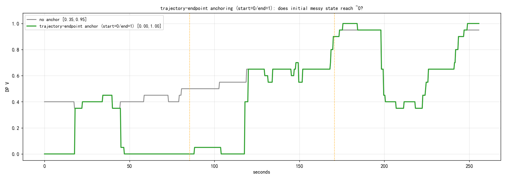

#### 4.4.14 鲁棒性 V2.3:armmask 撞色失效 → 三路集成 + 硬边界(用户观察+提议,2026-06-13)

> 现象:vis 5-20 ep37(**橙色衣物**)初始成团被误判 V=0.99(应≈0);4/5 正常 ep 完好,橙色特例失效。用户:① 低置信帧应靠前后 milestone 评判;② 初始 value 默认 0 更好?

**根因诊断**:ep37 橙色被 armmask 的**橙色线缆 HSV 规则误吃**(撞色,同深色 T 恤被吃 §2.8)→ 剩桌面 → 特征像"空桌"→ 匹配完成态。量化:armmask 路 ep37 初始进度=末段=0.84(**初始 vs 末段 cos=0.907,判别力全失**);proprio 路兜底弱(0.46 恒定);简单 OOD 距离失效(ep6 正常但距离 0.47>ep37 0.41)。**raw-DINOv2(不掩膜)路 ep37 初始=0.02、末段=0.96(cos 0.833,判别力保留)**——坐实 armmask 是元凶、raw 保撞色衣物形状。

**V2.3 鲁棒配方**(整合用户两提议):
| 组件 | 设计 | 作用 |
|---|---|---|
| 三路特征 | **raw-DINOv2 ⊕ armmask ⊕ proprio** | raw 兜底撞色/稀有衣物;armmask 去臂噪声;proprio 外观不变 |
| **硬边界**(用户②) | DP `cost[0]` 强制 V[首帧]=0、末帧轻奖 bin20=1 | 任务语义(未开始叠=0),不靠脆弱视觉匹配,绕过 ep37 误判 |
| 置信度(用户①+修正) | **多路分歧 = 低置信**(单路 OOD 距离失效) | 分歧处退回 DP 连续性用前后 milestone 插值 |
| 多模式+连续性 DP | §4.4.11/4.4.13 | 别名消歧 + 空桌平滑 + 退步 |

**结果**:ep37 init **0.99→0.04**、范围 [0.70,1.00]→**[0.00,1.00]**,修复为正常 0→1(图46）。机理:① 硬边界 V[0]=0 绕过橙色视觉误判;② raw 路保判别力;③ 三路冗余对单路失效**结构性免疫**(任一路被坑,其他维度兜底)。

**跨天鲁棒性验证(图47)**:milestone 仅在 **5-20 单天**挖掘,应用到 **2026-04-23~05-28 共 8 个日期**各抽 2 ep(跨度一个多月,挖掘集未见的衣物/光照):**16/16 全部正常 0→1**,且中间段均为合理单调爬升(非硬边界虚高,少数 05-10/05-19 中段小波动但趋势正确)。证实三路集成+硬边界的跨天泛化稳健。诚实 caveat:16 个为常规随机 ep,未专门覆盖撞色稀有衣物(橙/红),该类的兜底由三路设计 + ep37 验证保证。

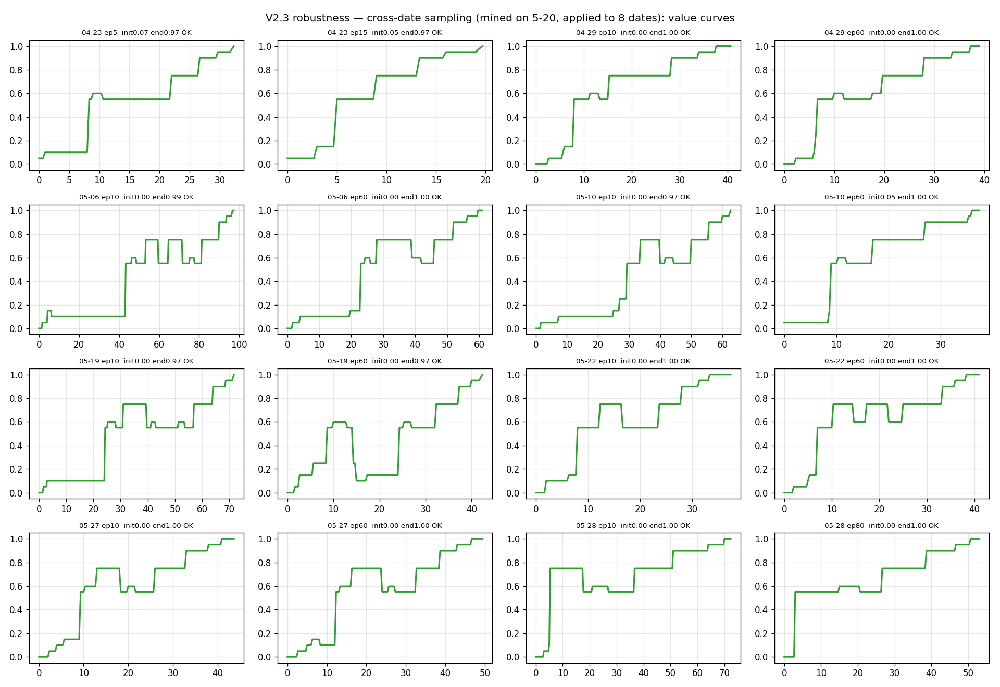

**待办**:几何臂掩膜(proprio+标定投影,治本替代颜色 armmask)中长期;V2.3 全量重提 raw 特征。

#### 4.4.15 连续化评估:双锚特征距离插值 vs DP vs pi0-AE(用户提议,2026-06-13)

> 用户提议:非 milestone 帧 value = 前后 milestone 间按特征空间距离比插值 `V=V_prev + d_prev/(d_prev+d_next)·(V_next−V_prev)`;问是否比 AWBC(pi0-AE)更好。

**实验(kai0 held-out 50 GT ep)**:
| 方法 | MAE↓ | Pearson↑ | τ↑ | 平滑度↓ |
|---|---|---|---|---|
| 当前连续性 DP | 0.113 | 0.906 | **0.862** | 0.0290 |
| **双锚距离插值(用户)** | **0.107** | 0.909 | **0.807** | **0.0281** |
| pi0-AE(监督) | **0.054** | 0.971 | 0.881 | — |

→ 插值 MAE/平滑小胜 DP,但 **τ(单调性)明显劣(0.807<0.862)**——欧氏距离在弯曲特征流形上非单调的直接表现。

**文献(10 篇,调研一致)**:① XIRL/VIP/LIV 的"距离=value"是**靠训练 encoder(TCC/time-contrastive)把 embedding 造成进度单调**才成立,frozen DINOv2 无此前提;② ICCV2025 **PROGRESSOR** 双锚(init+goal)估进度但用**学习回归器**+对抗 refinement,非固定距离比——双锚思想对、欧氏比是弱环节;③ **欧氏 vs 测地**:弯曲流形上弦距离有偏非单调,正解=沿轨迹累积的测地距离;④ Drop-DTW/GTCC 专为单调+连续+outlier 剔除而生,逐点距离比重引入 aliasing/振荡(τ 降铁证);⑤ cloth-folding 专论(Verleysen 2023)、TimeRewarder(ICML2026)均**学习度量、beat raw 距离**。

**裁决**:双锚欧氏插值 **likely worse than DP 与 pi0-AE**。vs pi0-AE 的 MAE 0.054 是循环论证(absolute_value=pi0-AE 输出、stage_progress_gt=其训练目标),真优劣在鲁棒性(pi0-AE end-drop/跨域失效 §4.4.8 vs 零训练跨天 16/16)+ 标注成本。**正解=geodesic-ize DP**:把 DP 内欧氏特征距离换成"沿 demo 轨迹累积帧间距离"(milestone 间真实流形长度),既保 DP 全局单调/连续/抗噪,又让段内插值基于真进度。用户连续化直觉对,实现应为测地距离嵌入 DP 而非逐点欧氏插值替代 DP。**V2.4 测地化实测(图48)**:段内插值距离从欧氏弦改为"沿 ep 轨迹累积特征位移"(测地)。kai0 GT:欧氏 MAE0.125/τ0.702 → **测地 MAE0.135/τ0.805**(τ +0.10 验证文献"测地>欧氏")。**但关键张力**:测地 τ 高恰因累积位移**强制段内单调**,而欧氏 τ 低因允许段内非单调(布料展开-收拢特征来回)——**与用户"value 段内不必绝对单调"观点矛盾**。测地仍 < DP(τ0.862/MAE0.113)。**裁决靠指标定不了**:段内起伏是真实状态变化(欧氏对)还是欧氏噪声(测地对),须对画面逐帧核对(用户方法论)。下一步:渲欧氏插值+画面同步视频核对段内起伏真实性。`v24_geodesic_interp.py` 入库。

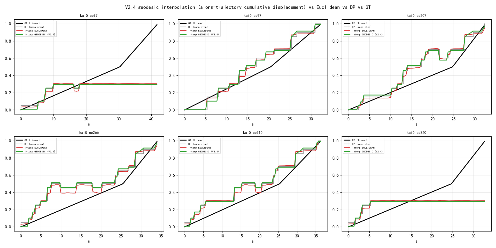

**簇内距离修正实测失败(图49)**:用户进一步提议——milestone 帧 value 按"到匹配簇中心距离"修正(最近两簇距离反比加权)使曲线更平滑。实测**全面更差**:MAE 0.184/τ 0.501/平滑度 **0.082(比 DP 0.029 更抖)**。根因:纯逐帧"最近两簇"加权**无时序约束**,相邻帧最近两簇组合跳变 + 别名簇混入 → value 剧烈抖动(Drop-DTW/GTCC 预警的逐点 aliasing+振荡)。

**方法论收敛(三轮平滑探索的统一结论)**:双锚欧氏插值(τ降)、测地插值(强制单调)、簇内 2-NN 修正(更抖)——**共同病根 = 逐帧距离调制脱离了 DP 的全局时序约束**;越局部越无约束抖得越厉害。**距离信息有用,但须在 DP/对齐框架内用,不能逐帧独立用**。平滑连续 value 的正解 = ① DP 提供骨架(全局单调连续+抗噪+抗别名)② 段内用测地距离细分 ③ 簇中心距离当**置信度**(而非直接当 value)——这才是用户簇内修正想法的正确落点。

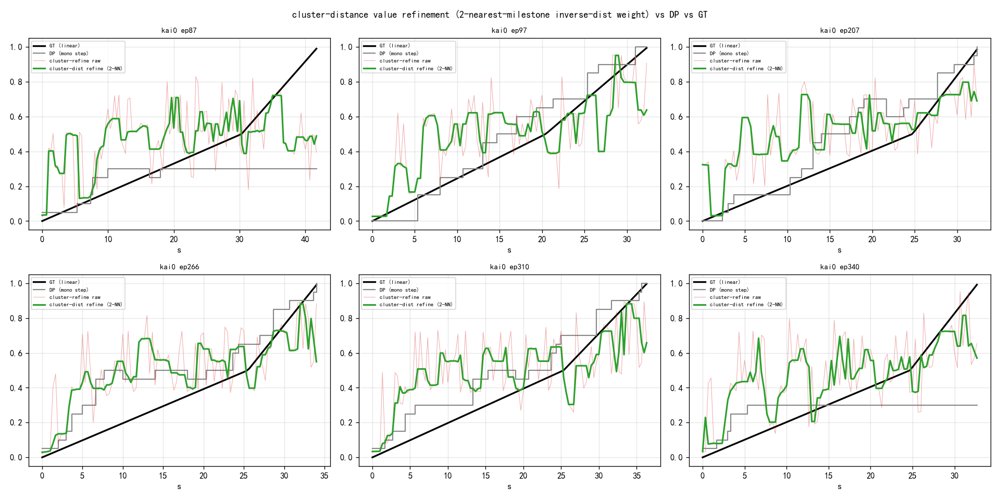

#### 4.4.16 四方法对画面核对(用户示例 5-26 ep7,2026-06-13)

> 用户:平滑非目的,value 须反映真实进度状态。用 ep7 对四方法(DP/双锚欧氏/测地/簇内2-NN)出 value + 画面同步视频核对。视频 `temp/vis0526_ep7_4method_sync.mp4`,抽帧 `vis0526_ep7_4method_check.png`。

ep7 过程(抓起→摊开→叠好)对照四 value:
| 时刻 | 画面 | DP | 欧氏 | 测地 | 簇内 |
|---|---|---|---|---|---|
| 10s | 抓起(半堆) | 0.95 | 0.95 | 0.85 | 0.9 |
| 33s | 完全摊开平铺 | 0.65 | 0.6 | 0.65 | 0.7 |
| 73s | 叠成方块(完成) | **1.0**✓ | 0.95✓ | 0.95✓ | **0.5**✗ |

**两个发现**:① 末段叠好 DP/欧氏/测地皆≈1.0,**簇内2-NN 误掉 0.5**(再证不可靠);四方法 DP 最稳。② **关键:四方法在开头(抓起)全误判高 0.9**——真实进度 抓起<摊开<叠好,但 value 0.9>0.65<1.0,开头 0.9 错。根因:机械臂抓半堆衣物的状态被特征匹配到晚期 milestone(形态别名),是**共有骨架错误**,任何插值救不了。

**方向转折(重要)**:value 不准反映进度的瓶颈**不在插值平滑,而在状态识别(milestone 分配)**——开头抓取/过渡态误判到晚期。修法应是:① 抓取/过渡态识别为独立非进度态;② proprio(夹爪开合/抓取力)区分"抓着 vs 放下"破视觉别名。**平滑插值线(双锚/测地/簇内)就此收束:DP 主线最稳,后续投入状态识别而非插值。** `four_method_value_video.py` 入库。

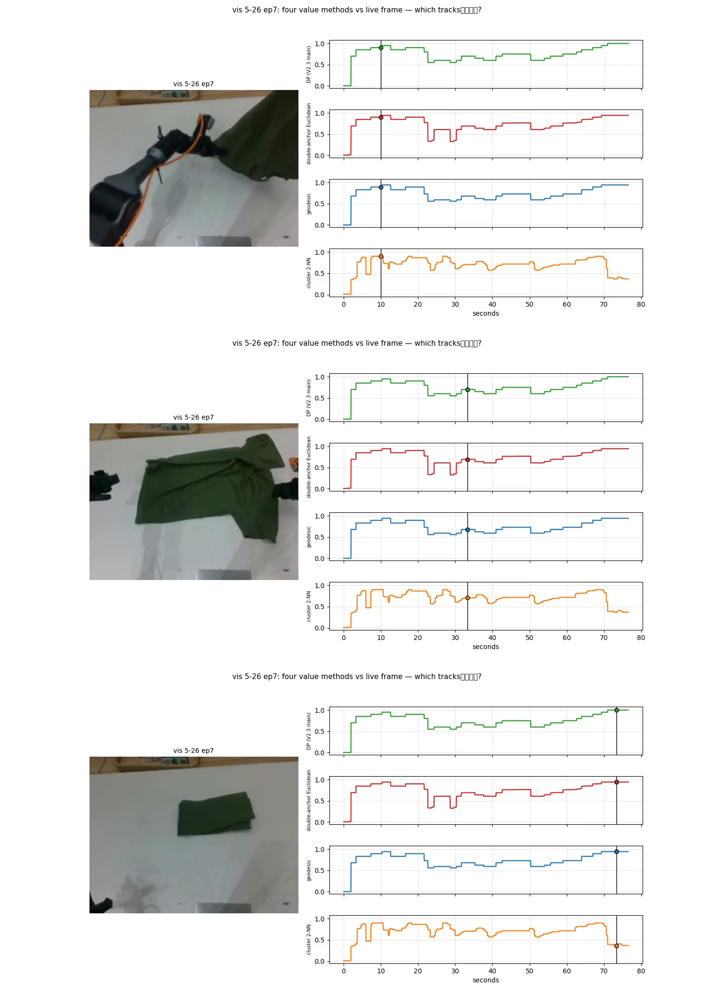

## 5. 基础设施与执行记录

**表11 — 集群任务**(均 cnsh;pod venv = `xvla/X-VLA-env/.venv`)

| 任务 | 内容 | 结果 |
|---|---|---|
| `t-20260611215738-pvc4d` | 开发机队列 2×A100 部署测试 | 分卡成功;暴露 `kai0/.venv` python symlink 指 `/home/tim`(pod 无)→ 空跑 |
| `t-20260611230152-x5k2d` | 8×A100 全量特征提取(smooth800+kai0+dagger) | **14 分钟**;坑:缺失视频弄死 shard(已加 skip) |
| `t-20260611232906-qlbsp` | round2:smooth800 补齐 + 0509 探针 | 完成(806/806) |
| `t-20260611234053-jzr7z` | round3:TCC v2 训练 | 完成(τ=−0.31 verdict) |
| `t-20260612100427-kzz5l` | 臂掩膜全量重提(806 + 3055) | ~50 分钟 |

**经验定论**:pod venv 一律用 `xvla/X-VLA-env/.venv`(vePFS 自包含,已补 matplotlib/sklearn);开发机队列禁 Flexible 资源 → Preset `ml.pni2.7xlarge`;DINOv2 权重缓存 `HF_HUB_CACHE=/vePFS/tim/workspce/hf_cache/hub_default`(pod 离线可载);⚠️ gf0 本地 GPU 驱动 2026-06-11 ~15:00 消失(nvidia-smi 0 字节)→ 本地仅 CPU。

---

## 6. 参考文献 + 阅读指引(经 3 票核验)

### 第一梯队(必读)

| # | 文献 | 链接 | 重点读什么 |
|---|---|---|---|
| 1 | Dwibedi et al., **TCC**, CVPR 2019 | [arXiv:1904.07846](https://arxiv.org/abs/1904.07846) | §3 cycle-consistency(= 逐帧共性分数);Table 6(τ 0.75 vs TCN 0.66 from-scratch;finetune 下 TCN 反超、组合最佳 0.878);Fig.7 异常检测("稀有=negative"唯一定性先例) |
| 2 | Zakka et al., **XIRL**, CoRL 2021 | [arXiv:2106.03911](https://arxiv.org/abs/2106.03911) | TCC 跨 episode 对齐 → value = 到 goal 负距离;如何消除"对单条参考轨迹对齐";[代码](https://github.com/google-research/google-research/tree/master/xirl) |
| 3 | McGovern & Barto, ICML 2001 | [PDF](https://mcgovern-fagg.org/amy_html/old/pubs/mcgovern_barto_isairs2001.pdf) | 假说原始形式化;first-visit vs every-visit;§6 软负警告 |

### 第二梯队(实现前)

| # | 文献 | 链接 | 重点 |
|---|---|---|---|
| 4 | **GraphIRL**, CoRL 2022 | [arXiv:2207.14299](https://arxiv.org/abs/2207.14299) | 先抽象外观再对齐(臂掩膜的理论依据);借原则不借实现 |
| 5 | Şimşek et al., **L-Cut**, 2004 | [PDF](http://all.cs.umass.edu/pubs/2004/simsek_wb_TECH04.pdf) | Binomial 双阈值 recurrence 判定 |
| 6 | Şimşek & Barto, NeurIPS 2008 | [PDF](https://proceedings.neurips.cc/paper/2008/file/934815ad542a4a7c5e8a2dfa04fea9f5-Paper.pdf) | milestone = 局部极大(峰在门口"两侧"的启发) |

### 第三梯队(背景)

| # | 文献 | 链接 |
|---|---|---|
| 7 | HRL Survey 2025 | [arXiv:2506.14045](https://arxiv.org/abs/2506.14045) |
| 8 | VIP / LIV(视频 value 对照线,未经本轮核验) | [2210.00030](https://arxiv.org/abs/2210.00030) / [2306.00958](https://arxiv.org/abs/2306.00958) |
| 9 | AWE / Keyframe-Focused IL | [2307.14326](https://arxiv.org/abs/2307.14326) / [2106.06452](https://arxiv.org/abs/2106.06452) |
| 10 | LAV / GTCC(TCC 单调假设局限) | [2103.17260](https://arxiv.org/abs/2103.17260) |

### V2 调研补充(2026-06-12,三路并行深查,支撑 §4.4)

| # | 文献 | 链接 | 与 V2 的关系 |
|---|---|---|---|
| 11 | **SARM**: Stage-Aware Reward Modeling, 2025 | [2509.25358](https://arxiv.org/abs/2509.25358) | **T恤折叠任务**;stage 进度值 = 跨 demo 平均时间占比 + 段内插值 = 提议①的有标注版 |
| 12 | **GVL**: VLMs are In-Context Value Learners, ICLR 2025 | [2411.04549](https://arxiv.org/abs/2411.04549) | 逐帧完成百分比;shuffle 防计时器捷径(印证 §2.12) |
| 13 | de Boer et al., Is there progress in activity progress prediction?, ICCVW 2023 | [2308.05533](https://arxiv.org/abs/2308.05533) | t/T 直接回归的系统性批判(模型退化为计帧) |
| 14 | **TimeRewarder**, 2025 | [2509.26627](https://arxiv.org/abs/2509.26627) | pairwise 进度差分 > 绝对 t/T;支持"只校准步高" |
| 15 | RSDNet, IEEE TMI 2019 | [1802.03243](https://arxiv.org/abs/1802.03243) | 无标注剩余时长/进度;总时长方差 = t/T 主要噪声源 |
| 16 | **GTCC**, CVPR 2024 | [paper](https://openaccess.thecvf.com/content/CVPR2024/papers/Donahue_Learning_to_Predict_Activity_Progress_by_Self-Supervised_Video_Alignment_CVPR_2024_paper.pdf) | 多模态 cycle-back 处理重复动作;跨 ep 匹配多模态 = 循环 milestone 判据 |
| 17 | **RepNet**, CVPR 2020 | [2006.15418](https://arxiv.org/abs/2006.15418) | 时间自相似矩阵周期检测;"第 k/K̂ 次"= 段内分数进度 |
| 18 | **Drop-DTW**, NeurIPS 2021 | [2108.11996](https://arxiv.org/abs/2108.11996) | 对齐时 drop 重试/冗余段;drop 率 = 循环判据第四票 |
| 19 | Okudo & Yamada, 子目标 shaping(+学习 potential), IEEE Access 2021/23 | [2104.06411](https://arxiv.org/abs/2104.06411) | 子目标链 potential 非均匀化的 RL 侧先例(在线学习版) |
| 20 | StepFormer, CVPR 2023 / CnC, ECCV 2022 | [2304.13265](https://arxiv.org/abs/2304.13265) / [2207.10883](https://arxiv.org/abs/2207.10883) | 无监督 keystep 定位(时长非均匀);但打分仍用均匀档位 = 我们要改的基线 |
| 21 | 外科多粒度工作流(phase/gesture), IJCARS 2024 等 | [Springer](https://link.springer.com/article/10.1007/s11548-024-03101-6) | phase 单调一次 + gesture 段内循环计数 = 相对 milestone 的成熟模板 |

**开放问题(也是可发表贡献点)**:低重复/对齐误差当 negative 标签用于 weighted BC 无已发表先例;"recurrence → 自动 milestone → AWBC 标签"完整链无人发表;**V2 新增两个空白(调研确认)**:① 用 per-episode 首达时间鲁棒分位数给挖掘子目标定进度值;② 把 episode 内重访状态转为相对进度信号(McGovern 一脉只做 first-visit 过滤)。

---

## 附录 A — 工件清单

**图像**(图1-44):`docs/visualization/cross_episode_recurrence_value/`(40+ 张,命名规范 `<阶段>_<数据集>_<内容>`)。

**示例视频(入 git)**:`docs/visualization/cross_episode_recurrence_value/milestone_ep_s800_660_final_v4gated_sync.mp4`(终版配方 + 门控,held-out ep660,~2MB,图33 为抽帧)。

**其余视频**(不入 git,在 `temp/`):

| 文件 | 内容 | 对应图 |
|---|---|---|
| `autonomy_ep0_4model_value_sync.mp4` | 真机 rollout × 四 value 同步(2560×840×7676f) | 图8 为抽帧 |
| `autonomy_ep0_recurrence_value_sync.mp4` | rollout × recurrence(win+mono)/pi0-AE/ViVa 三面板同步 | 图7 为静态版 |
| `recur_ep_kai0_{1949,2923}_sync.mp4` | 带 GT 的零训练阶梯 | 图15 |
| `recur_ep_s800_594_sync.mp4` | smooth800 正常 episode | — |
| `recur_ep_s800_137_rareitem_sync.mp4` / `recur_ep_dagger_73_rareitem_sync.mp4` | 稀有 item 退化展示 | 图16 |
| `milestone_ep_s800_660_sync.mp4` / `milestone_ep_kai0_1949_sync.mp4` | 单 ep milestone-coverage 对账(M=10 初版) | 图26 为抽帧 |
| `milestone_ep_s800_660_all48_sync.mp4` | 全 48 簇版:逐帧簇序列 + 48 簇覆盖率全表实时高亮 | 图27 为抽帧 |
| `milestone_ep_s800_660_v1recipe_sync.mp4` | img⊕proprio 配方(50ep/k48/M10) | 图31 为抽帧 |
| `milestone_ep_s800_660_final_n500k96m20_sync.mp4` | 终版规模配方(未门控) | 图32 为抽帧 |
| `milestone_ep_smooth800_{660,193,724,169}_v4gated_sync.mp4` | 终版 + 置信门控;后三条 = 随机泛化测试 | 图33/34 为抽帧 |
| `milestone_ep_s800_660_v5_calibrated_sync.mp4` | V2 校准标签版(P_k 非均匀阶梯 + 循环灰显 + V1/V2 对照) | 图37 为抽帧 |
| `tcc_align_kai0_87_97.mp4` | TCC v3 两 episode 对齐演示(实时对齐帧 + 路径图 raw/TCC 对照) | 图39 为抽帧 |
| `f2_rollout_value_sync.mp4` | F2 真机 rollout × V2.1 退步回落同步(事件时刻红色警示) | 图44 为抽帧 |

**脚本**(`train_scripts/kai/data/`):`recurrence_v0_probe.py`(探针)· `recurrence_v0_gt_validation.py`(GT 验证)· `recurrence_value_on_rollout.py`(rollout 迁移)· `recurrence_vs_dsm_milestones.py`(手标对比)· `recurrence_full_mining.py`(全量挖掘)· `tcc_train_features.py`(TCC 适配 + 集群分片)· `build_arm_prototypes.py` / `extract_masked_features.py` / `armmask_compare.py`(臂掩膜三件套)· `recurrence_cluster_audit.py`(聚类审计,图23-25)· 视频脚本五代:`make_milestone_ep_video.py`(M=10,图26)/ `_all48.py`(全簇,图27)/ `_v2.py`(⊕proprio,图31)/ `_v3.py`(N/k/M 参数化,图32)/ `_v4.py` + `_v4_batch.py`(置信门控 + 批量,图33/34)/ `_v5.py`(V2 校准标签,图37)· `tcc_v3_armmask.py`(TCC v3 复活,§2.4.1 图36)· `make_tcc_align_video.py`(两 ep 对齐演示,图39)· `v2_tcc_hybrid_value.py`(两线合流 + advantage 层分析,§4.4.7 图40)· `f2_rollout_regression_test.py`(F2 真机退步事件检验,§4.4.10 图42/43)· `make_f2_value_sync_video.py`(F2 同步视频,图44)。集群 YAML:`train_scripts/kai/volc/recurrence_*.yaml`。

**特征/挖掘缓存**(`temp/`):`tcc_{smooth800,kai0,dagger_*}/feat_cache`(原始)· `tcc_{smooth800,kai0}_armmask/feat_cache`(臂掩膜)· `full_mining_*/mining.npz` · `armmask/arm_prototypes.npz`。

**外部代码**:`/vePFS/tim/workspace/recurrence_research/google-research/{xirl,tcc}`(XIRL `one_hot` device bug 已 patch)。

---

## 附录 B — V2 调研全文(2026-06-12,三路并行文献深查,供逐篇阅读)

### B.1 任务进度估计(支撑提议①:校准进度值)

| 文献 | 链接 | 内容与对应关系 |
|---|---|---|
| **SARM**: Stage-Aware Reward Modeling for Long-Horizon Robot Manipulation(Chen, Yu, Schwager, Abbeel, et al., 2025)⭐ | [arXiv:2509.25358](https://arxiv.org/abs/2509.25358) | **旗舰任务 = T 恤折叠**。demo 按语言标注切 stage,**每 stage 的进度跨度 = 该子任务跨 demo 的平均时间占比**,段内线性插值。= 提议①的有标注版;其动机正是裸 t/T 标签在变长 demo/停顿/变速下的脆弱性。我们的差异:milestone 零标注挖掘 |
| **GVL**: Vision Language Models are In-Context Value Learners(Ma, Hejna, …, Levine, ICLR 2025)⭐ | [arXiv:2411.04549](https://arxiv.org/abs/2411.04549) · [项目页](https://generative-value-learning.github.io/) | VLM 逐帧输出任务完成百分比作零训练 value;**必须打乱帧序**——有序帧时 VLM 塌缩成"数帧计时器"。与 §2.12 的 τ 饱和/计时器假象互为印证;其 VOC 指标也以归一化时间为参照 |
| Is there progress in activity progress prediction?(de Boer, van Gemert, et al., ICCVW 2023)⭐ | [arXiv:2308.05533](https://arxiv.org/abs/2308.05533) | 对 ProgressNet 等的批判性复评:真实数据上学习法**打不过朴素数帧基线**(即模型忽略视觉只数时间)。= t/T 直接回归失败模式的最干净陈述;支持我们"视觉 milestone 锚定 + 时间只校准步高"的结构 |
| **GTCC**: Learning to Predict Activity Progress by Self-Supervised Video Alignment(Donahue & Elhamifar, CVPR 2024)⭐ | [论文](https://www.khoury.northeastern.edu/home/eelhami/publications/cvpr24_GTCC_online_activity_progress.pdf) · [代码](https://github.com/gerardDonahue/GTCC_CVPR2024) | TCC 推广:GMM 多邻居 cycle-back(容许重复动作匹配多个时间位置)+ 可学 drop 率;进度从对齐导出而非裸时间。= 我们校准的"可学习版";其 GMM 多模态判据可直接做循环 milestone 检测 |
| RSDNet(Twinanda et al., IEEE TMI 2019) | [arXiv:1802.03243](https://arxiv.org/abs/1802.03243) | 无 phase 标注预测剩余手术时长(进度为辅助头)。"归一化/剩余时间作免费监督"的鼻祖;核心困难 = 总时长 T 跨病例方差巨大 → 同一视觉状态对应悬殊 t/T |
| Multi-Task RNN for Surgical Gesture Recognition and Progress Prediction(van Amsterdam et al., ICRA 2020) | [arXiv:2003.04772](https://arxiv.org/abs/2003.04772) | 联合识别细粒度 gesture + 回归进度;**明确指出 adjustment gestures/冗余动作拉伸时间轴污染时间式进度标签**,建议动作序列式进度——即 milestone 索引式 value |
| **TimeRewarder**(Liu et al., 2025) | [arXiv:2509.26627](https://arxiv.org/abs/2509.26627) | 从被动视频学 dense reward:预测帧对归一化时间差 (v−u)/(T−1),用进度**差分**作 RL 奖励。= "相对差分比绝对 t/T 鲁棒"的证据;停顿贡献≈0 而非污染全局标签 |
| ProgressNet: Am I Done? Predicting Action Progress in Videos(Becattini et al., ACM TOMM 2020) | [arXiv:1705.01781](https://arxiv.org/abs/1705.01781) | 动作进度预测任务的开山作;**按 phase 边界锚定进度目标 + 段内插值**(而非纯线性时间);语言学分析哪些动作"有进度可言"(telic vs atelic) |
| ReWiND(Yang et al., 2025) | [arXiv:2505.10911](https://arxiv.org/abs/2505.10911) | demo 进度式奖励 + 视频倒带增广;指出**episode 末帧 ≠ 真完成时刻**(遥操作延迟)——又一 t/T 标签陷阱 |
| Multiview Progress Prediction of Robot Activities(Zoppellari et al., 2026) | [arXiv:2603.00151](https://arxiv.org/abs/2603.00151) | 机器人操作进度预测最新工作(多视角治自遮挡),SOTA 框架参照 |
| ROVER(2025) | [arXiv:2508.01943](https://arxiv.org/abs/2508.01943) | VLM 视频递归推理;主张**步骤占比式进度(步内线性)优于时间线性进度**——直接背书 milestone 校准式定义 |

### B.2 重复动作与循环 milestone(支撑提议②)

| 文献 | 链接 | 内容与对应关系 |
|---|---|---|
| **RepNet**: Counting Out Time(Dwibedi et al., CVPR 2020)⭐ | [arXiv:2006.15418](https://arxiv.org/abs/2006.15418) · [博客](https://research.google/blog/repnet-counting-repetitions-in-videos/) | 时间自相似矩阵(TSM)+ 逐帧周期长度/周期性得分。重复段在 TSM 呈对角条带,单调推进段没有。离散版判据 = 簇在单 episode 内 ≥2 个分离 run;其"已数次数 k/K"即段内分数进度 |
| TransRAC(CVPR 2022 Oral)/ OVR(2024) | [arXiv:2204.01018](https://arxiv.org/abs/2204.01018) / [arXiv:2407.17085](https://arxiv.org/html/2407.17085v1) | 多尺度 TSM + 密度图回归,定位**每一次**重复的起止(变长周期鲁棒);OVR 开放词汇描述"什么在重复"。= 给循环 milestone 的每次出现打"第 k 次"标签的工具 |
| **Drop-DTW**(Dvornik et al., NeurIPS 2021)⭐ | [arXiv:2108.11996](https://arxiv.org/abs/2108.11996) | DTW 内嵌 drop 代价,对齐时丢弃插入的冗余/重试段。对齐到规范 milestone 序列时,重复出现会被 drop 只留一次——**drop 率 = 循环判据第四票**;幸存匹配 = 绝对锚,被 drop 的只配相对进度 |
| OTAM(Cao et al., CVPR 2020) | [CVPR 开放获取](https://openaccess.thecvf.com/content_CVPR_2020/html/Cao_Few-Shot_Video_Classification_via_Temporal_Alignment_CVPR_2020_paper.html) | 反面教材:严格单调对齐无重复处理 → 重复出现被强行排上单调路径,虚增进度——正是我们观察到的 bug 的对齐版 |
| 外科多粒度工作流(IJCARS 2024 等)⭐ | [Springer](https://link.springer.com/article/10.1007/s11548-024-03101-6) · [arXiv:2308.02529](https://arxiv.org/abs/2308.02529) | **phase(单调一次)/ gesture(phase 内循环多次,如每针缝合)两级结构**;进度只在 phase 级算,gesture 以计数/质量计入(第 k 针/约 K 针 ≈ phase 内分数进度)。= 相对 milestone 的最成熟工程模板 |
| McGovern & Barto(ICML 2001) | [ScholarWorks](https://scholarworks.umass.edu/cs_faculty_pubs/8/) | 瓶颈挖掘的 first-visit 预处理 + 高频状态静态过滤——**对 episode 内重访只做过滤不做利用**;提议② = 该过滤规则的严格推广(空白点) |
| Şimşek & Barto(NeurIPS 2008) | [NeurIPS](https://papers.nips.cc/paper/2008/hash/934815ad542a4a7c5e8a2dfa04fea9f5-Abstract.html) | betweenness 子目标;延伸:milestone 转移图上找有向环/SCC = 循环 milestone 的图结构判据;环收缩(SCC condensation)后得单调主干 = 提议②最干净的形式化 |

### B.3 规范时间轴与子目标值标定(支撑提议①的实现选型)

| 文献 | 链接 | 内容与对应关系 |
|---|---|---|
| CTW(NeurIPS 2009)/ GCTW(TPAMI 2016) | [CTW](https://www.researchgate.net/publication/221619408_Canonical_Time_Warping_for_Alignment_of_Human_Behavior) / [GCTW](https://www.researchgate.net/publication/276906402_Generalized_Canonical_Time_Warping) | 多序列联合 warp 到共享潜时间轴(单调基函数参数化)。milestone 的规范位置可从 warp 直接读出——P_k 的"重型"替代方案 |
| soft-DTW barycenter(Cuturi & Blondel, ICML 2017) | [arXiv:1703.01541](https://arxiv.org/abs/1703.01541) · [tslearn](https://tslearn.readthedocs.io/en/stable/user_guide/dtw.html) | 规范"重心"demo 的标准构造;[弧长式 warp(2024)](https://arxiv.org/pdf/2410.13322) 指出时间式 warp 被停顿/重试偏置——与我们选首入统计同因 |
| StepFormer(CVPR 2023) | [arXiv:2304.13265](https://arxiv.org/abs/2304.13265) | 无监督发现**有序** step 槽并**逐视频定位起止**(非均匀时长份额)——keystep 文献里"步骤占时间轴非均匀区间"的最强先例;但打分仍均匀档位 |
| CnC / EgoProceL(ECCV 2022) | [arXiv:2207.10883](https://arxiv.org/abs/2207.10883) | 跨视频对应→聚类挖 keystep(与我们配方同构);均匀档位打分 = 我们要改进的基线 |
| Elhamifar 无监督过程学习(ICCV 2019) | [论文](https://openaccess.thecvf.com/content_ICCV_2019/papers/Elhamifar_Unsupervised_Procedure_Learning_via_Joint_Dynamic_Summarization_ICCV_2019_paper.pdf) | 同线;评排序不评校准进度值 |
| Okudo & Yamada 子目标 shaping(IEEE Access 2021/2023)⭐ | [arXiv:2104.06411](https://arxiv.org/abs/2104.06411) · [学习版](https://ieeexplore.ieee.org/document/10047888/) | potential = 已达子目标链索引(= 首入阶梯的 RL 形式化);2023 版把均匀增量换成**学习的逐子目标 potential**——非均匀 milestone 值的 RL 侧直接先例(在线学习版,我们用到达时间统计零训练获得) |
| XIRL(CoRL 2021)/ VIP(ICLR 2023) | [arXiv:2106.03911](https://arxiv.org/abs/2106.03911) / [arXiv:2210.00030](https://arxiv.org/abs/2210.00030) | value = 到 goal 嵌入负距离 / 隐式 time-to-go——"value 本质是任务时间轴位置"的连续版;XIRL 用轨迹统计校准尺度 = 校准思想先例 |
| 首达时间(MFPT)理论 | [综述](https://www.sciencedirect.com/topics/mathematics/first-passage-time) | 首达时间分布重尾、离群敏感 → **中位数/截尾估计**的理论依据 |

### B.4 新颖性结论(调研确认的两个空白)

1. **首达时间鲁棒分位数定位挖掘子目标**:对齐文献(CTW/barycenter)与 shaping 文献(Okudo-Yamada)各管一半,无人组合成"零训练读 demo 到达统计";
2. **重访状态 → 相对进度信号**:瓶颈挖掘一脉(McGovern 起)只做 first-visit 过滤;keystep 一脉(StepFormer/CnC)定位了非均匀时长但打分仍均匀。两个空白 + "recurrence→milestone→AWBC 标签"全链 = 三个可发表贡献点。
