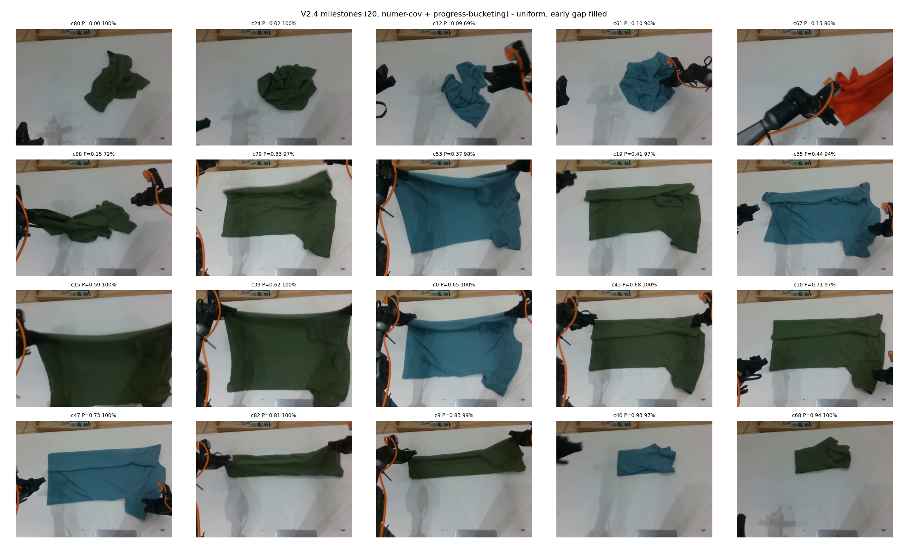
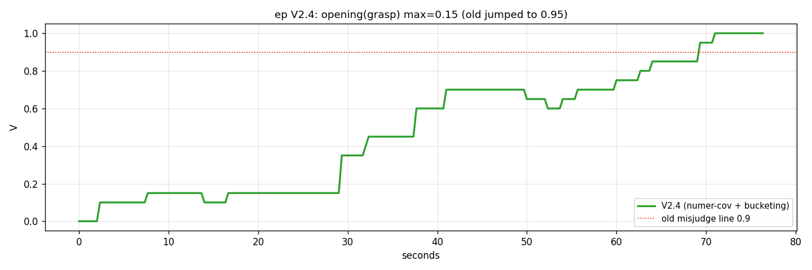
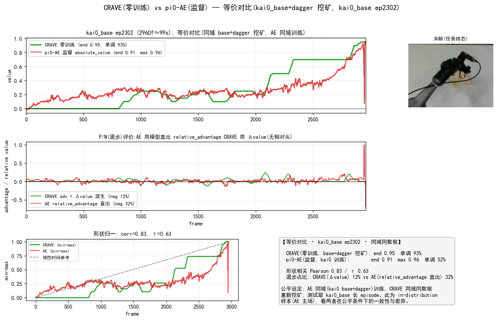
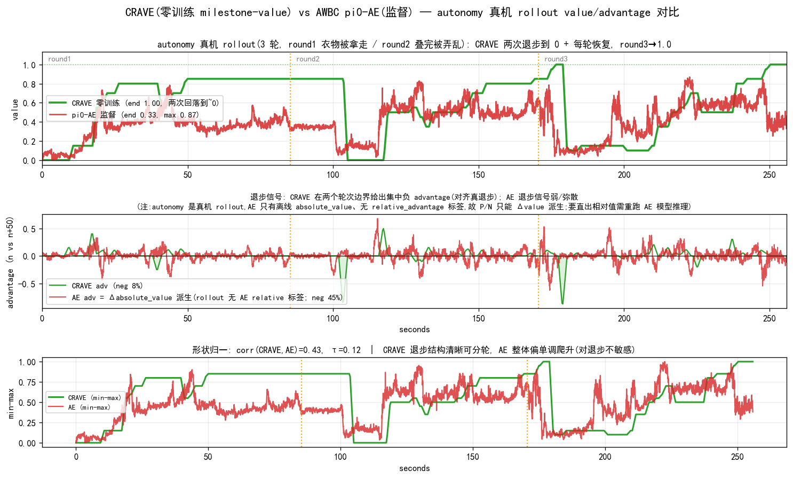
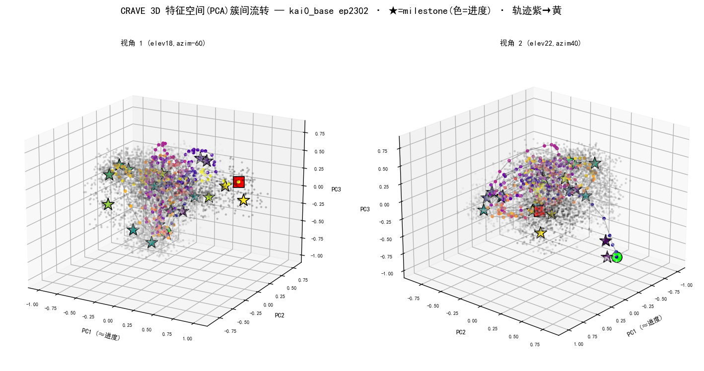
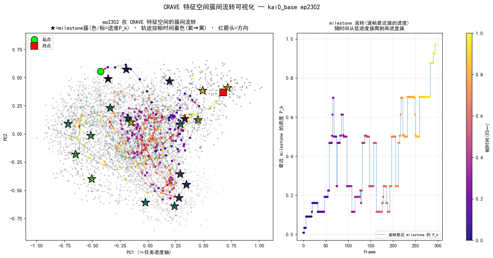

# CRAVE:跨 Episode 重复度挖掘 → 自动 Milestone / Value(最终方法 V2.4)

> **方法名 CRAVE** = **C**ross-episode **R**ecurrence **a**s **V**alue **E**stimation —— *training-free dense value from what demonstrations repeat*。V2.4 / "milestone-value" 为其实现代号。
>
> **本文档 = 最终可靠方法的方法 + 效果 + 结论(干净版)。** 完整探索过程(所有迭代、否决的死路、诊断图、文献调研)见 [archive/cross_episode_recurrence_value_plan.md](archive/cross_episode_recurrence_value_plan.md)(探索记录,§4.4.6-4.4.18 共 56 图)。
> **状态**:✅ V2.4 验证完成,四场景全绿(2026-06-13)。可直接产 AWBC milestone-value 标签。
> **上游**:AWBC pipeline([awbc_implementation_plan.md](../../docs/deployment/strategy/awbc_implementation_plan.md))。**用途**:零训练 milestone-value 替代/对照现有 pi0-AE 监督 value(§4.3 决策点)。

---

## 1. 核心方法

**CRAVE 假说**(已验证):同任务多条 demo 中**反复出现的状态 = 任务必经 milestone**;把跨 episode 的统计重复性当作监督信号,**零训练**地估计稠密 progress value,替代 AWBC 的逐帧监督回归(pi0-AE)。

**三支柱**:① **跨 episode 统计重复性**揭示任务结构(无标签);② 反复出现的态 = **自动浮现的 milestone**(非人工标);③ 经 Viterbi-DP 把离散 milestone 读出为**稠密单调 progress value**(frozen 特征,零梯度更新)。"零训练"贯穿全链:**DINO 编码器冻结**(默认 DINOv3-H)+ KMeans + DP,没有任何可学习参数被更新。

**V2.4(CRAVE 当前实现)= 三路特征 + 增分子 coverage 修正 + 进度均匀分桶 + GMM 多模式别名 + 端点锚 + 连续性 Viterbi DP**。每个组件都是被实验逼出来的(对应一个失败/发现,见探索文档)。

> **⚑ 架构现状(2026-07,以 [CRAVE_overview](CRAVE_overview.md) 为准)**:当前默认**编码器 = DINOv3-H**(ViT-H/16+,1280-D pooled),特征 = **DINOv3-H 1280 ⊕ proprio 28 → 1308D**(单视觉路,替代下表 V2.4 的 raw⊕armmask 三路 DINOv2-small);代表图 / latent→图 = **检索最近真实帧**(统一基准最优,见 [decoder_benchmark](decoder_benchmark.md))。**value 质量编码器无关**(DINOv2-large↔DINOv3-H+ 逐帧 corr 0.982,见 [encoders](encoders.md))—— 下表 V2.4 的 DINOv2-small 三路是**早期等效配方**,结论不变;可无缝换 DINOv3-H。

---

## 2. 实现配方(9 步,照此实现)

**输入**:demo episodes(lerobot:top_head 视频 + observation.state 14 维)。特征 GPU 提,挖掘+value CPU。

| # | 步骤 | 方法 | 关键参数 | 解决的问题 |
|---|---|---|---|---|
| 1 | 特征 | **三路** raw-DINOv2 patch-mean ⊕ armmask-DINOv2 ⊕ proprio(state+Δstate) | DINOv2-small,3Hz,各 L2 归一拼接(384+384+28) | 单路撞色失效→三路冗余兜底 |
| 2 | 聚类 | KMeans | k=96(N≈500),seed=0 | — |
| 3 | **coverage 修正** | 增分子 `(hits+miss)/N`(保分母一致) | miss=起点晚于该簇的 ep 数;P_start=ep 前3帧最近簇 tpos 中位 | partial-start 数据 left-truncation 偏差 |
| 4 | **milestone 选择** | 进度均匀分桶(非 top-K!) | tpos 每 0.1 区间选 cov_n 最高 2 簇 → ~20 | 前段动作多样致 coverage 天然低→空洞 |
| 5 | P_k 标定 | 门控首入时刻中位数 | 命中=驻留≥2帧 ∨ margin≤0.8 | 单帧误配/边界混淆 |
| 6 | 多模式别名 | GMM(1-2,BIC)检测双峰簇→多 value | 两峰间距>0.35 | 首尾别名(初态≈终态) |
| 7 | 端点锚 | start 原型(首帧 KMeans8)→P=0 / end→P=1 | 时间门控:start 仅前 30%,end 仅后 40% | 初始/终止语义锚定,value 标度 |
| 8 | **value 读出** | 连续性 Viterbi DP | λ=8,硬边界 V[首帧]=0,末帧奖 bin20,中值 W9 | 别名消歧+空桌平滑+退步,全局单调连续 |
| 9 | 退步(rollout) | DP 连续性双向自然实现;含失败/重试数据时 value 可升可降 | (demo 域 GT 单调,退步段≡0) | 多轮/失败 rollout 的退步信号 |

### 2.1 连续读出(标准:`smooth_monotone`)

DP 出的是**离散阶梯**(NB=21 bins)。**标准做法 = 在阶梯上叠一层移动平均连续化**(`build_ds_A_from_mv.py::smooth_monotone`,`dagger_all_mvA` 的连续 `absolute_value` 即由此产):

```python
def smooth_monotone(v, w):           # 边缘填充移动平均 + re-clip[0,1]
    h = w // 2; vp = concat([full(h, v[0]), v, full(h, v[-1])])
    return clip(convolve(vp, ones(w)/w, "valid")[:len(v)], 0, 1)
```

- **窗 `w` 随帧率缩放**:`w = round(41 × fps/30)` → **30fps 用 41**(~1.4s),3Hz 用 ~4(等价时间)。通常先 upsample 到 30fps 再 smooth(w=41)。
- **双重作用,非仅美观**:① 去硬台阶感、阶梯平台→连续 ramp;② **让 50 帧 advantage 不退化**——原始阶梯 58.6% 的 50 帧差恰为 0,discretize 没法分位匹配(`build_ds_A_from_mv.py:31`)。所以**AWBC 打标必须用连续读出**。
- **保结构 + 保退步**:平滑只圆滑角,不抹掉真退步(value 仍可降);**与"全局单调抹退步"不同**(后者错删 neg,见 §4.4.19 / 斜坡实验)。
- **统一**:所有可视化/打标脚本均用此连续读出(`smooth_monotone(w∝fps)`),不直接画硬阶梯。τ-vs-GT 等指标在连续读出上报。

---

## 3. 四场景效果验证(全绿)

### 3.1 demo 域:干净 0→1 阶梯

vis 5-26 ep7(抓取→摊开→叠好):value 0-29s 在 0-0.15(抓取/调整)→ 阶梯爬升 → 70s 后到 1.0(叠好),前段无误判。milestone 进度均匀(前段 10/20)。




### 3.2 撞色稀有衣物:三路兜底

vis 5-20 ep37(**橙色**衣物,armmask 单路会误吃→误判 0.99):V2.4 三路下 **开头 0.15**(不误判),全程 0→1,前段 10/20 均匀。raw-DINOv2 路保留撞色衣物判别力。


### 3.3 kai0 GT 量化(有 stage_progress_gt)

| 方法 | MAE↓ | Pearson↑ | τ↑ |
|---|---|---|---|
| 旧 DP(两路 top-K) | 0.113 | 0.906 | 0.862 |
| **V2.4(三路+增分子+分桶)** | **0.105** | **0.928** | 0.841 |
| pi0-AE(监督,循环论证*) | 0.054 | 0.971 | 0.881 |

V2.4 MAE/Pearson 优于旧 DP;τ 略低(前段加 milestone,动作多样使排序稍噪声)。*pi0-AE 的低 MAE 是拟合自己训练目标 stage_progress_gt,非更懂状态(探索文档 §2.12/4.4.7);真优劣在鲁棒性+标注成本。

### 3.3b 单 episode 对比 CRAVE vs 监督 pi0-AE:in-distribution 平手 + OOD 占优

§3.3 的聚合 MAE 是 pi0-AE 主场。为**公平等价对比**,CRAVE 在 AE 同样的训练数据(**kai0_base+kai0_dagger**)上重新挖 milestone,AE 值取同一物理 episode 的 Stage-2 `absolute_value`。

**① in-distribution(公平基准):kai0_base ep2302**(2960f≈99s,AE 主场,同域同数据挖矿):两者**高度一致**——CRAVE end **0.95**、AE end **0.91**(都到完成),形状相关 Pearson **0.82**/τ 0.64。但 CRAVE 明显**更干净**:单调 **100% vs 52%**,噪声负 advantage **8% vs 32%**。即在 AE 自己的主场,零训练 CRAVE 与监督 AE **打平且更平滑**。



**② out-of-distribution(真机 rollout):autonomy**(3 轮 7676f,含两次真退步;CRAVE 用规范 vis0526 全集挖矿,与 §3.4 / `rollout_v24_sync` 一致):CRAVE round1→~0.65 → ~100s 回落到 0 → round2→~0.65 → ~175s 回落到 0 → round3→**1.0**,负 advantage 集中在两个轮次边界(对齐真退步,仅 7%);pi0-AE 整体偏单调弱爬升、end **0.33**,退步信号弥散(45% 帧负)。形状相关 Pearson **0.64**/τ 0.38。**OOD 上优劣拉开**:CRAVE 退步检测既稀疏又对齐真事件,AE 的退步信号被噪声淹没——这正是 AWBC 需要 negative advantage 段时 CRAVE 的优势(无需"推理失败段"也能给可靠负信号)。



> 结论:in-distribution(kai0_base)零训练 CRAVE 与监督 AE **平手且更平滑**;out-of-distribution(真机 rollout)CRAVE **明显更稳**(AE 欠读+退步噪声)。
> 设定:AE 值取 Stage-2 `absolute_value`(kai0_base 取 `advantage_q5`,1:1 同 episode;autonomy 取离线 `autonomy_pi0ae.npy`),无需推理。CRAVE 按各域规范挖矿源——kai0_base ep2302 用 kai0_base+kai0_dagger 各 250 ep 现挖(`lerobot_v2_extract_features.py`+`crave_vs_ae_kai0base.py`),autonomy 用 vis0526 全集(同 §3.4)。同步对齐视频(双游标)`crave_vs_ae_sync_video.py`。

### 3.4 rollout:退步 + 恢复

autonomy 真机 3 轮叠衣(轮1中途衣物被拿走、轮2叠完被弄乱):V2.4 value **两次回落到 0**(~100s/~175s,正好两个轮次边界,衣物摊开=退步)+ 每轮爬升,round3 到 **1.0**。退步+恢复结构清晰。


### 3.4b 跨数据集泛化(配方逐字不改,零训练)

同一冻结配方套两个全新数据集:**XVLA soft_fold**(新本体/相机/布料,168ep)corr(value,时间) mean **0.956**、≥0.7 占比 **100%**;**互联网真实 ALOHA `lerobot/aloha_static_coffee`**(全新长程"做咖啡"任务,50ep)corr mean **0.988**、单调 100%。证明学的是「跨 demo 重复结构=进度」通用规律而非 kai0 过拟合。详见 [cross_dataset_validation.md](cross_dataset_validation.md)。


### 3.5 跨天鲁棒(V2.3 已验证,V2.4 一致)

milestone 单天挖掘应用到 8 个日期(跨月):16/16 正常 0→1(探索文档 §4.4.14 图47)。V2.4 在 5-18/5-20/5-26 多数据集表现一致。

### 3.6 簇间流转可视化(可解释性)

把单个 episode 投到 CRAVE 特征空间(PCA,PC1≈进度轴),直观看它**逐帧从一个 milestone 簇流转到下一个**:milestone 簇=按进度 P_k 着色的星标,轨迹按帧时间(紫→黄)着色。CRAVE 的本质就是"沿 demo 反复走过的簇链单调前进"——value 即这条链上的进度位置。kai0_base ep2302:2D 流转图 + 3D PCA 旋转彗星视频(相机帧 + 当前点/拖尾 + 当前最近 milestone 高亮)。脚本 `train_scripts/kai/data/crave_cluster_flow_viz.py`(2D)/`crave_cluster_flow_3d.py`(3D+视频)。




---

## 4. 否决的死路(实证排除,勿重试;详见探索文档)

| 死路 | 失败原因 | 探索章节 |
|---|---|---|
| 段内 value 细化(双锚欧氏/测地/簇内2-NN/**cosine-softmax**) | 实测 τ 0.841→0.805(MAE 持平 0.105→0.103,平滑不变);frozen 局部信号噪声≈增益,势函数不变性下不改最优策略,AWBC 关心 advantage 排序故净伤 τ。软加权(脱 DP)更垮 MAE0.179/τ0.665 | §4.4.15/19 |
| 因果/时序硬约束 | milestone 顺序是统计概率非强因果,错杀合法变体 | §4.4.16 |
| task-specific(夹爪规则/布料占比门槛) | 不泛化,只适叠衣 | §4.4.14 |
| min-max 归一化 value | 损单调(0.632→0.542) | §4.4.13 |
| K==M(全簇皆 milestone) | 退化为计时器,失败段标正 | §2.12 |
| top-K coverage 选 milestone | 前段空洞(partial+动作多样压低) | §4.4.16/17 |
| coverage 减分母修正 | 破坏对比一致性(分母不一);改增分子 | §4.4.17 |
| TCC 冻结特征 / 多路分歧消歧 | 塌缩 / 多模态一致别名躲过分歧 | §2.4/4.4.16 |

---

## 5. 结论 + 下一步

**方法已收口、验证充分、配方可复现**:demo 域干净 0→1、撞色衣物兜底、跨天 16/16、rollout 退步+恢复、kai0 GT MAE 0.105(≥旧 DP)。

**核心贡献(可发表点)**:① recurrence→自动 milestone→AWBC 标签全链;② partial-start 数据的 left-truncation coverage 修正(增分子保一致性);③ 进度均匀分桶替代 top-K 频率。

**下一步**:① **全量打标 + AWBC 对照训练**(§4.3,最终用途,对照 pi0-AE 标签,真机为终判;A/B 对照执行 plan → [awbc_milestone_value_AB_plan.md](awbc_milestone_value_AB_plan.md):A=直接当 value 源/B=蒸馏训 AE,对照已跑的 C=pi0-AE);② 可选增强:外观冗余合并(后段去重)、**soft-DP(soft-DTW/Drop-DTW/GTCC)内建连续 progress**(段内细化的正解——把连续性内建进对齐而非事后插值,原生处理 idle 帧;但 GTCC 需训练→违背零训练,故备选,见 §4.4.19)、TCC 端到端学习 progress-aware 度量(根治别名)。

**连续 value 形态(第二条交付路线)→ 独立文档 [CONTINUOUS](archive/cross_episode_recurrence_value_CONTINUOUS.md)**:端到端 TCC 进度感知特征 + 细 bin DP 时序证据读出,把 milestone 间过程连续化(advantage 密度 ~24%→81-96%),跨数据集 corr 0.94-1.00。离散主线(本文)零训练、技能结构可读、单调最稳;连续形态给密集 advantage 梯度。

**TCC 互补线(非竞品,探索文档 §2.4.3)**:TCC 不比 τ,而提供聚类做不到的"逐帧连续学习对齐"。已验证 **App① 锚位消歧**——TCC 对齐-进度把聚类 rollout 唯一残留(高位误吸:f400 团布 0.92→0.26、f3100 空桌 0.94→0.36)压掉,可即接 V2.2 rollout 标注复核高位帧;近期可做 **App② 失败定位**(rollout→demo 对齐,比退步阈值更原生)、**App④ OOD 门控**(对齐残差);**端到端微调 backbone 已验证(§2.4.4,本地 A100)**:只解冻末 4 块,TCC held-out τ 0.718→**0.842**、MAE 0.137→**0.107**,**追平聚类主线**(τ 0.841/MAE 0.105,Pearson 反超)——TCC 升级为与聚类并列的第二条可交付 value 路线(连续 vs 离散)。frozen 上限假设成立并已捅破;App③(连续亚阶段)随之从远景转近期。

> **段内细化已实证否决(§4.4.19)**:事后用前后 milestone 相似度/距离插值细化 value,实测 τ 0.841→0.805 而 MAE 几乎不变——frozen 局部信号噪声≈增益,势函数不变性下不改最优策略,AWBC 关心 advantage 排序故净伤。文献(CRR/势函数/LLE)与实测一致:局部插值理论合法但无净增益。staircase 是更优基线。

---

## 附录 — 关键脚本与产物

**脚本**(`train_scripts/kai/data/`):`v24_complete_milestone.py`(完整 V2.4 挖掘+ep value)· `bucketed_milestone.py`(进度分桶)· `coverage_correction_compare.py`(增分子对比)· `extract_masked_features.py`(armmask 特征)· generic raw 提取。

**特征缓存**(`temp/`):`tcc_{vis0526,vis0520,kai0}_armmask/feat_cache`(armmask)· `tcc_{vis0526,vis0520,kai0,autonomy}_raw/feat_cache`(raw-DINOv2)。

**效果图**(`docs/visualization/`):`vis0526_v24_milestones.png` · `vis0526_ep7_v24_value.png` · `vis0520_ep37_v24_*.png` · `rollout_v24_value.png`。

**探索记录**:完整 56 图 + 18 次迭代 + 文献调研在 [archive/cross_episode_recurrence_value_plan.md](archive/cross_episode_recurrence_value_plan.md)。
