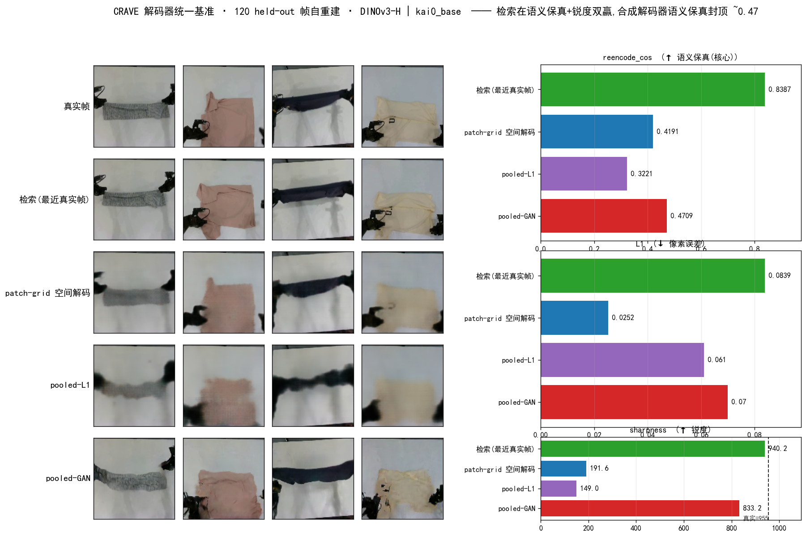
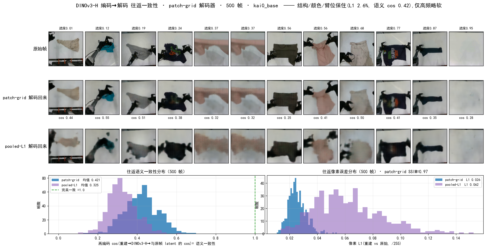

# CRAVE 解码器统一基准 —— 找到最好的解码方案

> **一句话结论**:把 latent 变成图,**检索(最近真实帧)是最优解** —— 在"语义保真"(核心指标)和"锐度"上**双赢**(cos **0.84** / 锐度 **940**≈真实 955),且零幻觉;**所有合成解码器语义保真封顶 ~0.47**,是一道结构性的墙。合成只在"必须造 demo 集里没有的新状态"时才需要,那时用 patch-grid(软)。
>
> 数据:120 held-out 帧**自重建**(每个解码器吃该帧自己的 latent,隔离预测误差)· DINOv3-H · kai0_base。脚本 [`crave/experiments/decoder_benchmark.py`](../experiments/decoder_benchmark.py)。日期:2026-07-03。



## 1. 为什么要重做一次统一基准

历史结论散在多篇文档、且量纲不一(锐度 152/852、L1 6.2%/2.7%、cos 0.87),还有一处**矛盾**:§2b 说 pooled-GAN "锐但幻觉、保真更差、弃",而 blur-diagnosis 说 GAN "锐度 852≈真实、合格测量仪"。到底哪个对?**只有把所有解码器放到同一批帧、同一套指标上才能一次排定。**

关键是加一个**跨解码器统一的保真指标**:**再编码 cos** —— 解码图 → 重新过 DINOv3-H pooled → 与目标 latent 的 cos。它直接回答"**解出来的图,语义上还是不是那个 latent**",能揭穿"锐但内容错"。

## 2. 结果(120 帧自重建)

| 解码器 | 再编码 cos ↑(**语义保真, 核心**) | L1 ↓(像素误差) | 锐度 ↑(真实≈955) | 定位 |
|---|---|---|---|---|
| **① 检索(最近真实帧)** | **0.839** | 0.084 | **940** | **语义+锐度双赢**;唯一逼近真实锐度 |
| ② patch-grid 空间解码 | 0.419 | **0.025** | 192 | 像素最近但**软**、语义漂 |
| ③ pooled-L1 | 0.322 | 0.061 | 149 | 全面被支配(糊) |
| ④ pooled-GAN | 0.471 | 0.070 | 833 | **锐但幻觉**(锐度高、语义仍只 0.47) |

三个读法:

- **检索在核心指标上是第二名的 1.8×**(0.84 vs 0.47)。它锐度 940≈真实,因为它**就是**真实帧。代价:L1 高(0.084)—— 但那是"换了一条 demo 的同阶段真实帧"(布料颜色/褶皱不同),**不是缺陷**;对 milestone 代表/子目标,要的正是"语义对、去具体化",不是逐像素复刻某一帧。
- **GAN 矛盾就此了结**:GAN 锐度 833(接近真实)**但语义保真只 0.47** —— 它用**幻觉的清晰纹理**换锐度,内容并没保住。"锐"≠"真"。§2b 的"弃"是对的(做保真/子目标),blur-diagnosis 的"锐"也没错(只是锐不等于保真)。
- **L1 会骗人**:patch-grid L1 最低(0.025)却**软(192)、语义最差之一(0.42)**——因为逐像素 L1 **偏爱模糊**(糊图 L1 小),而 DINOv3 对纹理敏感、软化即语义漂。**别用 L1 选解码器,用再编码 cos。**

**结构性天花板**:所有**合成**解码器(patch/pooled/GAN)语义保真都卡在 **0.42–0.47**,远低于检索 0.84。这与 §2.4 "可形变布料的平均/合成 ill-posed" 同源 —— 合成天生丢语义;检索直接借用真实帧,一步到位。

## 2b. 往返一致性:结构 SSIM 0.97 忠实,latent 因软化而降 → 故选检索

"帧 → DINOv3-H 编码 → 解码回来"的**自重建往返**(500 帧,最忠实的合成解码器 patch-grid;检索会返回另一帧、不适用):



| 一致性口径 | patch-grid | pooled-L1 | 读法 |
|---|---|---|---|
| **SSIM(结构相似)** | **0.97** | 0.80 | 结构/布局几乎一致 |
| **像素 L1** | **2.6%** | 6.2% | 颜色/形状/臂位都保住 |
| 再编码 cos(DINOv3 latent) | 0.42 | 0.33 | 中等 —— 见下 |

**两种"一致性"要分开**:
- **人眼/结构视角:高度一致**(SSIM 0.97、L1 2.6%)—— 画廊里每帧都能一眼认出是**同一场景**(同布料、同折叠阶段、同臂位),仅**高频褶皱略软**;
- **编码器视角:偏严**(再编码 cos 仅 0.42)—— **DINOv3-H pooled 对高频纹理极敏感**,哪怕 SSIM 0.97 的重建,只要略软,其 DINOv3 latent 就明显漂移。

**这正是标准解码器选检索的原因**:任何**合成**往返都必然略软 → DINOv3 latent 漂到 ~0.42;**检索直接借真实帧、无软化 → latent 一致性直接 0.84、锐度=真实**。副产论:① patch-grid 是**结构最忠实的合成往返**(SSIM 0.97,远胜 pooled 的 0.80);② 想"解码再比"衡量 LMWM 预测质量并不干净(软化就吃掉 0.4+ cos)——**该直接用 latent-cos**。复现 `crave/experiments/roundtrip_consistency.py`。

## 3. 最好的解码方案(按目的选)

| 目的 | 最佳解码 | 依据 |
|---|---|---|
| **latent→图(可视化 / VLA subgoal / LMWM / milestone 词表)** | **① 检索(最近真实帧)** | cos 0.84 + 锐度 940 双赢,零幻觉;规范组件 `lmwm.LatentRetrievalDecoder` |
| 选定真实帧的**照片级**渲染 | Wan2.2-VAE(单帧重建 L1 0.003) | §6.3;Wan 只做渲染 |
| **必须合成新状态**(不在 demo 集)+ 保真优先 | ② patch-grid 空间解码(软但保结构) | 合成里语义最不差、且保空间;避开 pooled/GAN |
| 只做"好看"、可容忍内容偏差 | ④ pooled-GAN(锐) | 锐度 833,但**绝不可**当保真/子目标/测量仪 |
| 衡量 LMWM 预测质量 | **不要解码**,直接用 latent-cos(0.86) | 合成自重建 cos 已封顶 0.47 → 解码不是干净的"测量仪" |

**弃用**:pooled-L1(全面被支配)、任何"簇平均"合成(ill-posed 恒软,§2.4)。

## 4. 一个尚未探索的杠杆(记录,非必需)

合成解码器语义保真封顶 0.47,现有损失(L1/GAN)都突破不了:L1 求均值→软→语义漂;GAN→幻觉→内容错。**理论上唯一可能同时"锐+保真"的合成是扩散解码器**(条件于 latent 采样一个清晰且语义一致的模态)。但——**检索已经免费拿到了"锐+保真"(0.84/940)**,除非确有"合成 demo 集里没有的新状态"的硬需求,否则**不值得投入扩散解码器**。

## 5. 复现

```bash
REPO=/home/tim/workspace/deepdive_kai0 PYTHONPATH=crave/src:lmwm/src:lmwm/scripts \
  /home/tim/miniconda3/envs/srpo/bin/python crave/experiments/decoder_benchmark.py
```
- 输入:`temp/crave_full_dinov3h`(DINOv3-H pooled 特征 + 帧)+ 三个解码器 ckpt(`lmwm/checkpoints/{dinov3h_decoder/dec.pt, dinov3h_decoder/dec_gan.pt, patch_decoder/patch_dec.pt}`)
- 输出:`crave/docs/visualization/decoder_benchmark/{decoder_benchmark.png, summary.json}`
- 相关:[`milestone_centroid_decoding.md`](milestone_centroid_decoding.md)(方法史/规模消融)、[`lmwm/docs/decoder_blur_diagnosis_20260702.md`](../../lmwm/docs/decoder_blur_diagnosis_20260702.md)(LMWM 侧应用)、规范组件 `lmwm/src/lmwm/retrieval_decoder.py`。
