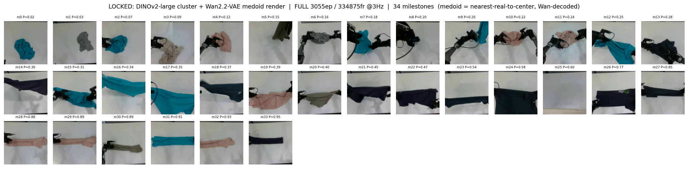
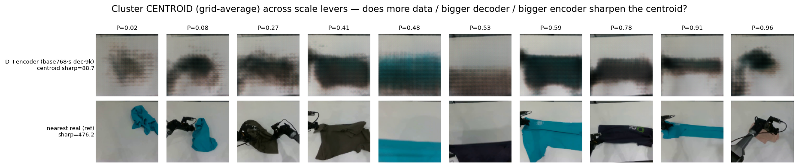
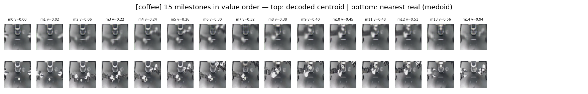
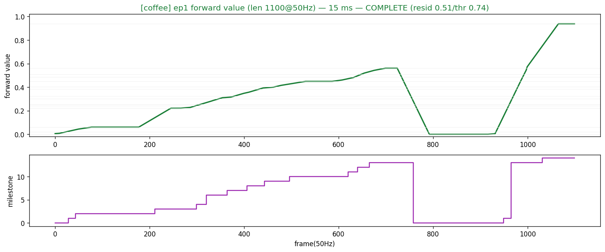
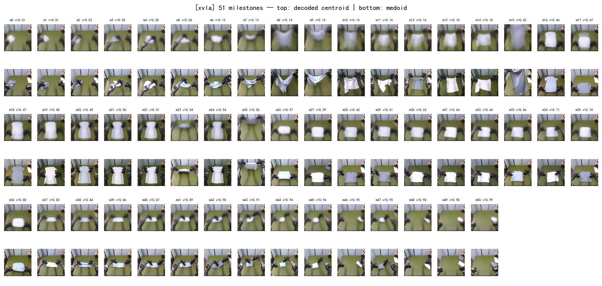
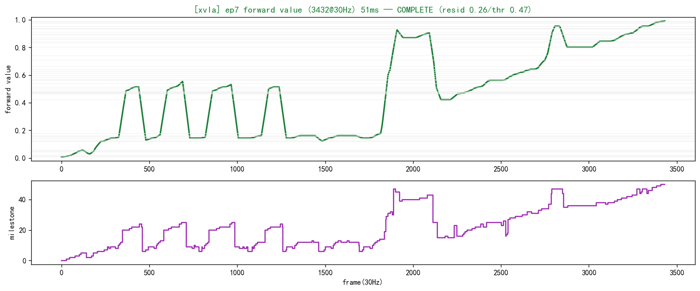
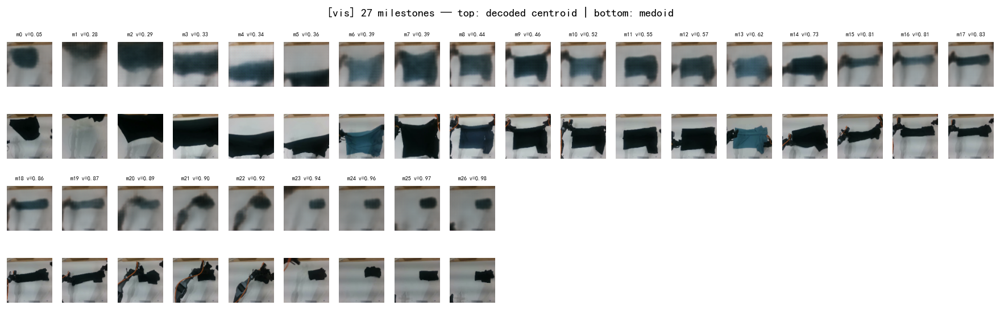
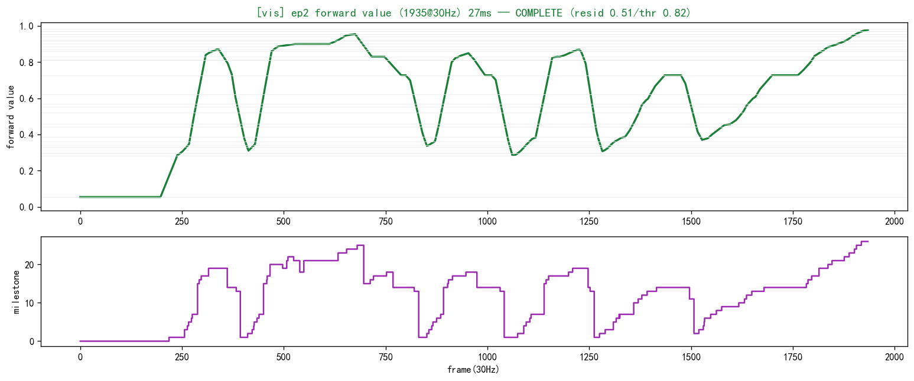
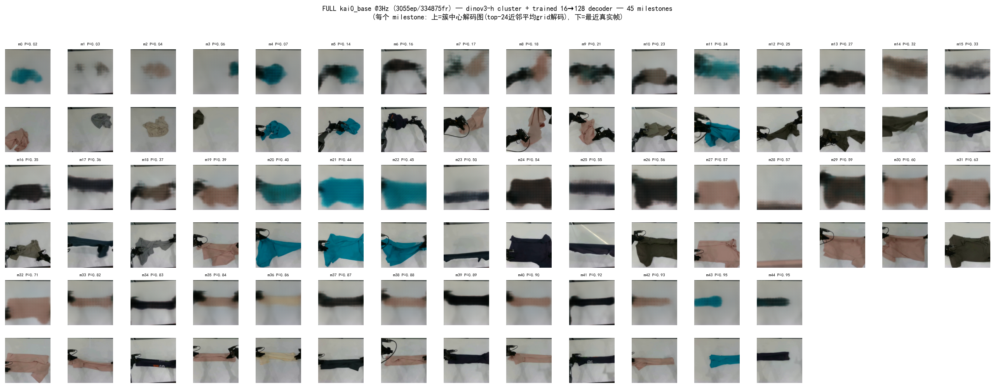
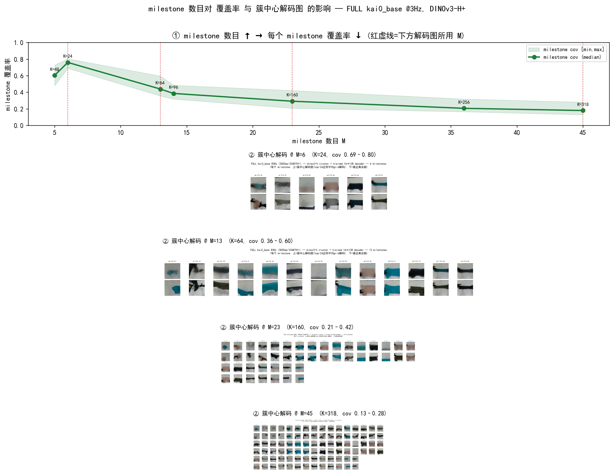

# 编码器(Encoders)：作用、选型与对比

> CRAVE 全程**零训练**,唯一的"表征"来自一个**冻结的视觉编码器**:帧 → 编码器 → 特征 →
> KMeans 聚类 → milestone 排序 → Viterbi-DP 读出 value。**编码器决定整条 pipeline 聚类
> 的特征空间**,是除数据质量外对 milestone/value 质量影响最大的单一旋钮。
>
> 编码器是**可插拔**的:注册表 [`crave/src/crave/config/encoders.py`](../src/crave/config/encoders.py)
> 是唯一事实源,加一个编码器 = 加一行 `EncoderSpec`,下游无需改动。运行时用
> `crave.encoders.load_encoder(name)`,产出 `encode_pooled (N,dim)` 与 `encode_grid (N,dim,16,16)`。
>
> 本文档配图统一放在 [`visualization/encoders/`](visualization/encoders/)。

---

## 1. 两类编码器各管什么

CRAVE 区分**语义**与**外观**两条互补的表征路:

| 路 | 编码器 | 抓什么 | 在 CRAVE 里的角色 |
|---|---|---|---|
| **语义 (semantic)** | DINOv2 / DINOv3 (ViT) | "**发生了什么 / 任务到哪一步**"——手-物关系、接触、相位 | **主力**:milestone 发现 + value 读出都跑在它的特征上 |
| **外观 (appearance)** | Wan2.2-VAE latent | "**画面长什么样**"——纹理、颜色、布料形态 | **辅助**:质心解码可读化 / 外观去歧义("3-path"中的一路) |

- **语义路**是 value 的来源:同任务多条 demo 反复出现的**语义状态** = 必经 milestone。DINO 的
  patch token 对"任务相位"高度敏感而对纹理相对不变,正是我们要的。
- **外观路**(Wan-VAE)**不参与 value**,主要用于把抽象 milestone 质心**解码回可看的图**,以及在
  语义近似但外观不同的状态间补充区分度。


*DINO 语义路:每个自动浮现的 milestone 质心(同一相位跨 episode 的代表帧)。*


*Wan-VAE 外观路:同样的质心在外观隐空间下的样子——纹理/形态保真,但相位区分度弱于 DINO。*


*语义特征(聚类用)与解码回像素(可读化用)是两件事:DINO 负责前者,空间解码器/Wan 负责后者。*

---

## 2. 注册表里的编码器

> 字段含义:`dim` 池化/逐 token 特征维;`dtype` 推理精度;`res` 处理分辨率(选成 patch 网格正好 16×16,
> 匹配固定 16→128 解码器);`nprefix` 池化前要跳过的前缀 token 数(CLS + register)。

### DINOv2(patch14 @224 → 16×16,nprefix=1,fp16)
| name | dim | 角色 |
|---|---|---|
| `dinov2-small` | 384 | **零训练 value 的历史默认**——最轻最快,milestone/value 已足够(kai0 GT MAE 0.105 即此档)。 |
| `dinov2-base`  | 768 | 中档,质心解码画廊更清晰。 |
| `dinov2-large` | 1024 | 早期合成质心解码配置(解码可读性最好);value 与 DINOv3-H 等效(corr 0.982)。**标准编码器现为 `dinov3-h`**。 |

DINOv2 只有 1 个前缀 token(CLS),无 register token,用 fp16 即可。



*规模消融:base→large 质心更锐、相位边界更干净;但对**最终 value 曲线**的提升远小于对**解码可读性**的提升——
value 早在 small 档就饱和,放大编码器主要买"图更好看",不是"value 更准"。*

### DINOv3(patch16 @256 → 16×16,nprefix=5,**bf16 必须**)
| name | dim | 状态 / 角色 |
|---|---|---|
| `dinov3-l`       | 1024 | **小号调试档**(ungated HF 格式镜像,~1.2GB)——比 H+ 轻、出图快,7B 下载期间先用它迭代。 |
| `dinov3-h`       | 1280 | **当前标准编码器**(ViT-H+,1280;coffee 跨数据集 0→0.94;LMWM / 跨数据集 / 解码基准均用它)。 |
| `dinov3-7b-int8` | 4096 | **旗舰**(int8 量化,bitsandbytes 加载)——特征最强,后台下载中。 |
| `dinov3-7b`      | 4096 | 旗舰全精度(占位,需 26.9GB,一般用 int8 即可)。 |

**DINOv3 vs DINOv2 的关键差异(实现必读)**:
1. **register token**:DINOv3 有 1 CLS + 4 register = **nprefix=5**,池化/reshape 前必须全部跳过,否则 16×16 网格错位。
2. **精度**:DINOv3 的 ViT-H+/7B 在 **fp16 会溢出成 NaN**,**必须 bf16**(int8 档内部也按 bf16 算)。详见 [[reference_dinov3_srpo_env]]。
3. **register token 让注意力更干净**(无 DINOv2 那种高范数伪影 patch),特征质量更高;代价是更大更慢、需更新的 transformers。


*DINOv3-H+ 在真实 ALOHA coffee 上自动浮现的 milestone 质心——跨本体零改配方。*


*同一编码器读出的单调 progress value(ep1,0→0.94),验证 DINOv3 路与既有 pipeline 完全对齐。*

#### 编码器阶梯实测对比:DINOv2-large vs DINOv3-L vs DINOv3-H+(2026-06-22)

同一套配方,只换编码器,在三个泛化数据集上跑 `generalize.py`(`--novideo`)。每格 `M(milestone数) / value区间`,
**代表 ep**(auto 选出的两条最长 episode)单列:

| 数据集 | eps / 帧数 N | DINOv2-large | DINOv3-L | DINOv3-H+ | 代表 ep |
|---|---|---|---|---|---|
| coffee(真 ALOHA) | 50 / 55,000 | 15 / [0.009, 0.949] | 24 / [0.0, 0.937] | 15 / [0.0, 0.94] | [0, 1] |
| vis | 560 / 219,350 | 32 / [0.042, 0.969] | 29 / [0.042, 0.969] | 27 / [0.054, 0.982] | **三档全 [2, 121]** |
| xvla(新本体) | 168 / 340,853 | 53 / [0.008, 0.990] | 49 / [0.008, 0.989] | 51 / [0.008, 0.990] | **三档全 [7, 39]** |

**结论(三档高度一致)**:
- **value 质量编码器无关**:vis/xvla 上三档 value 区间几乎逐位相同,**自动选出的代表 episode 完全相同**(vis [2,121] / xvla [7,39])——pipeline 对 backbone **强鲁棒**,换编码器不破结构。
  量化:coffee 两条长 ep 上**逐帧 `corr(DINOv2-large, DINOv3-H+) = 0.982`**(`--dump-values` 落 npz 后算),value 区间逐位相同 [0,0.94]——换编码器,value 曲线几乎重合。
- **DINOv3 milestone 更紧凑**:大数据集上 v3 普遍比 v2 略少 milestone(vis 32→27、xvla 53→49/51),register-token 把同相位帧聚得更干净;coffee(仅 50ep)上 L 反而偏多(M=24),小样本聚类的正常波动。
- 再次印证:**换编码器主要影响"结构紧凑度 / 质心可读性",value 质量本身持平**——value 的天花板由数据质量与 Viterbi-DP 读出决定,不由 backbone 决定。
- 工程含义:**调试用 DINOv3-L 即可**(更轻更快,结构与 H+ 一致),要最强语义再上 H+ / 7B。



*新本体 XVLA:DINOv3-H+ 自动 milestone 质心 + 单调 value(ep7,0.008→0.990),跨本体零改配方。*



*vis:DINOv3-H+ 27 个 milestone + value(ep2),与 DINOv2 代表 ep 选择一致。*

### Wan2.2-VAE(外观隐空间)
| name | dim | 角色 |
|---|---|---|
| `wan-vae` | 48×16×16 | **外观路**:不做 value,做质心可读化解码 + 外观去歧义("3-path")。 |


*Wan-VAE 隐空间下的 milestone 外观——纹理/布料形态保真,适合"看",但相位语义不如 DINO。*

---

## 3. 全量簇中心解码(FULL kai0_base @3Hz)

把"编码 → 聚类 → 簇中心解码"跑到**全量数据**上,看真实任务里自动浮现的 milestone 长什么样。

**配置**:`kai0_base` **全部 3055 episode @3Hz = 334,875 帧**,编码器 **DINOv3-H+**。
流程(脚本 [`crave/experiments/crave_full_7b_centroid.py`](../experiments/crave_full_7b_centroid.py),`--encoder` 可换 H+/7B):
1. **双卡分片编码**池化特征落盘(grid 太大 ~700GB 不存,~20min);
2. 全量 **MiniBatchKMeans** 自适应 `K0=318` → 自适应选 milestone(覆盖率 Otsu τ=0.128 + 时间纯度 τ=0.170 + 进度去冗余)→ **45 个 milestone**;
3. 重编码 4000 帧训 16→128 解码器;每个 milestone 取 **top-24 近邻平均 grid → 解码成簇中心图**。


*45 个 milestone,每对:上=簇中心解码图(top-24 近邻平均 grid 解码),下=最近真实帧。沿 m0→m44 按任务相位(P 递增)推进。*

**读图结论**:
- **簇中心解码 ↔ 最近真实帧对得上**——布料形态/颜色/手位都还原,证明 DINOv3-H+ 的 patch-grid **可解码、可读**,自动 milestone 是真实任务相位代表而非噪声。
- 45 个 milestone 沿叠衣流程**相位连贯**,全量(3055ep)聚类不塌缩。
- 解码偏"软"(簇中心=类内平均的固有特性 + 4000 训练对);要更清晰可加大 `--train-imgs/--epochs`。

> 跨编码器(DINOv2-large/DINOv3-L/H+/7B)的**小规模**簇中心解码对比另见
> [`visualization/encoders/enc_centroid_decode_compare.png`](visualization/encoders/enc_centroid_decode_compare.png)(vis,K=10);
> 结论:该任务下解码质量主要由数据视觉丰富度 + 解码器预算决定,**跨编码器差异小**(与 value 的编码器无关结论一致)。
> DINOv3-7B(int8)全量同款图待跑(`--encoder dinov3-7b-int8`,~2.6h)。

## 4. milestone 数目 ↔ 覆盖率 权衡(M≈13 甜点)

milestone 数目 M(由聚类数 K + 完整筛选决定)直接换来一条**"时间分辨率 vs 复现鲁棒性"权衡**。
在全量 kai0_base @3Hz(DINOv3-H+)上把 K 从 24 扫到 318:


*上=M↔覆盖率权衡曲线;下=M=6/13/23/45 四档簇中心解码图。*

| milestone 数 M | 6 | **13** | 23 | 36 | 45 |
|---|---|---|---|---|---|
| (聚类数 K) | 24 | 64 | 160 | 256 | 318 |
| milestone 覆盖率(中位) | 0.76 | **0.44** | 0.29 | 0.20 | 0.18 |

**单调反比、前段陡降**(M 6→13 覆盖率腰斩 0.76→0.44):milestone 越多,每个越"窄",能反复出现的 episode 比例越低。
- **少 milestone(M≈6)**:每个近乎人人经过(cov 0.69–0.80),但解码块状、步数太少、丢细节。
- **多 milestone(M≈45)**:45 步细粒度,但每个只覆盖 13–28% episode → 偏微状态、**中段易双峰**(同一外观状态在折叠中复现两次被并进一簇,std 纯度拦不住)。
- **甜点 M≈13(K=64)**:曲线拐点——milestone 仍覆盖 ~0.36–0.60(鲁棒),又给出干净的 13 步折叠序列。

> ⚠️ 坑(诚实):milestone 选择**必须同时要"覆盖率 AND 时间纯度"**。只按覆盖率筛(`cov≥mean`)会选中"整段都在的泛状态"簇——其帧进度 T 摊平在 0.1–0.8、tpos 塌向中间、value 失真;原版 CRAVE 的 **cov-Otsu + tstd 时间纯度 + 进度去冗余** 三件套才正确(脚本默认即此)。

## 5. 怎么选

- **要复现 / 跑 value**:`dinov2-small`(最快)或 `dinov2-large`(出图最清)——零训练 value 早饱和,这两档够用。
- **要最强语义 / 跨本体泛化**:`dinov3-h`(已验证)→ `dinov3-7b-int8`(下完后,旗舰)。
- **7B 下载期间快速调试**:`dinov3-l`(小、drop-in)。
- **要把 milestone 质心解码成好看的图 / 外观去歧义**:加 `wan-vae` 走外观路。

```bash
# srpo 环境(torch2.10 + transformers4.57,DINOv3-capable)
/home/tim/miniconda3/envs/srpo/bin/python crave/scripts/generalize.py coffee --encoder dinov3-h
#                                                                              ^^^^^^^^^ 换 encoder 即换表征,pipeline 不变
```

> ⚠️ 经验:**换大编码器买到的多是"质心解码更清晰",不是"value 更准"**——value 质量的天花板更多由
> **数据质量**和 **Viterbi-DP 读出**决定(见 [METHOD](cross_episode_recurrence_value_METHOD.md) /
> [viterbi_computation](viterbi_computation.md)),编码器先从 small/large 起步、有需要再上 DINOv3。

---
**相关**:编码器注册表 [`config/encoders.py`](../src/crave/config/encoders.py) ·
DINOv3 环境与 7B 获取 [[reference_dinov3_srpo_env]] ·
解码器选型/标准配置 [milestone_centroid_decoding](milestone_centroid_decoding.md) ·
解码器规模消融 [milestone_centroid_decoding](milestone_centroid_decoding.md)
