# CRAVE 最终架构(milestone 发现 + value 读出)

> **日期**: 2026-07-09(收口)
> **数据**: kai0_base(3055 成功 demo,折叠布任务)
> **定位**: 经过编码器/降维/K₀/proprio/聚类方法/多峰/读出方法/端点锚 全面消融后的收口方案

---

## 0. 一句话

**DINOv3-base → PCA128 ⊕ proprio位置(1:1) → BayesianGMM(自适应K)+ per-mode coverage筛选 → 中位数(median)值 → 双锚 Viterbi(无 smooth · 无 norm01)**

> 12 milestone + 起点锚(→0)/终点锚(→1)。**标准读出 = 双锚 Viterbi 无 smooth**。
> vs 监督 stage_progress_gt(kai0_advantage):corr **0.943**、单调 0.981、末值 0.999,零监督达成。

---

## 1. 完整 pipeline

```
① 特征
   image:   DINOv3-base(ViT-B/16, 768D, 冻结) → pooled(patch mean) → PCA→128D
   proprio: observation.state(14D 关节) → 标准化(zero-mean/unit-var) → L2
   joint:   concat[ l2(img128), l2(pos14) ]   # 两路各自L2 → 能量1:1

② milestone 发现(过聚类 + 复现筛选)
   过聚类器: BayesianGaussianMixture(diag协方差, Dirichlet先验) → 自适应K
   mode 检测: 每簇 T 分布 → robust mode(直方图平滑 + 谷深检验) → 单峰/双峰
   筛选:     **per-mode** cross-episode coverage ≥ 0.50
             (双峰簇的每个 mode 单独达标才保留, 非两 mode 加总凑数)
   → 每个存活 mode = 一个 milestone

③ 进度值 = **中位数(median)**
   每 mode 的进度值 = 该 mode 成员帧的 T 中位数
   为什么不用峰值(mode)/均值(mean):
     - 均值 → 偏斜/双峰簇是幽灵值(如 0.455 实际无帧)
     - 峰值 → 保序性差, 偏斜簇 mode≠时间中心 → value 排序倒挂(实测 5 处)
     - 中位数 → 抗尾巴 + 保序(升序无倒挂) + 双峰按谷分裂后各取中位数

④ value 读出 = 【标准输出:双锚 Viterbi · 无 smooth · 无 norm01】
   发射目标 = 12 milestone(median bin) + 起点锚 + 终点锚:
     起点锚 = mean(全ep首3帧) → value 0    终点锚 = mean(全ep末3帧) → value 1
   Viterbi(λ=16, 最近质心): 强制首帧=bin0、强制末帧=bin1.0
   → per-ep 3Hz value → 插值 30Hz
   ✗ 不做 smooth(median/boxcar 平滑一律不加)
   ✗ 不做 norm01(双锚已给真实 0→1,无需 per-ep 拉伸)

注: per-mode 覆盖筛选后 12 个全单峰 milestone。端点别名(flat-start≈flat-end)
    由【双锚 + Viterbi 全局路径】消解:末帧锚在 1.0 → DP 为登顶必阶梯经过高
    milestone(0.6/0.83/0.96)→ 高 milestone 被激活,不再靠 norm01 掩盖。
```

**输出**:`temp/crave_ae_labels/final/ep*.npy`(3055 ep,native-30Hz,真实 0→1)

---

## 2. 关键消融结论(为什么是这套)

### 2.1 编码器:DINOv2/DINOv3-base > 更大模型

per-cluster 时间纯度 mean-Tstd(越低越好,Overcluster+Otsu,100ep):

| 编码器 | dim | Tstd | 备注 |
|---|---|---|---|
| DINOv2-base | 768 | 0.203 | |
| **DINOv3-base** | 768 | **0.211**(PCA128后0.195) | 采用(和v2同级,新数据) |
| DINOv2-L | 1024 | 0.210 | |
| DINOv3-H | 1280 | 0.219 | 更大反而差 |
| Wan-VAE | 12288 | 0.268 | 外观≠相位 |
| SigLIP2(pi05) | 1152 | 0.281 | 对齐空间搅乱相位 |

**结论**:自监督 DINO 对"任务相位"的组织最好;更大模型/更大latent/多模态对齐都更差(细粒度语义是聚类噪声)。

### 2.2 PCA 降维有益,256/128D 是甜点

DINOv2-L raw 1024D=0.210 → PCA256=0.194(−8%)。所有编码器 U 型,64-256D 最优。**高维 65-95% 维度是相位噪声。** 当前用 PCA128。

### 2.3 pooled > grid/pixel

| 空间粒度 | 别名簇 | Tstd |
|---|---|---|
| **pooled 1×1** | **3** | **0.195** |
| grid 2×2 | 5 | 0.245 |
| grid 4×4 | 6 | 0.244 |

**空间位置对本任务是干扰**;加 grid/像素把同相位按"布的位置"碎片化 → 更差。pooled gist 正确抽象掉位置。

### 2.4 proprio:位置 > 速度,速度有害

img ⊕ {?}(K₀=60,1000ep):

| proprio | K | Tstd | 别名 |
|---|---|---|---|
| 无 | 10 | 0.202 | 3 |
| **仅位置** | 13 | **0.160** | **1** |
| 仅速度 | 51 | 0.215 | 12 |
| 位置+速度 | 32 | 0.163 | 2 |

**位置是稳定相位锚,速度瞬时含噪(臂脉冲式移动,多帧≈0)→ 碎片化。** 采用仅位置。

### 2.5 底层过聚类器:BayesianGMM > KMeans(img⊕pos 配置)

| 方法 | K_eff | Tstd | coverage | 自适应K |
|---|---|---|---|---|
| MiniBatchKMeans | 20 | 0.186 | 0.646 | ✗ |
| KMeans | 24 | 0.176 | 0.635 | ✗ |
| GMM(diag) | 19 | 0.153 | 0.678 | ✗ |
| **BayesianGMM** | **13** | **0.141** | **0.766** | **✓** |
| HDBSCAN | 高维崩塌/O(n²)不实用 | | | |

**更正早期结论**:早期图像-only(768-1280D)高斯假设失效,KMeans+Otsu 胜出;现 img⊕pos+PCA128 维度低、含近高斯 proprio,**GMM 族反超**。BayesianGMM 全面最优 + 自带自适应 K。

### 2.6 K₀ / milestone 数:coverage 是硬约束

- CRAVE 定义:milestone = 跨 ep **重复出现**的关键动作 → coverage 是**硬门槛非软 tradeoff**。
- KMeans 时代用 K₀ 饱和(递增到 K_eff 不再增长)+ coverage 阈值;BayesianGMM 直接 Dirichlet 自适应。
- min_cov=0.50(≥50% ep ≈ 1528 条 demo 访问才算 milestone)。

### 2.7 进度值:中位数(median)最优

三选一(均值/峰值/中位数):

| 方式 | 问题 | 倒挂数 |
|---|---|---|
| 均值 mean | 偏斜/双峰簇是幽灵值(如 0.455 实际无帧) | — |
| 峰值 mode | 偏斜簇 mode≠时间中心 → value 排序倒挂 | 5 |
| **中位数 median** | 抗尾巴 + 保序 + 双峰谷分裂各取中位 | **0** |

- **per-mode 覆盖筛选**:双峰簇的每个 mode 单独要 coverage≥0.5(否则该 mode 不是 universal milestone)。kai0_base 上弱端模被剔除 → 12 个全单峰。
- 最近质心分配 vs bgmm-membership:实测**最近质心一致化反而让中段过碎、末端稀疏**,故 median/coverage 用 bgmm-membership,Viterbi 用最近质心(标签质量优先)。

### 2.8 别名的本质:序列级,非单帧可解

flat-start ≈ flat-end 在**外观和 proprio 都相似**(臂都在 home)。单时刻(含速度)物理上分不开 → 交给**双锚 + Viterbi 全局路径**消歧。换编码器/加空间/加速度都无效(已实证)。

### 2.9 proprio 权重:img:pos = 1:1(每维不过重)

img128 与 pos14 各自 L2 → **能量 1:1**。曾疑"14 维 pos 每维 ≈ 9× img 过重",实测降权反而全面变差(1200ep 重聚类 + 双锚读出):

| img:pos | Tstd↓ | 首末别名簇↓ | value-vs-T corr |
|---|---|---|---|
| **1:1** | **0.154** | **3** | 0.923 |
| 1:0.36 | 0.167 | 4 | 0.928 |
| 1:0.12 | 0.172 | 6 | 0.912 |

**proprio 是最强相位信号**(臂沿轨迹走),且首末关节构型其实**不同** → 高 proprio 权重恰恰减少 start/end 别名。1:1 全面最优,保持。

### 2.10 读出方法:双锚 Viterbi 无 smooth(标准) > SymVote(非Viterbi)

**① 端点锚替代 norm01(关键修正)**:早期 per-ep min-max norm01 把每条曲线各自拉满 →
**掩盖了 raw 值达顶失败**:实测 300ep raw 峰值 median 仅 0.32,**52% 的 ep raw<0.5**,高
milestone(0.83/0.96)最近质心读出下仅 5% ep 能到 —— "98% 终值达顶"纯属 norm01 假象。
根因:高 milestone 质心 cloth-specific,多数 ep 完成态匹配不上。
**修法 = 双锚**:起点锚/终点锚是 universal(每 ep 都有首末帧,均值即 cloth-average 完成态,
靠 proprio-home 跨布匹配)。强制末帧=1 后 raw 峰值/末值 median=1.000、100%≥0.9,且 DP 为
登顶必阶梯经过高 milestone(激活 0.6→0.83→0.96),**中段形状诚实**(见 ep2302_anchored)。

**② 无 smooth**:median/boxcar 平滑会糊化 milestone 阶梯过渡且不提升 corr;30Hz 插值本身
已平滑,Viterbi 路径已单调干净 → 不加任何平滑。

**③ vs SymVote(非Viterbi 在线,corr 上限 ~0.83 < 0.943)**:

| 方法 | corr vs 监督GT | 单调 | 末值 | 备注 |
|---|---|---|---|---|
| **双锚 Viterbi 无smooth** | **0.943** | 0.981 | 0.999 | 标准,全局+末锚,别名免疫 |
| SymVote(α2 wd10) | 0.795 | 0.884 | 0.944 | 原参数,毛刺多 |
| SymVote(α2 wd30 调优) | 0.829 | 0.954 | 0.884 | 只调 wd 上限 |

SymVote 是**在线因果、真机实时可部署**的替代,但在当前"12 粗 milestone + 3Hz图像(upsample)+
因果无全局"三重退化下:持续别名击穿(ep345 冲 1.0 持续 180 帧)、末端够不着,只调投票阈值
wd 有天花板。**离线标签蒸馏(crave_stage 用途)→ 双锚 Viterbi 定为标准**。SymVote 细节见
[sym_adaptive_vote](sym_adaptive_vote.md)(需原生 30Hz 图像 + 细 milestone 才能复现旧 0.974)。

---

## 2.11 过程踩坑记录(指标 + 数据,附对比图)

收口路上被数据否决/纠偏的关键点,留档避免重犯:

| # | 踩坑 | 表象 | 真因 / 数据 | 结论 |
|---|---|---|---|---|
| 1 | **λ 当超参调** | λ=1 时 value 曲线塌 | λ 是**单位换算常数**(≈16):emission 帧间累积 ~900 vs λ·跳变;非可调旋钮 | λ 固定=16 |
| 2 | **norm01 掩盖达顶失败** | "终值 98%>0.9" | per-ep min-max 把每条各自拉满 → 掩盖 **raw 峰值 median 仅 0.32、52% ep raw<0.5**、高 milestone 仅 5% ep 能到 | 弃 norm01 → **双锚** |
| 3 | **SymVote 照搬旧 0.974** | 换到当前 pipeline corr 只 0.79 | 旧数是 **39 细 milestone + 原生30Hz图像**;当前 12 粗 + 3Hz upsample + 因果 → 持续别名击穿(ep345 冲1.0持180帧) | 离线用 **Viterbi**;SymVote 留在线场景 |
| 4 | **velocity>position 假设** | 以为速度含时序更好 | 实测 img⊕速度 Tstd 0.215/别名12 vs img⊕位置 0.160/别名1;速度瞬时含噪碎片化 | 用**位置** |
| 5 | **proprio 1:1 过重直觉** | 14维pos每维≈9×img | 降权反而 Tstd 0.154→0.172、别名 3→6;proprio 是最强相位信号且首末构型不同 | 保 **1:1** |
| 6 | **聚类器"KMeans永远最优"** | 早期1280D结论 | 维度翻转:1280D→KMeans稳;PCA128+proprio近高斯→**BayesianGMM反超**(Tstd 0.176→0.141) | 按维度选,当前 **BayesianGMM** |
| 7 | **簇进度用均值/峰值** | value 排序倒挂5处、幽灵值0.455 | 偏斜/双峰簇 mean=无帧幻值、mode≠时间中心 | 用**中位数**(0倒挂) |

### 关键配图(均为最终方案证据,保留)

**读出方法与端点锚(§2.10):**

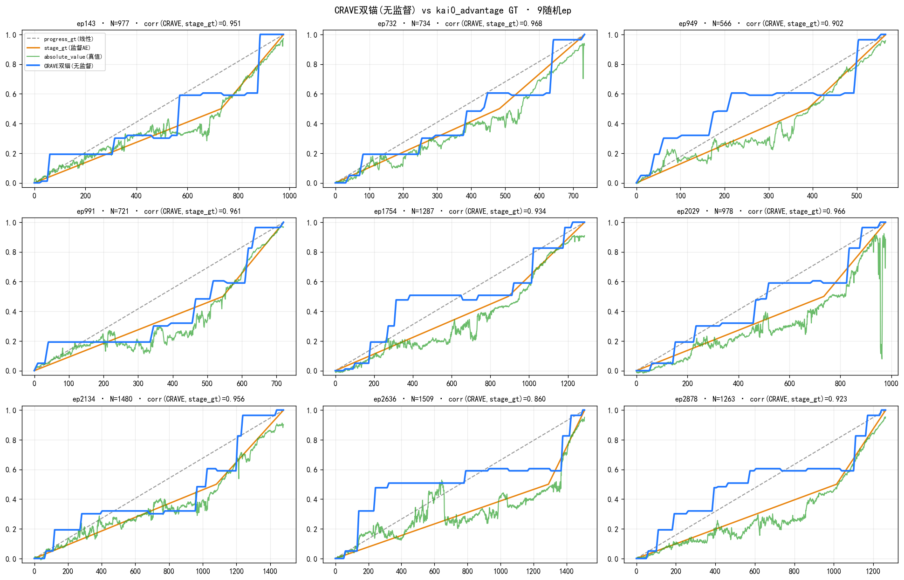
*双锚 Viterbi(蓝)vs 监督 stage_gt(橙)vs 真值 absolute_value(绿),9随机ep,corr 0.94*

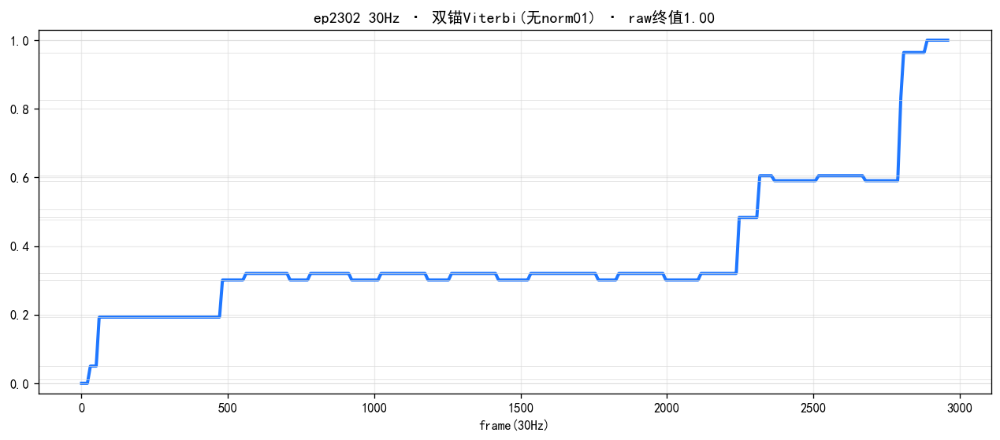
*双锚后 ep2302 中段形状诚实:高 milestone 0.6→0.83→0.96 被激活,非硬跳*

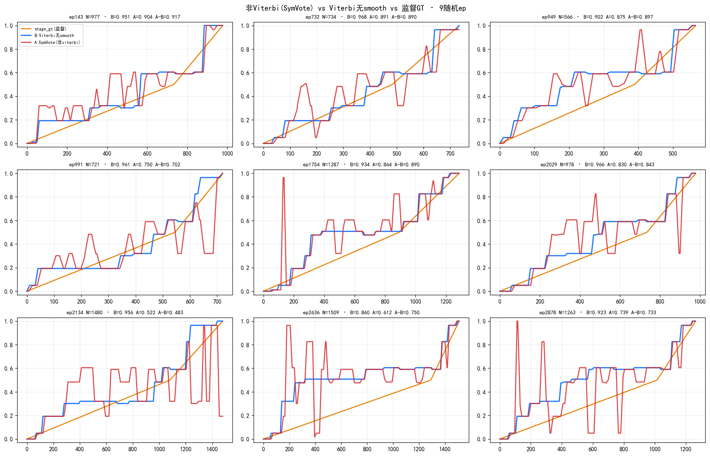
*Viterbi无smooth(蓝,corr0.943)vs SymVote原参数(红,毛刺多)*

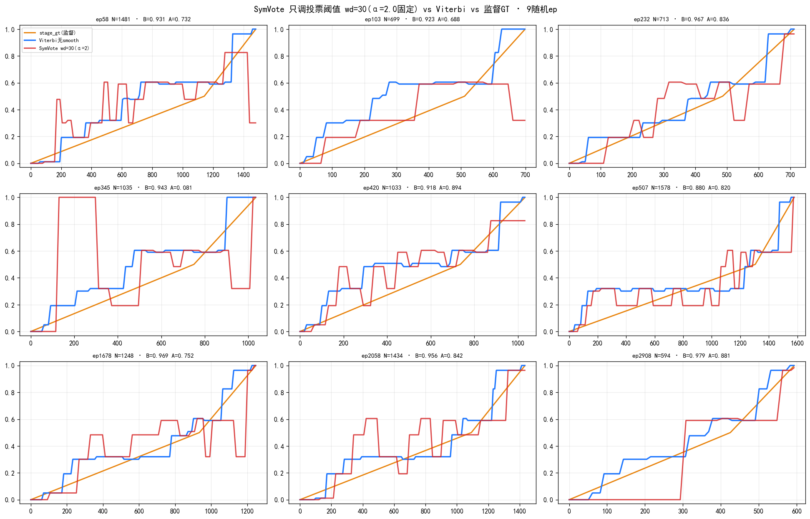
*只调投票阈值 wd=30:压住多数毛刺但 corr 上限≈0.83,ep345 持续别名击穿*

**特征/聚类消融(§2.1–2.6):**

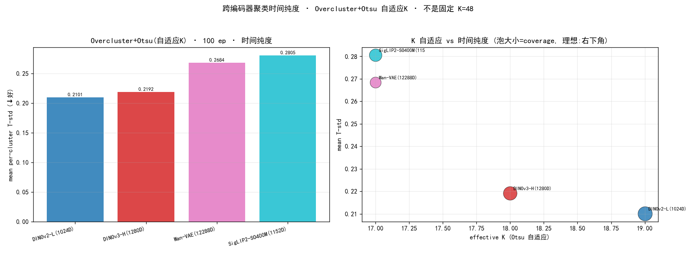
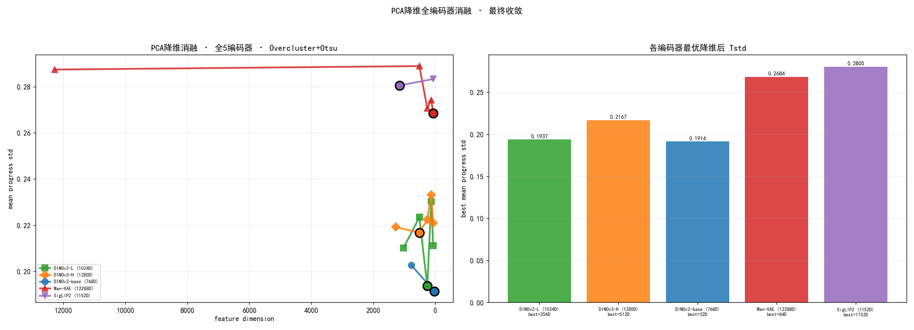
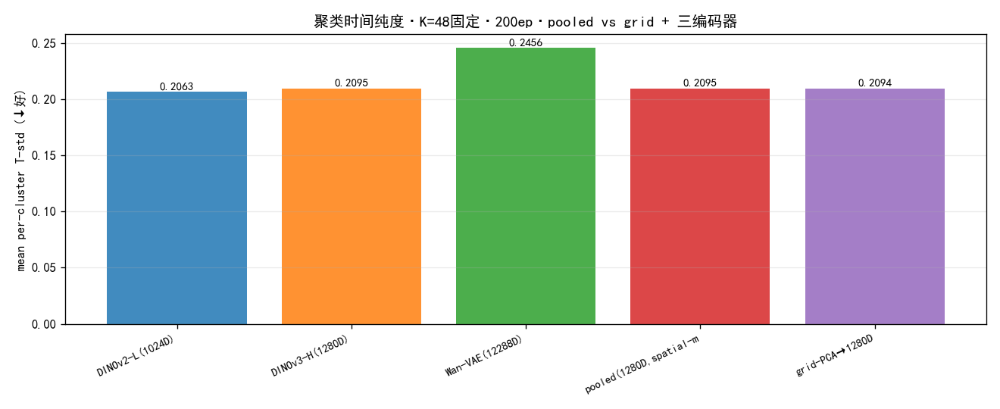
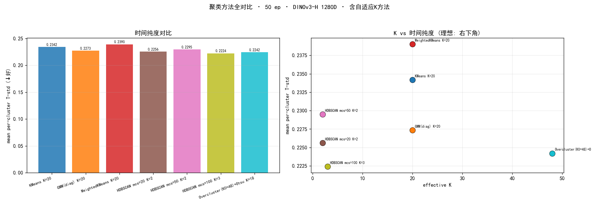
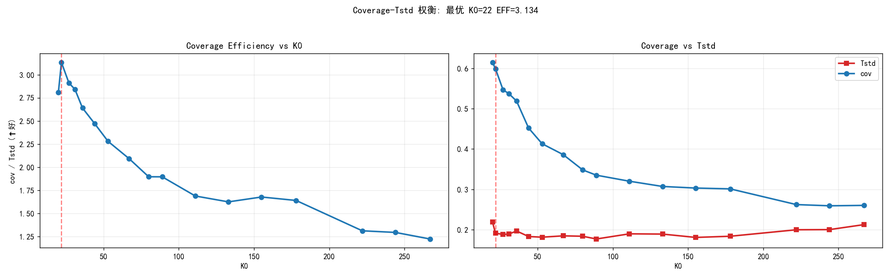
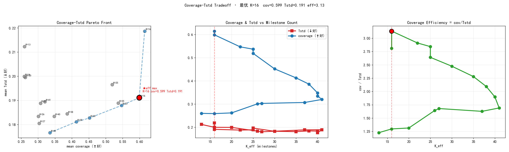
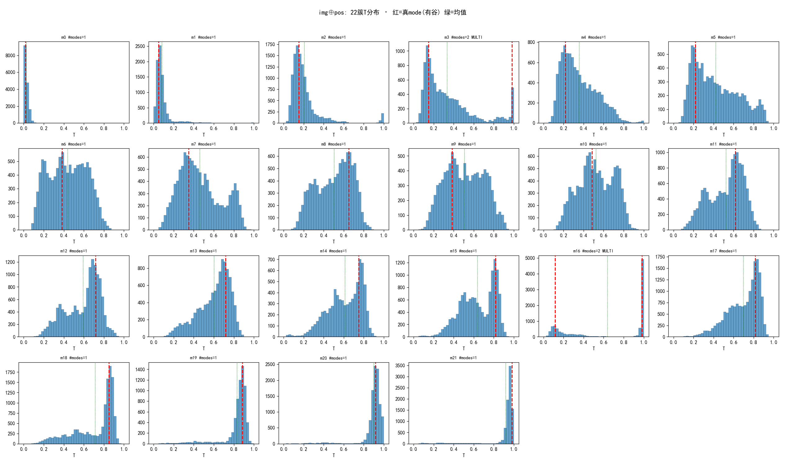
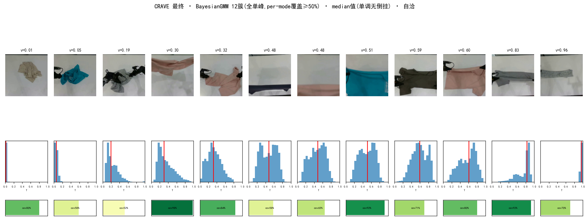

---

## 2.12 代表帧折线读出(polyline · 可选平滑版)

阶梯(step)之外的**平滑替代**, 在双锚 Viterbi 分段基础上:

1. 双锚 Viterbi → 逐帧 milestone value(阶梯);
2. 每个连续 stage 段取【离该簇质心最近的一帧】为**代表帧**, 钉在簇 value;
3. 相邻代表帧之间**线性连成折线**, 每帧 value = 折线对应值。

硬阶梯 → 锚在"最典型帧"上的分段线性。实测(200ep vs 监督 stage_gt):

| 读出 | corr vs GT | 单调 |
|---|---|---|
| 阶梯 step | 0.944 | 0.981 |
| **折线 polyline** | **0.957** | 0.790 |
| 折线 + cummax | ≈0.957 | 1.000 |

**折线 corr 反超阶梯**(监督 GT 本身是平滑 ramp, 折线更贴)。代价是 raw 折线单调降到 0.79
(相邻近等值 milestone 代表帧的微摆 + 真实再抓); 需单调时 cummax 即可(与 crave_stage_B 一致)。

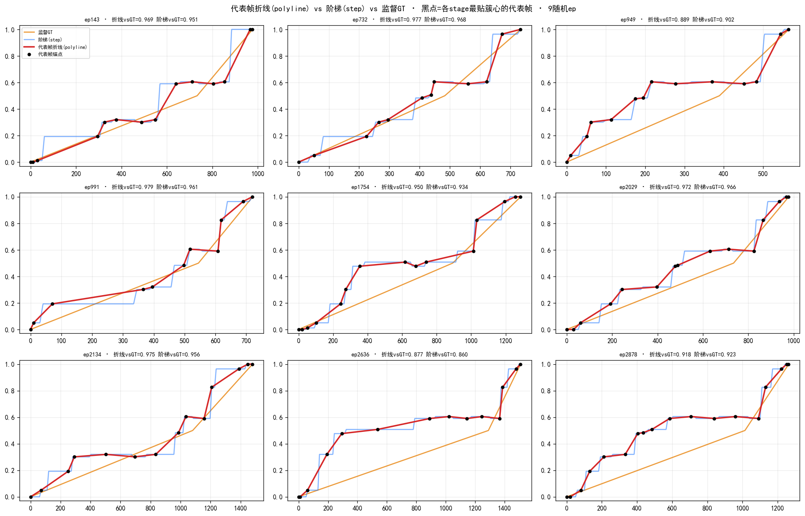
*红=折线, 蓝=阶梯, 橙=GT, 黑点=各 stage 最贴簇心的代表帧锚点*

产物: `gen_polyline_labels.py` → `temp/crave_ae_labels/polyline/`(raw) + `polyline_mono/`(cummax)。

---

## 3. 最终标签质量(3055 ep,双锚 Viterbi 无 smooth · 无 norm01)

| 指标 | 值 | 说明 |
|---|---|---|
| milestone 数 | 12 + 2 锚 | 全单峰 milestone + 起点锚/终点锚 |
| raw 起值 / 末值 | 0.00 / 1.00 | 双锚保证真实 0→1(非 norm01 拉伸) |
| raw 峰值 median | 1.000 | 100% ep raw≥0.9(修复前仅 52% raw<0.5) |
| **corr vs 监督 stage_gt** | **0.943** | kai0_advantage,零监督对齐 |
| 单调度 | 0.981 | |
| A-vs-B 一致性 | — | A=原值, B=cummax |
| 倒挂 | 0 | median 值保序 |

输出: `temp/crave_ae_labels/final/` → 数据集 `kai0/data/Task_A/self_built/crave_stage_{A,B}/`
(A=对称原值, B=cummax 单调)。milestone spec: `temp/crave_final_v3.npz`(+ 双锚在读出时从全ep首末帧现算)。

> ⚠️ 现存 `temp/crave_ae_labels/final/` 与 `crave_stage_{A,B}` 是**旧 norm01 版**,
> 需按本收口(双锚无norm01)重生成才与文档一致 —— 见 §5。

---

## 4. 相关文档

- [clustering_method_comparison](clustering_method_comparison.md) — 聚类方法对比(含本次 img⊕pos 更新)
- 可视化: `visualization/encoders/`(编码器/PCA/K₀/proprio/grid/多峰/medoid 全套)

## 5. 复现(收口:双锚 Viterbi 无 smooth · 无 norm01)

```bash
# 1) milestone 发现(BayesianGMM + median + per-mode coverage)→ spec: temp/crave_final_v3.npz
PYTHONPATH=crave/src:lmwm/src:crave/experiments python crave/experiments/gen_final_v3.py
# 2) 双锚 Viterbi 无 smooth 读出 → temp/crave_ae_labels/final/ep*.npy(真实 0→1,不 norm01)
PYTHONPATH=crave/src:lmwm/src:crave/experiments python crave/experiments/gen_anchored_labels.py
# 3) 写数据集 crave_stage_{A,B}(A=原值, B=cummax;不再 per-ep norm01)
python crave/experiments/write_crave_stage_datasets.py
```

读出细节(双锚):起点锚=mean(全ep首3帧)→0,终点锚=mean(全ep末3帧)→1;Viterbi 强制首帧=bin0、
末帧=bin1.0;λ=16 最近质心;3Hz→插值30Hz;**不加 smooth、不加 norm01**。
