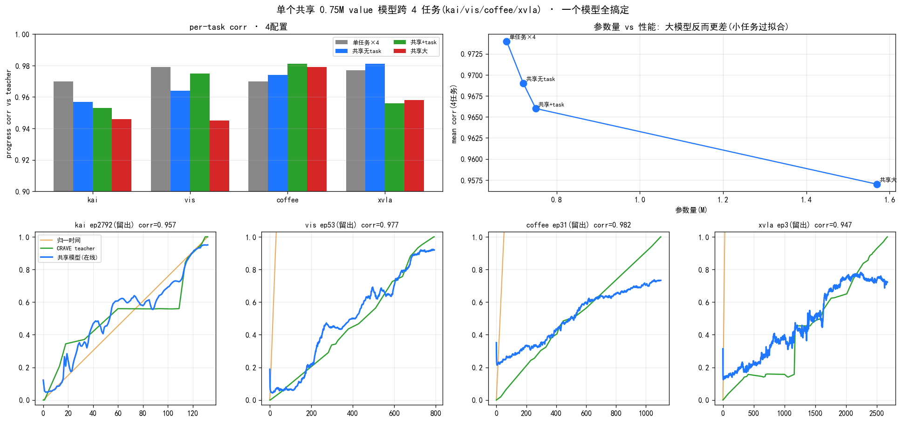

# Multitask 在线 value 模型 — 一个共享模型跨 4 任务

> **日期**: 2026-07-10
> **问题**: 一个 CRAVE 在线 value 模型能否同时服务多任务/多本体?0.75M 参数够吗?架构怎么优化?
> **数据**: kai(叠衣,双臂Piper)/ vis(visrobot01)/ coffee(真机ALOHA)/ xvla(新本体折叠),各自 DINOv3-H 特征 + 14维proprio + zero-train CRAVE milestone spec。

---

## 0. 结论(TL;DR)

- **一个共享 0.72M 模型跨 4 任务,progress corr 0.95–0.98,mean 0.969**,仅比"4 个单任务专家"(0.974)低 0.5%。**Multitask 成立。**
- **0.75M 绰绰有余**——瓶颈不在容量。视觉多样性由**冻结 DINOv3-H 编码器**吸收,GRU 只做便宜的时序积分。
- **放大参数反而更差**(1.57M→0.957,过拟合小任务);**task-embedding 冗余**(特征本身可区分任务);**共享 trunk 对小任务是正迁移**。

---

## 1. 实验设置

- **特征**: 4 数据集统一用 DINOv3-H **1280D pooled** → 共享 PCA→128D(在 4 数据集 pooled 帧上拟合一次)。img-only(跨本体 proprio 语义不同,略去)。
- **teacher(无监督标签)**: 各数据集用自己的 `recurrence_graph.npz`(prototype_table + pord)跑**双锚 Viterbi + polyline** → per-frame 0→1 progress。teacher vs 归一时间 corr:kai 0.956 / vis 0.986 / coffee 0.997 / xvla 0.971(质量有保证)。
- **模型**: 单向 GRU(严格因果)+ scalar sigmoid progress 头;可选 task-embedding。
- **平衡采样**: 每任务每 epoch 采 ≤250 ep(kai 3055 vs coffee 50,防大任务淹没)。
- **评测**: per-task 留出集 corr(pred, teacher)。

---

## 2. 结果:参数量消融

| 配置 | kai | vis | coffee | xvla | **mean** | 参数 |
|---|---|---|---|---|---|---|
| 单任务×4(专家) | 0.970 | 0.979 | 0.970 | 0.977 | **0.974** | 0.68M×4 |
| **共享 无task-id** | 0.957 | 0.964 | 0.974 | 0.981 | **0.969** | 0.72M |
| 共享 +task-embed(32) | 0.953 | 0.975 | 0.981 | 0.956 | 0.966 | 0.75M |
| 共享 +task 大(h=384) | 0.946 | 0.945 | 0.979 | 0.958 | 0.957 | 1.57M |


*上左:per-task 4 配置对比;上右:参数量↑ 性能↓(大模型过拟合小任务);下:共享模型在 4 任务留出 ep 上都贴合各自 teacher。*

---

## 3. 三条(反直觉)结论

1. **0.72M 够,更大更差**。共享 0.72M ≈ 4 专家(−0.5%);1.57M 掉到 0.957(coffee 42ep / xvla 68ep 过拟合)。**根因**:视觉多样性在冻结 DINOv3-H 里已解决,GRU 只需时序积分——不是容量瓶颈。**别加参数。**

2. **task-embedding 冗余**。加了(0.966)反不如不加(0.969)——**DINOv3-H 特征本身跨域可分**,模型能从特征推断是哪个任务,显式 task-id 多余。仅当任务极多 / 域高度相似时才需要。

3. **共享对小任务是正迁移**。共享无task 下 coffee 0.974>单任务0.970、xvla 0.981>0.977(小数据从 kai 3055ep 借力);只有 kai 被稀释略降。**→ 加新任务(少 demo)挂到共享 trunk 上,比单独训更好。**

**推荐架构**:单个小共享模型(GRU h=256,~0.7M),img-only,不加 task-embed,不放大;扩展靠多挂任务而非扩参。分布式双头 + advantage(见 [online_readout_route](online_readout_route.md))可直接叠加。

---

## 4. 诚实边界

- teacher 是 CRAVE 无监督(vis/coffee/xvla 无 GT),corr 是 vs teacher;teacher vs 归一时间 0.96–0.997 有保证。
- xvla 特征当时只有 80/168 ep;**已用 2 卡并行补齐全 168**(`scratch_build_xvla` 抽取逻辑,cam_high→DINOv3-H)。
- img-only + 标量头(本轮聚焦"能否共享 + 容量");分布式双头 / advantage 头可照 [online_readout_route](online_readout_route.md) 加入。

## 5. 复现

```bash
# ① 生成 teacher + 共享 PCA(4 数据集)
PYTHONPATH="<repo>/lmvla/crave/src" python lmvla/crave/experiments/prep_multitask_features.py
# ② multitask 训练 + 参数量消融 + 出图
CUDA_VISIBLE_DEVICES=0 PYTHONPATH="<repo>/lmvla/crave/src" python lmvla/crave/experiments/train_multitask_value.py
```
产物:`temp/multitask_cache/`(per-ep 特征+teacher)、`temp/crave_multitask_gru.pt`。

## 6. 相关文档
- [online_readout_route](online_readout_route.md) — 在线读出三档 + 因果 GRU 蒸馏 + 分布式双头
- [cross_dataset_validation](cross_dataset_validation.md) — 零训练 CRAVE 跨数据集(xvla/coffee)
- [value_advantage_methods_comparison](value_advantage_methods_comparison.md) — kai0-AE vs π0.6 vs CRAVE
