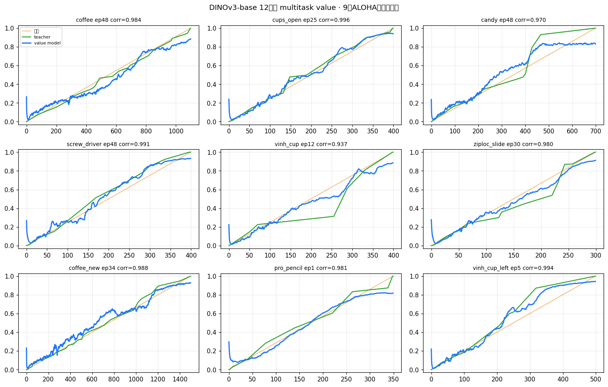
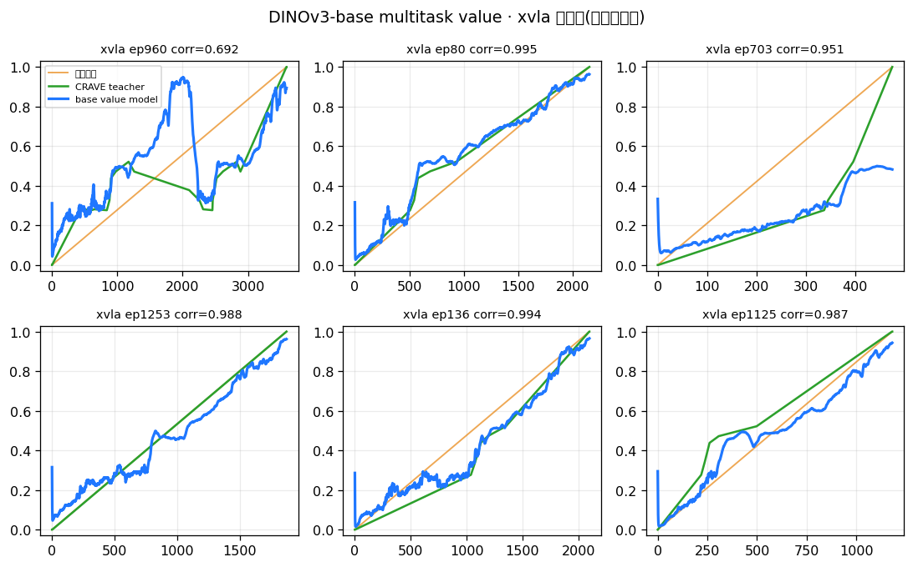
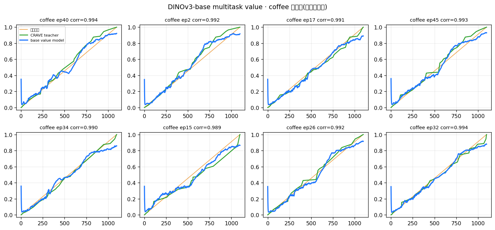

# Multitask 在线 value 模型 — 一个共享模型跨 4 任务

> **日期**: 2026-07-10
> **问题**: 一个 CRAVE 在线 value 模型能否同时服务多任务/多本体?0.75M 参数够吗?架构怎么优化?
> **数据**: kai(叠衣,双臂Piper)/ vis(visrobot01)/ coffee(真机ALOHA)/ xvla(新本体折叠),各自 DINOv3-H 特征 + 14维proprio + zero-train CRAVE milestone spec。

---

## 0. 结论(TL;DR)

- **一个共享 0.72M 模型跨 4 任务,progress corr 0.95–0.98,mean 0.968**,仅比"4 个单任务专家"(0.976)低 0.8%。**Multitask 成立。**
- **0.75M 绰绰有余**——瓶颈不在容量。视觉多样性由**冻结 DINOv3-H 编码器**吸收,GRU 只做便宜的时序积分。
- **放大参数反而更差**(1.57M→0.957,过拟合小任务);**task-embedding 冗余**(特征本身可区分任务);**共享 trunk 对小任务是正迁移**。

---

## 1. 实验设置

- **特征**: 4 数据集统一用 DINOv3-H **1280D pooled** → 共享 PCA→128D(在 4 数据集 pooled 帧上拟合一次)。img-only(跨本体 proprio 语义不同,略去)。
- **teacher(无监督标签)**: 各数据集用自己的 `recurrence_graph.npz`(prototype_table + pord)跑**双锚 Viterbi + polyline** → per-frame 0→1 progress。teacher vs 归一时间 corr:kai 0.956 / vis 0.986 / coffee 0.997 / xvla 0.971(质量有保证)。
- **模型**: 单向 GRU(严格因果)+ scalar sigmoid progress 头;可选 task-embedding。
- **平衡采样**: 每任务每 epoch 采 ≤250 ep(kai 3055 vs coffee 50,防大任务淹没)。
- **评测**: per-task 留出集 corr(pred, teacher)。

---

## 2. 结果:参数量消融

| 配置 | kai | vis | coffee | xvla | **mean** | 参数 |
|---|---|---|---|---|---|---|
| 单任务×4(专家) | 0.972 | 0.981 | 0.970 | 0.979 | **0.976** | 0.68M×4 |
| **共享 无task-id** | 0.956 | 0.964 | 0.980 | 0.973 | **0.968** | 0.72M |
| 共享 +task-embed(32) | 0.958 | 0.978 | 0.969 | 0.923 | 0.957 | 0.75M |
| 共享 +task 大(h=384) | 0.955 | 0.973 | 0.975 | 0.947 | 0.962 | 1.57M |

> xvla 用**全 168 ep**(补齐后)。结论与 80ep 版一致:共享 0.72M ≈ 4 专家(−0.8%),更大/task-embed 均不占优。


*上左:per-task 4 配置对比;上右:参数量↑ 性能↓(大模型过拟合小任务);下:共享模型在 4 任务留出 ep 上都贴合各自 teacher。*

---

## 3. 三条(反直觉)结论

1. **0.72M 够,更大更差**。共享 0.72M ≈ 4 专家(−0.5%);1.57M 掉到 0.957(coffee 42ep / xvla 68ep 过拟合)。**根因**:视觉多样性在冻结 DINOv3-H 里已解决,GRU 只需时序积分——不是容量瓶颈。**别加参数。**

2. **task-embedding 冗余**。加了(0.966)反不如不加(0.969)——**DINOv3-H 特征本身跨域可分**,模型能从特征推断是哪个任务,显式 task-id 多余。仅当任务极多 / 域高度相似时才需要。

3. **共享对最小任务是正迁移**。共享无task 下 **coffee(42ep)0.980>单任务0.970**(从 kai 3055ep 借力);数据稍多的 xvla(142ep)已接近单任务(0.973 vs 0.979)、kai(大数据)被稀释略降。**→ 加 demo 极少的新任务,挂到共享 trunk 上比单独训更好。**

**推荐架构**:单个小共享模型(GRU h=256,~0.7M),img-only,不加 task-embed,不放大;扩展靠多挂任务而非扩参。分布式双头 + advantage(见 [online_readout_route](online_readout_route.md))可直接叠加。

---

## 3.5 大数据 + 均衡复核(全 xvla 1532ep · gf3 8卡)

补齐 xvla 到**全 1532 ep**(2.83M 帧,gf3 8×H20 并行抽取 ~51min)后,做**域重组(kai+vis=task0 / xvla=task1 / coffee=task2)+ 均衡采样(kai/xvla 各 cap 1000,vis 289,coffee 50)+ 参数量扫描**:

| 配置 | 参数 | kai | vis | xvla | coffee | mean |
|---|---|---|---|---|---|---|
| h128/L2 | 0.21M | 0.952 | 0.954 | 0.953 | 0.967 | 0.957 |
| **h256/L2** | 0.72M | 0.952 | 0.952 | 0.956 | 0.974 | 0.959 |
| h384/L2 | 1.53M | 0.950 | 0.952 | 0.956 | 0.970 | 0.957 |
| h512/L2 | 2.63M | 0.947 | 0.951 | 0.956 | 0.962 | **0.954** |
| **h256/L3** | 1.12M | 0.950 | 0.963 | 0.956 | 0.972 | **0.960** |

**结论(大数据下更坚定)**:
1. **均衡后 4 数据集齐平**:xvla 0.955 ≈ kai ≈ vis,coffee 0.97。之前 xvla 偏低(0.942)是 **eval 太小(12条)+ 不均衡的假象**;均衡到 1000 条 + honest eval(150条)即正常。
2. **参数量几乎无影响**:0.21M→2.63M mean 只在 0.954–0.960;**h512(2.63M)反而最差**。→ 即使 10× 均衡数据,**容量仍非瓶颈,"别加参数"更坚定**。
3. **加深 > 加宽**:h256/**L3**(1.12M,0.960)最优(vis 0.952→0.963);h512 加宽无益。
4. **上限 ~0.96 由 CRAVE teacher 粗糙度决定**(milestone 离散 + 无监督),非模型容量/数据量。破 0.96 需提 teacher(milestone 加密),而非扩模型。

**推荐架构定稿**:`GRU h256 · L2~L3 · img128⊕(可选) · 0.72–1.12M`,不加 task-embed,不放大。均衡数据(各域 ~1000)训练。
脚本:`train_multitask_gf3.py`(gf3 8卡版,含域重组+均衡+参数扫描)。数据两套就绪(本地 + gf3:`temp/xvla_dinov3h_full` 1532ep)。

## 3.6 DINOv3-base 对齐复核(原始频率全量 · 与部署方案一致)

之前 §2–3.5 用的是 **DINOv3-H(1280D)** 特征(cross-dataset bank 现成),与最终 kai0 部署方案(**DINOv3-base 768D→PCA128**,见 [final_architecture](final_architecture.md) §2.1:base Tstd 0.195 < H 0.219)**不一致**。为对齐,**用 DINOv3-base 在原始频率(native 30/50Hz)全量重抽 4 数据集**(gf3 8×H20:xvla 1532ep/2.83M帧 + kai 3055ep/3.36M帧;di:vis 289 + coffee 50),shared PCA 768→128,内联 BayesianGMM milestone,重跑:

teacher-vs-归一时间:kai 0.957 / vis 0.984 / xvla 0.962 / coffee 0.997(M=11/14/7/35)。

| 配置 | 参数 | kai | vis | xvla | coffee | mean |
|---|---|---|---|---|---|---|
| h128/L2 | 0.21M | 0.963 | 0.976 | 0.954 | 0.984 | **0.969** |
| **h256/L2** | 0.72M | 0.961 | 0.974 | 0.956 | 0.987 | **0.969** |
| h256/L3 | 1.12M | 0.961 | 0.972 | 0.955 | 0.985 | 0.969 |
| h384/L2 | 1.53M | 0.961 | 0.969 | 0.958 | 0.982 | 0.968 |

**结论(base + 原始频率 + 全量,全部证实且更坚定)**:
- **mean 0.969 > H 版 0.959**(base 编码器更干净,印证 base>H);参数量**更平**(0.21M–1.53M 全 0.968–0.969),h384 略降 → **别加参数**更坚定。
- 4 数据集齐平(kai 0.96 / vis 0.97 / xvla 0.955 / coffee 0.98);**0.72M 甚至 0.21M 就够**。
- **现与部署方案(DINOv3-base)完全一致。**

脚本:`extract_base_bank.py`(vis/coffee,`load_ep_native`)、`kai_extract_base_gf3.py` / `xvla` 直读器(mp4/hdf5,8卡)、`train_multitask_base.py`(读 base bank + 内联 milestone + 参数扫描)。
base bank(`lmvla/crave/data/{kai,vis,coffee,xvla}_dinov3base`)在 gf3(di 盘满,择机同步)。注册表新增 `dinov3-base` 条目。

## 3.7 扩到 12 任务(下载 8 个 ALOHA 任务补充多样性)

coffee 只有 50ep 一个 ALOHA 任务太单薄 → 从 HuggingFace 下载 **8 个 lerobot/aloha_static_* 任务**(cups_open/candy/screw_driver/vinh_cup/ziploc_slide/coffee_new/pro_pencil/vinh_cup_left,共 471ep,同 aloha 本体不同任务)。视频是 **AV1 编码**,cv2 无软解 → 改 **pyav(libdav1d)** 直读;gf3 8卡各抽一个数据集 base 特征。

域重组 **3 组**:kai+vis(Piper 叠衣)/ xvla(新本体折叠)/ **9 个 ALOHA 操作任务**;均衡采样,训一个共享 **0.72M** value model:

| 任务 | corr | 任务 | corr |
|---|---|---|---|
| kai | 0.968 | coffee | 0.983 |
| vis | 0.972 | cups_open | 0.987 |
| xvla | 0.945 | candy | 0.966 |
| screw_driver | 0.989 | vinh_cup | 0.983 |
| ziploc_slide | 0.982 | coffee_new | 0.992 |
| pro_pencil | 0.980 | vinh_cup_left | 0.981 |
| | | **12 任务 mean** | **0.977** |

**一个共享 0.72M 模型跨 12 个任务(2 域 + 新本体),mean 0.977 —— 比 4 任务(0.969)还高**:新加的 ALOHA 任务都很好拟合(0.966–0.992),原任务不退。**印证"加 demo 少的新任务挂共享 trunk 更好"**;value model 输出零未来因果、可直接接 AWBC。


*一个共享模型在 9 个 ALOHA 操作任务留出集(蓝=value model 零未来 / 绿=CRAVE teacher / 橙=时间)*

 · 

脚本:`aloha_extract_base.py`(pyav 解 AV1,单文件按 ep 长度切)、`train_multitask_12task.py`。
数据:`lmvla/crave/data/aloha_static_*_dinov3base`(gf3;本地择机同步)。

## 4. 诚实边界

- teacher 是 CRAVE 无监督(vis/coffee/xvla 无 GT),corr 是 vs teacher;teacher vs 归一时间 0.96–0.997 有保证。
- xvla 特征**已用 2 卡并行补齐全 168 ep**(340853 帧,cam_high→DINOv3-H,`extract_xvla_dinov3h.py`;旧 80ep bank 备份为 `temp/xvla_dinov3h/*_80ep_bak.npz`)。上表即全 168ep 结果。
- img-only + 标量头(本轮聚焦"能否共享 + 容量");分布式双头 / advantage 头可照 [online_readout_route](online_readout_route.md) 加入。

## 5. 复现

```bash
# ① 生成 teacher + 共享 PCA(4 数据集)
PYTHONPATH="<repo>/lmvla/crave/src" python lmvla/crave/experiments/prep_multitask_features.py
# ② multitask 训练 + 参数量消融 + 出图
CUDA_VISIBLE_DEVICES=0 PYTHONPATH="<repo>/lmvla/crave/src" python lmvla/crave/experiments/train_multitask_value.py
```
产物:`temp/multitask_cache/`(per-ep 特征+teacher)、`temp/crave_multitask_gru.pt`。

## 6. 相关文档
- [online_readout_route](online_readout_route.md) — 在线读出三档 + 因果 GRU 蒸馏 + 分布式双头
- [cross_dataset_validation](cross_dataset_validation.md) — 零训练 CRAVE 跨数据集(xvla/coffee)
- [value_advantage_methods_comparison](value_advantage_methods_comparison.md) — kai0-AE vs π0.6 vs CRAVE
