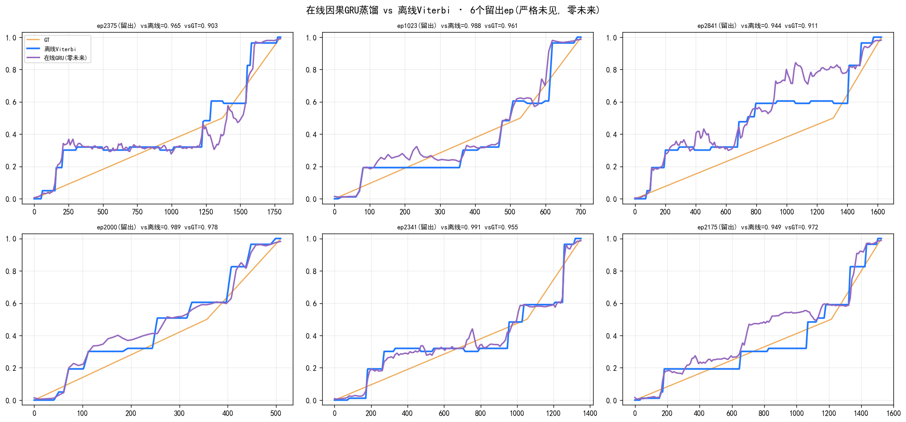
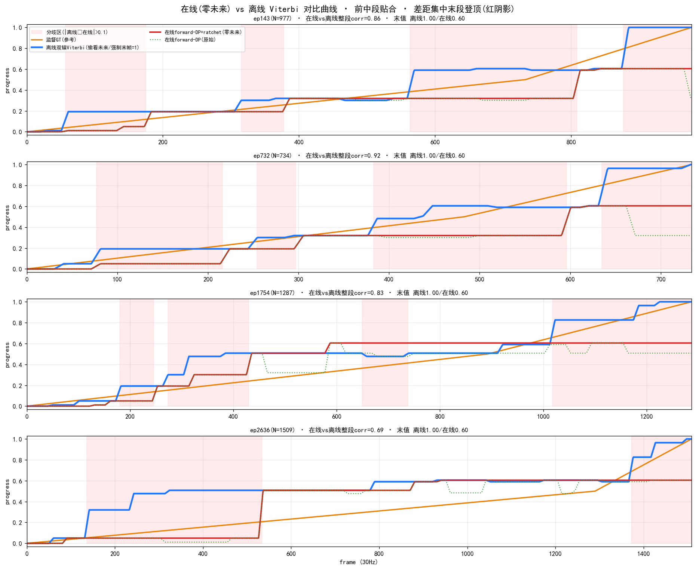

# CRAVE 在线读出路线(完全因果 · 追平离线 Viterbi)

> **日期**: 2026-07-09
> **目标**: 在**不知道未来**(完全因果, 零延迟)的前提下, 逼近离线双锚 Viterbi 的 value 效果
> **基准**: 离线双锚 Viterbi(见 [final_architecture](final_architecture.md)) vs 监督 stage_gt corr=**0.943**
> **数据**: kai0_base, 特征 img PCA128 ⊕ proprio位置14 @3Hz, teacher=离线双锚 value

---

## 0. 核心矛盾与破解思路

**离线 Viterbi 的全部优势 = 知道未来**:① 全局回溯把每个转变提前锁定;② "强制末帧=1"反向激活高 milestone 登顶。完全在线两者都没有。

三档方案逐步用**因果先验**替代"偷看未来",最终用**学到的未来预期**追平:

| 档 | 方法 | 是否零训练 | 用什么替代"未来" |
|---|---|---|---|
| ⓪ | ~~固定滞后 Viterbi~~(否决) | ✓ | 偷看 L 帧未来 → **不是完全在线** |
| ① | 对称 forward-DP(流式Viterbi)+ratchet | ✓ | 转移罚(因果抗跳变)+ 单调 |
| ② | 非对称 forward-DP(前向偏置)+ratchet | ✓ | "进度多半向前"的因果先验 |
| ③ | **因果 GRU 蒸馏** | ✗(需训练) | **从训练数据学到的未来预期** |

---

## 1. 三档方法与实测(留出集, 严格未见, 零未来)

| 方法 | corr vs 离线 | corr vs 监督GT | 末值(登顶) | 单调 | 备注 |
|---|---|---|---|---|---|
| ⓪ 固定滞后 L=12 | 0.77 | 0.74 | 0.50 | — | **偷看未来, 否决** |
| ① 对称 forward-DP λ16 +ratchet | 0.81 | 0.83 | 0.54 | 0.97 | 零训练, 泊 0.5 上不去 |
| ② 非对称 λf8/λb32 +ratchet | 0.86 | 0.86 | 0.82 | 1.00 | 零训练甜点 |
| ②′ 非对称 λf4/λb64 +ratchet | 0.87 | 0.86 | 0.95 | 1.00 | 更激进, 易中段过冲 |
| ③ **因果 GRU 蒸馏** | **0.97** | **0.955** | **0.986** | — | **≈离线, 需训练** |
| — 离线双锚 Viterbi(基准) | 1.00 | 0.943 | 1.00 | 0.98 | 偷看未来 |

> **在线 GRU corr vs GT 0.955 ≥ 离线本身 0.943 → gap 归零**(GRU 还平滑掉了离散阶梯噪声)。


*档③ 因果 GRU(紫, 零未来)vs 离线 Viterbi(蓝)· 6 个严格留出 ep · 台阶对齐 + 自学登顶*

### ⓪ 为什么否决固定滞后

固定滞后 L: 要输出第 t−L 帧, 必须已见第 t 帧 → **偷看了 L 帧未来**, 不是完全在线。且实测 L 越大越差(未强制末帧时, 高 L 只把"泊 0.5"的错误估计抹得更平)。**完全因果只能 L=0。**

### ① 对称 forward-DP(流式 Viterbi)

离线 Viterbi 的**前向递推**照跑, 但每帧即时输出当前 forward-cost 的 argmin, **不做后向回溯**(后向才需未来):

```
cost[bin0]=emission(起点锚)  # 起点锚=init, 天然给 0
每帧 t(只用≤t): cost = emission_t + min_j( cost_prev[j] + λ|Δbin| );  p_t = bins[argmin cost]
p_t = max(p_{t-1}, p_t)      # 单调 ratchet(贴合 monotone progress)
```
转移罚 λ|Δbin| 在**因果方向**就压住了跳变(这是相比逐帧投票 SymVote 的实质进步: 无毛刺)。缺点: 无末帧强制 → 泊中段 0.5 登不了顶。

### ② 非对称 forward-DP(前向偏置)

转移罚拆方向: **上升便宜 λf, 下降贵 λb(λf<λb)**。编码"进度多半向前"的**合法因果先验**(不偷看未来):
```
pen[i,j] = λf·(bin_i−bin_j)  若上升;  λb·(bin_j−bin_i)  若下降
```
前向便宜 → 敢爬高 milestone(末值 0.54→0.82~0.95);后向贵 → 强单调。**λf8/λb32 是甜点**(corr 最佳); λf4/λb64 末值最高但易中段过冲(如 ep2302 长再抓 ep 提前冲 0.6)。

### ③ 因果 GRU 蒸馏(追平离线)

把离线 Viterbi 当 **teacher**, 训一个**单向 GRU(结构上严格因果)** 当 student 回归它。GRU 见过几千条同类轨迹, 内化了"这个状态之后进度通常跳到 X / 平台还剩多久 / 这类轨迹会完成"——用**学到的未来预期**补上滞后、中段选级、甚至登顶, 而推理零未来。

- **模型 I/O**: 输入 `x:(B,T,142)`(每帧 = img PCA128(L2) ⊕ proprio位置14(标准化+L2)); 输出 `y:(B,T)∈[0,1]`(逐帧 progress, sigmoid)。
- **参数量**: **734,977 (~0.735M)** = GRU(142→256, 2层) 701,952 + head(256→128→1) 33,025; ckpt **2.94MB**。
- **严格因果**: 第 t 帧输出只依赖 `h_t`(累积自 1..t), 零未来; 真机逐帧复用隐状态, O(1)/帧。
- **训练**: teacher=离线双锚 value, MSE 回归, 2000 train / 300 eval, 60 ep, ~2min(1×A100)。

**真机在线推理(逐帧, 严格因果):**
```python
h = None
for each frame:
    x_t = concat[img_pca128_l2, pos14_std_l2].view(1, 1, 142)
    o, h = net.g(x_t, h)                 # 复用隐状态
    p_t = torch.sigmoid(net.head(o)).item()   # 当前 progress, 零未来
```

---

## 2. 差距分解(在线 forward-DP vs 离线, 200ep)

| | 离线 Viterbi | 在线 forward-DP(①) |
|---|---|---|
| corr vs GT | 0.943 | 0.815(+ratchet 0.837) |
| 单调度 | 0.980 | 0.973(持平) |
| 抗毛刺 | 无 | **无**(转移罚因果生效) |
| 末值 | 0.999 | 0.486 |
| 前80% 一致性 | — | 0.836 |
| 帧级 MAE | — | 0.172 |

**差距集中在末段登顶**(前中段贴合, 前80% 一致性 0.84、单调持平、零毛刺)。零训练档②靠前向偏置把末值抬到 0.82~0.95; 要真正抹平(0.955)用档③ GRU。


*档① 完全在线(红)vs 离线(蓝)· 前中段贴合, 分歧集中末段登顶(粉阴影)*

---

## 3. 选型建议

- **零训练 / 快速上线** → 档② 非对称 forward-DP(λf8/λb32)+ratchet: corr 0.86, 无毛刺, O(nb²)/帧微秒级。
- **追平离线 / 有训练预算** → 档③ 因果 GRU 蒸馏: corr vs GT 0.955=离线水平, 0.735M 参数, 真机实时。
- **诚实边界**: 档③末端登顶靠"训练全是成功 demo"学到的先验; 真机遇失败 rollout 仍可能高估(所有在线法通病), 但这是学出来、更好校准的先验, 非硬编码强制。若部署有外部成功/终止信号, 可作 end-trigger 进一步校准。

---

## 4. 复现与产物

```bash
# 档① ② 零训练: 见下方脚本内 forward-DP / asym 函数
# 档③ GRU 蒸馏训练:
CUDA_VISIBLE_DEVICES=0 PYTHONPATH=crave/src:lmwm/src:crave/experiments \
  python crave/experiments/train_online_gru.py         # -> temp/crave_online_gru.pt
```

- 训练脚本: [`crave/experiments/train_online_gru.py`](../experiments/train_online_gru.py)(含逐帧因果推理示例)
- 模型: `temp/crave_online_gru.pt`(0.735M, 2.94MB)
- 配图: `visualization/encoders/` — `online_causal_9ep.png`(①完全在线)、`online_vs_offline_curves.png`(①差距分解)、`online_vs_offline_gap.png`(条形汇总)、`ep2302_online_vs_offline_30hz.png`(②)、`gru_heldout_6ep.png`(③留出严格)、`ep2302_gru_vs_offline_30hz.png`(③示意)

## 5. 相关文档

- [final_architecture](final_architecture.md) — 离线收口(双锚 Viterbi 无 smooth)
- [sym_adaptive_vote](sym_adaptive_vote.md) — 更早的 Viterbi-free 投票探索(39细milestone+原生30Hz)
- [viterbi_computation](viterbi_computation.md) — DP 计算 + 频率标定(含固定滞后附录)
