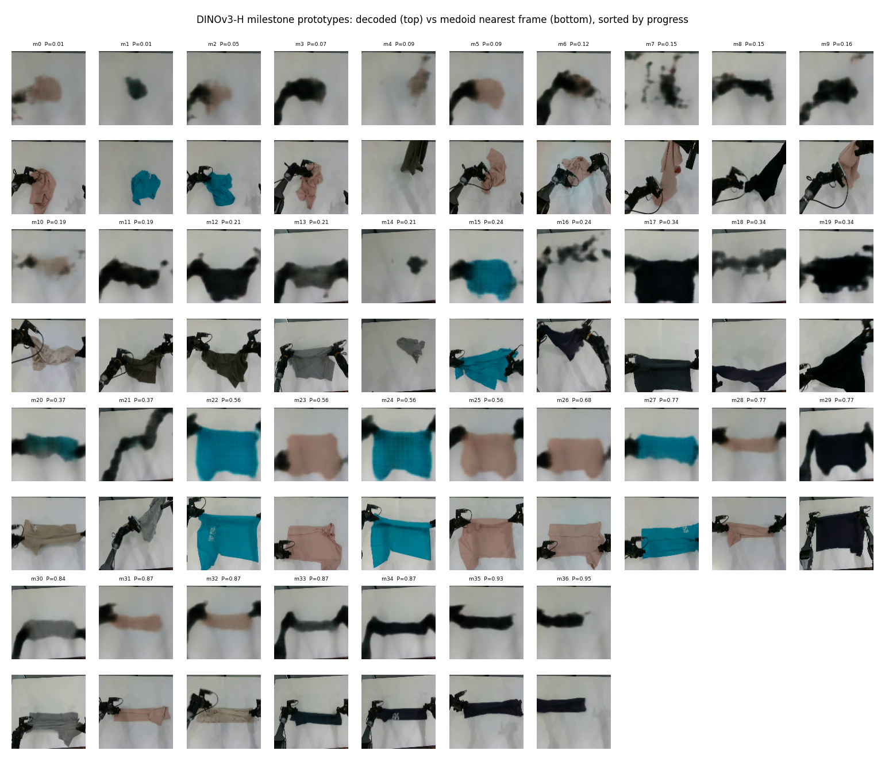
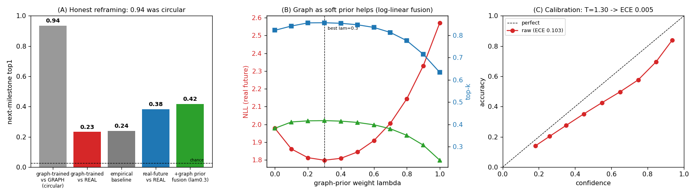
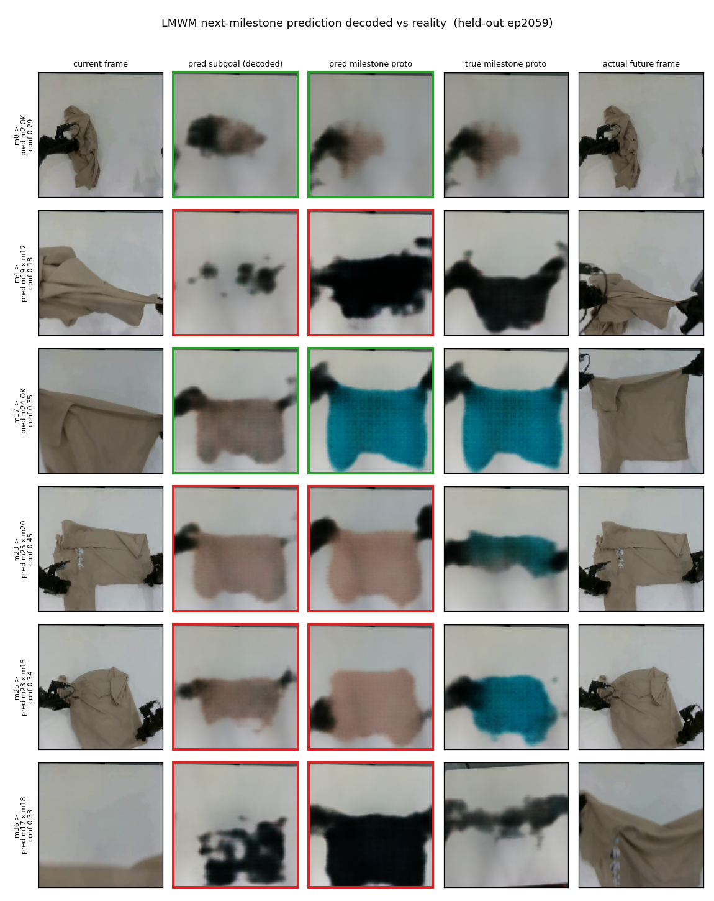

# LMWM 技术报告 — 隐变量里程碑世界模型

> CRAVE-native 的循环世界模型,基于任务感知 milestone 状态,外加一个将其预测渲染为图像的 DINOv3-H 解码器。
> 日期:2026-07-02。数据:`kai0_base` DINOv3-H(334,875 帧 / 3,055 episode / 37 milestone prototype)。除特别注明外,所有指标在 held-out episode(40,572 pair / 611 episode)上,**对真实观测**的未来 milestone 评分。

## 1. 问题与定位

CRAVE 将跨 episode 重复度转化为带 progress 值的任务感知 **milestone**(离散技能相位)。LMWM 问下一个问题:*给定当前视觉状态,下一个 milestone 是什么?* —— 一个紧凑世界模型,为 VLA planning-prior 用途输出:

- 下一 milestone 的分布,
- 贪心/最大完成的下一 milestone,
- **隐变量 prototype subgoal**(DINOv3-H 空间,LaWAM 风格),
- 经校准的置信度/熵。

它**不是**像素预测,也**不是**策略。隐变量是 CRAVE 的 milestone 状态,不是通用视觉未来 token。

### Milestone 词汇表(解码器验证)

37 个 DINOv3-H milestone prototype 形成一个连贯的进度排序流形 —— 臂夹皱布(P≈0)→ 布被展开举起(P≈0.5)→ 平折叠好在桌面(P≈0.9)。上行 = 我们训练的 DINOv3-H 解码器的合成 prototype;下行 = medoid(最近真实帧):



## 2. 方法

### 2.1 架构

`UnifiedLMWM`(`src/lmwm/models.py`):当前 DINOv3-H 帧特征上的共享 MLP trunk,喂给五个头 —— 转移 logits、贪心/最大积 milestone logits、两个 L2 归一化的隐变量 prototype subgoal 头。

```
当前 DINOv3-H 帧特征 (1280-D)
  └─ trunk (MLP)
       ├─ 转移头      → P(下一 milestone)   [分布]
       ├─ 贪心头      → 下一 milestone       [点]
       ├─ 最大积头     → 完成下一             [点]
       ├─ 贪心 proto 头 → 隐变量 subgoal (1280-D, 范数=1)
       └─ 最大积 proto  → 隐变量 subgoal (1280-D, 范数=1)
```

### 2.2 循环图(规划先验)

每帧分配到最近 milestone 中心 → 压缩连续重复 → 统计转移 → 行归一化。产出经验 `P(下一 | 当前 milestone)`,贪心表以及向最高 progress 终点(#36)的有限 horizon 最大积路径。一阶 Markov —— 是先验,不是 ground truth。

### 2.3 标签:真实未来,而非图表(Phase A)

决定性的设计选择。导出的 pair 存储 `future_milestone` —— **实际观测到的**下一独特 milestone —— 但早期阶段训练在图查找 `greedy_next[current_m]` 上。两者在 **75.8%** 的情况下不一致,且真实下一 milestone 有 ~2.56 nats(~13 分支)熵。在图表上训练和评估是循环的。我们将监督切为真实未来(`label_source: real_future`)并对之评估。

### 2.4 校准 + 图作软先验(Phase B)

真实未来贪心头是一个帧条件分布。我们(a)对其进行温度缩放,并(b)将对数线性池化将图降级为**软贝叶斯先验**:

```
p_cal   = softmax(greedy_logits / T),          T = 1.30
p_prior = transition_probs[current_milestone]
p_fused ∝ p_cal^(1-λ) · p_prior^λ,             λ = 0.30
```

### 2.5 DINOv3-H 解码器(新训)

CRAVE 现有解码器消费 DINOv2-large 的 *patch grid*,而 LMWM 活在 DINOv3-H 的 *pooled* 1280-D(正是其 subgoal 头预测的东西),故无现成解码器。我们训练了一个(`scripts/train_dinov3h_decoder.py`):`pooled 1280-D → fc → (512,4,4) → 5× 上采样 → 3×128×128`,在 16k 对(特征,帧)上训练,val L1 = 0.13。Pooled 解码是有意平滑的"可读原型"(CRAVE 已验证 pooled 解码偏软);medoid 检索提供锐利配套。

## 3. 结果

### 3.1 诚实重塑



*(A)* 那个著名的 0.94 是**循环的**(神经贪心 vs 制造其标签的图表)。对现实仅有 **0.23** —— 勉强超过非神经经验基线(0.24)。在真实未来上训练将其提升到 **0.38**;加入图作为软先验达到 **0.42**。*(B)* 融合 sweep 是凹的,在 λ=0.3 处有清晰最优。*(C)* 分布轻度过自信(ECE 0.10),单温度 T=1.30 修复(ECE→0.005)。

### 3.2 阶段结果(旧图监督指标,"vs graph")

| 阶段 | 指标 | 值 |
|---|---|---|
| Stage-1(LaWM 形状) | val top1(prototype 表) | 1.00(仅管线验证) |
| Stage-2(图策略) | greedy/max-product top1 | 0.935/0.935 |
| Stage-3(统一) | greedy/max-product top1;proto cosine | 0.936/0.935;0.99 |

这些是 **vs 图的**,且是循环的;诚实数字见 §3.3。

### 3.3 下一 milestone 预测 vs 真实未来(held-out)

| 模型/基线 | top1 | top3 | top5 | NLL |
|---|---|---|---|---|
| 均匀分布 | 0.024 | 0.057 | 0.109 | 3.61 |
| 经验分布 `P(下一\|当前 milestone)` | 0.240 | 0.483 | 0.633 | 2.57 |
| 图训练·贪心头 | 0.233 | 0.366 | 0.474 | 16.0 |
| **真实未来训练·贪心头** | 0.383 | 0.686 | 0.822 | 1.98 |
| **+ 图软先验(λ=0.3)** | **0.417** | **0.731** | **0.856** | **1.80** |

真实未来训练 + 软先验融合在 NLL 上反超非神经基线(1.80 vs 2.57) —— LMWM 携带当前 milestone id 之外动态的第一个证据。

### 3.4 帧历史有帮助吗?(Phase C — 负)

| 模型 | 输入维度 | top1 | top5 | NLL |
|---|---|---|---|---|
| 单帧 | 1280 | 0.383 | 0.822 | 1.978 |
| 历史 H4 s2 | 5120 | 0.377 | 0.826 | 1.979 |
| 历史 H6 s4 | 7680 | 0.367 | 0.815 | 2.024 |

帧历史没有帮助(噪声范围内;更长跨度过拟合更严重)。单帧已达天花板;~13 分支熵是固有任务歧义。剩余杠杆(动作条件、更少抖动的标签)在 VLA/数据侧。

## 4. 将 LMWM 预测解码为图像

使用 DINOv3-H 解码器,我们渲染 LMWM 预测的下一 milestone 并在 held-out episode 上与真实对比。列:当前帧 · LMWM subgoal-latent 解码 · LMWM 预测 milestone prototype · 真正的下一 milestone prototype · 真实未来帧。绿/红框 = 预测正确/错误:



Subgoal-latent 解码和预测 milestone prototype 一致(两者都是 LMWM 自己的预测),且当预测正确(绿)时,它们与真实 milestone 及真实未来帧在视觉上匹配。这证明同一解码器可以渲染 LMWM 的连续预测,而不只是固定簇中心。

## 5. VLA 集成

LMWM 已打包为 VLA 用途(`lmwm.vla_interface.VLALMWMPredictor`,`configs/inference/kai0base_dinov3h_vla_realfuture.yaml`):

```python
from lmwm.vla_interface import VLALMWMPredictor
predictor = VLALMWMPredictor.from_yaml(".../kai0base_dinov3h_vla_realfuture.yaml")
out = predictor.predict(current_features)
# next_milestone_probs, topk_milestones/probs, subgoal_latent, confidence, entropy
```

使用指南:以 `subgoal_latent`(LaWAM 风格)和 `topk` 候选集(top-5 覆盖 86%)为条件,按 `confidence`/`entropy` 门控,**不要**将 top-1 视为 ground truth。

## 6. 诚实局限

- 单 `kai0_base` DINOv3-H,同任务 held-out;`T`/`λ` 按数据集重新拟合。
- 绝对 top-1 ≈ 0.42 反映固有 ~13 分支歧义 —— 依靠 top-k + 置信度,不靠点预测。
- Pooled 解码是平滑原型(天然偏模糊);medoid 是锐利同伴。
- Milestone 标签逐帧抖动(~每 2 帧变一次),这限制了下一帧监督质量。

## 7. 产物与代码

- 模型/数据/训练/运行时/VLA:`src/lmwm/{models,data,training,runtime,vla_interface}.py`
- 训练器:`scripts/train_{state_world_model,graph_policy_model,unified_lmwm}.py`
- 真实未来 + Phase-B 评估:`scripts/eval_real_future.py`,`scripts/eval_phase_b.py`
- 解码器:`scripts/train_dinov3h_decoder.py` → `checkpoints/dinov3h_decoder/dec.pt`
- 图表:`scripts/visualize_lmwm_decode.py` → `docs/assets/{prototype_gallery,prediction_filmstrip}.png`;`docs/assets/metrics_summary.png`
- Phase 文档:`docs/phase_{a,b,c}_*.md`,`docs/vla_integration_20260702.md`,`docs/lmwm_stage_overview.md`
